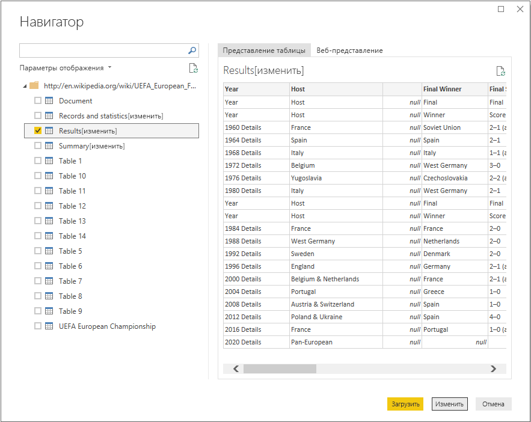
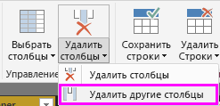
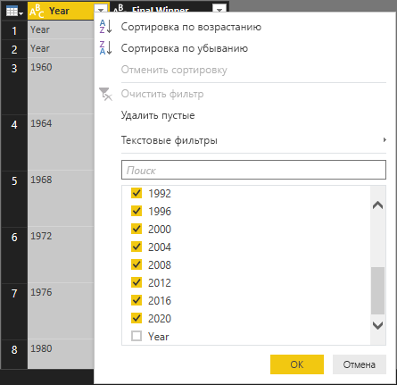
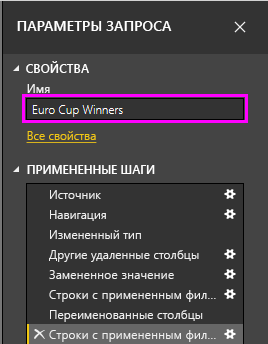
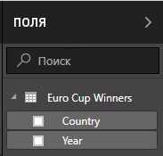
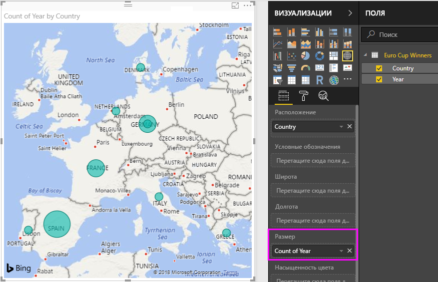

# Анализ данных веб-страницы с помощью Power BI Desktop (руководство)
Изучив этот учебник, вы узнаете, как импортировать таблицу данных с веб-страницы и создать отчет для их визуализации. В ходе этого процесса вы будете переходить по таблицам, доступным на веб-странице, и применять преобразования данных для обработки таблицы.

 В этой статье:

* **Задача 1.** Подключение к веб-источнику данных
* **Задача 2.** Обработка данных в представлении запросов
  * Шаг 1. Удаление других столбцов для отображения только нужных столбцов
  * Шаг 2. Замена значений для очистки выделенного столбца
  * Шаг 3. Фильтрация значений в столбце
  * Шаг 4. Переименование столбца
  * Шаг 5. Фильтрация нулевых значений в столбце
  * Шаг 6. Переименование запроса
  * Созданные действия запроса
* **Задача 3.** Создание визуализаций с помощью представления отчета
  * Шаг 1. Загрузка запроса в отчет
  * Шаг 2. Создание визуализации диаграммы дерева

## Задача 1. Подключение к веб-источнику данных
 В задаче 1 вам нужно импортировать таблицу со сводкой турнира со страницы УЕФА в Википедии (http://en.wikipedia.org/wiki/UEFA\_European\_Football\_Championship).

### Добавление источника данных страницы Википедии
1. В диалоговом окне **Приступая к работе** или на вкладке **Главная** на ленте выберите **Получить данные**.
2. Откроется диалоговое окно **Получение данных** , в котором можно выбрать из множества источников данных для импорта данных в Power BI Desktop. Мы выберем источник **Интернет** в группе **Все** или **Другие** .
3. В диалоговом окне **Веб-содержимое** в текстовое поле **URL-адрес** вставьте URL-адрес страницы Википедии (http://en.wikipedia.org/wiki/UEFA\_European\_Football\_Championship).
4. Нажмите кнопку **ОК**.

После подключения к веб-странице в диалоговом окне **Навигатор** отображается список таблиц, доступных на этой странице Википедии. Можно щелкнуть один раз каждую из этих таблиц для просмотра данных.

В левой области окна **Навигатор** щелкните таблицу **Results[edit]** сводки результатов турнира или выберите таблицу **Results[edit]** и нажмите кнопку **Изменить**. Это позволит изменить форму таблице перед ее загрузкой в отчет, так как формат данных пока не подходят для анализа.

Откроется окно предварительного просмотра таблицы в представлении запроса, где мы сможем применить набор преобразований для очистки данных.

## Задача 2. Обработка данных в таблице
После выбора таблицы выбранной для запроса данных вы узнаете, как выполнять различные действия обработки и очистки данных.

**Шаг 1.** Удаление других столбцов для отображения только нужных столбцов

На этом шаге вы удалите все столбцы, кроме **Year** (Год) и **Final Winners**(Победители финала).

1. В таблице **Просмотр запроса** выберите столбцы **Год** и **Победители финала** (**CTRL** + **щелчок**).
2. Щелкните правой кнопкой мыши заголовок столбца в таблице **Просмотр запроса** и выберите команду **Удалить другие столбцы** , чтобы удалить невыбранные столбцы. Обратите внимание, что эта операция также доступна на вкладке **Главная** в группе **Управление столбцами** ленты.

**Шаг 2.** Замена значений для очистки выделенного столбца

На этом шаге вы замените суффикс сведений в столбце **Year** (Год). Обратите внимание, что этот суффикс размещен в новой строке, поэтому он не отображается в области предварительного просмотра таблицы. Но если щелкнуть одну из ячеек с числовым значением в столбце "Year", вы увидите полное значение в подробном представлении.

1. Выберите столбец **Year** (Год).
2. На ленте **представления запроса** нажмите кнопку **Заменить значения** на вкладке **Главная** или щелкните правой кнопкой мыши столбец **Year** (Год) и выберите команду **Заменить значения** , чтобы заменить сведения на пустой текст.
3. В диалоговом окне **Замена значений** введите сведения в текстовом поле **Значение для поиска** и оставьте текстовое поле **Заменить на** пустым.
4. Нажмите кнопку **ОК**.

 **Шаг 3.** Фильтрация значений в столбце

На этом шаге вы отфильтруете столбец **Year** (Год) так, чтобы показывать только строки, которые не содержат слово Year.

1. Щелкните стрелку раскрывающегося фильтра в столбце **Year** (Год).
2. В раскрывающемся списке **Фильтр** снимите флажок **Year** (Год).
3. Нажмите кнопку **ОК**.

**Шаг 4.** Переименование столбца

После очистки данных в столбце **Year** (Год) мы поработаем над столбцом **Final Winner** (Победитель финала).

Поскольку мы ищем только в списке победителей, мы можем переименовать этот столбец в **Country**(Страна).

1. Выберите столбец **Final Winner** (Победитель финала) в области предварительного просмотра запроса.
2. На ленте **представления запроса** на вкладке **Преобразование** в группе **Любой столбец** вы найдете команду **Переименовать**.
3. После этого имя столбца можно будет изменить. Мы переименуем этот столбец в **Country**(Страна).

**Шаг 5.** Фильтрация нулевых значений в столбце

Кроме того, нам нужно отфильтровать нулевые значения в столбце **Country** (Страна). Для этого можно использовать меню фильтра, как на шаге 3. Или же можно выполнить следующие действия.

1. Щелкните правой кнопкой мыши одну из ячеек в столбце **Country** (Страна), который содержит нулевое значение.
2. В контекстном меню выберите **Текстовые фильтры -\> Не равно**.
3. При этом создается новое действие фильтра для удаления строк с нулевыми в столбце **Country** (Страна).

**Шаг 6.** Указание имени запроса

На этом шаге вы укажете имя окончательного запроса **Euro Cup Winners**(Победители Еврокубка).

1. В области **Параметры запроса** в текстовом поле **Имя** введите **Euro Cup Winners**(Победители Еврокубка).
   
   

## Задача 3. Создание визуализаций с помощью представления отчета
После преобразования данных в форму, необходимую для анализа, мы можем загрузить полученную таблицы в отчет и создать визуализации.

**Шаг 1.** Загрузка запроса в отчет

Чтобы загрузить результаты запроса в Power BI Desktop и создать отчет, выберите **Загрузить и закрыть** на ленте **Главная**.

При этом начинается вычисление запроса и загрузка выходных данных таблицы в отчет. В Power BI Desktop выберите значок **Отчет** , чтобы увидеть Power BI Desktop в представлении отчета.

После завершения загрузки запроса вы увидите полученную таблицу в **области полей** справа от **представления отчетов**.

**Шаг 2.** Создание визуализации диаграммы дерева

Чтобы создать визуализацию, можно перетащить поля из **списка полей** и разместить их на **холсте отчета**.

1. Перетащите поле **Country** (Страна) и поместите его на **холсте отчета**. При этом на **холсте отчета**создается визуализация. Поскольку в этом случае у нас есть список стран, будет создана **визуализация карты**.
   
   
2. Можно легко изменить тип визуализации, щелкнув другой значок в области **Визуализация** .
   
   
3. Мы оставим тип визуализации **Карта**. Можно также изменить размеры визуализации, перетащив один из углов визуализации до нужного размера.
   
   
4. Обратите внимание, что в настоящее время все точки на карте одинакового размера. Нам необходимо изменить размер так, чтобы страны, выигравшие больше всех еврокубков, были представлены большей точкой на карте. Для этого можно перетащить поле **Year** (Год) в **списке полей** в поле **Значения** в нижней части **области полей**.
   
   

Как видно, вы можете очень легко настроить визуализации в отчете для представления данных нужным образом. Power BI Desktop предоставляет удобные возможности для получения данных из разнообразных источников и их обработки для анализа и визуализации интерактивными способами. Готовый отчет можно [отправить в Power BI](desktop-upload-desktop-files.md) и создать на его основе панели мониторинга, к которым можно предоставить общий доступ для других пользователей Power BI.

На этом изучение учебника **Импорт данных из Интернета** завершено. Полный файл Power BI Desktop можно скачать [здесь](http://download.microsoft.com/download/1/4/E/14EDED28-6C58-4055-A65C-23B4DA81C4DE/Analyzing_Data_From_The_Web.pbix).

## Где еще можно получить дополнительные сведения?
* [Прочитайте другие руководства по Power BI Desktop.](http://go.microsoft.com/fwlink/?LinkID=521937)
* [Посмотрите видеоматериалы по Power BI Desktop.](http://go.microsoft.com/fwlink/?LinkID=519322)
* [Посетите форум Power BI.](http://go.microsoft.com/fwlink/?LinkID=519326)
* [Прочитайте блог, посвященный Power BI.](http://go.microsoft.com/fwlink/?LinkID=519327)

