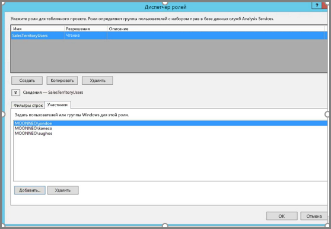
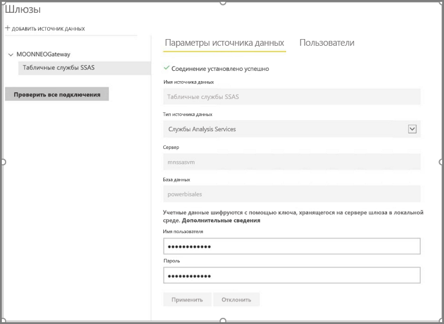
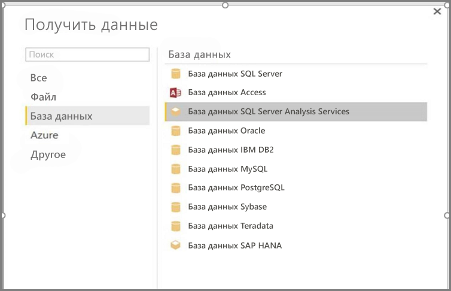
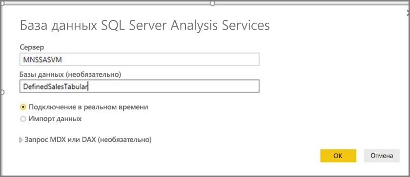
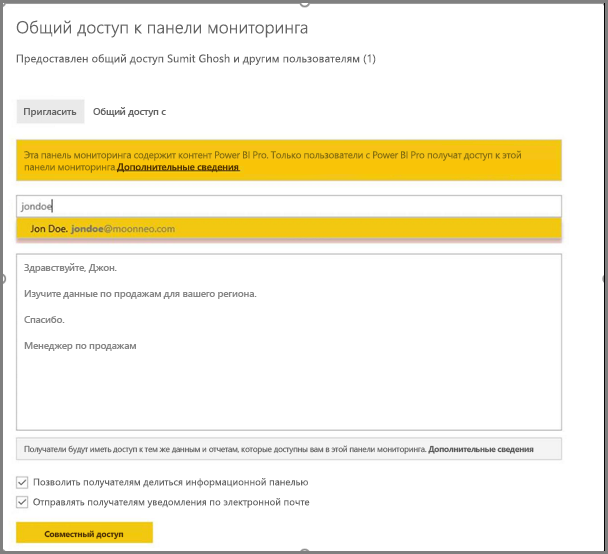
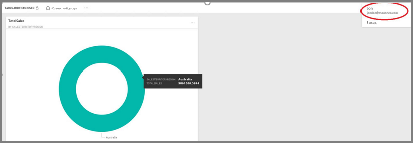

# <a name="dynamic-row-level-security-with-analysis-services-tabular-model"></a>Динамическая безопасность на уровне строк при использовании табличной модели служб Analysis Services

На примере набора данных, используемого для выполнения описанных ниже действий, это руководство показывает, как реализовать [**безопасность на уровне строк**](service-admin-rls.md) в **табличной модели Analysis Services** и использовать ее в отчете Power BI. 

* Создание таблицы безопасности в [базе данных **AdventureworksDW2012**](https://github.com/Microsoft/sql-server-samples/releases/tag/adventureworks)
* Создание табличной модели с необходимыми таблицами фактов и измерений
* Определение ролей и разрешений пользователей
* Развертывание модели в **табличном экземпляре Analysis Services**
* Создание в Power BI Desktop отчета, отображающего для пользователей данные с учетом их прав доступа
* Развертывание отчета в **службе Power BI**
* Создание панели мониторинга на основе отчета
* Предоставление доступа к панели мониторинга коллегам. 

Для прохождения этого руководства нужна [база данных **AdventureworksDW2012**](https://github.com/Microsoft/sql-server-samples/releases/tag/adventureworks).

## <a name="task-1-create-the-user-security-table-and-define-data-relationship"></a>Задача 1. Создание таблицы безопасности пользователей и определение связей между данными

Существует множество статей, описывающих, как настроить динамическую безопасность на уровне строк в **табличной модели SQL Server Analysis Services (SSAS)** . В этом примере воспользуемся статьей [Реализация динамической безопасности с помощью фильтров строк](https://msdn.microsoft.com/library/hh479759.aspx). 

Для выполнения описанных действий нужна реляционная база данных **AdventureworksDW2012**.

1. Создайте в **AdventureworksDW2012** таблицу **DimUserSecurity**, как показано ниже. Для создания таблицы можно использовать [SQL Server Management Studio (SSMS)](https://docs.microsoft.com/sql/ssms/download-sql-server-management-studio-ssms).
   
   

2. Создав и сохранив таблицу, нужно установить связь между столбцом **SalesTerritoryID** таблицы **DimUserSecurity** и столбцом **SalesTerritoryKey** таблицы **DimSalesTerritory**, как показано ниже. 

   В **SSMS** щелкните таблицу **DimUserSecurity** правой кнопкой мыши и выберите пункт **Конструктор**. Выберите **Конструктор таблиц -> Связи...** . После этого сохраните таблицу.
   
   

3. Добавьте пользователей в таблицу: щелкните таблицу **DimUserSecurity** правой кнопкой мыши и выберите пункт **Изменить первые 200 строк**. После добавления пользователей таблица **DimUserSecurity** должна выглядеть следующим образом, но при этом содержать ваших пользователей:
   
   
   
   Вы вернетесь к этим пользователям при выполнении дальнейших задач.

4. Теперь нужно создать *внутреннее соединение* с таблицей **DimSalesTerritory**, которое отражает связанные с пользователем сведения о регионе. Этот код SQL выполняет *внутреннее соединение*, а на рисунке показано, как таблица выглядит после этой операции.
   
       select b.SalesTerritoryCountry, b.SalesTerritoryRegion, a.EmployeeID, a.FirstName, a.LastName, a.UserName from [dbo].[DimUserSecurity] as a join  [dbo].[DimSalesTerritory] as b on a.[SalesTerritoryID] = b.[SalesTerritoryKey]
   
   

   На рисунке показано, кто отвечает за каждый регион продаж, в соответствии со связью, созданной в **шаге 2**. Например, можно видеть, что **Jon Doe** отвечает за **Австралию**. 

## <a name="task-2-create-the-tabular-model-with-facts-and-dimension-tables"></a>Задача 2. Создание табличной модели с таблицами фактов и измерений

1. Создав реляционное хранилище данных, нужно определить табличную модель. Для создания модели можно использовать инструментарий [**SQL Server Data Tools (SSDT)** ](https://docs.microsoft.com/sql/ssdt/sql-server-data-tools). Дополнительные сведения см. в статье [Создание проекта табличной модели](https://msdn.microsoft.com/library/hh231689.aspx).

2. Импортируем в модель все необходимые таблицы, как показано ниже.
   
    

3. После импорта таблиц нужно определить роль под названием **SalesTerritoryUsers** с разрешениями на **чтение**. Откройте меню **Модель** в инструментарии SQL Server Data Tools и выберите пункт **Роли**. В диалоговом окне **Диспетчер ролей** выберите **Создать**.

4. На вкладке **Участники** в **диспетчере ролей** добавьте пользователей, определенных в таблице **DimUserSecurity** при выполнении **задачи 1 (шаг 3)** .
   
    

5. Теперь добавим необходимые функции для таблиц **DimSalesTerritory** и **DimUserSecurity**, как показано ниже на вкладке **Фильтры строк**.
   
    

6. В этом шаге вы с помощью функции **LOOKUPVALUE** возвращаете значения для столбца, в котором имя пользователя Windows совпадает с именем, возвращаемым функцией **USERNAME**. Для запросов можно настроить ограничение, благодаря которому значения, возвращаемые функцией **LOOKUPVALUE**, будут совпадать со значениями в той же или связанной таблице. В столбце **Фильтр DAX** введем следующую формулу:
   
       =DimSalesTerritory[SalesTerritoryKey]=LOOKUPVALUE(DimUserSecurity[SalesTerritoryID], DimUserSecurity[UserName], USERNAME(), DimUserSecurity[SalesTerritoryID], DimSalesTerritory[SalesTerritoryKey])

    В этой формуле функция **LOOKUPVALUE** возвращает все значения из столбца **DimUserSecurity[SalesTerritoryID]** , для которых **DimUserSecurity[UserName]** совпадает с именем текущего пользователя Windows, а параметр **DimUserSecurity[SalesTerritoryID]** совпадает с параметром **DimSalesTerritory[SalesTerritoryKey]** .
   
    > [!IMPORTANT]
    > При использовании безопасности на уровне строк функция DAX [USERELATIONSHIP](https://msdn.microsoft.com/query-bi/dax/userelationship-function-dax) не поддерживается.

   Набор значений SalesTerritoryKey, возвращаемых функцией **LOOKUPVALUE**, используется для фильтрации списка строк, отображаемых в таблице **DimSalesTerritory**. В ней показаны только строки, в которых значение **SalesTerritoryKey** входит в число идентификаторов, возвращаемых функцией **LOOKUPVALUE**.

7. Для таблицы **DimUserSecurity** в столбце **Фильтр DAX** добавьте следующую формулу:
   
       =FALSE()

    Она указывает, что все столбцы разрешаются в `false`, поэтому столбцы таблицы **DimUserSecurity** не используются в запросе.

8. Теперь нужно обработать и развернуть модель. Дополнительные сведения см. в статье о [развертывании](https://msdn.microsoft.com/library/hh231693.aspx).

## <a name="task-3-add-data-sources-within-your-on-premises-data-gateway"></a>Задача 3. Добавление источников данных в локальном шлюзе данных

После того как табличная модель развернута и готова к работе, нужно добавить подключение к источнику данных на сервер табличного экземпляра Analysis Services.

1. Чтобы **служба Power BI** могла обращаться к локальной службе аналитики, в вашей среде должен быть установлен и настроен **[локальный шлюз данных](service-gateway-onprem.md)** .

2. Настроив шлюз должным образом, необходимо создать подключение к источнику данных для экземпляра табличной модели **Analysis Services**. Дополнительные сведения см. в статье [Управление своим источником данных — службы Analysis Services](service-gateway-enterprise-manage-ssas.md).
   
   

  После выполнения предыдущего шага шлюз настроен и готов к взаимодействию с локальным источником данных **Analysis Services**.

## <a name="task-4-create-report-based-on-analysis-services-tabular-model-using-power-bi-desktop"></a>Задача 4. Создание отчета на основе табличной модели Analysis Services с помощью Power BI Desktop

1. Запустите **Power BI Desktop** и выберите **Получение данных > База данных**.

2. В списке источников данных выберите пункт **База данных SQL Server Analysis Services** и щелкните **Подключиться**.
   
   

3. Введите данные своего экземпляра табличной модели **Analysis Services** и щелкните **Подключение в реальном времени**. Нажмите кнопку **ОК**. В **Power BI** динамическая безопасность работает только при **динамических подключениях**.
   
   

4. Вы увидите, что развернутая модель находится в экземпляре **Analysis Services**. Выберите нужную модель и нажмите кнопку **ОК**.
   
   

   **Power BI Desktop** выведет все доступные поля справа от холста в области **Поля**.

5. В области **Поля** справа выберите меру **SalesAmount** в таблице **FactInternetSales** и измерение **SalesTerritoryRegion** в таблице **SalesTerritory**.

6. Чтобы не усложнять этот отчет, мы не станем добавлять в него другие столбцы. Чтобы сделать данные более осмысленными, выберите режим визуализации **Кольцевой график**.
   
   

7. Создав отчет, мы можем опубликовать его непосредственно на портале Power BI. На ленте **Главная** в **Power BI Desktop** выберем **Опубликовать**.

## <a name="task-5-create-and-share-a-dashboard"></a>Задача 5. Создание и совместное использование панели мониторинга

1. Вы создали отчет и опубликовали его в службе **Power BI**. Теперь вы можете использовать пример, созданный на предыдущих этапах, для демонстрации сценария безопасности модели.
   
   Как **руководитель продаж** Sumit видит данные из всех регионов продаж. Он создает этот отчет (который мы сформировали на предыдущих этапах) и публикует его в службе Power BI.
   
   После публикации он создает на его основе панель мониторинга в службе Power BI и называет ее **TabularDynamicSec**. На изображении ниже показано, что Sumit видит все данные для всех регионов продаж.
   
   

2. Теперь он предоставляет доступ к панели мониторинга своему коллеге, которого зовут Jon Doe и который отвечает за продажи в Австралии.
   
   
   
   

3. Когда Jon Doe входит в службу **Power BI** и открывает общую панель мониторинга, созданную пользователем Sumit, он должен видеть **только** показатели продаж в подотчетном ему регионе. 
   
   

    Поздравляем! Параметры динамической безопасности на уровне строк, настроенные в локальной табличной модели **Analysis Services**, отображаются в **службе Power BI**. Служба Power BI использует свойство **EffectiveUserName** для передачи учетных данных текущего пользователя Power BI в локальный источник данных при выполнении запросов.

## <a name="task-6-understand-what-happens-behind-the-scenes"></a>Задача 6. Понимание происходящего

При выполнении этой задачи предполагается, что вы знакомы с приложением [SQL Profiler](https://docs.microsoft.com/sql/tools/sql-server-profiler/sql-server-profiler), так как вам нужно выполнить трассировку обмена данными с SQL Server в локальном табличном экземпляре SSAS.

1. Сеанс создается в момент, когда пользователь (Jon Doe) обращается к панели мониторинга в службе Power BI. Мы видим, что роль **salesterritoryusers** сразу же применяется для действующего имени пользователя **<EffectiveUserName>jondoe@moonneo.com</EffectiveUserName>** .
   
       <PropertyList><Catalog>DefinedSalesTabular</Catalog><Timeout>600</Timeout><Content>SchemaData</Content><Format>Tabular</Format><AxisFormat>TupleFormat</AxisFormat><BeginRange>-1</BeginRange><EndRange>-1</EndRange><ShowHiddenCubes>false</ShowHiddenCubes><VisualMode>0</VisualMode><DbpropMsmdFlattened2>true</DbpropMsmdFlattened2><SspropInitAppName>PowerBI</SspropInitAppName><SecuredCellValue>0</SecuredCellValue><ImpactAnalysis>false</ImpactAnalysis><SQLQueryMode>Calculated</SQLQueryMode><ClientProcessID>6408</ClientProcessID><Cube>Model</Cube><ReturnCellProperties>true</ReturnCellProperties><CommitTimeout>0</CommitTimeout><ForceCommitTimeout>0</ForceCommitTimeout><ExecutionMode>Execute</ExecutionMode><RealTimeOlap>false</RealTimeOlap><MdxMissingMemberMode>Default</MdxMissingMemberMode><DisablePrefetchFacts>false</DisablePrefetchFacts><UpdateIsolationLevel>2</UpdateIsolationLevel><DbpropMsmdOptimizeResponse>0</DbpropMsmdOptimizeResponse><ResponseEncoding>Default</ResponseEncoding><DirectQueryMode>Default</DirectQueryMode><DbpropMsmdActivityID>4ea2a372-dd2f-4edd-a8ca-1b909b4165b5</DbpropMsmdActivityID><DbpropMsmdRequestID>2313cf77-b881-015d-e6da-eda9846d42db</DbpropMsmdRequestID><LocaleIdentifier>1033</LocaleIdentifier><EffectiveUserName>jondoe@moonneo.com</EffectiveUserName></PropertyList>

2. Используя запрос действующего имени пользователя, службы Analysis Services преобразуют его в учетные данные moonneo/jondoe после отправки запроса в каталог Active Directory. После того как службы **Analysis Services** получают реальные учетные данные, они возвращают те данные, на работу с которыми у пользователя есть разрешение. ****

3. Если на панели мониторинга будет выполнено еще какое-то действие (например, Jon Doe перейдет с панели на связанный с ней отчет), в SQL Profiler отразится соответствующий запрос, который направляется в табличную модель Analysis Services в виде запроса DAX.
   
   

4. Ниже также показан запрос DAX, который выполняется для заполнения отчета данными.
   
   ```
   EVALUATE
     ROW(
       "SumEmployeeKey", CALCULATE(SUM(Employee[EmployeeKey]))
     )
   
   <PropertyList xmlns="urn:schemas-microsoft-com:xml-analysis">``
             <Catalog>DefinedSalesTabular</Catalog>
             <Cube>Model</Cube>
             <SspropInitAppName>PowerBI</SspropInitAppName>
             <EffectiveUserName>jondoe@moonneo.com</EffectiveUserName>
             <LocaleIdentifier>1033</LocaleIdentifier>
             <ClientProcessID>6408</ClientProcessID>
             <Format>Tabular</Format>
             <Content>SchemaData</Content>
             <Timeout>600</Timeout>
             <DbpropMsmdRequestID>8510d758-f07b-a025-8fb3-a0540189ff79</DbpropMsmdRequestID>
             <DbPropMsmdActivityID>f2dbe8a3-ef51-4d70-a879-5f02a502b2c3</DbPropMsmdActivityID>
             <ReturnCellProperties>true</ReturnCellProperties>
             <DbpropMsmdFlattened2>true</DbpropMsmdFlattened2>
             <DbpropMsmdActivityID>f2dbe8a3-ef51-4d70-a879-5f02a502b2c3</DbpropMsmdActivityID>
           </PropertyList>
   ```

## <a name="considerations"></a>Примечания

* Локальная безопасность на уровне строк при работе с Power BI действует только при динамических подключениях.

* Все изменения, вносимые в данные после обработки модели, становятся сразу же доступны пользователям, которые работают с отчетом через **динамические подключения** из службы Power BI.

