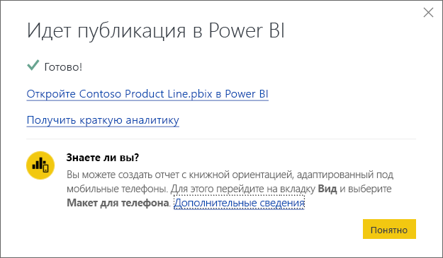

# Публикация из Power BI Desktop
При публикации файла **Power BI Desktop** в **службе Power BI** данные в модели и все отчеты, созданные в режиме **отчета**, публикуются в рабочей области Power BI. Новый набор данных с тем же именем и все отчеты появятся в навигаторе рабочей области.

Публикация из **Power BI Desktop** аналогична использованию функции **Получить данные** в Power BI для подключения к файлу **Power BI Desktop** и его отправки.

> [!NOTE]
> Изменения, внесенные в отчет Power BI, например добавление, удаление или изменение визуализаций в отчетах, не сохраняются в исходном файле **Power BI Desktop**.
> 
> 

## Публикация набора данных и отчетов Power BI Desktop
1. В Power BI Desktop последовательно выберите \> **Файл** \> **Опубликовать** \> **Опубликовать в Power BI** или щелкните **Опубликовать** на ленте.  
   
2. Войдите в Power BI.

По завершении вы получите ссылку, с помощью которой сможете открыть отчет на сайте Power BI.  
    

## Повторная публикация или замена набора данных, опубликованного из Power BI Desktop
При публикации файла **Power BI Desktop** набор данных и все отчеты, созданные в **Power BI Desktop**, отправляются на сайт Power BI. При повторной публикации файла **Power BI Desktop** набор данных на сайте Power BI будет заменен обновленным набором данных из файла **Power BI Desktop**.

Здесь все очевидно, однако существуют некоторые моменты, которые следует знать.

* При наличии нескольких наборов данных в Power BI с названием, совпадающим с именем файла **Power BI Desktop**, публикация может завершиться ошибкой. Убедитесь, что в Power BI имеется только один набор данных с тем же именем. Можно также переименовать файл и опубликовать его, создав новый набор данных с тем же именем, что и у файла.
* При переименовании или удалении столбца или меры все визуализации, уже существующие в Power BI с этим полем, могут быть повреждены. 
* Power BI не учитывает некоторые изменения формата существующих столбцов. Например, если формат столбца меняется с 0,25 до 25 %.
* Если имеется расписание обновления, настроенное для существующего набора данных в Power BI, и в файл добавляются новые источники данных, после чего он публикуется повторно, будет необходимо войти в них в разделе *Управление источниками данных* до следующего запланированного обновления.

