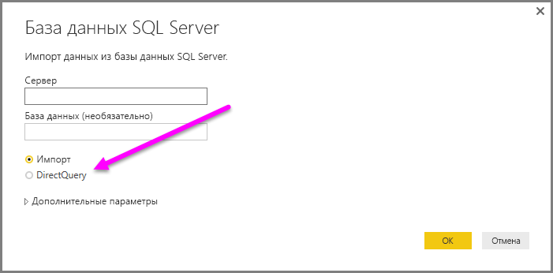
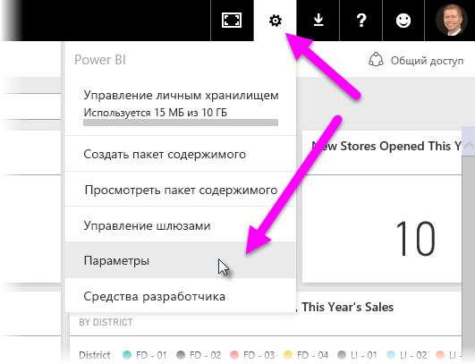
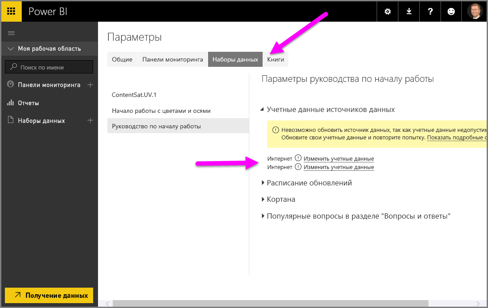

# Использование DirectQuery в Power BI Desktop
При подключении к источнику данных в **Power BI Desktop** всегда можно импортировать копию данных в **Power BI Desktop**. Для некоторых источников данных доступен альтернативный подход: прямое подключение к источнику данных с помощью **DirectQuery**.

## Поддерживаемые источники данных
Полный список источников данных, поддерживающих **DirectQuery**, см. в статье [Источники данных, поддерживаемые DirectQuery](desktop-directquery-data-sources.md).

## Подключение с помощью DirectQuery
При использовании команды **Получить данные** для подключения к источнику данных, поддерживаемому функцией **DirectQuery**, отображается диалоговое окно с вопросом о способе подключения.  

Варианты **Импорт** и **DirectQuery** имеют следующие различия:

**Импорт** — выбранные таблицы и столбцы импортируются в **Power BI Desktop**. При создании визуализации или взаимодействии с ней **Power BI Desktop** использует импортированные данные. Вам необходимо обновить данные (при этом снова производится импорт всего набора данных), чтобы просмотреть изменения, внесенные в базовые данные с момента первоначального импорта или самой последней операции обновления.

**DirectQuery** — данные не импортируются и не копируются в **Power BI Desktop**. Для реляционных источников выбранные таблицы и столбцы отображаются в списке **Поля**. Для многомерных источников, таких как SAP Business Warehouse, измерения и меры выбранного куба отображаются в списке **Поля**. При создании визуализации или взаимодействии с ней **Power BI Desktop** запрашивает базовый источник данных, то есть вы всегда видите актуальные данные.

При использовании **DirectQuery**доступно множество функций моделирования и преобразования данных, хотя и с некоторыми ограничениями. При создании визуализации или взаимодействии с ней должен запрашиваться базовый источник, а время, необходимое для обновления визуализации, зависит от производительности базового источника данных. Если данные, необходимые для обслуживания запроса, недавно запрашивались, Power BI Desktop использует эти последние данные для сокращения времени, необходимого для отображения визуализации. Выбор элемента **Обновить** на вкладке **Главная** ленты обеспечивает обновление всех визуализаций с использованием актуальных данных.

В статье [Power BI и DirectQuery](desktop-directquery-about.md) подробно описывается **DirectQuery**. Также в следующих разделах приведены дополнительные сведения о преимуществах, ограничениях и важных аспектах использования функции **DirectQuery**.

## Преимущества использования DirectQuery
Использование **DirectQuery** дает несколько преимуществ.

* **DirectQuery** позволяет создавать визуализации на базе очень больших наборов данных, где в противном случае было бы нецелесообразно сначала импортировать все данные с предварительным агрегированием.
* Изменения в базовых данных могут потребовать обновления данных, а для некоторых отчетов отображение актуальных данных может потребовать передачи большого объема данных, делая повторный импорт данных нецелесообразным. Отчеты **DirectQuery**, наоборот, всегда используют актуальные данные.
* Ограничение в 1 ГБ для набора данных *не* касается **DirectQuery**.

## Ограничения DirectQuery
В настоящее время существует несколько ограничений, связанных с использованием **DirectQuery**.

* Все таблицы должны поступать из одной базы данных.
* Если запрос в **редакторе запросов** слишком сложный, произойдет ошибка. Чтобы устранить ошибку, необходимо удалить проблемный шаг в **редакторе запросов** или *импортировать данные* вместо использования **DirectQuery**. Для многомерных источников, таких как SAP Business Warehouse, нет **редактора запросов**.
* Фильтровать связи можно только в одном направлении, а не в обоих. Но вы можете включить перекрестную фильтрацию в обоих направлениях для **DirectQuery** в качестве предварительной версии функции. Для многомерных источников, таких как SAP Business Warehouse, определенные в модели связи отсутствуют.
* Логика операций со времен недоступна в **DirectQuery**. Например, в режиме **DirectQuery** специальная обработка столбцов даты (год, квартал, месяц, день и т. д.) не поддерживается.
* По умолчанию ограничения размещаются в выражения DAX, (разрешены в мерах). Дополнительные сведения см. в следующем абзаце после этого маркированного списка.
* При возврате данных с помощью **DirectQuery** существует ограничение в 1 миллион строк. Это не влияет на агрегаты и вычисления, используемые для создания набора данных, возвращаемого с помощью **DirectQuery**. Ограничивается только количество возвращаемых строк. Например, можно объединить 10 миллионов строк из запроса, выполняемого в источнике данных, и вернуть точные результаты этого агрегирования в Power BI с помощью **DirectQuery**, если данные, возвращаемые в Power BI, содержат меньше 1 миллиона строк. Если из **DirectQuery** будет возвращено более 1 миллиона строк, в Power BI появится сообщение об ошибке.

Чтобы обеспечить приемлемую производительность запросов, отправляемых в базовый источник данных, ограничения накладываются на меры по умолчанию. Опытные пользователи могут обойти это ограничение, щелкнув **Файл > Параметры**, затем — **Настройки > Параметры и настройки > DirectQuery**, а затем выбрав параметр *Разрешить неограниченные меры в режиме DirectQuery*. При выборе этого параметра может использоваться любое выражение DAX, которое является допустимым для меры. Однако пользователям необходимо иметь в виду, что в режиме DirectQuery некоторые выражения, которые оптимально работают при импорте данных, могут стать причиной очень медленного выполнения запросов к серверному источнику.

## Важные аспекты использования DirectQuery
При использовании **DirectQuery** следует учитывать три аспекта.

* **Производительности и нагрузка**. Все запросы **DirectQuery** отправляются в базу данных-источник, поэтому время обновления визуализации зависит от того, как быстро источник на сервере возвратит результаты запросов. При использовании **DirectQuery** для визуализаций стандартным временем получения запрошенных данных считается пять секунд и меньше. Максимальное время получения ответа не должно превышать 30 секунд. Если на получение ответа уходит больше времени, работа с отчетом сильно затрудняется. Кроме того, если отчет опубликован в службе Power BI, все запросы, выполняющиеся более пяти минут, возвращают ошибку о превышении времени ожидания. В этом случае пользователь получает сообщение об ошибке.
  
  Также необходимо учитывать нагрузку на базу данных-источник. Нагрузка зависит от количества пользователей Power BI, которые используют опубликованные отчеты. *Защита на уровне строк* (RLS) может тоже оказывать существенное влияние. Для плитки панели мониторинга, в которой не применяется RLS и с которой одновременно могут работать несколько пользователей, достаточного одного запроса к базе данных. Если же RLS применяется, каждое обновление плитки обычно создает отдельный запрос для *каждого пользователя*, что значительно увеличивает нагрузку на базу данных-источник и потенциально влияет на производительность.
  
  Power BI создает максимально эффективные запросы, но в некоторых ситуациях созданный запрос может оказаться недостаточно эффективным, из-за чего происходит сбой обновления. Например, запрос может извлечь из источника данных на сервере свыше 1 млн строк. В этом случае возникает такая ошибка:
  
      The resultset of a query to external data source has exceeded
      the maximum allowed size of '1000000' rows.
  
  Такая ситуация может возникнуть с простой диаграммой, в которой есть столбец с очень большим количеством элементов и выбран параметр статистической обработки *Не суммировать*. В визуализациях нужно использовать столбцы, в которых количество элементов не превышает 1 млн, или применять соответствующие фильтры.
* **Безопасность**. Все пользователи опубликованного отчета подключаются к источнику данных на сервере с помощью учетных данных, которые были указаны после публикации отчета в службе Power BI. Такая же ситуация возникает при импорте данных: все пользователи видят одинаковые данные вне зависимости от того, какие правила безопасности определены в источнике на сервере. Пользователи, которым требуется внедрение средств безопасности на уровне пользователя с источниками DirectQuery и которые используют RLS. [Дополнительные сведения об RLS](service-admin-rls.md).
* **Поддерживаемые функции**. Некоторые функции **Power BI Desktop** не работают в режиме **DirectQuery**, а некоторые имеют определенные ограничения. Кроме того, в службе Power BI есть некоторые возможности (например, *Краткая аналитика*), которые недоступны для наборов данных при использовании **DirectQuery**. Выбирая способ подключения к данным, учитывайте совместимость функций с **DirectQuery****.**   

## Публикация в службу Power BI
Отчеты, созданные с помощью **DirectQuery**, можно опубликовать в службе Power BI.

Если для источника данных не требуется **локальный шлюз данных** (**база данных SQL Azure** , **хранилище данных SQL Azure** или **Redshift**), необходимо указать учетные данные, чтобы опубликованный отчет отобразился в службе Power BI.

Вы можете указать учетные данные, выбрав значок шестеренки **Параметры** в Power BI, а затем выбрав элемент **Параметры**.

Power BI отображает окно **Параметры** . В нем откройте вкладку **Наборы данных** и выберите набор данных, использующий **DirectQuery**, а затем выберите **Изменить учетные данные**.

Пока учетные данные не указаны, открытие опубликованного отчета или изучение набора данных, созданного с помощью подключения **DirectQuery** к источникам данных, приводит к ошибке.

Для источников данных, отличных от **базы данных SQL Azure**, **хранилища данных SQL Azure** или **Redshift**, использующих DirectQuery, необходимо установить **локальный шлюз данных** и зарегистрировать источник данных, чтобы подключиться к данным. Дополнительные сведения о локальном шлюзе данных см. [здесь](http://go.microsoft.com/fwlink/p/?LinkID=627094).

## Дальнейшие действия
Дополнительные сведения о **DirectQuery** см. в следующей статье:

* [Power BI и DirectQuery](desktop-directquery-about.md)
* [Источники данных, поддерживаемые DirectQuery](desktop-directquery-data-sources.md)
* [Использование DirectQuery и SAP Business Warehouse (BW)](desktop-directquery-sap-bw.md)
* [DirectQuery и SAP HANA](desktop-directquery-sap-hana.md)
* [Локальный шлюз данных](service-gateway-onprem.md)

