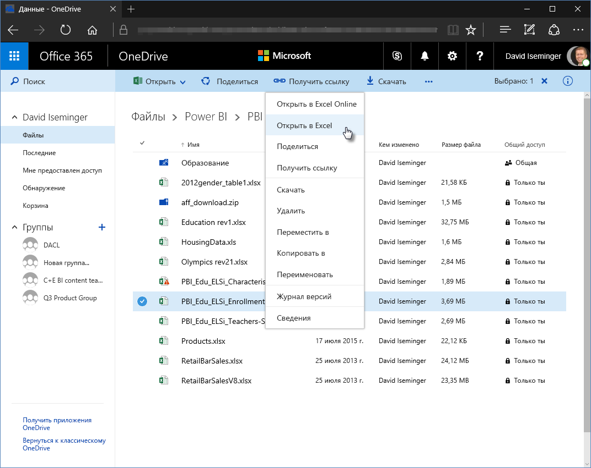
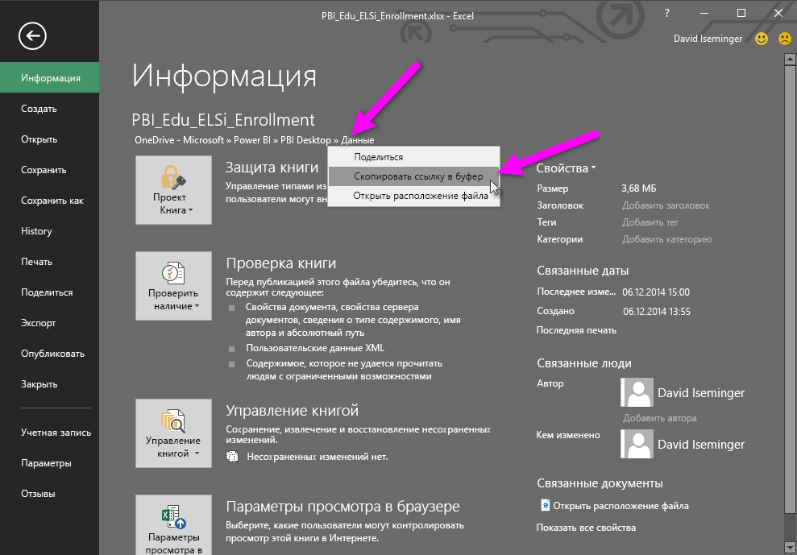
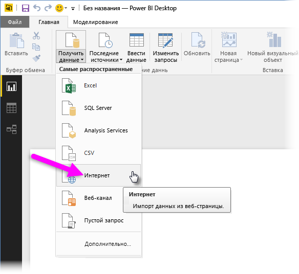
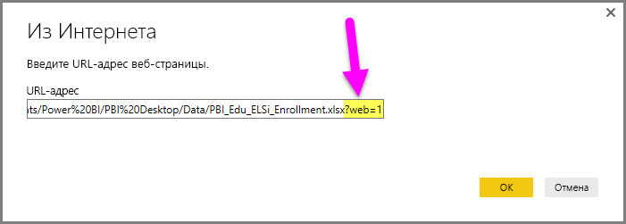

# Использование ссылок OneDrive для бизнеса в Power BI Desktop
Многие пользователи хранят книги Excel на диске OneDrive для бизнеса, который отлично подходит для использования с Power BI Desktop. Благодаря **Power BI Desktop** вы можете использовать веб-ссылки на файлы **Excel**, хранящиеся в **OneDrive для бизнеса**, для создания отчетов и визуальных элементов. Можно использовать учетную запись группы **OneDrive для бизнеса** или индивидуальную учетную запись **OneDrive для бизнеса**.

Для получения веб-ссылки из **OneDrive для бизнеса** требуется выполнить определенные действия. В следующих разделах демонстрируются процедуры, которые позволяют предоставить общий доступ к ссылке на файл для групп, разных компьютеров, а также пользователей.

## Получение ссылки из Excel с помощью браузера
1. Перейдите к расположению OneDrive для бизнеса с помощью браузера. Щелкните правой кнопкой мыши нужный файл и выберите **Открыть в Excel**.
   
   > [!NOTE]
> Интерфейс браузера может отличаться от представленного на рисунке. Существует несколько способов выбора команды **Открыть в Excel** для файлов в интерфейсе браузера **OneDrive для бизнеса**. Можно использовать любой вариант, позволяющий открыть файл в Excel.
   > 
   > 
   
   
2. В **Excel** выберите **Файл > Сведения**, а затем выберите ссылку под кнопкой **Защитить книгу**. Выберите **Копировать ссылку в буфер обмена**.
   
   

## Использование ссылки в Power BI Desktop
В Power BI Desktop можно использовать только что скопированную ссылку. Выполните следующие действия.

1. В Power BI Desktop выберите **Получение данных > Интернет**.
   
   
2. Вставьте ссылку в диалоговое окно **Из Интернета** (пока **не** нажимайте кнопку OK).
   
    
3. Обратите внимание на строку *?web=1* в конце ссылки. Эту *часть строки URL-адреса необходимо удалить* **перед** нажатием кнопки **ОК**, чтобы выполнить **Power BI Desktop** правильный переход к файлу.
4. Если **Power BI Desktop** запрашивает учетные данные, выберите **Windows** (для локальных сайтов SharePoint) или **Учетная запись организации** (для сайтов Office 365 или OneDrive для бизнеса).
   
   

Откроется область **Навигатор**, где в списке таблиц, листов и диапазонов, обнаруженных в книге Excel, можно выбрать нужные данные. Из этого окна файл OneDrive для бизнеса можно использовать так же, как любой другой файл Excel, создавать отчеты и использовать его в наборах данных, как и любой другой источник данных.

> [!NOTE]
> Вы можете использовать файл **OneDrive для бизнеса** в качестве источника данных в службе Power BI с включенным для этого файла параметром **обновления службы**. Для этого нужно выбрать **OAuth2** в качестве **метода проверки подлинности** при настройке параметров обновления. В противном случае при попытке подключения или обновления может возникнуть ошибка (например, *ошибка обновления учетных данных источника данных*). Выбрав **OAuth2** как метод аутентификации, вы устраните эту проблему с учетными данными.
> 
> 

