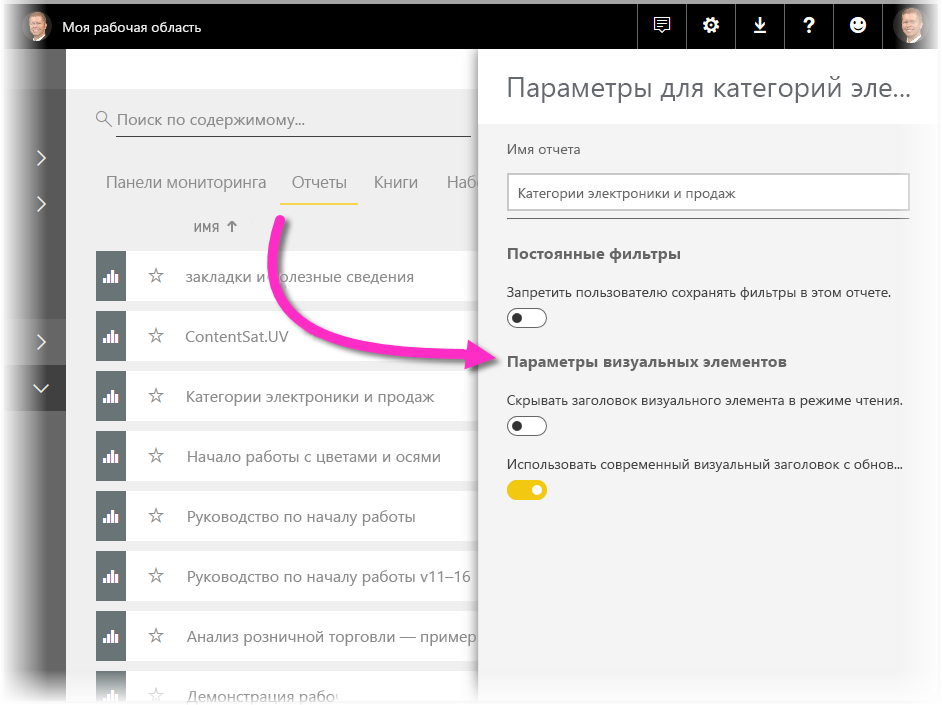

# Усовершенствование отчетов Power BI с помощью визуальных элементов

Чтобы усовершенствовать оформление отчетов **Power BI Desktop**, вы можете использовать такие визуальные элементы, как фоновый рисунок и улучшенные заголовки визуальных элементов.

Начиная с выпуска версии **Power BI Desktop** в июле 2018 г. в отчетах доступны усовершенствования, которые позволяют улучшить оформление представлений аналитических сведений и отчетов. В этой статье рассматриваются следующие усовершенствования: 

* **фоновый рисунок**, который помогает оттенить или выделить элементы отчета;
* улучшенные **заголовки визуальных элементов** для отдельных визуализаций, позволяющие идеально организовать элементы на холсте отчета. 

В следующих разделах объясняется, как использовать эти усовершенствования и применять их к отчетам.

## Использование фонового рисунка в отчетах Power BI

Можно отформатировать серую область за пределами отчета с помощью **фонового рисунка**. На следующем изображении стрелкой указана область применения фонового рисунка. 

Можно задать фоновый рисунок как для каждой страницы отчета, так и для всех вместе. Чтобы установить фоновый рисунок, нажмите значок **Форматирование**. При этом не должен быть выбран ни один визуальный элемент в отчете. В области появится карточка **Фоновый рисунок**.

В качестве **фонового рисунка** можно применить цвет, выбрав раскрывающийся список **Цвет**, или же нажать кнопку **Добавить изображение**, чтобы выбрать фоновое изображение. Также можно применить к фоновому рисунку прозрачность (цвет или изображение) с помощью ползунка **Прозрачность**.

Полезно помнить следующие определения, относящиеся к **фоновому рисунку**:

* серая область за пределами области отчета представляет собой область **фонового рисунка**;
* область на холсте, где можно размещать визуальные элементы, называется **страницей** отчета. Ее можно изменить в **области форматирования** с помощью раскрывающегося списка **Фон страницы**.

**Страница** отчета всегда находится на переднем плане (по сравнению с фоновым рисунком), в то время как **фоновый рисунок** располагается за ней и является наиболее отдаленным элементом заднего плана на странице отчета. Если к странице применить прозрачность, она также применяется к визуальным элементам в отчете. Это позволяет сделать фоновый рисунок видимым на фоне через визуальные элементы.

Для всех новых отчетов применяются следующие параметры по умолчанию:

* для **страницы** отчета устанавливается **белый** цвет и уровень прозрачности **100 %**;
* для **фонового рисунка** устанавливается **белый** цвет и уровень прозрачности **0 %**.

Если установить для фона страницы прозрачность более 50 %, во время создания или редактирования отчета появляется пунктирная граница, обозначающая рамки холста отчета. 

Важно отметить, что пунктирная граница отображается *только* при редактировании отчета и *не* видна пользователям, которые просматривают опубликованный отчет, например при просмотре в **службе Power BI**.

> [!NOTE]
> Если вы используете темный фоновый рисунок и белый или очень светлый цвет текста, помните, что функция **Экспорт в PDF** не выполняется для фонового рисунка, поэтому после экспорта такой текст не будет видно. Дополнительные сведения о функции **Экспорт в PDF** см. в [соответствующем разделе](desktop-export-to-pdf.md).

## Использование улучшенных заголовков визуальных элементов в отчетах Power BI

Начиная с выпуска версии **Power BI Desktop** в июле 2018 г. заголовки визуальных элементов в отчетах значительно улучшены. Основные усовершенствования заключаются в том, что заголовок теперь отсоединен от визуального элемента и его положение можно изменять в зависимости от предпочитаемого макета и позиционирования, а сам заголовок теперь отображается внутри визуального элемента, а не "плавает" над ним. 

По умолчанию заголовок выровнен с названием и отображается внутри визуального элемента. На приведенном ниже рисунке показан заголовок (значки закрепления, развертывания и многоточия) в пределах визуального элемента, выровненный по правому краю, вдоль той же горизонтальной позиции, что и название визуального элемента.

Если у визуального элемента нет названия, заголовок "плавает" над верхним краем визуального элемента, выровненный по правому краю, как показано на представленном ниже рисунке. 

Если визуальный элемент расположен в самом верху отчета, его заголовок вместо этого прикрепляется к нижнему краю визуального элемента. 

Для каждого визуального элемента также имеется карточка в разделе **Форматирование** области **Визуализации** под названием **Заголовок визуального элемента**. В этой карточке можно настроить все виды характеристик заголовка визуального элемента.

> [!NOTE]
> Видимость переключателей не влияет на отчет во время его создания или редактирования. Чтобы эффект отобразился, необходимо опубликовать отчет и просмотреть его в режиме чтения. Такое поведение связано с важностью многих настроек, содержащихся в заголовках, особенно значков предупреждения, оповещающих о проблемах во время редактирования.

Для отчетов, которые отображаются только в **службе Power BI**, можно отрегулировать использование заголовков визуальных элементов. Для этого последовательно выберите **Моя рабочая область > Отчеты**, а затем выберите значок **Параметры**. Здесь отображаются параметры отчета, для которого был выбран значок **Параметры**. Их можно отрегулировать, как показано на приведенном ниже рисунке.

### Включение улучшенных заголовков визуальных элементов для существующих отчетов

Новый заголовок визуального элемента применяется по умолчанию для всех новых отчетов. Для существующих отчетов нужно включить эту функцию в **Power BI Desktop**. Для этого выберите **Файл > Параметры и настройки > Параметры**, а затем в разделе **Параметры отчетов** установите флажок **Использование современного визуального заголовка с обновленными параметрами стиля**.

## Дальнейшие действия
Дополнительные сведения о **Power BI Desktop** и инструкции по началу работы см. в следующих статьях.

* [Что такое Power BI Desktop?](desktop-what-is-desktop.md)
* [Общие сведения о запросах в Power BI Desktop](desktop-query-overview.md)
* [Источники данных в Power BI Desktop](desktop-data-sources.md)
* [Подключение к данным в Power BI Desktop](desktop-connect-to-data.md)
* [Формирование и объединение данных в Power BI Desktop](desktop-shape-and-combine-data.md)
* [Общие задачи с запросами в Power BI Desktop](desktop-common-query-tasks.md)   

