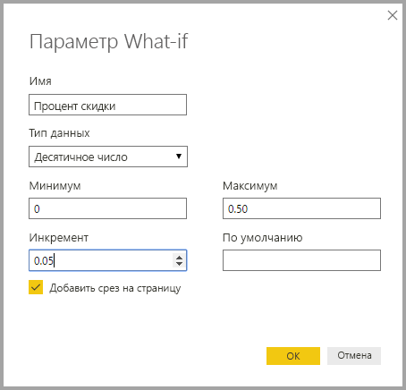
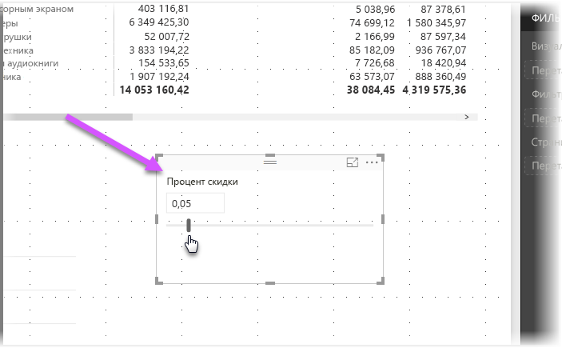
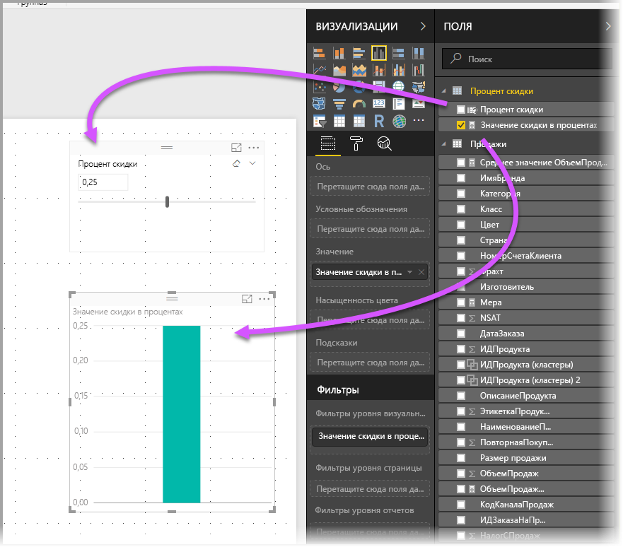
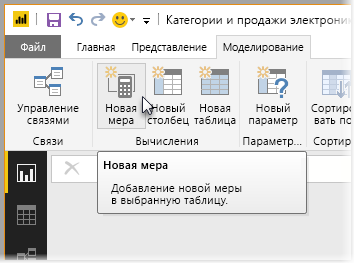
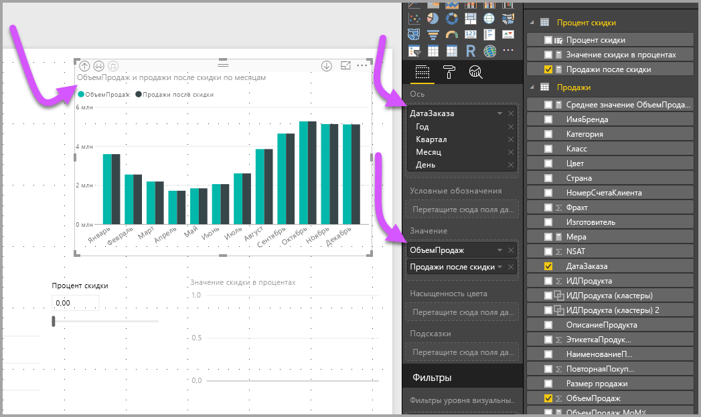

# Создание и использование параметра What if для визуализации переменных в Power BI Desktop
Начиная с августа 2017 г. в **Power BI Desktop** можно создать переменные **What if** для отчетов, взаимодействовать с переменной в качестве среза, и, впоследствии, визуализировать различные ключевые значения в отчетах и определять их количество.

Параметр **What if** находится на вкладке **Моделирование** в **Power BI Desktop**. После перехода на эту вкладку откроется диалоговое окно, где можно настроить этот параметр.

## Создание параметра What if
Чтобы создать параметр **What if**, нажмите кнопку **What if** на вкладке **Моделирование** в **Power BI Desktop**. На следующем рисунке видно, что мы создали параметр с именем *Процент скидки* и задали для него тип *Десятичное число*. Значение*Минимум* равно нулю, *Максимум* — 0,50 (50 %). Мы также настроили *шаг приращения* 0,05 или 5 %. Именно с таким шагом параметр будет корректироваться при взаимодействии в отчете.

> [!NOTE]
> Убедитесь, что вы поставили перед десятичным числом 0, например 0,50, а не просто ,50. В противном случае число не будет проверено, а кнопка **ОК** — неактивна.
> 
> 

Для вашего удобства при установке флажка **Add slicer to this page** (Добавить срез на эту страницу) срез с вашим параметром **What if** автоматически помещается на текущую страницу отчета.

Помимо создания этого параметра при создании параметра **What if** также создается мера, которую можно использовать для визуализации текущего значения параметра **What if**.

Обратите внимание, что после создания параметра **What if** и параметр и мера становятся частью вашей модели. Они доступны в пределах отчета и могут использоваться на других страницах отчета. И так как они являются частью модели, можно удалить срез на странице отчета и при необходимости восстановить его. Просто выделите параметр **What if** в списке **Поля** и перетащите его на полотно (и измените визуальный элемент на "Срез"), чтобы легко восстановить этот параметр в отчете.

## Использование параметра What if
Давайте создадим простой пример использования параметра **What if**. В предыдущем разделе мы создали параметр **What if**. Теперь мы используем его, создав меру, значение которой изменяется с помощью ползунка. Для этого нужно создать меру.

Новая мера будет отражать общий объем продаж с примененной скидкой. Вы, конечно, можете создавать сложные и интересные меры, которые дадут тем, кто использует ваши отчеты, возможность визуализировать переменную параметра **What if**. Например, можно создать отчет, позволяющий торговым представителям увидеть свое вознаграждение за достижение определенных целевых показателей или процентов по продажам или же влияние увеличения продаж на повышение скидок.

После того, как мы введем формулу меры в строку формул, называем ее **Продажи после скидки** и видим результат:

Затем создаем визуальный элемент столбца со значением *OrderDate* на оси и используем *SalesAmount* и созданную меру *Продажи после скидки* в качестве значений.

Затем мы передвигаем ползунок и видим, что в колонке *Продажи после скидки* отображается объем продаж со скидкой.

Вот, собственно, и все. Параметры **What if** можно использовать в любой ситуации, чтобы предоставить пользователям отчетов возможность взаимодействовать с разными сценариями, которые в них создаются.

