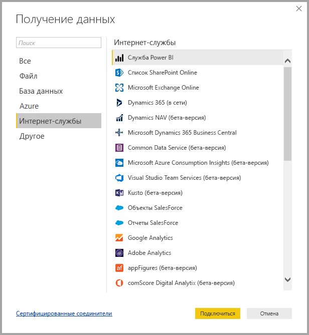
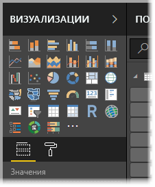
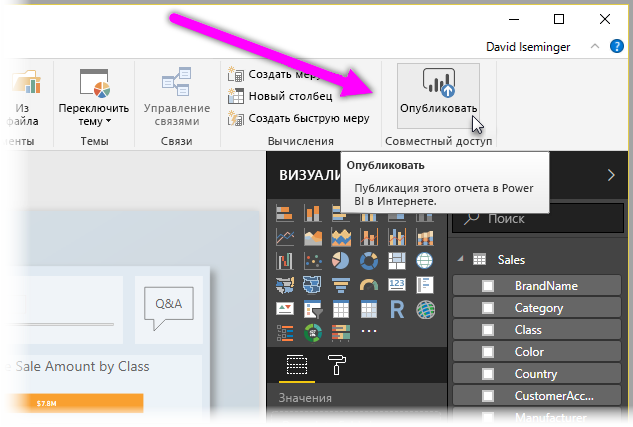

# Что такое Power BI Desktop?

**Power BI Desktop** — это бесплатное приложение, которое устанавливается на локальном компьютере и позволяет подключаться к источникам данных, преобразовывать и визуализировать данные. Используя **Power BI Desktop**, вы сможете подключиться одновременно к нескольким разным источникам данных, а также объединить их в модель данных (этот процесс называется моделированием) и создать на ее основе визуальные элементы и коллекции визуальных элементов, которые можно совместно использовать с другими пользователями организации в форме отчетов. Большинство пользователей, работающих над проектами бизнес-аналитики, применяют **Power BI Desktop** для создания отчетов, а **службу Power BI** — для предоставления к отчетам общего доступа другим пользователям.

Вот самые распространенные варианты применения **Power BI Desktop**:

* Подключение к данным
* преобразование и очистка данных для создания модели данных;
* создание визуальных элементов, таких как диаграммы и графики, которые наглядно отображают данные;
* создание отчетов, которые представляют собой коллекции визуальных элементов на одной или нескольких страницах отчета;
* совместное использование с помощью **службы Power BI**.

Сотрудники, обычно выполняющие такие задачи, чаще всего называются *специалистами по анализу данных* (или просто *аналитиками*) или специалистами по бизнес-аналитике (иногда их еще называют *создателями отчетов*). Но многие пользователи, которые не считают себя аналитиками или создателями отчетов, с успехом применяют **Power BI Desktop** для создания привлекательных отчетов или извлечения данных из разных источников и построения моделей данных, которые можно совместно использовать с другими сотрудниками и организациями.

В Power BI Desktop есть три представления, которые показаны вдоль левой стороны холста. Это такие представления (в порядке их отображения):
* **Представление отчетов** — здесь создаются отчеты и визуальные элементы, а также выполняется большая часть действий по созданию.
* **Представление данных** — здесь можно просмотреть таблицы, меры и другие данные, используемые в модели данных, связанной с отчетом, а также преобразовывать данные для оптимального использования в модели отчета.
* **Представление модели** — в этом представлении можно просмотреть связи между таблицами в модели данных и управлять ими.

На следующем рисунке показаны три представления, отображаемые вдоль левой стороны холста:

**Power BI Desktop** позволяет создавать сложные и визуально эффектные отчеты, объединяя данные из нескольких источников в один отчет, к которому можно предоставить доступ многим пользователям в организации. 

## Подключение к данным
Чтобы приступить к работе с **Power BI Desktop**, нужно прежде всего подключиться к данным. **Power BI Desktop** поддерживает подключение к источникам данных самых разных видов. Для подключения к данным выберите на ленте вкладку **Главная**, а затем щелкните **Получить данные > Дополнительно**. В результате Это действие отобразит окно **Получение данных**, которое представлено на следующем изображении. Здесь вы видите полный список категорий, к которым можно подключаться с помощью Power BI Desktop.

Когда вы выберете тип данных, система предложит вам ввести такие сведения, как URL-адрес и учетные данные, необходимые Power BI Desktop для подключения к источнику данных от вашего имени.

После подключения к одному или нескольким источникам данных может потребоваться преобразовать данные в удобный формат.

## Преобразование и очистка данных, создание модели

В Power BI Desktop данные можно очищать и преобразовывать с помощью встроенного **редактора запросов**. С помощью редактора запросов в данные можно вносить различные изменения, например изменять тип данных, удалять столбцы или объединять данные из нескольких источников. Это похоже на работу скульптора — вы берете большой кусок глины (или данных) и понемногу отсекаете от него ненужные кусочки или добавляете новые, пока не добьетесь нужной формы. 

Каждый шаг преобразования (переименование таблицы, преобразование типа данных или удаление столбцов) сохраняется **редактором запросов**, и он выполняет этот же процесс при каждом следующем подключении к тому же источнику данных. Это означает, что входящие данные всегда будут приобретать указанный вами вид.

На следующем рисунке представлена панель **Параметры запроса** с примером сформированного запроса, который был преобразован в модель.

 

Придав данным нужный вид, переходите к созданию визуальных элементов. 

## Создание визуальных элементов 

Завершив подготовку модели данных, перетащите ее *поля* на холст отчета для создания *визуальных элементов*. *Визуальный элемент* — это графическое представление данных модели. Ниже представлен пример визуального элемента, представляющего собой простую гистограмму. 

В Power BI Desktop предоставляется широкий выбор типов визуальных элементов. Чтобы создать или изменить визуальный элемент, просто щелкните значок нужного типа на панели **Визуализации**. При этом, если на холсте отчета был выбран визуальный элемент, его тип изменится на выбранный тип. Если ни один визуальный элемент не выбран, будет создан новый визуальный элемент выбранного типа.

## Создавать отчеты

Чаще всего создаются коллекции визуальных элементов, отображающих разные аспекты данных, на основе которых создавалась модель в Power BI Desktop. Коллекция визуальных элементов, сохраненная в одном файле Power BI Desktop, называется *отчетом*. Отчет может состоять из одной или нескольких страниц, так же как файл Excel включает один или несколько листов. На следующем рисунке вы видите первую страницу отчета Power BI Desktop с именем Overview (Обзор), которое отображается на вкладке в нижней части изображения. В этом отчете десять страниц.

## Публикация отчетов

Когда отчет будет готов для предоставления другим пользователям, вы можете **опубликовать** этот его в **службе Power BI**, чтобы сделать его доступным для любого сотрудника вашей организации, имеющего лицензию Power BI. Чтобы опубликовать отчет Power BI Desktop, нажмите кнопку **Опубликовать** на вкладке **Главная** в Power BI Desktop.

Когда вы нажимаете кнопку **Опубликовать**, Power BI Desktop подключается к **службе Power BI** от имени вашей учетной записи Power BI и предлагает вам выбрать, где именно в службе Power BI следует опубликовать этот отчет: в личной рабочей области, в рабочей области группы и т. п. Для публикации отчетов в службе Power BI необходима лицензия Power BI.

## Дальнейшие действия

Чтобы начать работу с **Power BI Desktop**, вам прежде всего нужно скачать и установить это приложение. Есть два способа получить **Power BI Desktop**:

* [скачать Power BI Desktop с веб-сайта](desktop-get-the-desktop.md);
* [установить Power BI Desktop из Магазина Windows](http://aka.ms/pbidesktopstore).
