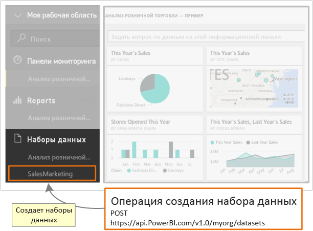

# <a name="step-3-create-a-dataset-in-power-bi"></a>Шаг 3. Создание набора данных в Power BI
Эта статья является частью пошагового руководства по [принудительной отправке данных в набор данных](walkthrough-push-data.md).

На **шаге 2** ([Получение токена доступа для проверки подлинности](walkthrough-push-data-get-token.md)) руководства по отправке данных в набор данных вы получили маркер для проверки подлинности в **Azure AD**. На этом шаге вы будете использовать этот маркер для вызова операции [PostDataset](https://docs.microsoft.com/rest/api/power-bi/pushdatasets).

Чтобы вызвать ресурс REST, используйте URL-адрес, который указывает на ресурс, а затем отправьте строку JavaScript Object Notation (JSON), которая описывает набор данных, в ресурс службы Power BI. Ресурс REST определяет часть службы Power BI, с которой вы будете работать. Для принудительной отправки данных в набор данных в качестве целевого ресурса используется **набор данных**. [https://api.PowerBI.com/v1.0/myorg/datasets](`https://api.PowerBI.com/v1.0/myorg/datasets`) — это URL-адрес, определяющий набор данных. Если данные отправляются в рамках группы, используется URL-адрес `https://api.PowerBI.com/v1.0/myorg/groups/{group_id}/datasets`.

Для проверки подлинности в ходе операции REST Power BI добавьте в заголовок запроса маркер, полученный на шаге [Получение маркера доступа для проверки подлинности](walkthrough-push-data-get-token.md).

При вызове операции [PostDataset](https://docs.microsoft.com/rest/api/power-bi/pushdatasets) создается набор данных. 



Далее приведены действия по созданию набора данных в Power BI.

## <a name="create-a-dataset-in-power-bi"></a>Создание набора данных в Power BI
> [!NOTE]
> Перед началом работы убедитесь, что выполнены предыдущие шаги из пошагового руководства по [принудительной отправке данных в набор данных](walkthrough-push-data.md).
> 
> 

1. В проекте консольного приложения, созданного в разделе [Шаг 2. Получение маркера доступа для проверки подлинности](walkthrough-push-data-get-token.md), добавьте директивы **using System.Net;** и **using System.IO;** в файл Program.cs.
2. В Program.cs добавьте приведенный ниже код.
3. Запустите консольное приложение и войдите в свою учетную запись Power BI. В окне консоли вы должны увидеть **созданный набор данных** . Кроме того, чтобы увидеть новый набор данных, можно войти в Power BI.

**Пример принудительной отправки данных в набор данных**

Добавьте следующий код в Program.cs.

* В методе static void Main(string[] args):
  
    ```csharp
    static void Main(string[] args)
    {
        //Get an authentication access token
        token = GetToken();
  
        //Create a dataset in Power BI
        CreateDataset();
    }
    ```
* Добавьте метод CreateDataset():
  
    ```csharp
    #region Create a dataset in Power BI
    private static void CreateDataset()
    {
        //TODO: Add using System.Net and using System.IO
  
        string powerBIDatasetsApiUrl = "https://api.powerbi.com/v1.0/myorg/datasets";
        //POST web request to create a dataset.
        //To create a Dataset in a group, use the Groups uri: https://api.PowerBI.com/v1.0/myorg/groups/{group_id}/datasets
        HttpWebRequest request = System.Net.WebRequest.Create(powerBIDatasetsApiUrl) as System.Net.HttpWebRequest;
        request.KeepAlive = true;
        request.Method = "POST";
        request.ContentLength = 0;
        request.ContentType = "application/json";
  
        //Add token to the request header
        request.Headers.Add("Authorization", String.Format("Bearer {0}", token));
  
        //Create dataset JSON for POST request
        string datasetJson = "{\"name\": \"SalesMarketing\", \"tables\": " +
            "[{\"name\": \"Product\", \"columns\": " +
            "[{ \"name\": \"ProductID\", \"dataType\": \"Int64\"}, " +
            "{ \"name\": \"Name\", \"dataType\": \"string\"}, " +
            "{ \"name\": \"Category\", \"dataType\": \"string\"}," +
            "{ \"name\": \"IsCompete\", \"dataType\": \"bool\"}," +
            "{ \"name\": \"ManufacturedOn\", \"dataType\": \"DateTime\"}" +
            "]}]}";
  
        //POST web request
        byte[] byteArray = System.Text.Encoding.UTF8.GetBytes(datasetJson);
        request.ContentLength = byteArray.Length;
  
        //Write JSON byte[] into a Stream
        using (Stream writer = request.GetRequestStream())
        {
            writer.Write(byteArray, 0, byteArray.Length);
  
            var response = (HttpWebResponse)request.GetResponse();
  
            Console.WriteLine(string.Format("Dataset {0}", response.StatusCode.ToString()));
  
            Console.ReadLine();
        }
    }
    #endregion
    ```

Следующим шагом является [получение набора данных для добавления строк в таблицу Power BI](walkthrough-push-data-get-datasets.md).

Ниже приведен [полный листинг кода](#code).

<a name="code"/>

## <a name="complete-code-listing"></a>Полный листинг кода

```csharp
using System;
using Microsoft.IdentityModel.Clients.ActiveDirectory;
using System.Net;
using System.IO;

namespace walkthrough_push_data
{
    class Program
    {
        private static string token = string.Empty;

        static void Main(string[] args)
        {

            //Get an authentication access token
            token = GetToken();

            //Create a dataset in Power BI
            CreateDataset();

        }

        #region Get an authentication access token
        private static string GetToken()
        {
            // TODO: Install-Package Microsoft.IdentityModel.Clients.ActiveDirectory -Version 2.21.301221612
            // and add using Microsoft.IdentityModel.Clients.ActiveDirectory

            //The client id that Azure AD created when you registered your client app.
            string clientID = "{Client_ID}";

            //RedirectUri you used when you register your app.
            //For a client app, a redirect uri gives Azure AD more details on the application that it will authenticate.
            // You can use this redirect uri for your client app
            string redirectUri = "https://login.live.com/oauth20_desktop.srf";

            //Resource Uri for Power BI API
            string resourceUri = "https://analysis.windows.net/powerbi/api";

            //OAuth2 authority Uri
            string authorityUri = "https://login.microsoftonline.com/common/";

            //Get access token:
            // To call a Power BI REST operation, create an instance of AuthenticationContext and call AcquireToken
            // AuthenticationContext is part of the Active Directory Authentication Library NuGet package
            // To install the Active Directory Authentication Library NuGet package in Visual Studio,
            //  run "Install-Package Microsoft.IdentityModel.Clients.ActiveDirectory" from the nuget Package Manager Console.

            // AcquireToken will acquire an Azure access token
            // Call AcquireToken to get an Azure token from Azure Active Directory token issuance endpoint
            AuthenticationContext authContext = new AuthenticationContext(authorityUri);
            string token = authContext.AcquireToken(resourceUri, clientID, new Uri(redirectUri)).AccessToken;

            Console.WriteLine(token);
            Console.ReadLine();

            return token;
        }

        #endregion


        #region Create a dataset in Power BI
        private static void CreateDataset()
        {
            //TODO: Add using System.Net and using System.IO

            string powerBIDatasetsApiUrl = "https://api.powerbi.com/v1.0/myorg/datasets";
            //POST web request to create a dataset.
            //To create a Dataset in a group, use the Groups uri: https://api.PowerBI.com/v1.0/myorg/groups/{group_id}/datasets
            HttpWebRequest request = System.Net.WebRequest.Create(powerBIDatasetsApiUrl) as System.Net.HttpWebRequest;
            request.KeepAlive = true;
            request.Method = "POST";
            request.ContentLength = 0;
            request.ContentType = "application/json";

            //Add token to the request header
            request.Headers.Add("Authorization", String.Format("Bearer {0}", token));

            //Create dataset JSON for POST request
            string datasetJson = "{\"name\": \"SalesMarketing\", \"tables\": " +
                "[{\"name\": \"Product\", \"columns\": " +
                "[{ \"name\": \"ProductID\", \"dataType\": \"Int64\"}, " +
                "{ \"name\": \"Name\", \"dataType\": \"string\"}, " +
                "{ \"name\": \"Category\", \"dataType\": \"string\"}," +
                "{ \"name\": \"IsCompete\", \"dataType\": \"bool\"}," +
                "{ \"name\": \"ManufacturedOn\", \"dataType\": \"DateTime\"}" +
                "]}]}";

            //POST web request
            byte[] byteArray = System.Text.Encoding.UTF8.GetBytes(datasetJson);
            request.ContentLength = byteArray.Length;

            //Write JSON byte[] into a Stream
            using (Stream writer = request.GetRequestStream())
            {
                writer.Write(byteArray, 0, byteArray.Length);

                var response = (HttpWebResponse)request.GetResponse();

                Console.WriteLine(string.Format("Dataset {0}", response.StatusCode.ToString()));

                Console.ReadLine();
            }
        }
        #endregion
    }
}
```

[Дальнейшие действия >](walkthrough-push-data-get-datasets.md)

## <a name="next-steps"></a>Дальнейшие действия
* [Получение набора данных для добавления строк в таблицу Power BI](walkthrough-push-data-get-datasets.md)  
* [Получение токена доступа для проверки подлинности](walkthrough-push-data-get-token.md)  
* [PostDataset](https://docs.microsoft.com/rest/api/power-bi/pushdatasets/datasets_postdataset)  
[PostDatasetInGroup](https://docs.microsoft.com/rest/api/power-bi/pushdatasets/datasets_postdatasetingroup)  
* [Принудительная отправка данных в панель мониторинга Power BI](walkthrough-push-data.md)  
* [Обзор интерфейса REST API Power BI](overview-of-power-bi-rest-api.md)  
* [Справочник по REST API Power BI](https://docs.microsoft.com/rest/api/power-bi/)  

Появились дополнительные вопросы? [Ответы на них см. в сообществе Power BI.](https://community.powerbi.com/)

