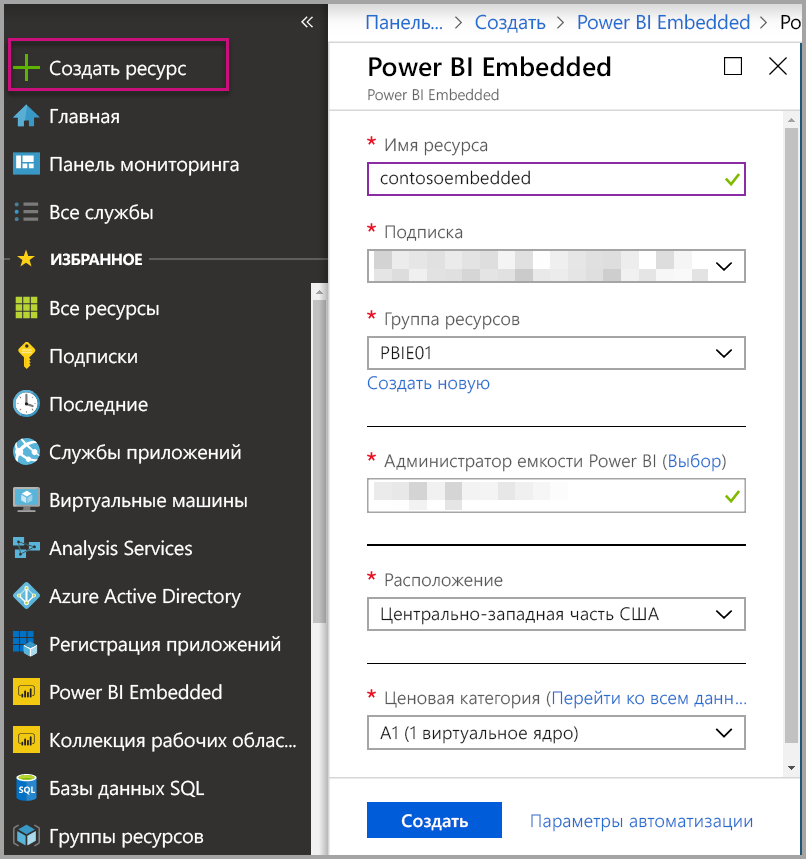

# Создание емкости Power BI Embedded на портале Azure

В этой статье рассматривается создание емкости [Power BI Embedded](azure-pbie-what-is-power-bi-embedded.md) в Microsoft Azure. Power BI Embedded упрощает возможности Power BI, позволяя быстро добавлять привлекательные визуальные элементы, отчеты и панели мониторинга в приложения.

Если у вас нет подписки Azure, перед началом работы [создайте бесплатную учетную запись](https://azure.microsoft.com/free/).

> [!VIDEO https://www.youtube.com/embed/aXrvFfg_iSk]

## Подготовка

Для этого краткого руководства вам потребуется:

* **Подписка Azure.** Посетите страницу [бесплатной пробной версии Azure](https://azure.microsoft.com/free/), чтобы создать учетную запись.
* **Azure Active Directory.** Ваша подписка должна быть связана с арендатором Azure Active Directory (AAD). Кроме того, ***вам необходимо войти в Azure с учетной записью в этом клиенте***. Учетные записи Майкрософт не поддерживаются. Дополнительные сведения см. в разделе [Проверка подлинности и разрешения пользователей](https://docs.microsoft.com/azure/analysis-services/analysis-services-manage-users).
* **Клиент Power BI.** По крайней мере одна учетная запись в клиенте AAD должна быть зарегистрирована для Power BI.
* **Группа ресурсов.** Используйте существующую группу ресурсов или [создайте новую](https://docs.microsoft.com/azure/azure-resource-manager/resource-group-overview).

## Создание емкости

1. Войдите на [портал Azure](https://portal.azure.com/).

2. В поле поиска найдите *Power BI Embedded*.

3. В Power BI Embedded выберите **Создать**.

4. Укажите необходимые сведения и нажмите **Создать**.

    

    |Параметр |Описание |
    |---------|---------|
    |**Имя ресурса**|Имя для идентификации емкости. Имя ресурса отображается на портале администрирования Power BI и на портале Azure.|
    |**Подписка**|Подписка, в которой вы хотите создать емкость.|
    |**Группа ресурсов**|Группа ресурсов, содержащая новую емкость. Выберите существующую группу ресурсов или создайте новую. Дополнительные сведения см. в [обзоре Azure Resource Manager](https://docs.microsoft.com/azure/azure-resource-manager/resource-group-overview).|
    |**Администратор емкости Power BI**|Администраторы емкости Power BI могут просматривать емкость на портале администрирования Power BI и давать разрешения другим пользователям. По умолчанию администратором емкости является ваша учетная запись. Администратор емкости должен находиться в вашем клиенте Power BI.|
    |**Расположение**|Расположение, где размещается Power BI для вашего клиента. Расположение по умолчанию — ваш домашний регион, но можно изменить расположение, используя [параметры поддержки нескольких регионов](embedded-multi-geo.md).
    |**Ценовая категория**|Выберите номер SKU (количество виртуальных ядер и объем памяти), который соответствует вашим потребностям.  Дополнительные сведения см. в разделе [Цены на Power BI Embedded](https://azure.microsoft.com/pricing/details/power-bi-embedded/).|

Вы можете перейти в раздел **Все службы** > **Power BI Embedded** и посмотреть, готова ли ваша емкость. Кроме того, можно выбрать команду **Закрепить на панели мониторинга** в разделе уведомлений или в колонке, чтобы перейти к панели мониторинга и просмотреть новую емкость.

## Дальнейшие действия

Чтобы использовать новую емкость Power BI Embedded, перейдите на портал администрирования Power BI и назначьте рабочие области. Дополнительные сведения см. в разделе [Управление емкостью в Power BI Premium и Power BI Embedded](https://powerbi.microsoft.com/documentation/powerbi-admin-premium-manage/).

Если вам не нужно использовать эту емкость, вы можете приостановить ее, чтобы исключить ее из счета. Дополнительные сведения см. в разделе [Приостановка и запуск емкости Power BI Embedded на портале Azure](azure-pbie-pause-start.md).

Чтобы начать внедрение содержимого Power BI в приложение, см. раздел [Как внедрять панели мониторинга, отчеты и плитки Power BI](https://powerbi.microsoft.com/documentation/powerbi-developer-embedding-content/).

Появились дополнительные вопросы? [Попробуйте задать вопрос в сообществе Power BI.](https://community.powerbi.com/)