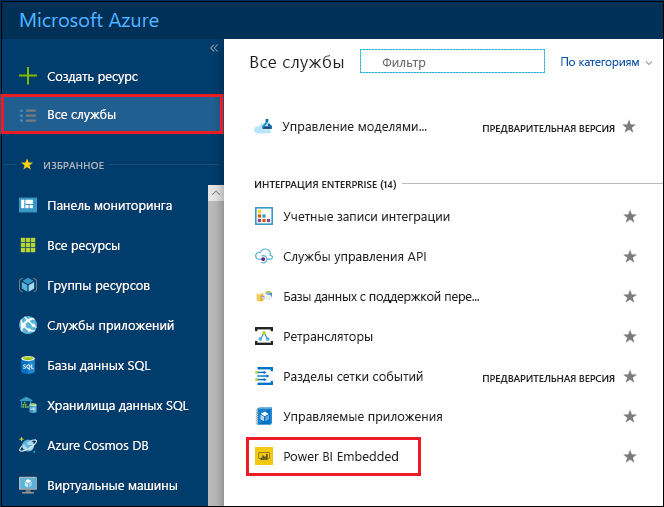
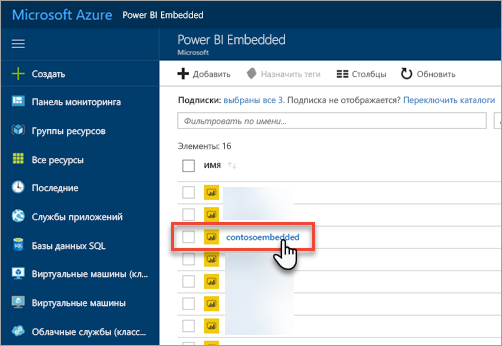
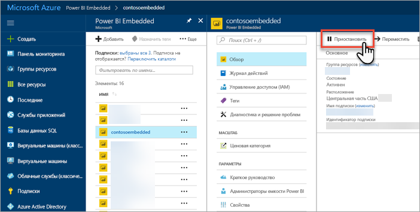
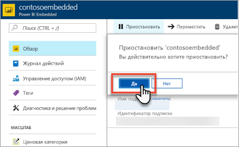
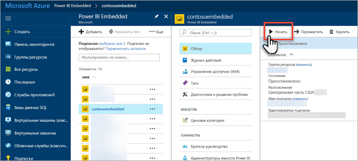
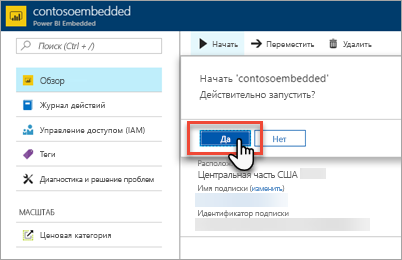

# Приостановка и запуск емкости Power BI Embedded на портале Azure

В этой статье рассматривается приостановка и запуск емкости Power BI Embedded в Microsoft Azure. Предполагается, что вы создали емкость Power BI Embedded. Если нет, см. раздел [Создание емкости Power BI Embedded на портале Azure](azure-pbie-create-capacity.md).

Если у вас нет подписки Azure, перед началом работы [создайте бесплатную учетную запись](https://azure.microsoft.com/free/).

## Приостановка емкости

Если вы приостановите емкость, вы не будете получать за нее счета. Приостановка емкости — это удобная возможность, если вам не нужно использовать емкость какое-то время. Следуйте инструкциям ниже, чтобы приостановить емкость.

> [!NOTE]
> При приостановке емкости содержимое может быть недоступно в Power BI. Обязательно отмените назначение рабочих областей в емкости перед ее приостановкой, чтобы избежать прерывания.

1. Войдите на [портал Azure](https://portal.azure.com/).

2. Выберите **Все службы** > **Power BI Embedded**, чтобы просмотреть доступные емкости.

    

3. Выберите емкость, которую нужно приостановить.

    

4. Выберите **Пауза** в сведениях о емкости.

    

5. Выберите **Да**, чтобы подтвердить приостановку емкости.

    

## Запуск емкости

Возобновите использование емкости, запустив ее. При запуске емкости также возобновляется выставление счетов.

1. Войдите на [портал Azure](https://portal.azure.com/).

2. Выберите **Все службы** > **Power BI Embedded**, чтобы просмотреть доступные емкости.

    

3. Выберите емкость, которую нужно запустить.

    

4. Выберите **Запуск** в сведениях о емкости.

    

5. Выберите **Да**, чтобы подтвердить запуск емкости.

    

Если для этой емкости назначено содержимое, оно будет доступно после запуска.

## Дальнейшие действия

Если вы хотите увеличить или уменьшить масштаб емкости, см. раздел [Масштабирование емкости Power BI Embedded](azure-pbie-scale-capacity.md).

Чтобы начать внедрение содержимого Power BI в приложение, см. раздел [Как внедрять панели мониторинга, отчеты и плитки Power BI](https://powerbi.microsoft.com/documentation/powerbi-developer-embedding-content/).

Появились дополнительные вопросы? [Попробуйте задать вопрос в сообществе Power BI.](https://community.powerbi.com/)