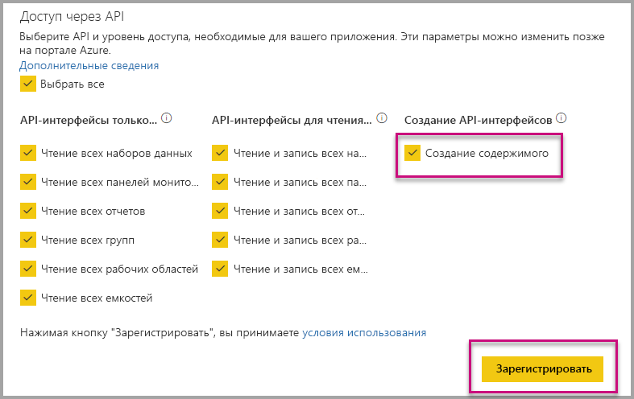

# Автоматическая установка приложения Power BI при внедрении для организации

Для внедрения содержимого из приложения, должен иметь пользователь, который внедрение [доступ к приложению](../service-create-distribute-apps.md). Если для пользователя установлено приложение, затем работает внедрение гладко. Дополнительные сведения см. в разделе [внедрить отчеты или панели мониторинга из приложения](embed-from-apps.md). Это можно определить в PowerBI.com, все приложения могут быть [устанавливается автоматически](https://powerbi.microsoft.com/blog/automatically-install-apps/). Тем не менее это действие выполняется на уровне клиента и применяется ко всем приложениям.

## Автоматически устанавливать приложения по внедрению

Если пользователь имеет доступ к приложению, но приложение не установлено, затем внедрение завершается ошибкой. Чтобы избежать таких сбоев при внедрении из приложения, вы можете разрешить автоматически установить приложение после внедрения. Это действие означает, что если приложение, которое пользователь пытается встроить не установлен, он автоматически устанавливается автоматически. Поэтому необходимое содержимое получает внедрен немедленно, что smooth интерфейса пользователя.

## Внедрение для пользователей Power BI (данные принадлежат пользователю)

Чтобы разрешить автоматическая установка приложений для пользователей, вам потребуется предоставить приложению разрешение «Создание содержимого» при [зарегистрировать приложение](register-app.md#register-with-the-power-bi-application-registration-tool), или добавьте ее, если вы уже зарегистрировали свое приложение.

Далее необходимо указать идентификатор приложения в URL-адрес внедрения. Чтобы предоставить идентификатор приложения, создателя приложения прежде всего необходимо установить приложение, а затем используйте один из поддерживаемых [Power BI Rest API](https://docs.microsoft.com/rest/api/power-bi/) вызовов - [Получение отчетов](https://docs.microsoft.com/rest/api/power-bi/reports/getreports) или [получение панелей мониторинга](https://docs.microsoft.com/rest/api/power-bi/dashboards/getdashboards). Затем автора приложения необходимо использовать URL-адрес внедрения из ответа REST API. Идентификатор приложения отображается в URL-адрес, если содержимое из приложения.  После внедрения URL-адрес, его можно использовать для внедрения регулярно.

## Защита внедрения

Чтобы использовать автоматическая установка приложений, создателя приложения сначала необходимо установить приложение, а затем перейдите в приложение на сайте PowerBI.com, перейдите к отчету и получите ссылку обычным образом. Все другие пользователи с доступом к приложению, которое можно использовать ссылку можно внедрить отчет.

## Рекомендации и ограничения

* Вы можете только внедрить отчеты и панели мониторинга для этого сценария.

* Эта функция в настоящее время не поддерживается для данные принадлежат приложению и сценариях встраивания SharePoint.