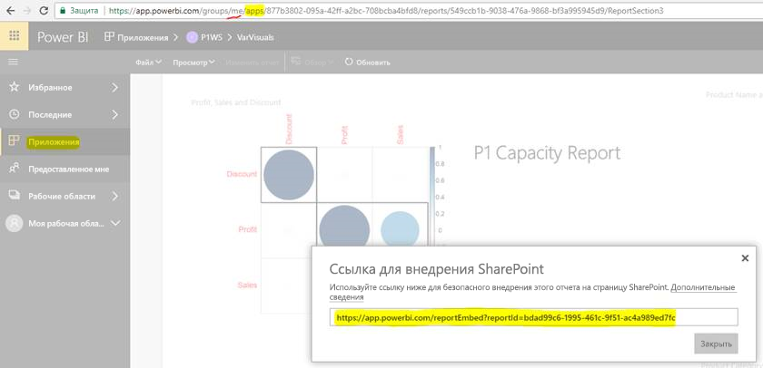

# Внедрение отчетов или панелей мониторинга из приложений

В Power BI вы можете создавать приложения, чтобы объединить связанные панели мониторинга и отчеты в одном решении. Затем вы можете опубликовать их для больших групп сотрудников в вашей организации. Эти приложения подходят для случаев, когда все пользователи имеют доступ к Power BI. И вы можете делиться с ними содержимым через приложения Power BI. В этой статье представлены краткие инструкции по внедрению содержимого опубликованного приложения Power BI в стороннее приложение.

## Получение URL-адреса внедрения отчета для внедрения

1. Создайте экземпляр приложения в рабочей области пользователя **Моя рабочая область**. Предоставьте к нему доступ для себя или помогите другому пользователю выполнить эту процедуру.

2. Откройте нужный отчет в службе Power BI.

3. Перейдите к пункту **Файл** > **Внедрить в SharePoint Online** и получите URL-адрес внедрения отчета. Пример URL-адреса внедрения показан ниже. Или вызовите REST API GetReports/GetReport и извлеките соответствующее поле URL-адреса внедрения отчета из ответа. Вызов REST не должен иметь идентификатор рабочей области в URL-адресе, поскольку экземпляр приложения создается в рабочей области пользователя.

    

4. Используйте URL-адрес внедрения, полученный на шаге 3, с пакетом SDK для JavaScript.

## Получение URL-адреса внедрения панели мониторинга для внедрения

1. Создайте экземпляр приложения в рабочей области пользователя **Моя рабочая область**. Предоставьте к нему доступ для себя или помогите другому пользователю выполнить эту процедуру.

2. Вызовите REST API GetDashboards и извлеките соответствующее поле URL-адреса внедрения панели мониторинга из ответа. Вызов REST не должен иметь идентификатор рабочей области в URL-адресе, поскольку экземпляр приложения создается в рабочей области пользователя.

3. Используйте URL-адрес внедрения, полученный на шаге 2, с пакетом SDK для JavaScript.

## Дальнейшие действия

Узнайте, как выполняется внедрение из рабочих областей приложений для сторонних клиентов и вашей организации:

> [!div class="nextstepaction"]
>[Внедрение для сторонних клиентов](embed-sample-for-customers.md)

> [!div class="nextstepaction"]
>[Внедрение для организации](embed-sample-for-your-organization.md)
