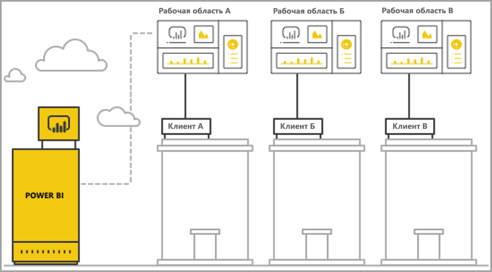
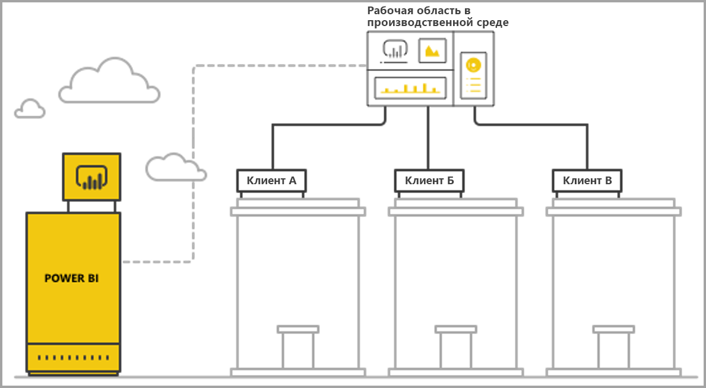

# Управление мультитенантностью с помощью встроенной аналитики Power BI

При разработке мультитенантного приложения SaaS необходимо тщательно подобрать модель аренды, которая лучше всего соответствует требованиям такого приложения. Этот процесс также применим к Power BI как к компоненту внедренной аналитики в приложении SaaS. Модель аренды определяет, как сопоставляются и управляются данные каждого арендатора в Power BI и учетной записи хранения. Модель аренды определяет архитектуру приложения и принципы управления им. Переход на другую модель впоследствии может повлечь за собой дополнительные затраты и повлиять на работу приложения.

Power BI Embedded предлагает два основных подхода к обеспечению разделения арендаторов.

   1. **Изоляция на основе рабочей области** — создание отдельной рабочей области Power BI для каждого арендатора.
   2. **Изоляция на основе безопасности на уровне строк** — при этом подходе используются базовые данные для управления доступом к данным для отдельных пользователей или групп.

В этой статье приводится описание этих подходов и их анализ по нескольким критериям оценки.

## Основные понятия и терминология

**[AAD](https://docs.microsoft.com/azure/active-directory/fundamentals/active-directory-whatis)**  — Azure Active Directory.

**Приложение AAD** — удостоверение приложения в Azure Active Directory. Приложение AAD требуется для проверки подлинности.

**Приложение SaaS (программное обеспечение как услуга)**  — это система, реализованная предприятием или независимым поставщиком программного обеспечения (как правило, в виде веб-службы). Это также связанные программные системы для обслуживания нескольких клиентов-арендаторов (организаций). В этой статье **в приложении SaaS для предоставления аналитики различным арендаторам используется Power BI Embedded**. Power BI Embedded также может работать с приложениями любых других типов, если они подключены к Интернету.

**Арендатор** — отдельный клиент (организация), использующий приложение SaaS и любые ресурсы или данные, которые клиент вносит в приложение SaaS.

**[Power BI](../fundamentals/power-bi-overview.md)**  — облачная служба Power BI, которая служит платформой для Power BI Embedded.

**Арендатор Power BI** — набор ресурсов Power BI, связанных с отдельным арендатором AAD.

**[Рабочая область Power BI](../service-create-workspaces.md)**  — контейнер для содержимого в Power BI.

**Артефакты Power BI**. В Power BI существуют такие артефакты рабочих областей Power BI, как панели мониторинга, отчеты, наборы данных и потоки данных.

**[Power BI Embedded](azure-pbie-what-is-power-bi-embedded.md)**  — набор общедоступных API, которые позволяют разработчикам создавать приложения для управления содержимым Power BI и внедрения элементов Power BI.

**[Безопасность на уровне строк (RLS)](embedded-row-level-security.md)** дает возможность управлять доступом пользователей к данным на уровне отдельных строк в таблице. Вы можете реализовать безопасность на уровне строк в источнике данных или в семантической модели Power BI.

**Главный пользователь** — удостоверение, представляющее приложение SaaS в Power BI. Это удостоверение также используется приложением SaaS при вызове API-интерфейсов Power BI. Главный пользователь должен быть пользователем AAD с лицензией Power BI Pro.

**Пользователь приложения AAD (субъект-служба)**  — удостоверение, представляющее приложение SaaS в Power BI. Это удостоверение также используется приложением SaaS при вызове API-интерфейсов Power BI. Пользователь приложения AAD должен быть веб-приложением AAD. Может заменять *главного* пользователя при проверке подлинности в Power BI.

**Емкость** — набор ресурсов, предназначенных для выполнения в службе Power BI. [Емкости Power BI Premium](../service-premium-what-is.md) предназначены для предприятий, которые используют Power BI для внутренних задач, а [емкости Power BI Embedded](azure-pbie-create-capacity.md) — для разработчиков приложений SaaS для третьих лиц.

**[Лицензия Power BI Pro](../service-admin-purchasing-power-bi-pro.md)**  — пользовательская лицензия, позволяющая публиковать содержимое в рабочих областях, использовать приложения без емкости Premium, совместно работать с панелями мониторинга, а также подписываться на панели мониторинга и отчеты.

**[Режимы подключения данных](../desktop-directquery-about.md)**  — подключение источников данных к Power BI, выполняемое в различных режимах:

   * Импорт — это наиболее распространенный способ получения данных.
   * DirectQuery — непосредственное подключение к исходному репозиторию данных.
   * Динамическое подключение — еще один способ непосредственного подключения к данным служб Analysis Services (размещенным локально и в Azure).

## Критерии оценки

Выбор оптимальной модели аренды для приложения SaaS зависит от конкретных коммерческих и технических требований, архитектуры данных и других факторов. Глубокое понимание этих требований, а также доступных вариантов моделей аренды, их преимуществ и недостатков поможет определить надежную, производительную, экономичную и масштабируемую архитектуру для вашего приложения SaaS.

Ниже приведен ряд факторов, которые следует учитывать при выборе модели аренды.

### Архитектура данных

Как правило, у разработчиков, создающих приложения с использованием Power BI Embedded, уже есть база данных с одним или несколькими арендаторами. Для Power BI Embedded проще использовать модель аренды, схожую с моделью аренды базы данных. Если модель аренды базы данных пока не определена, можно рассмотреть другие аспекты перед выбором архитектуры данных.

### Изоляция данных

Насколько конфиденциальны хранимые данные? Какой уровень изоляции требуется при разделении клиентов-арендаторов? Ответ будет зависеть от конкретной отрасли или клиента, предъявляющего определенные требования.

### Масштабируемость

Чтобы найти наилучшее решение, определите предполагаемый масштаб на ближайшее будущее. Помните, что решение, подходящее в данный момент, может оказаться недостаточным, когда масштабы использования и объемы данных возрастут. При анализе масштабируемости примите во внимание следующее:

   * число арендаторов (клиентов);
   * количество отчетов, панелей мониторинга и наборов данных у каждого арендатора;
   * объем данных в каждом наборе данных и частота их обновления;
   * количество пользователей;
   * количество одновременно активных пользователей в пиковые периоды.

У некоторых приложений SaaS число клиентов и объем использования могут быть небольшими, а объем данных — значительным. У других может быть много клиентов, интенсивный режим использования, но небольшой объем данных и малое количество отчетов по каждому клиенту. Большие значения в любом из этих вариантов могут впоследствии сказаться на затратах и сложности эксплуатации.

### Автоматизация и сложность эксплуатации

Определите часто выполняемые процессы, требующие автоматизации.

   * Как часто подключаются новые арендаторы? Какие действия необходимы для полного подключения каждого из них?
   * Какова периодичность выпуска нового или обновленного содержимого для Power BI, которое необходимо развертывать?
   * Сколько ролей безопасности на уровне строк определены для каждого арендатора?  

Определение этих процессов и способов их оптимизации поможет вам понять сложности, связанные с поддержкой каждой из моделей.

### Требования к месту расположения данных и необходимость поддержки нескольких географических регионов

Power BI Embedded поддерживает развертывание в нескольких регионах (предварительная версия функции). [Поддержка нескольких регионов](embedded-multi-geo.md) позволяет развертывать ресурсы Power BI Embedded в разных регионах с определенным содержимым, предназначенным для размещения в определенных регионах. Эта функция может использоваться в любых моделях, но она может влиять на объем администрируемого содержимого и затраты. Сейчас функция поддержки нескольких регионов обеспечивает соблюдение требований к месту расположения данных и не способствует росту производительности за счет размещения данных ближе к пользователям.

### Затраты

[Power BI Embedded](https://azure.microsoft.com/services/power-bi-embedded/) предлагается по модели приобретения на основе ресурсов, как и **Power BI Premium**. Вы приобретаете единицы емкости с фиксированным объемом вычислительной мощности и памяти. Такая емкость — это основная статья затрат при работе с **Power BI Embedded**. Нет ограничений на количество пользователей, использующих емкость. Единственным ограничением является производительность емкости. [Лицензия Power BI Pro](../service-admin-licensing-organization.md) является обязательной для каждого *главного* пользователя или отдельных пользователей, которым требуется доступ к порталу Power BI.

Рекомендуется испытать и измерить предполагаемую нагрузку в емкости. Для этого следует сымитировать реальную среду и использование, а также выполнить нагрузочное тестирование в емкости. Нагрузку и производительность можно измерить с помощью различных метрик, доступных в емкости Azure или в [приложении метрик емкости Premium](../service-admin-premium-monitor-capacity.md).

### Создание и настройка содержимого

Существует два подхода к реализации приложений SaaS, которые предоставляют пользователям возможность изменять и создавать отчеты или отправлять данные в службу в рамках потока:

   * [Режим правки или создания во встроенном кадре iFrame](https://github.com/Microsoft/PowerBI-JavaScript/wiki/Create-Report-in-Embed-View). Пользователь получает представление отчета или новый пустой холст в приложении SaaS. При этом он может использовать панель инструментов Power BI для создания содержимого на основе набора данных в рабочей области. Мы рекомендуем этот вариант, так как он удобен для работы пользователя в знакомой среде. Пользователю будет проще приступить к работе и редактированию, а созданный им отчет будет привязан к существующему набору данных.

   * Использование Power BI Desktop для создания содержимого и его отправки в рабочую область с помощью пользовательского интерфейса приложения SaaS. При этом подходе пользователи имеют в своем распоряжении больше инструментов для работы в Power BI Desktop. Тем не менее мы не рекомендуем этот подход, так как пользователи должны быть знакомы с дополнительными инструментами, что выходит за рамки контекста приложения SaaS. Передача PBIX-файла означает, что пользователь добавляет дополнительный набор данных, который может быть копией набора данных, уже существующего в рабочей области.

## Изоляция на основе рабочей области Power BI

С помощью изоляции на основе рабочей области Power BI приложение SaaS обеспечивает поддержку нескольких арендаторов из одной организации-арендатора Power BI. При изоляции на основе рабочей области сохраняется все содержимое Power BI, используемое разными арендаторами. Разделение арендаторов выполняется на уровне рабочей области Power BI путем создания нескольких рабочих областей. Каждая рабочая область содержит соответствующие наборы данных, отчеты и панели мониторинга своего арендатора. Кроме того, каждая рабочая область подключена только к данным этого арендатора. Если вам нужна дополнительная изоляция, можно создать *главного* пользователя или субъект-службу для каждой рабочей области и ее содержимого.

### Архитектура данных

Существует два основных подхода к управлению данными арендатора:

* отдельная база данных для каждого арендатора;
* единая мультитенантная база данных.

Если в хранилище приложения SaaS предусмотрена отдельная база данных для каждого арендатора, было бы оптимально использовать отдельные наборы данных арендаторов в Power BI со строкой подключения для каждого набора данных, указывающей на соответствующую базу данных.

Если хранилище приложения SaaS использует единую мультитенантную базу данных для всех арендаторов, разделять арендаторов удобно с помощью рабочих областей. Можно настроить подключение к базе данных для набора данных Power BI с параметризованным запросом к базе данных для извлечения только соответствующих данных арендатора. Вы можете обновить подключение с помощью [Power BI Desktop](../desktop-query-overview.md) или с помощью [API](https://docs.microsoft.com/rest/api/power-bi/datasets/updatedatasourcesingroup), используя [параметры](https://docs.microsoft.com/rest/api/power-bi/datasets/updateparametersingroup) запроса.

### Изоляция данных

В этой модели аренды данные разделены на уровне рабочей области. Простое сопоставление рабочей области и арендатора не позволит пользователям одного арендатора просматривать содержимое другого арендатора. Конфигурация с единым *главным* пользователям обеспечивает вам доступ ко всем рабочим областям. Настройка отображаемых пользователю данных выполняется в ходе [создания токена внедрения](https://docs.microsoft.com/rest/api/power-bi/embedtoken) — серверного процесса, недоступного для просмотра или изменения конечным пользователям.

Для дополнительной изоляции разработчик приложения может назначить *главного* пользователя или главное приложение для каждой рабочей области вместо единого *главного* пользователя или приложения с доступом к нескольким рабочим областям. Это предотвратит возможность раскрытия данных разных клиентов вследствие ошибки пользователя или утечки учетных данных.

### Масштабируемость

Одним из преимуществ этой модели является разделение данных по нескольким наборам данных для каждого арендатора, что позволяет преодолеть [ограничения на размер одного набора данных](https://docs.microsoft.com/power-bi/service-premium-large-datasets) (сейчас это 10 ГБ емкости). Когда емкость перегружена, неиспользуемые наборы данных могут быть вытеснены, чтобы освободить память для активных наборов данных. При едином большом наборе данных эта процедура невозможна. Использование нескольких наборов данных также позволяет при необходимости распределять арендаторы по разным емкостям Power BI.

При всех этих преимуществах следует учитывать масштаб, которого приложение SaaS может достичь в будущем. Например, пользователь может достичь ограничения на количество управляемых артефактов. Дополнительные сведения см. в разделе об [ограничениях](#summary-comparison-of-the-different-approaches) развертывания далее в этой статье. Используемый номер SKU для емкости определяет предел для объема памяти, которому должны соответствовать наборы данных, а также ограничения на количество одновременных обновлений и максимальную частоту обновления данных. При управлении сотнями или тысячами наборов данных рекомендуется выполнять их тестирование. Кроме того, рекомендуется учитывать средний и пиковый объем использования, а также арендаторов с большими наборами данных или различными шаблонами использования, управление которыми осуществляется иначе, чем у других арендаторов.

### Автоматизация и сложность эксплуатации

При изоляции на основе рабочей области Power BI разработчику приложения может потребоваться управлять сотнями или тысячами артефактов. Очень важно определить процессы, которые часто выполняются в ходе управления жизненным циклом вашего приложения, и убедиться, что вы располагаете необходимым набором средств для выполнения этих операций в требуемом масштабе в выбранной модели аренды. Это могут быть такие операции:

   * добавление нового арендатора (клиента);
   * обновление отчета или панели мониторинга для некоторых или всех арендаторов;
   * обновление схемы набора данных для некоторых или всех арендаторов;
   * внеплановая настройка для определенных арендаторов;
   * обновления наборов данных с определенной частотой.

Например, создание рабочей области для нового арендатора является рядовой задачей, которая должна быть автоматизирована. С помощью [REST API Power BI](https://docs.microsoft.com/rest/api/power-bi/) можно добиться [полной автоматизации при создании рабочих областей](https://powerbi.microsoft.com/blog/duplicate-workspaces-using-the-power-bi-rest-apis-a-step-by-step-tutorial/).

### Необходимость поддержки нескольких регионов

Развертывание в нескольких регионах предполагает приобретение емкости в необходимых регионах и назначение рабочей области для этой емкости. Если вам требуется обеспечить поддержку арендаторов в разных регионах, необходимо назначить рабочую область арендатора для емкости, находящейся в нужном регионе. Эта задача является простой операцией, которая по стоимости сопоставима с вариантом размещения всех рабочих областей в одной емкости. Но если некоторым вашим арендаторам требуется разместить данные в нескольких регионах, все артефакты рабочей области придется продублировать в емкости каждого региона, что связано с ростом затрат и сложности управления.

### Затраты

Разработчикам приложений, использующим Power BI Embedded, необходимо [приобрести емкость Power BI Embedded для перехода к производственной среде](embed-sample-for-customers.md#move-to-production).  Важно понимать особенности модели изоляции на основе рабочей области и ее влияние на емкости.

Модель изоляции на основе рабочей области хорошо согласуется с емкостями по следующим причинам:

   * Наименьший объект, который можно назначить емкости, — это рабочая область (т. е. вы не можете назначить ей, скажем, отчет), поэтому, разделяя арендаторов по рабочим областям, вы обретаете максимальную гибкость в управлении каждым арендатором и его потребностями в производительности, а также возможность оптимизировать использование емкостей путем их масштабирования. Например, крупный и приоритетный арендатор с большим объемом часто обновляемых данных может размещаться в отдельной емкости для обеспечения должного уровня его обслуживания, тогда как небольшие арендаторы можно сгруппировать в другой емкости, чтобы оптимизировать затраты.

   * Разделение рабочих областей также предполагает разделение наборов данных между арендаторами, поэтому модели данных могут быть представлены небольшими блоками, а не одним большим набором данных. Такое разделение позволяет оптимизировать использование памяти в емкости, которая при необходимости может вытеснять мелкие и неиспользуемые наборы данных и поддерживать должный уровень производительности.

Разработчикам приложений необходимо учитывать максимальное число параллельных обновлений, так как процессам обновления может потребоваться дополнительная емкость при наличии нескольких наборов данных.

### Создание и настройка содержимого

Для основных вариантов использования с созданием содержимого разработчику приложения необходимо тщательно продумать, какие арендаторы будут иметь возможность изменения содержимого и сколько пользователей каждого арендатора будут иметь такую возможность. Разрешение изменять содержимое многим пользователям каждого арендатора может привести к созданию больших объемов содержимого, достигающих ограничений для набора данных, таких как максимальное количество отчетов для набора данных или максимальное количество наборов данных в рабочей области. Если вы предоставляете эту возможность пользователям, рекомендуется выполнять пристальный мониторинг создания содержимого и масштабировать емкость по мере необходимости. По тем же причинам мы не рекомендуем использовать эту возможность для персонализации содержимого, когда каждый пользователь может внести небольшие изменения в отчет и сохранить его для себя. Если в приложении SaaS разрешена персонализация содержимого, рекомендуем внедрить и распространить политики хранения пользовательского содержимого в рабочих областях, чтобы упростить процесс удаления содержимого при переходе пользователей на другие должности, увольнении из компании или прекращении использования платформы.

## Изоляция на основе безопасности на уровне строк

При изоляции на основе безопасности на уровне строк приложение SaaS использует одну рабочую область для размещения нескольких арендаторов. Это означает, что каждый артефакт, отчет, панель мониторинга и набор данных в Power BI создаются один раз и все арендаторы их используют. Разделение данных между арендаторами осуществляется посредством [безопасности на уровне строк](embedded-row-level-security.md) в мультитенантном наборе данных. Когда пользователь входит в приложение SaaS и открывает содержимое, для текущего сеанса пользователя создается токен внедрения с ролями и фильтрами, обеспечивающими пользователю возможность просматривать только разрешенные данные. Если не всем пользователям арендатора разрешается просматривать одни и те же данные, разработчику приложения необходимо реализовать иерархию ролей как для арендаторов, так и для пользователей одного арендатора.

### Архитектура данных

Изоляция на основе безопасности на уровне строк наиболее удобна, когда все данные арендаторов хранятся в одном хранилище данных. В этом случае разработчик приложения может передавать только нужные данные из хранилища данных в набор данных Power BI с помощью DirectQuery или импорта данных. Если данные в базе данных разделены по отдельным арендаторам, их необходимо объединить в один набор данных, что приведет к меньшей степени разделения арендаторов в базе данных.

### Изоляция данных

При изоляции на основе безопасности на уровне строк разделение данных выполняется с помощью [определений безопасности на уровне строк](embedded-row-level-security.md), примененных к набору данных. Это означает, что все данные сосуществуют. Такая форма разделения данных более уязвима к утечкам данных из-за ошибок разработчика. Несмотря на то что безопасность на уровне строк обеспечивается в серверной части и защищена от конечного пользователя, рекомендуется использовать изоляцию на основе рабочей области, если данные являются строго конфиденциальными или заказчикам требуется разделение данных.

### Масштабируемость

При изоляции на основе безопасности на уровне строк объем данных должен соответствовать ограничению на объем данных в наборе данных, которое сейчас составляет 10 ГБ. С появлением [добавочного обновления](../service-premium-incremental-refresh.md) и предстоящим выпуском конечной точки XMLA для наборов данных Power BI максимальный размер набора данных может существенно возрасти. Тем не менее данные по-прежнему должны соответствовать объему памяти емкости с достаточным запасом памяти для выполнения обновления данных. При крупномасштабных развертываниях требуется большая емкость, чтобы у пользователей не возникали проблемы из-за превышений ограничений емкости на объем памяти. Альтернативный способ проведения крупномасштабных развертываний предполагает использование **[агрегатов](../desktop-aggregations.md)** или прямое подключение к источнику данных с помощью DirectQuery либо динамического подключения вместо кэширования всех данных в емкости Power BI.

### Автоматизация и сложность эксплуатации

Управлять артефактами гораздо удобнее при изоляции на основе безопасности на уровне строк, чем при изоляции на основе рабочей области, так как в этом случае существует только одна версия артефакта для каждой среды (разработки, тестирования или производственной среды), а не несколько версий для каждого арендатора. При больших масштабах это предполагает администрирование и обновление нескольких десятков артефактов, а не тысяч или десятков тысяч.

У Power BI еще нет API для изменения или создания ролей и правил RLS. Добавлять или изменять роли можно только вручную в Power BI Desktop. Если необходимо применить иерархию RLS, без надлежащего планирования это может оказаться сложной и чреватой последующими ошибками задачей.

Если разработчик приложения должен управлять множеством ролей и определениями ролей, которые необходимо часто создавать или обновлять, изоляция на основе безопасности на уровне строк не обеспечит масштабируемость с точки зрения управляемости.

Другой сложностью эксплуатации является необходимость внимательно отслеживать использование памяти и предусмотреть надежный механизм оповещений и масштабирования, чтобы обеспечить бесперебойную работу пользователей.  

### Необходимость поддержки нескольких регионов

Так как все данные хранятся в одном наборе данных, непросто выполнить требования к месту расположения данных, предусматривающие размещение определенных данных в определенных регионах. Это также может значительно повысить затраты на размещение в нескольких регионах, так как все данные реплицируются и хранятся в каждом регионе. Если размещение в разных регионах требуется ограниченному кругу арендаторов, данные только этих арендаторов можно разместить в другом регионе, используя описанную выше модель изоляции на основе рабочей области.

### Затраты

Основная статья затрат при изоляции на основе безопасности на уровне строк — это объем памяти, занимаемый набором данных. Вам требуется достаточная емкость для хранения набора данных и обеспечения буфера дополнительной памяти для пиковых нагрузок на память. Один из способов избежать такой ситуации — это хранение данных в базе данных SQL Server или кубе служб SQL Server Analysis Services и получение данных из источника данных в реальном времени с помощью DirectQuery или динамического подключения. Такой подход увеличивает затраты на источники данных, но уменьшает потребность в большой емкости из-за требований к памяти, таким образом снижая затраты на емкость Power BI.

### Создание и настройка содержимого

При изменении или создании отчетов конечными пользователями они могут использовать мультитенантный набор данных в рабочей среде. По этой причине рекомендуется изменять или [создавать отчеты](https://github.com/Microsoft/PowerBI-JavaScript/wiki/Create-Report-in-Embed-View) только в режиме правки или создания во встроенном iFrame, так как он использует тот же набор данных с изоляцией на основе безопасности на уровне строк. Если пользователи отправляют PBIX-файлы с дополнительными наборами данных, это может привести к росту затрат и сложности управления при изоляции на основе безопасности на уровне строк. Кроме того, когда пользователи создают новое содержимое, находящееся в той же рабочей области, вам необходимо убедиться, что рабочая область рабочей среды не достигла своих ограничений, а также создать надежный механизм определения подключения содержимого к тому или иному арендатору.

## Итоговое сравнение подходов

> [!Important]
> Следующий анализ основан на текущем состоянии продукта. Новые функции выпускаются ежемесячно. Мы продолжаем предоставлять новые возможности и функции, устраняющие существующие ограничения и недостатки. Узнавайте о новшествах из наших ежемесячных сообщений в блоге и повторно просматривайте эту статью, чтобы выяснить, как новые функции отражаются на рекомендациях по модели аренды.

| Критерии оценки | На основе рабочей области   | На основе безопасности на уровне строк  |  |  |
|--------------------------------------|----------------------------------------------------------------------------------------------------------------------|---------------------------------------------------------------------------------------|---|---|
| Архитектура данных  | Самый простой вариант при наличии отдельной базы данных для каждого арендатора.  | Самый простой вариант, если все данные всех арендаторов находятся в одном хранилище данных.   |  |  |
| Изоляция данных  | Хороший вариант. У каждого арендатора есть отдельный набор данных.  | Умеренная. Все данные находятся в общем наборе данных, а управление ими осуществляется посредством управления доступом.  |  |  |
| Масштабируемость  | Средняя. Возможна оптимизация за счет разбиения данных по нескольким наборам данных.  | Самая низкая. Препятствуют ограничения наборов данных.  |  |  |
| Необходимость поддержки нескольких регионов  | Оптимальный вариант, если большинство арендаторов находятся в одном регионе.  | Не рекомендуется. Необходимо размещать весь набор данных в нескольких регионах.  |  |  |
| Автоматизация и сложность эксплуатации  | Хорошая автоматизация для отдельного арендатора.   Сложность управления множеством артефактов при масштабировании.  | Простота управления артефактами Power BI, но сложность управления RLS при масштабировании.  |  |  |
| Затраты  | Ниже среднего. Можно оптимизировать использование для сокращения затрат в расчете на одного арендатора.  Могут возрасти при необходимости частого обновления.  | Выше среднего при использовании режима импорта.  Ниже среднего при использовании режима DirectQuery.  |  |  |
| Создание и настройка содержимого  | Оптимальный вариант. Может достигать ограничений емкости при масштабировании.  | Создание содержимого только во встроенном iFrame.  |  |  |

## Развертывание: рекомендации и ограничения

**Ограничения по артефактам Power BI**:

* Количество рабочих областей V1 (группы), в которых один пользователь или приложение может быть членом или администратором, — 250.
* Количество рабочих областей V2 (папки), в которых один пользователь или приложение может быть членом или администратором, — 1000.
* Количество наборов данных в одной рабочей области — 1000.
* Количество отчетов и панелей мониторинга, подключенных к одному набору данных, — 1000.
* Максимальный объем памяти для отправки *PBIX*-файлов — 10 ГБ.

**Емкость Power BI — рекомендации и ограничения**:

* В емкости можно использовать только ее выделенную память и виртуальные ядра согласно [приобретенному номеру SKU](../service-premium-what-is.md).
* Рекомендуемый размер набора данных для каждого номера SKU см. в статье [Поддержка крупных наборов данных в Power BI Premium](../service-premium-what-is.md#large-datasets).
* Максимальный размер набора данных в выделенной емкости — 10 ГБ.
* Количество запланированных обновлений для набора данных в *режиме импорта* в день — 48.
* Интервал между запланированными обновлениями для набора данных в *режиме импорта* — 30 минут.
* Сведения о количестве обновлений, которые могут выполняться параллельно в емкости, см. в статье [Использование и оптимизация ресурсов емкости Microsoft Power BI Premium](../service-premium-what-is.md#capacity-nodes).
* Среднее время выполнения масштабирования емкости — 1–2 минуты. В течение этого времени емкость недоступна. Мы рекомендуем использовать горизонтальное масштабирование, чтобы [избежать простоя](https://powerbi.microsoft.com/blog/power-bi-developer-community-november-update-2018/#scale-script).

## Дальнейшие действия

* [Использование встроенной аналитики с Power BI](embedding.md)
* [Что такое Power BI Embedded в Azure?](azure-pbie-what-is-power-bi-embedded.md)
* [Power BI Premium](../service-premium-what-is.md)
* [Использование безопасности на уровне строк во встроенном содержимом Power BI](embedded-row-level-security.md)
