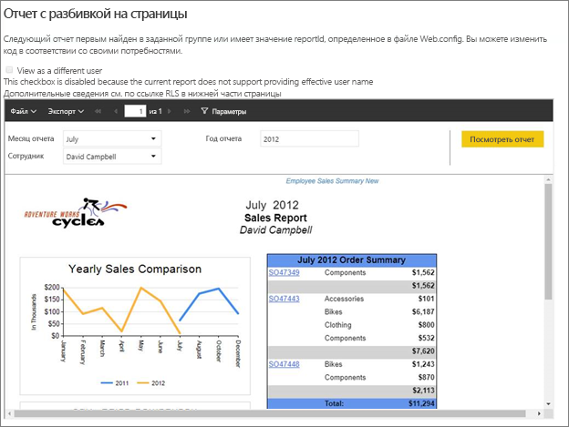
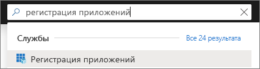
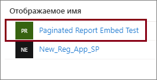
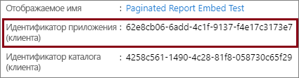
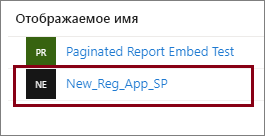
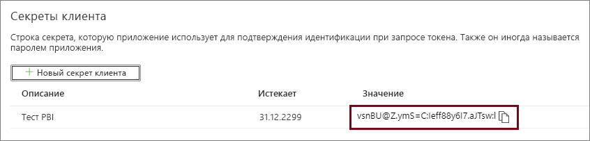

# <a name="tutorial-embed-power-bi-paginated-reports-into-an-application-for-your-customers-preview"></a>Руководство. Внедрение отчетов Power BI с разбивкой на страницы в приложение для клиентов (обзор)

С помощью **Power BI Embedded в Azure** или **внедрения Power BI в Office** вы можете внедрять отчеты с разбивкой на страницы в приложение с помощью данных, принадлежащих ему. Модель **данных, принадлежащих приложению**, позволяет приложению использовать Power BI как встроенную платформу аналитики. Как **независимый поставщик программного обеспечения** или **разработчик** вы можете создавать содержимое Power BI, отображающее отчеты с разбивкой на страницы в приложении. При этом приложение будет полностью интегрированным и интерактивным, а пользователям не потребуется лицензия Power BI. Из этого руководства вы узнаете, как интегрировать отчет с разбивкой на страницы в приложение с помощью пакета SDK Power BI для .NET и API JavaScript для Power BI.



Из этого руководства вы узнаете, как выполнять следующие задачи:
> [!div class="checklist"]
> * регистрация приложения в Azure;
> * внедрение отчета Power BI с разбивкой на страницы в приложение.

## <a name="prerequisites"></a>Предварительные требования

Для работы вам понадобятся:

* [субъект-служба (маркер только для приложения)](embed-service-principal.md);
* подписка [Microsoft Azure](https://azure.microsoft.com/);
* собственная установка [клиента Azure Active Directory](create-an-azure-active-directory-tenant.md);
* По крайней мере [емкости](#create-a-dedicated-capacity) A4 или P1 с включенной рабочей нагрузкой [отчетов с разбивкой на страницы](../service-admin-premium-workloads.md#paginated-reports).

Если у вас нет подписки Azure, перед началом работы [создайте бесплатную учетную запись](https://azure.microsoft.com/free/?WT.mc_id=A261C142F).

> [!IMPORTANT]
> * Необходимо использовать **субъект-службу**. Главный пользователь не поддерживается.
> * Источники данных, для которых требуется единый вход, не поддерживаются.
> * Набор данных Power BI не поддерживается в качестве [источника данных](../service-get-data.md).

## <a name="set-up-your-power-bi-environment"></a>Настройка рабочей среды Power BI

Для внедрения отчета с разбивкой на страницы необходимо назначить рабочую область выделенной емкости и отправить отчет в рабочую область.

### <a name="create-an-app-workspace"></a>Создание рабочей области приложения

Поскольку для входа в приложение вы применяете [субъект-службу](embed-service-principal.md), необходимо использовать [новые рабочие области](../service-create-the-new-workspaces.md). При использовании *субъекта-службы* также необходимо быть администратором или членом рабочих областей приложения, участвующим в приложении.

### <a name="create-a-dedicated-capacity"></a>Создание выделенной емкости

Прежде чем импортировать или передать отчет с разбивкой на страницы для внедрения, рабочая область, содержащая отчет, должна быть назначена по меньшей мере емкости A4 или P1. Вы можете выбрать из двух типов емкости.
* **Power BI Premium** — для внедрения отчета с разбиением на страницы требуется емкость SKU *P*. При внедрении содержимого Power BI это решение называется *внедрением Power BI*. Дополнительные сведения об этой подписке см. в разделе [Что такое Power BI Premium?](../service-premium-what-is.md).
* **Azure Power BI Embedded** — вы можете приобрести выделенную емкость на [портале Microsoft Azure](https://portal.azure.com). Эта подписка использует номера SKU *A*. Для внедрения отчетов с разбивкой на страницы требуется по крайней мере подписка *A4*. Дополнительные сведения о создании емкости Power BI Embedded см. в статье [Создание емкости Power BI Embedded на портале Azure](azure-pbie-create-capacity.md).

В следующей таблице описаны ресурсы и ограничения для каждого SKU. Чтобы определить, какая емкость лучше соответствует вашим потребностям, ознакомьтесь с таблицей [Какой номер SKU следует приобрести для моего сценария](https://docs.microsoft.com/power-bi/developer/embedded-faq#power-bi-now-offers-three-skus-for-embedding-a-skus-em-skus-and-p-skus-which-one-should-i-purchase-for-my-scenario).

| Узлы емкости | Число виртуальных ядер | Серверные виртуальные ядра | ОЗУ (ГБ) | Интерфейсные виртуальные ядра | 
| --- | --- | --- | --- | --- |
| P1/A4 | 8 | 4 | 25 | 4 |
| P2/A5 | 16 | 8 | 50 | 8 |
| P3/A6 | 32 | 16 | 100 | 16 |
| | | | | |

### <a name="assign-an-app-workspace-to-a-dedicated-capacity"></a>Назначение выделенной емкости для рабочей области приложения

После создания выделенной емкости ей можно назначить рабочую область приложения.

Чтобы назначить выделенную емкость рабочей области с помощью [субъекта-службы](embed-service-principal.md), используйте [REST API Power BI](https://docs.microsoft.com/rest/api/power-bi/capacities/groups_assigntocapacity). Если применяется REST API Power BI, необходимо использовать [идентификатор объекта субъекта-службы](embed-service-principal.md#how-to-get-the-service-principal-object-id).

### <a name="create-and-upload-your-paginated-reports"></a>Создание и передача отчетов с разбивкой на страницы

Отчет с разбивкой на страницы можно создать с помощью [построителя отчетов Power BI](../paginated-reports-report-builder-power-bi.md#create-reports-in-power-bi-report-builder), а затем [передать отчет в службу](../paginated-reports-quickstart-aw.md#upload-the-report-to-the-service).

Отчеты с разбивкой на страницы можно импортировать в новые рабочие области с помощью [REST API Power BI](https://docs.microsoft.com/rest/api/power-bi/imports/postimportingroup).

## <a name="embed-content-using-the-sample-application"></a>Внедрение содержимого с помощью примера приложения

Этот пример намеренно упрощен в целях наглядности. Вы или ваши разработчики отвечаете за защиту секретного ключа приложения.

Чтобы приступить к внедрению содержимого, используя пример приложения, выполните указанные ниже действия.

1. Скачайте [Visual Studio](https://www.visualstudio.com/) (версии 2013 или более поздней). Обязательно скачайте последнюю версию [пакета NuGet](https://www.nuget.org/profiles/powerbi).

2. Чтобы приступить к работе, скачайте [пример с данными, принадлежащими приложению](https://github.com/Microsoft/PowerBI-Developer-Samples) из GitHub.

    

3. Откройте файл **Web.config** из примера приложения. Здесь есть поля, которые нужно заполнить, чтобы успешно запустить приложение. Выберите значение **ServicePrincipal** для поля **AuthenticationType**.

    Заполните следующие поля:
    * [applicationId](#application-id)
    * [workspaceId](#workspace-id)
    * [reportId](#report-id)
    * [applicationsecret](#application-secret)
    * [tenant](#tenant)

    > [!Note]
    > По умолчанию в этом примере поле **AuthenticationType** имеет значение MasterUser. Убедитесь, что вы изменили его на **ServicePrincipal**. 


    

### <a name="application-id"></a>Идентификатор приложения

Укажите в поле **applicationId** значение **идентификатора приложения** из **Azure**. Поле **applicationId** используется приложением для его идентификации для пользователей, у которых запрашиваются разрешения.

Чтобы получить значение **applicationId**, сделайте следующее.

1. Войдите на [портал Azure](https://portal.azure.com).

2. В области навигации слева выберите **Все службы** и выполните поиск пункта **Регистрация приложений**.

    

3. Выберите приложение, для которого требуется **applicationId**.

    

4. В поле **Идентификатор приложения** указан GUID. Используйте этот **идентификатор приложения** как значение параметра **applicationId** приложения.

    

### <a name="workspace-id"></a>Идентификатор рабочей области

Укажите в поле **workspaceId** GUID рабочей области (группы) приложения из Power BI. Эти данные можно получить из URL-адреса после входа в службу Power BI или с помощью PowerShell.

URL-адрес <br>


PowerShell <br>

```powershell
Get-PowerBIworkspace -name "Paginated Report Embed"
```

   

### <a name="report-id"></a>Идентификатор отчета

Укажите в поле **reportId** значение GUID отчета из Power BI. Эти данные можно получить из URL-адреса после входа в службу Power BI или с помощью PowerShell.

URL-адрес<br>


PowerShell <br>

```powershell
Get-PowerBIworkspace -name "Paginated Report Embed" | Get-PowerBIReport
```


### <a name="application-secret"></a>Секрет приложения

Заполните сведения **ApplicationID** из раздела **Ключи** раздела **Регистрация приложений** в **Azure**.

Чтобы получить значение **ApplicationSecret**, сделайте следующее.

1. Войдите на [портал Azure](https://portal.azure.com).

2. В области навигации слева выберите **Все службы** и выполните поиск пункта **Регистрация приложений**.

    

3. Выберите приложение, для которого нужно использовать **ApplicationSecret**.

    

4. Выберите **Сертификаты и секреты** в разделе **Управление**.

5. Выберите **Новые секреты клиента**.

6. Введите имя в поле **Описание** и выберите длительность. Затем выберите **Сохранить**, чтобы получить **Значение** для вашего приложения. Когда вы закроете панель **Ключи** после сохранения значения ключа, поле значения отображается только как скрытое. На этом этапе вы не можете получить значение ключа. Если вы потеряете значение ключа, потребуется создать новое на портале Azure.

    

### <a name="tenant"></a>Клиент

Укажите в поле **tenant** идентификатор клиента Azure. Эти данные можно получить в [центре администрирования Azure AD](/onedrive/find-your-office-365-tenant-id) после входа в службу Power BI или с помощью PowerShell.

### <a name="run-the-application"></a>Запуск приложения

1. Выберите **Запуск** в **Visual Studio**.

    

2. Теперь выберите **Внедрить отчет**.

    

3. Теперь вы можете просмотреть отчет в примере приложения.

    

## <a name="embed-power-bi-paginated-reports-within-your-application"></a>Внедрение отчетов Power BI с разбивкой на страницы в приложении

Несмотря на то, что шаги по внедрению отчетов Power BI с разбивкой на страницы выполняются с помощью [REST API Power BI](https://docs.microsoft.com/rest/api/power-bi/), примеры кода, описанные в этой статье, созданы с помощью **пакета SDK для .NET**.

При внедрении отчетов Power BI с разбивкой на страницы для ваших клиентов в приложении в **Azure AD** необходимо иметь [субъект-службу](embed-service-principal.md) и получить [маркер доступа Azure AD](get-azuread-access-token.md#access-token-for-non-power-bi-users-app-owns-data) для приложения Power BI, прежде чем выполнять вызовы к [интерфейсам REST API Power BI](https://docs.microsoft.com/rest/api/power-bi/).

Для создания клиента Power BI с помощью **маркера доступа** создайте объект клиента Power BI, что позволит работать с интерфейсами [REST API Power BI](https://docs.microsoft.com/rest/api/power-bi/). Для создания объекта клиента Power BI маркер **AccessToken** упаковывается в объект ***Microsoft.Rest.TokenCredentials***.

```csharp
using Microsoft.IdentityModel.Clients.ActiveDirectory;
using Microsoft.Rest;
using Microsoft.PowerBI.Api.V2;

var tokenCredentials = new TokenCredentials(authenticationResult.AccessToken, "Bearer");

// Create a Power BI Client object. it's used to call Power BI APIs.
using (var client = new PowerBIClient(new Uri(ApiUrl), tokenCredentials))
{
    // Your code to embed items.
}
```

### <a name="get-the-paginated-report-you-want-to-embed"></a>Получение отчета с разбивкой на страницы, который необходимо внедрить

Вы можете использовать объект клиента Power BI, чтобы получить ссылку на элемент, который требуется внедрить.

Ниже приведен пример кода для получения первого отчета из определенной рабочей области.

*Пример получения элемента содержимого (отчета, панели мониторинга или плитки), который вы хотите внедрить, можно найти в файле Services\EmbedService.cs в [примере приложения](https://github.com/Microsoft/PowerBI-Developer-Samples).*

```csharp
using Microsoft.PowerBI.Api.V2;
using Microsoft.PowerBI.Api.V2.Models;

// You need to provide the workspaceId where the dashboard resides.
ODataResponseListReport reports = await client.Reports.GetReportsInGroupAsync(workspaceId);

// Get the first report in the group.
Report report = reports.Value.FirstOrDefault();
```

### <a name="create-the-embed-token"></a>Создание маркера внедрения

Создайте маркер внедрения, который можно использовать из API JavaScript. Чтобы создать маркер внедрения для внедрения отчетов Power BI с разбивкой на страницы, используйте API [Отчеты GenerateTokenForCreateInGroup](https://docs.microsoft.com/rest/api/power-bi/embedtoken/reports_generatetokenforcreateingroup).

Пример создания токена внедрения можно найти в файле  *Services\EmbedService.cs* в [примере приложения](https://github.com/Microsoft/PowerBI-Developer-Samples).

```csharp
using Microsoft.PowerBI.Api.V2;
using Microsoft.PowerBI.Api.V2.Models;

// Generate Embed Token.
var generateTokenRequestParameters = new GenerateTokenRequest(accessLevel: "view");
EmbedToken tokenResponse = client.Reports.GenerateTokenInGroup(workspaceId, report.Id, generateTokenRequestParameters);

// Generate Embed Configuration.
var embedConfig = new EmbedConfig()
{
    EmbedToken = tokenResponse,
    EmbedUrl = report.EmbedUrl,
    Id = report.Id
};
```

### <a name="load-an-item-using-javascript"></a>Загрузка элемента с помощью JavaScript

Чтобы загрузить отчет с разбивкой на страницы в элемент div веб-страницы, можно использовать JavaScript.

С полнофункциональным примером на основе API JavaScript вы можете ознакомиться на странице [средства "Площадка"](https://microsoft.github.io/PowerBI-JavaScript/demo). Средство "Тестовая площадка" — это очень удобный способ быстро протестировать разные примеры Power BI Embedded. Дополнительные сведения об API JavaScript вы найдете на странице [вики-сайта PowerBI-JavaScript](https://github.com/Microsoft/powerbi-javascript/wiki).

## <a name="next-steps"></a>Дальнейшие действия

В этом руководстве вы узнали, как внедрить отчет с разбивкой на страницы Power BI в свое приложение для клиентов. Кроме того, вы можете попробовать внедрить содержимое Power BI для своей организации.

Появились дополнительные вопросы? [Попробуйте задать вопрос в сообществе Power BI.](https://community.powerbi.com/)
