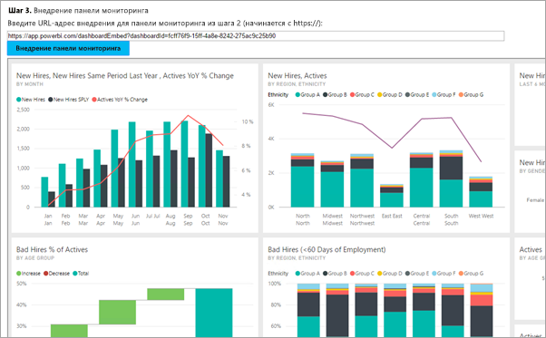

# <a name="embed-a-power-bi-dashboard-tile-or-report-into-your-application-for-sovereign-clouds"></a>Внедрение панели мониторинга, плитки или отчета Power BI в приложение для национальных облаков
Узнайте, как интегрировать (внедрить) панель мониторинга, плитку или отчет в веб-приложение с помощью пакета SDK для .NET в Power BI и API JavaScript для Power BI для клиентов. Как правило, это сценарий ISV.

Power BI также поддерживает национальные (частные) облака. Каждое национальное облако принадлежит отдельной организации. Национальные облака могут быть следующими:

* U.S. Government Community Cloud (GCC)

* U. S. Military Contractors (DoDCON)

* U. S. Military (DoD)

* Power BI для облачных служб в Германии.



Для работы с руководством вам потребуется учетная запись **Power BI**. Если вы еще на настроили учетную запись, то в зависимости от типа государственной организаций, можно [зарегистрироваться для получения учетной записи в Power BI для государственных организаций США](../service-govus-signup.md) или [в Power BI для облачных служб в Германии](https://powerbi.microsoft.com/power-bi-germany/?ru=https%3A%2F%2Fapp.powerbi.de%2F%3FnoSignUpCheck%3D1).

> [!NOTE]
> Планируете внедрить панель мониторинга для организации? В таком случае см. статью об [интеграции панели мониторинга в приложение для организации](integrate-dashboard.md).
>

Чтобы интегрировать панель мониторинга в веб-приложение, используйте API **Power BI** и **токен доступа** авторизации Azure Active Directory (AD) для получения панели мониторинга. Затем загрузите панель мониторинга, используя маркер внедрения. API **Power BI** обеспечивает программный доступ к определенным ресурсам **Power BI**. Дополнительные сведения см. в документации по [интерфейсу REST API для Power BI](https://docs.microsoft.com/rest/api/power-bi/), [пакету SDK для .NET в Power BI](https://github.com/Microsoft/PowerBI-CSharp) и [интерфейсу API JavaScript для Power BI](https://github.com/Microsoft/PowerBI-JavaScript).

## <a name="download-the-sample"></a>Скачивание примера
В этой статье приведен код, используемый в [примере внедрения для клиента](https://github.com/Microsoft/PowerBI-Developer-Samples/tree/master/App%20Owns%20Data/PowerBIEmbedded_AppOwnsData) на GitHub. Для работы с этим пошаговым руководством можно загрузить пример кода.

* Government Community Cloud (GCC):
    1. Замените содержимое файла Cloud.config на содержимое файла GCCCloud.config.
    2. Обновите clientid (идентификатор клиента собственного приложения), groupid, user (ваш главный пользователь) и password в файле Web.config.
    3. Добавьте параметры GCC в файл web.config следующим образом.

```xml
<add key="authorityUrl" value="https://login.windows.net/common/oauth2/authorize/" />

<add key="resourceUrl" value="https://analysis.usgovcloudapi.net/powerbi/api" />

<add key="apiUrl" value="https://api.powerbigov.us/" />

<add key="embedUrlBase" value="https://app.powerbigov.us" />
```

* Military Contractors (DoDCON):
    1. Замените содержимое файла Cloud.config на содержимое файла TBCloud.config.
    2. Обновите clientid (идентификатор клиента собственного приложения), groupid, user (ваш главный пользователь) и password в файле Web.config.
    3. Добавьте параметры DoDCON в файл web.config следующим образом.

```xml
<add key="authorityUrl" value="https://login.windows.net/common/oauth2/authorize/" />

<add key="resourceUrl" value="https://high.analysis.usgovcloudapi.net/powerbi/api" />

<add key="apiUrl" value="https://api.high.powerbigov.us/" />

<add key="embedUrlBase" value="https://app.high.powerbigov.us" />
```

* Military (DoD):
    1. Замените содержимое файла Cloud.config на содержимое файла PFCloud.config.
    2. Обновите clientid (идентификатор клиента собственного приложения), groupid, user (ваш главный пользователь) и password в файле Web.config.
    3. Добавьте параметры DoDCON в файл web.config следующим образом.

```xml
<add key="authorityUrl" value="https://login.windows.net/common/oauth2/authorize/" />

<add key="resourceUrl" value="https://mil.analysis.usgovcloudapi.net/powerbi/api" />

<add key="apiUrl" value="https://api.mil.powerbigov.us/" />

<add key="embedUrlBase" value="https://app.mil.powerbigov.us" />
```

* Параметры Power BI для облачных служб в Германии
    1. Замените содержимое файла Cloud.config на содержимое Power BI для облачных служб в Германии.
    2. Обновите clientid (идентификатор клиента собственного приложения), groupid, user (ваш главный пользователь) и password в файле Web.config.
    3. Добавьте параметры Power BI для облачных служб в Германии в файл web.config следующим образом.

```xml
<add key="authorityUrl" value=https://login.microsoftonline.de/common/oauth2/authorize/" />

<add key="resourceUrl" value="https://analysis.cloudapi.de/powerbi/api" />

<add key="apiUrl" value="https://api.powerbi.de/" />

<add key="embedUrlBase" value="https://app.powerbi.de" />
```

## <a name="step-1---register-an-app-in-azure-ad"></a>Шаг 1. Регистрация приложения в Azure AD
Вы должны зарегистрировать приложение в Azure Active Directory, чтобы осуществлять вызовы REST API. Дополнительные сведения см. в статье [Регистрация приложения Azure AD для внедрения содержимого Power BI](register-app.md). Так как национальные облака принадлежат различным организациям, существуют отдельные URL-адреса для регистрации приложений.

* Government Community Cloud (GCC) — https://app.powerbigov.us/apps 

* Military Contractors (DoDCON) — https://app.high.powerbigov.us/apps 

* Military (DoD) — https://app.mil.powerbigov.us/apps

* Power BI для облачных служб в Германии — https://app.powerbi.de/apps

Если вы скачали [пример внедрения для клиента](https://github.com/Microsoft/PowerBI-Developer-Samples/tree/master/App%20Owns%20Data), используйте **идентификатор клиента**, полученный после регистрации, чтобы настроить этот пример для проверки подлинности в Azure Active Directory. Для настройки примера измените значение **clientId** в файле *web.config*.


## <a name="step-2---get-an-access-token-from-azure-ad"></a>Шаг 2. Получение маркера доступа из Azure AD
Перед выполнением вызовов в REST API Power BI в приложении потребуется получить **маркер доступа** из Azure AD. Дополнительные сведения см. в статье [Authenticate users and get an Azure AD access token for your Power BI app](get-azuread-access-token.md) (Проверка подлинности для пользователей и получение маркера доступа Azure AD для приложения Power BI). Так как национальные облака принадлежат различным организациям, существуют отдельные URL-адреса для получения маркеров доступа для приложений.

* Government Community Cloud (GCC) — https://login.microsoftonline.com

* Military Contractors (DoDCON) — http://login.microsoftonline.us

* Military (DoD) — https://login.microsoftonline.us

* Power BI для облачных служб в Германии — https://login.microsoftonline.de

Примеры можно найти в задачах для каждого элемента содержимого в **Controllers\HomeController.cs**.

## <a name="step-3---get-a-content-item"></a>Шаг 3. Получение элемента содержимого
Чтобы внедрить содержимое Power BI, вам потребуется выполнить несколько действий для проверки процесса внедрения. Эти действия можно выполнить при помощи API REST напрямую, но образец приложения и приведенные здесь примеры созданы при помощи пакета SDK для .NET.

### <a name="create-the-power-bi-client-with-your-access-token"></a>Создание клиента Power BI с использованием маркера доступа
Используя маркер доступа, можно создать объекта клиента Power BI, что позволит вам работать с API Power BI. Для этого AccessToken упаковывается в объект *Microsoft.Rest.TokenCredentials*.

```csharp
using Microsoft.IdentityModel.Clients.ActiveDirectory;
using Microsoft.Rest;
using Microsoft.PowerBI.Api.V2;

var tokenCredentials = new TokenCredentials(authenticationResult.AccessToken, "Bearer");

// Create a Power BI Client object. It will be used to call Power BI APIs.
using (var client = new PowerBIClient(new Uri(ApiUrl), tokenCredentials))
{
    // Your code to embed items.
}
```

### <a name="get-the-content-item-you-want-to-embed"></a>Получение элемента содержимого, который нужно внедрить
Используйте объект клиента Power BI, чтобы получить ссылку на элемент, который требуется внедрить. Вы можете внедрять панели мониторинга, плитки или отчеты. Ниже показано, как получить первую панель мониторинга, плитку или отчет из определенной рабочей области.

Образец можно найти в файле **Controllers\HomeController.cs** [примера для данных, принадлежащих приложению](https://github.com/Microsoft/PowerBI-Developer-Samples/tree/master/App%20Owns%20Data).

**Панели мониторинга**

```csharp
using Microsoft.PowerBI.Api.V2;
using Microsoft.PowerBI.Api.V2.Models;

// You will need to provide the GroupID where the dashboard resides.
ODataResponseListDashboard dashboards = client.Dashboards.GetDashboardsInGroup(GroupId);

// Get the first report in the group.
Dashboard dashboard = dashboards.Value.FirstOrDefault();
```

**Плитка**

```csharp
using Microsoft.PowerBI.Api.V2;
using Microsoft.PowerBI.Api.V2.Models;

// To retrieve the tile, you first need to retrieve the dashboard.

// You will need to provide the GroupID where the dashboard resides.
ODataResponseListDashboard dashboards = client.Dashboards.GetDashboardsInGroup(GroupId);

// Get the first report in the group.
Dashboard dashboard = dashboards.Value.FirstOrDefault();

// Get a list of tiles from a specific dashboard
ODataResponseListTile tiles = client.Dashboards.GetTilesInGroup(GroupId, dashboard.Id);

// Get the first tile in the group.
Tile tile = tiles.Value.FirstOrDefault();
```

**Отчет**

```csharp
using Microsoft.PowerBI.Api.V2;
using Microsoft.PowerBI.Api.V2.Models;

// You will need to provide the GroupID where the dashboard resides.
ODataResponseListReport reports = client.Reports.GetReportsInGroupAsync(GroupId);

// Get the first report in the group.
Report report = reports.Value.FirstOrDefault();
```

### <a name="create-the-embed-token"></a>Создание маркера внедрения
Необходимо, чтобы создаваемый токен внедрения можно было использовать из API JavaScript. Токен внедрения будет связан только с внедряемым элементом. Это означает, что при каждом внедрении части содержимого Power BI нужно создавать отдельный токен внедрения. Дополнительные сведения, включая информацию о том, какой уровень **accessLevel** нужно использовать, см. в статье [Токен внедрения](https://docs.microsoft.com/rest/api/power-bi/embedtoken).

> [!IMPORTANT]
> Так как токены внедрения предназначены только для тестирования при разработке, количество таких токенов, создаваемых основной учетной записью Power BI, ограничено. Для сценариев внедрения в рабочей среде [необходимо приобрести емкость](https://docs.microsoft.com/power-bi/developer/embedded-faq#technical). В этом случае количество создаваемых токенов внедрения не ограничено.

Пример можно найти в файле **Controllers\HomeController.cs** [примера внедрения для организации](https://github.com/Microsoft/PowerBI-Developer-Samples/tree/master/App%20Owns%20Data).

Предполагается, что класс создается для **EmbedConfig** и **TileEmbedConfig**. Эти примеры доступны в **Models\EmbedConfig.cs** и **Models\TileEmbedConfig.cs**.

**Панель мониторинга**

```csharp
using Microsoft.PowerBI.Api.V2;
using Microsoft.PowerBI.Api.V2.Models;

// Generate Embed Token.
var generateTokenRequestParameters = new GenerateTokenRequest(accessLevel: "view");
EmbedToken tokenResponse = client.Dashboards.GenerateTokenInGroup(GroupId, dashboard.Id, generateTokenRequestParameters);

// Generate Embed Configuration.
var embedConfig = new EmbedConfig()
{
    EmbedToken = tokenResponse,
    EmbedUrl = dashboard.EmbedUrl,
    Id = dashboard.Id
};
```

**Плитка**

```csharp
using Microsoft.PowerBI.Api.V2;
using Microsoft.PowerBI.Api.V2.Models;

// Generate Embed Token for a tile.
var generateTokenRequestParameters = new GenerateTokenRequest(accessLevel: "view");
EmbedToken tokenResponse = client.Tiles.GenerateTokenInGroup(GroupId, dashboard.Id, tile.Id, generateTokenRequestParameters);

// Generate Embed Configuration.
var embedConfig = new TileEmbedConfig()
{
    EmbedToken = tokenResponse,
    EmbedUrl = tile.EmbedUrl,
    Id = tile.Id,
    dashboardId = dashboard.Id
};
```

**Отчет**

```csharp
using Microsoft.PowerBI.Api.V2;
using Microsoft.PowerBI.Api.V2.Models;

// Generate Embed Token.
var generateTokenRequestParameters = new GenerateTokenRequest(accessLevel: "view");
EmbedToken tokenResponse = client.Reports.GenerateTokenInGroup(GroupId, report.Id, generateTokenRequestParameters);

// Generate Embed Configuration.
var embedConfig = new EmbedConfig()
{
    EmbedToken = tokenResponse,
    EmbedUrl = report.EmbedUrl,
    Id = report.Id
};
```
## <a name="step-4---load-an-item-using-javascript"></a>Шаг 4. Загрузка элемента с помощью JavaScript
Чтобы загрузить панель мониторинга в элемент div веб-страницы, вы можете использовать JavaScript. В примере используется модель EmbedConfig/TileEmbedConfig и представления панели мониторинга, плитки или отчета. С полным примером применения API JavaScript можно ознакомиться в [образце Microsoft Power BI Embedded](https://microsoft.github.io/PowerBI-JavaScript/demo).

Пример приложения доступен в [примере внедрения для организации](https://github.com/Microsoft/PowerBI-Developer-Samples/tree/master/App%20Owns%20Data).

**Views\Home\EmbedDashboard.cshtml**

```csharp
<script src="~/scripts/powerbi.js"></script>
<div id="dashboardContainer"></div>
<script>
    // Read embed application token from Model
    var accessToken = "@Model.EmbedToken.Token";

    // Read embed URL from Model
    var embedUrl = "@Html.Raw(Model.EmbedUrl)";

    // Read dashboard Id from Model
    var embedDashboardId = "@Model.Id";

    // Get models. models contains enums that can be used.
    var models = window['powerbi-client'].models;

    // Embed configuration used to describe the what and how to embed.
    // This object is used when calling powerbi.embed.
    // This also includes settings and options such as filters.
    // You can find more information at https://github.com/Microsoft/PowerBI-JavaScript/wiki/Embed-Configuration-Details.
    var config = {
        type: 'dashboard',
        tokenType: models.TokenType.Embed,
        accessToken: accessToken,
        embedUrl: embedUrl,
        id: embedDashboardId
    };

    // Get a reference to the embedded dashboard HTML element
    var dashboardContainer = $('#dashboardContainer')[0];

    // Embed the dashboard and display it within the div container.
    var dashboard = powerbi.embed(dashboardContainer, config);
</script>
```

**Views\Home\EmbedTile.cshtml**

```csharp
<script src="~/scripts/powerbi.js"></script>
<div id="tileContainer"></div>
<script>
    // Read embed application token from Model
    var accessToken = "@Model.EmbedToken.Token";

    // Read embed URL from Model
    var embedUrl = "@Html.Raw(Model.EmbedUrl)";

    // Read tile Id from Model
    var embedTileId = "@Model.Id";

    // Read dashboard Id from Model
    var embedDashboardeId = "@Model.dashboardId";

    // Get models. models contains enums that can be used.
    var models = window['powerbi-client'].models;

    // Embed configuration used to describe the what and how to embed.
    // This object is used when calling powerbi.embed.
    // This also includes settings and options such as filters.
    // You can find more information at https://github.com/Microsoft/PowerBI-JavaScript/wiki/Embed-Configuration-Details.
    var config = {
        type: 'tile',
        tokenType: models.TokenType.Embed,
        accessToken: accessToken,
        embedUrl: embedUrl,
        id: embedTileId,
        dashboardId: embedDashboardeId
    };

    // Get a reference to the embedded tile HTML element
    var tileContainer = $('#tileContainer')[0];

    // Embed the tile and display it within the div container.
    var tile = powerbi.embed(tileContainer, config);
</script>
```

**Views\Home\EmbedReport.cshtml**

```csharp
<script src="~/scripts/powerbi.js"></script>
<div id="reportContainer"></div>
<script>
    // Read embed application token from Model
    var accessToken = "@Model.EmbedToken.Token";

    // Read embed URL from Model
    var embedUrl = "@Html.Raw(Model.EmbedUrl)";

    // Read report Id from Model
    var embedReportId = "@Model.Id";

    // Get models. models contains enums that can be used.
    var models = window['powerbi-client'].models;

    // Embed configuration used to describe the what and how to embed.
    // This object is used when calling powerbi.embed.
    // This also includes settings and options such as filters.
    // You can find more information at https://github.com/Microsoft/PowerBI-JavaScript/wiki/Embed-Configuration-Details.
    var config = {
        type: 'report',
        tokenType: models.TokenType.Embed,
        accessToken: accessToken,
        embedUrl: embedUrl,
        id: embedReportId,
        permissions: models.Permissions.All,
        settings: {
            filterPaneEnabled: true,
            navContentPaneEnabled: true
        }
    };

    // Get a reference to the embedded report HTML element
    var reportContainer = $('#reportContainer')[0];

    // Embed the report and display it within the div container.
    var report = powerbi.embed(reportContainer, config);
</script>
```

## <a name="next-steps"></a>Дальнейшие действия

* Пример приложения для проверки можно найти на сайте GitHub. Примеры выше основаны на этом образце. Дополнительные сведения см. в [примере внедрения для организации](https://github.com/Microsoft/PowerBI-Developer-Samples/tree/master/App%20Owns%20Data).
* Дополнительные сведения об API JavaScript см. на странице [API JavaScript для Power BI](https://github.com/Microsoft/PowerBI-JavaScript).
* Дополнительные сведения о Power BI для облачных служб в Германии см. в статье с ответами на [часто задаваемые вопросы по этому продукту](https://docs.microsoft.com/power-bi/service-govde-faq).
* [Как перенести содержимое коллекции рабочих областей Power BI в Power BI](migrate-from-powerbi-embedded.md)

Рекомендации и ограничения
* Учетные записи GCC в настоящее время поддерживают только емкости P и EM

Появились дополнительные вопросы? [Попробуйте задать вопрос в сообществе Power BI.](http://community.powerbi.com/)
