# Руководство. Внедрение отчета, панели мониторинга или плитки Power BI в приложение для клиентов
Служба **Power BI Embedded в Azure** позволяет внедрять в приложение отчеты, панели мониторинга и плитки с помощью модели **данных, принадлежащих приложению**. Модель **данных, принадлежащих приложению**, позволяет приложению использовать Power BI как встроенную платформу аналитики. Обычно это сценарий **разработчика и независимого поставщика программного обеспечения**. Как **разработчик и независимый поставщик программного обеспечения** вы можете создавать содержимое Power BI, отображающее отчеты, панели мониторинга или плитки в приложении. При этом приложение будет полностью интегрированным и интерактивным, а пользователям не потребуется лицензия Power BI, и они не будут знать, что это Power BI. Из этого руководства вы узнаете, как правильно интегрировать отчет в приложение с помощью пакета SDK **Power BI** для .NET и API JavaScript **Power BI** в системе, предоставляющей клиентам ресурсы **Power BI Embedded в Azure**  по модели **данных, принадлежащих приложению**.

Из этого руководства вы узнаете, как выполнять следующие задачи:
>[!div class="checklist"]
>* регистрация приложения в Azure;
>* внедрение отчета Power BI в приложение.

## Предварительные требования
Чтобы начать работу, вам потребуется учетная запись **Power BI Pro**, которая станет вашей **главной учетной записью**, и подписка **Microsoft Azure**.

* Если вы не зарегистрированы в **Power BI**, перед началом работы [пройдите бесплатную регистрацию](https://powerbi.microsoft.com/en-us/pricing/).
* Если у вас нет подписки Azure, перед началом работы [создайте бесплатную учетную запись](https://azure.microsoft.com/free/?WT.mc_id=A261C142F).
* Вам потребуется собственная установка [клиента Azure Active Directory ](create-an-azure-active-directory-tenant.md).
* Также нужно установить [Visual Studio](https://www.visualstudio.com/) 2013 или более поздней версии.

## Настройка среды разработки для встроенной аналитики

Чтобы внедрить в приложение отчеты, панели мониторинга и плитки, внедрение необходимо настроить в вашей среде. В процессе настройки необходимо будет сделать следующее.

Воспользуйтесь [средством адаптации](https://aka.ms/embedsetup/AppOwnsData), чтобы быстро приступить к работе и скачать образец приложения, с помощью которого можно создать среду и внедрить отчет.

Если вы решили настроить среду вручную, см. инструкции ниже.
### Регистрация приложения в Azure Active Directory

Регистрация приложения в Azure Active Directory нужна для того, чтобы предоставить приложению доступ к REST API Power BI. Это позволит создать удостоверение для приложения и предоставить ему разрешения на доступ к ресурсам REST Power BI.

1. Примите [условия использования API Microsoft Power BI](https://powerbi.microsoft.com/api-terms).

2. Войдите на [портал Azure](https://portal.azure.com).
 
    

3. На панели навигации слева выберите **Все службы**, выберите **Регистрация приложений** и щелкните **Регистрация нового приложения**.
   
    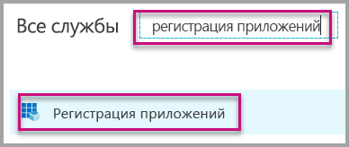 
    

4. Следуя инструкциям на экране, создайте приложение. Чтобы применить модель данных, принадлежащих приложению, необходимо использовать тип **собственного приложения**. Также укажите **универсальный код ресурса (URI) перенаправления**, который требуется **Azure AD** для ответа на запросы маркеров. Это значение уникально для вашего приложения (например, http://localhost:13526/redirect).

    

### Предоставление разрешений для приложения в Azure AD

Кроме разрешений, представленных на странице регистрации приложения, потребуется несколько дополнительных разрешений. Вам нужно войти в систему с помощью *главной* учетной записи, используемой для внедрения, или учетной записи глобального администратора.

### Использование портала Azure Active Directory

1. На портале Azure перейдите к колонке [Регистрация приложений](https://portal.azure.com/#blade/Microsoft_AAD_IAM/ApplicationsListBlade) и выберите приложение, используемое для внедрения.
   
    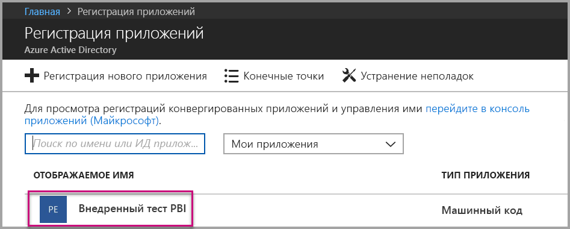

2. В разделе **Параметры** откройте **Доступ через API** и выберите **Необходимые разрешения**.
   
    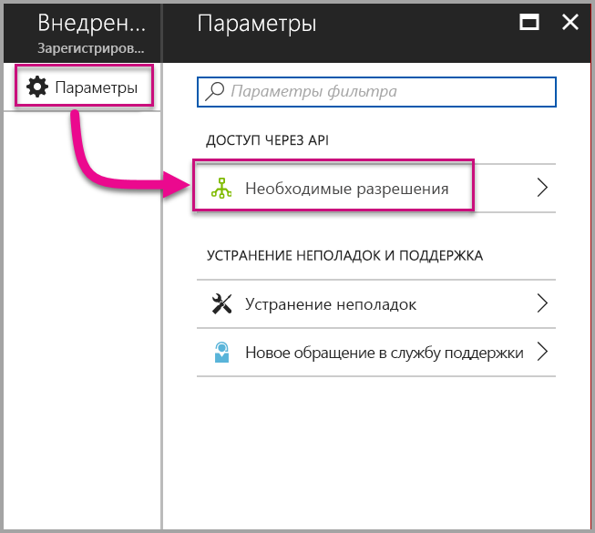

3. Выберите **Microsoft Azure Active Directory** и затем установите флажок **Осуществляйте доступ к каталогу как пользователь, выполнивший вход**. Нажмите кнопку **Сохранить**.
   
    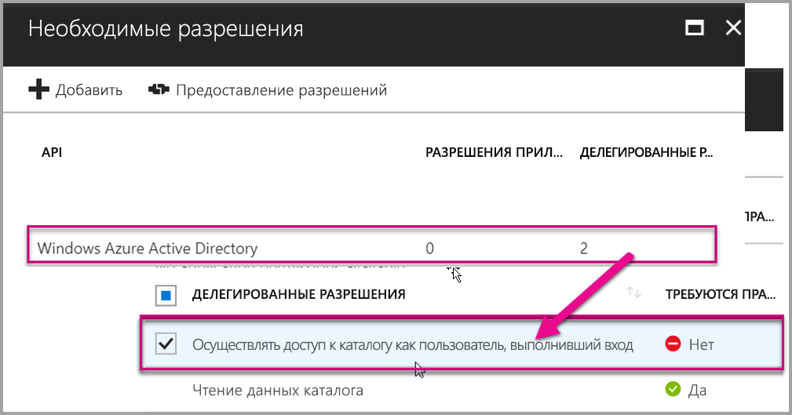

4. Нажмите кнопку **Добавить**.

    

5. Щелкните **Select an API** (Выбор API).

    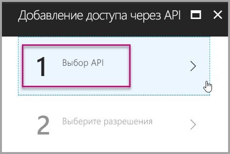

6. Последовательно выберите **Служба Power BI** и **Выбрать**.

    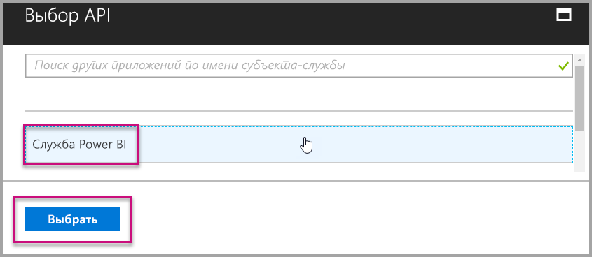

7. Установите все разрешения в разделе **Делегированные разрешения**. Их необходимо выбирать по одному. Это позволит сохранить настройки. После завершения щелкните **Сохранить**.
   
    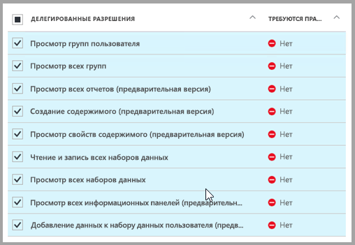

8. В колонке **Необходимые разрешения** выберите **Предоставить разрешения**.
   
    Действие **Предоставить разрешения** требуется для того, чтобы в *главную учетную запись* не отправлялись запросы на продолжение из Azure AD. Если это действие выполняется для учетной записи глобального администратора, разрешения на использование этого приложения предоставляется всем пользователям в вашей организации. Если это действие выполняется для *главной учетной записи*, а не для учетной записи глобального администратора, разрешения на использование этого приложения предоставляется только для *главной учетной записи*.
   
    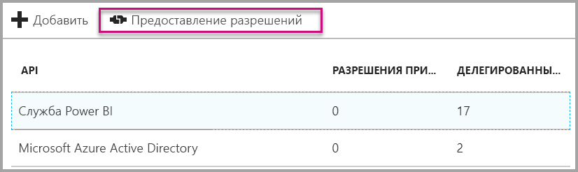

## Настройка рабочей среды Power BI

### Создание рабочей области приложения

Если вы планируете внедрить отчеты, панели мониторинга и (или) плитки в приложение для клиентов, необходимо разместить содержимое в рабочей области этого приложения. *Главная* учетная запись должна предоставлять права администратора для рабочей области приложения.

1. Начнем с создания рабочей области. Последовательно выберите **Рабочие области** > **Создать рабочую область приложения**. Именно здесь вы будете размещать содержимое, к которому нужен доступ из приложения.

    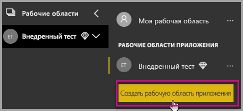

2. Присвойте рабочей области имя. Если соответствующее поле **Workspace ID** (Идентификатор рабочей области) недоступно, измените это имя, чтобы указать уникальный идентификатор. Он также станет именем приложения.

    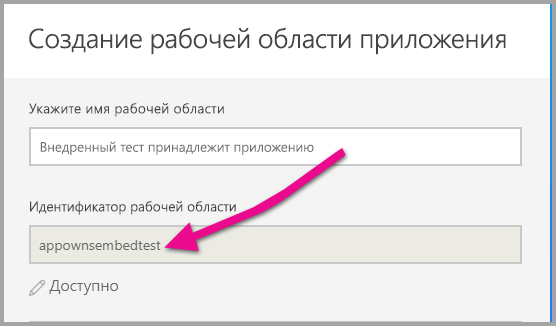

3. Вы можете выбрать один из доступных вариантов. Если вы выбрали **Общедоступный**, все пользователи организации смогут просматривать содержимое рабочей области. С другой стороны, если выбрать **Частный**, только члены рабочей области смогут просматривать ее содержимое.

    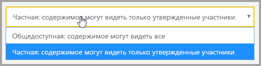

    После создания группы изменить параметр открытого или закрытого доступа нельзя.

4. Вы также можете задать права для членов рабочей области: разрешить **изменение** содержимого или предоставить доступ **только для просмотра**.

    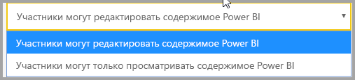

5. Добавьте адреса электронной почты сотрудников, которым необходимо предоставить доступ к рабочей области, и нажмите кнопку **Добавить**. Вы не можете добавлять псевдонимы групп, а только отдельных пользователей.

6. Предоставьте каждому пользователю либо права участника, либо администратора. Администраторы могут самостоятельно изменять рабочую область, в том числе добавлять других участников. Участники могут изменять содержимое рабочей области (за исключением тех случаев, когда они имеют доступ только на просмотр). Публиковать приложения могут и администраторы, и участники.

Теперь можно перейти к просмотру новой рабочей области. После этого служба Power BI создаст рабочую область и откроет ее. Она отображается в списке рабочих областей, в которые вы входите. Администратор может щелкнуть многоточие (…), чтобы вернуться и внести изменения в рабочую область, например добавить новых участников или изменить разрешения.

   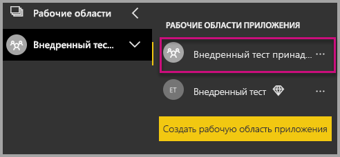

### Создание и публикация отчетов

Вы можете создавать отчеты и наборы данных с помощью Power BI Desktop, а затем публиковать эти отчеты в рабочей области приложения. У пользователя, публикующего отчеты в рабочей области приложения, должна быть лицензия Power BI Pro.

1. Скачайте пример [демонстрационной версии блога](https://github.com/Microsoft/powerbi-desktop-samples) из GitHub.

    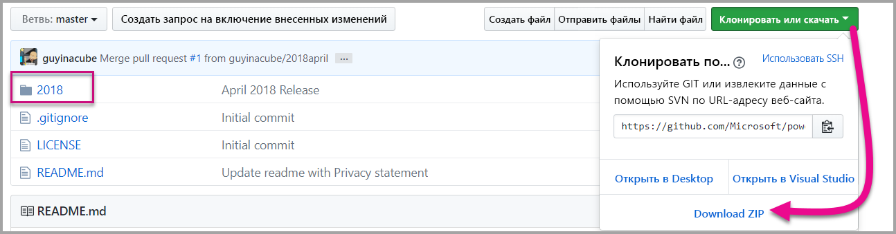

2. Откройте PBIX-файл с образцом отчета в **Power BI Desktop**.

   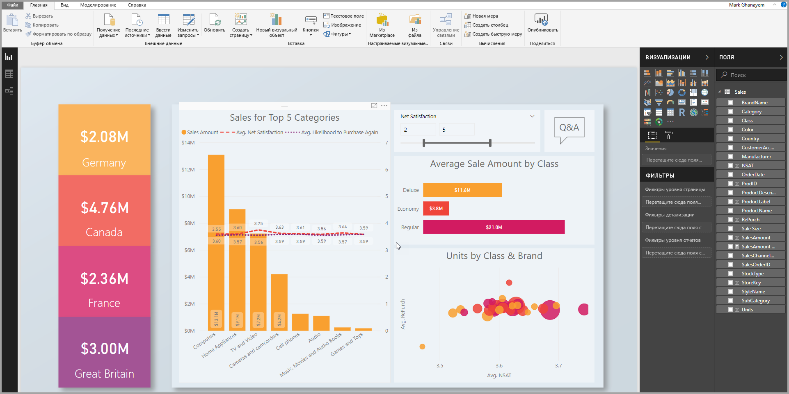

3. Опубликуйте его в **рабочей области приложения**.

   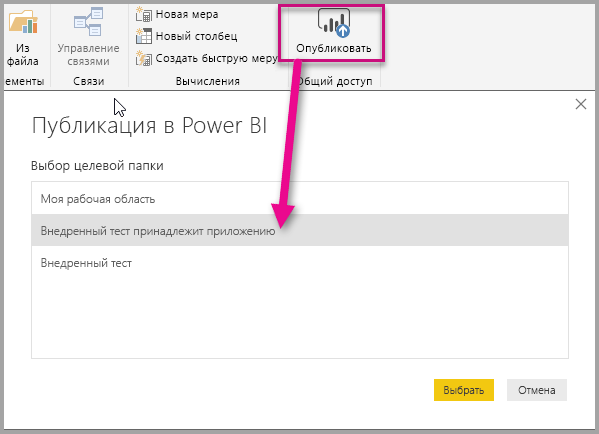

    Теперь вы можете просмотреть отчет в веб-службе Power BI.

   

## Внедрение содержимого

Чтобы внедрять содержимое для клиентов в приложении, вам нужно получить **токен доступа** из **Azure AD** для главной учетной записи. Необходимо [получить токен доступа Azure AD](get-azuread-access-token.md#access-token-for-non-power-bi-users-app-owns-data) для приложения Power BI, использующего модель данных, принадлежащих приложению, прежде чем выполнять вызовы в API Power BI.

Сделайте следующее, чтобы начать внедрять содержимое, использующее модель данных, принадлежащих приложению.

1. Чтобы приступить к работе, скачайте [пример с данными, принадлежащими приложению](https://github.com/Microsoft/PowerBI-Developer-Samples) из GitHub.

    

2. Откройте файл Web.config из этого примера приложения. Здесь есть 5 полей, которые нужно заполнить, чтобы успешно запустить приложение. Это **ClientID**, **groupId**, **reportId**, **pbiUsername** и **pbiPassword**.

      

    * Укажите в поле **clientId** значение **идентификатора приложения** из **Azure**. Поле **clientId** используется приложением для его идентификации для пользователей, у которых запрашиваются разрешения. Чтобы получить значение **clientId**, выполните следующие действия:

    1. Войдите на [портал Azure](https://portal.azure.com).

        

    2. На панели навигации слева выберите **Все службы** и щелкните **Регистрация приложений**.

        
    3. Выберите приложение, для которого вам нужно значение **clientId**.

        

    4. Отобразится **идентификатор приложения**, указанный в поле идентификатора GUID. Поместите этот **идентификатор приложения** в поле **clientId** для приложения.

        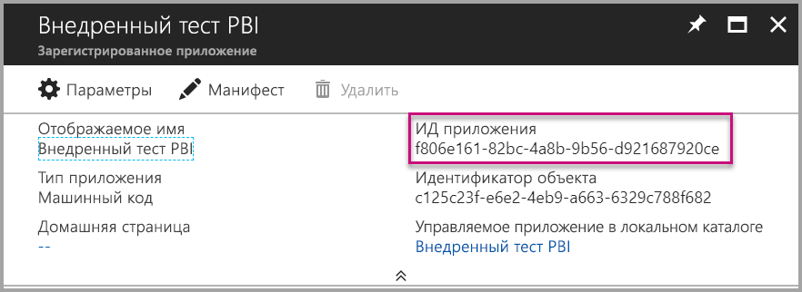     

    * Укажите в поле **groupId** значение **GUID рабочей области приложения** из Power BI.

        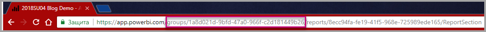

    * Укажите в поле **reportId** значение **GUID отчета** из Power BI.

        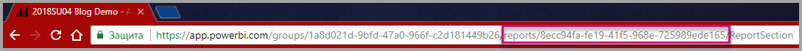    

    * Укажите в поле **pbiUsername** имя главной учетной записи Power BI.
    * Укажите в поле **pbiPassword** пароль для главной учетной записи Power BI.

3. Запустите приложение!

    Сначала выберите **Запуск** в **Visual Studio**.

    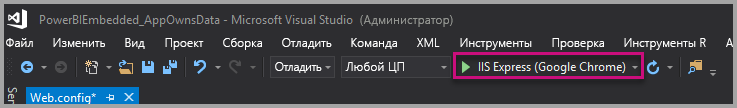

    Теперь выберите **Внедрить отчет**. В зависимости от того, какое содержимое вы хотите проверить (отчеты, панели мониторинга или плитки), выберите нужный вариант в приложении.

    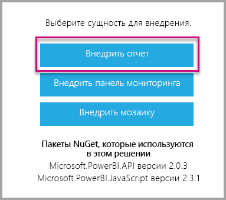
 
    Теперь вы можете просмотреть отчет в примере приложения.

    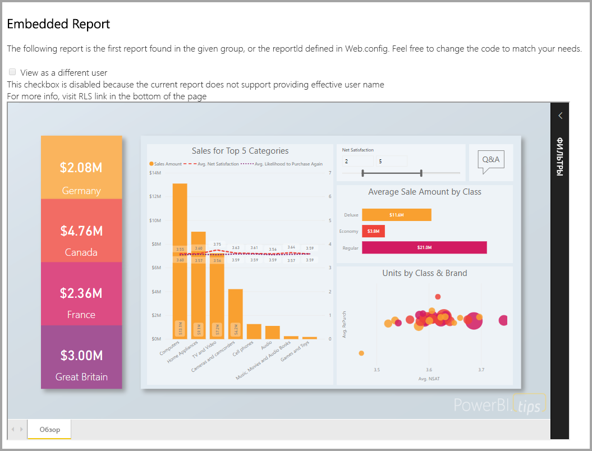

## Начало эксплуатации в рабочей среде

После разработки приложения нужно вернуться к рабочей области приложения с выделенной емкостью. Для перехода к рабочей среде требуется выделенная емкость.

### Создание выделенной емкости
Создав выделенную емкость, вы получите преимущество выделенного ресурса для клиента. Рабочие области, которые не были назначены в выделенную емкость, будут находиться в общей емкости. Создать выделенную емкость можно с помощью решения [Выделенная емкость Power BI Embedded](https://docs.microsoft.com/azure/power-bi-embedded/create-capacity) в Azure.

>[!Note]
>Токены внедрения с лицензией PRO предназначены для разработки и тестирования при разработке, поэтому количество таких токенов, создаваемых главной учетной записью Power BI, ограничено. Необходимо приобрести выделенную емкость, чтобы иметь возможность внедрения в рабочей среде. В этом случае не будет ограничения на количество создаваемых токенов. Выберите [Получить доступные компоненты](https://msdn.microsoft.com/library/mt846473.aspx), чтобы проверить данные о потреблении Embedded, выраженные в процентах от общей емкости.
>

### Назначение выделенной емкости для рабочей области приложения

После создания выделенной емкости назначьте выделенную емкость рабочей области приложения. Для этого сделайте следующее.

1. В **службе Power BI** разверните рабочие области и щелкните многоточие возле рабочей области, в которую встраивается содержимое. Затем выберите команду **Изменить рабочие области**.

    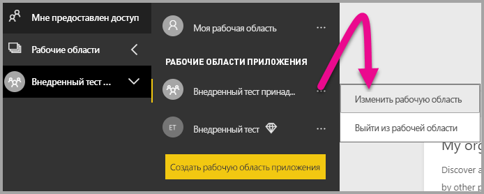

2. Разверните элемент **Дополнительно**, затем включите **выделенную емкость** и выберите созданную выделенную емкость. Затем выберите **Сохранить**.

    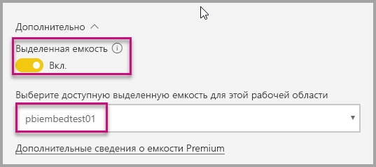

С полнофункциональным примером на основе API JavaScript вы можете ознакомиться на странице [средства "Площадка"](https://microsoft.github.io/PowerBI-JavaScript/demo). Это очень удобный способ быстро протестировать разные примеры Power BI Embedded. Дополнительные сведения об API JavaScript вы найдете на странице [вики-сайта PowerBI-JavaScript](https://github.com/Microsoft/powerbi-javascript/wiki).

Если у вас остались вопросы о Power BI Embedded, воспользуйтесь [разделом часто задаваемых вопросов](embedded-faq.md).  Если в приложении возникают проблемы, связанные с Power Bi Embedded, примените инструкции из [руководства по устранению неполадок](embedded-troubleshoot.md).

Появились дополнительные вопросы? [Попробуйте задать вопрос в сообществе Power BI.](http://community.powerbi.com/)