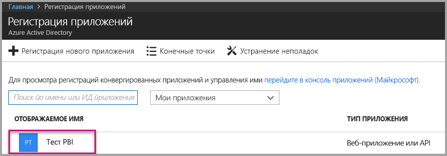
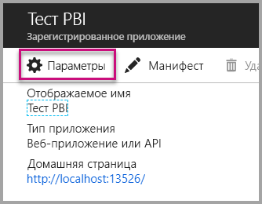
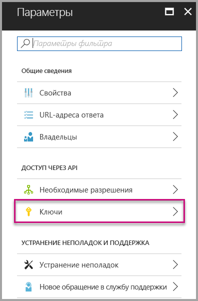
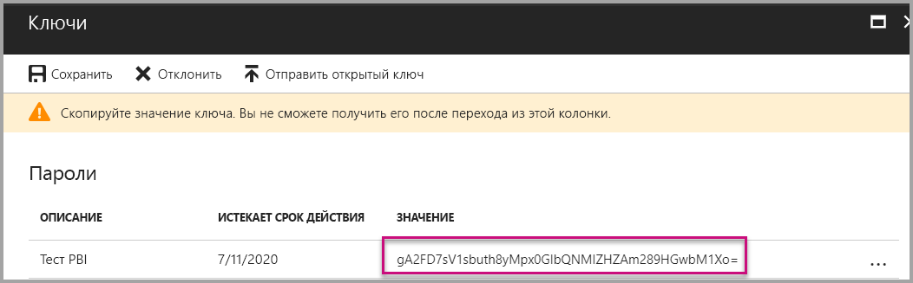
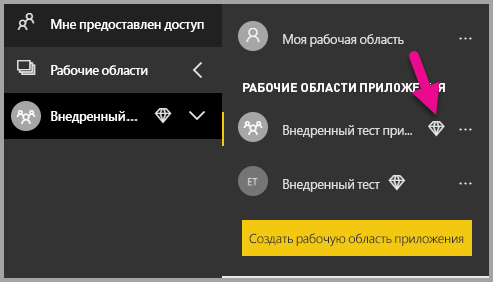

# <a name="tutorial-embed-power-bi-content-into-an-application-for-your-customers"></a>Руководство. Внедрение содержимого Power BI в приложение для клиентов

С помощью **Power BI Embedded в Azure** вы можете встраивать отчеты, информационные панели или плитки в приложение с помощью данных, принадлежащих ему. Модель **данных, принадлежащих приложению**, позволяет приложению использовать Power BI как встроенную платформу аналитики. Как **разработчик и независимый поставщик программного обеспечения** вы можете создавать содержимое Power BI, отображающее отчеты, информационные панели или плитки в приложении. При этом приложение будет полностью интегрированным и интерактивным, а пользователям не потребуется лицензия Power BI. Из этого руководства вы узнаете, как интегрировать отчет в приложение с помощью пакета SDK Power BI для .NET и API JavaScript для Power BI при использовании**Power BI Embedded в Azure** для ваших клиентов.

Из этого руководства вы узнаете, как выполнять следующие задачи:
> [!div class="checklist"]
> * регистрация приложения в Azure;
> * внедрение отчета Power BI в приложение.

## <a name="prerequisites"></a>Предварительные требования

Для работы вам понадобятся:

* [учетная запись Power BI Pro](../service-self-service-signup-for-power-bi.md) (главная учетная запись, то есть имя пользователя и пароль для входа в учетную запись Power BI Pro) или [субъект-служба (токен только для приложения)](embed-service-principal.md);
* подписка [Microsoft Azure](https://azure.microsoft.com/);
* собственная установка [клиента Azure Active Directory](create-an-azure-active-directory-tenant.md).

Если вы не зарегистрированы в **Power BI**, перед началом работы [пройдите бесплатную регистрацию](https://powerbi.microsoft.com/pricing/).

Если у вас нет подписки Azure, перед началом работы [создайте бесплатную учетную запись](https://azure.microsoft.com/free/?WT.mc_id=A261C142F).

## <a name="set-up-your-embedded-analytics-development-environment"></a>Настройка среды разработки для встроенной аналитики

Чтобы внедрить в приложение отчеты, панели мониторинга и плитки, необходимо убедиться, что среда допускает внедрение с помощью Power BI.

Воспользуйтесь [средством настройки внедрения](https://aka.ms/embedsetup/AppOwnsData), чтобы быстро приступить к работе и скачать пример приложения с пошаговой инструкцией для создания среды и внедрения отчета.

Если вы решили настроить среду вручную, см. инструкции ниже.

### <a name="register-an-application-in-azure-active-directory-azure-ad"></a>Регистрация приложения в Azure Active Directory

[Зарегистрируйте приложение](register-app.md) в Azure Active Directory, чтобы предоставить ему доступ к [REST API Power BI](https://docs.microsoft.com/rest/api/power-bi/). Регистрация приложения позволит создать удостоверение для приложения и предоставить ему разрешения на доступ к ресурсам REST Power BI. Способ регистрации приложения зависит от того, используете ли вы главную учетную запись или [субъект-службу](embed-service-principal.md).

Выбранный метод влияет на тип приложения, регистрируемого в Azure.

Если вы продолжаете использовать главную учетную запись, зарегистрируйте **собственное** приложение, так как в этом случае применяется неинтерактивный вход.

Если же вы используете субъект-службу, необходимо зарегистрировать **веб-приложение на стороне сервера**, чтобы создать секрет приложения.

## <a name="set-up-your-power-bi-environment"></a>Настройка рабочей среды Power BI

### <a name="create-an-app-workspace"></a>Создание рабочей области приложения

Если вы планируете внедрить отчеты, информационные панели и (или) плитки в приложение для клиентов, необходимо разместить содержимое в рабочей области этого приложения. Можно настроить рабочие области разных типов: [традиционные](../service-create-workspaces.md) или [новые](../service-create-the-new-workspaces.md). Если вы используете *главную* учетную запись, тип рабочих областей может быть любым. Однако если вы применяете *[субъект-службу](embed-service-principal.md)* для входа в приложение, необходимо использовать новые рабочие области. И *главная* учетная запись, и *субъект-служба* должны быть администраторами рабочих областей, в которые входит приложение.

### <a name="create-and-publish-your-reports"></a>Создание и публикация отчетов

Вы можете создавать отчеты и наборы данных с помощью Power BI Desktop, а затем публиковать эти отчеты в рабочей области приложения. Эту задачу можно выполнять двумя способами. Конечный пользователь может публиковать отчеты в традиционной рабочей области приложения с помощью главной учетной записи (с лицензией Power BI Pro). Если вы используете субъект-службу, то можете публиковать отчеты в новых рабочих областях с помощью [REST API Power BI](https://docs.microsoft.com/rest/api/power-bi/imports/postimportingroup).

Ниже приведены пошаговые инструкции по публикации отчета PBIX в рабочей области Power BI.

1. Скачайте пример [демонстрационной версии блога](https://github.com/Microsoft/powerbi-desktop-samples) из GitHub.

    

2. Откройте PBIX-файл с образцом отчета в **Power BI Desktop**.

   

3. Опубликуйте его в **рабочих областях приложения**. Этот процесс зависит от того, используете ли вы главную учетную запись (с лицензией Power Pro) или субъект-службу. Если вы используете главную учетную запись, отчет можно опубликовать через Power BI Desktop.  Если же вы используете субъект-службу, необходимо применять REST API Power BI.

## <a name="embed-content-using-the-sample-application"></a>Внедрение содержимого с помощью примера приложения

Этот пример намеренно упрощен в целях наглядности. За защиту секрета приложения или учетных данных главной учетной записи отвечаете вы или ваши разработчики.

Чтобы приступить к внедрению содержимого, используя пример приложения, выполните указанные ниже действия.

1. Скачайте [Visual Studio](https://www.visualstudio.com/) (версии 2013 или более поздней). Обязательно скачайте последнюю версию [пакета NuGet](https://www.nuget.org/profiles/powerbi).

2. Чтобы приступить к работе, скачайте [пример с данными, принадлежащими приложению](https://github.com/Microsoft/PowerBI-Developer-Samples) из GitHub.

    

3. Откройте файл **Web.config** из примера приложения. Здесь есть поля, которые нужно заполнить, чтобы успешно запустить приложение. Для поля **AuthenticationType** можно выбрать значение **MasterUser** или **ServicePrincipal**. Выбранный метод проверки подлинности влияет на заполняемые поля.

    > [!Note]
    > По умолчанию в этом примере поле **AuthenticationType** имеет значение MasterUser.

    <center>

    | **MasterUser** </br> (лицензия Power BI Pro) | **ServicePrincipal** </br> (токен только для приложения)|
    |---------------|-------------------|
    | [applicationId](#application-id) | [applicationId](#application-id) |
    | [workspaceId](#workspace-id) | [workspaceId](#workspace-id) |
    | [reportId](#report-id) | [reportId](#report-id) |
    | [pbiUsername](#power-bi-username-and-password) |  |
    | [pbiPassword](#power-bi-username-and-password) |  |
    |  | [applicationsecret](#application-secret) |
    |  | [tenant](#tenant) |

   </center>

    

### <a name="application-id"></a>Идентификатор приложения

Этот атрибут необходим для обоих типов проверки подлинности (главной учетной записи и [субъекта-службы](embed-service-principal.md)).

Укажите в поле **applicationId** значение **идентификатора приложения** из **Azure**. Поле **applicationId** используется приложением для его идентификации для пользователей, у которых запрашиваются разрешения.

Чтобы получить значение **applicationId**, сделайте следующее.

1. Войдите на [портал Azure](https://portal.azure.com).

2. На панели навигации слева выберите **Все службы** и щелкните **Регистрация приложений**.

    

3. Выберите приложение, для которого требуется **applicationId**.

    

4. В поле **Идентификатор приложения** указан GUID. Используйте этот **идентификатор приложения** как значение параметра **applicationId** приложения.

    

### <a name="workspace-id"></a>Идентификатор рабочей области

Этот атрибут необходим для обоих типов проверки подлинности (главной учетной записи и [субъекта-службы](embed-service-principal.md)).

Укажите в поле **workspaceId** GUID рабочей области (группы) приложения из Power BI. Эти данные можно получить из URL-адреса после входа в службу Power BI или с помощью PowerShell.

URL-адрес </br>


PowerShell </br>

```powershell
Get-PowerBIworkspace -name "App Owns Embed Test"
```

   

### <a name="report-id"></a>Идентификатор отчета

Этот атрибут необходим для обоих типов проверки подлинности (главной учетной записи и [субъекта-службы](embed-service-principal.md)).

Укажите в поле **reportId** значение GUID отчета из Power BI. Эти данные можно получить из URL-адреса после входа в службу Power BI или с помощью PowerShell.

URL-адрес</br>


PowerShell </br>

```powershell
Get-PowerBIworkspace -name "App Owns Embed Test" | Get-PowerBIReport
```


### <a name="power-bi-username-and-password"></a>Имя пользователя и пароль Power BI

Эти атрибуты необходимы, только если в качестве типа проверки подлинности выбрана главная учетная запись.

Если для проверки подлинности используется [субъект-служба](embed-service-principal.md), заполнять атрибуты имени пользователя и пароля не нужно.

* Укажите в поле **pbiUsername** главную учетную запись Power BI.
* Укажите в поле **pbiPassword** пароль для главной учетной записи Power BI.

### <a name="application-secret"></a>Секрет приложения

Этот атрибут необходим только для типа проверки подлинности [субъект-служба](embed-service-principal.md).

Заполните сведения **ApplicationID** из раздела **Ключи** раздела **Регистрация приложений** в **Azure**.  Этот атрибут действует при использовании [субъекта-службы](embed-service-principal.md).

Чтобы получить значение **ApplicationSecret**, сделайте следующее.

1. Войдите на [портал Azure](https://portal.azure.com).

2. В области навигации слева выберите **Все службы** и щелкните **Регистрация приложений**.

    

3. Выберите приложение, для которого нужно использовать **ApplicationSecret**.

    

4. Выберите **Параметры**.

    

5. Выберите раздел **Ключи**.

    

6. Введите имя в поле **Описание** и выберите длительность. Затем выберите **Сохранить**, чтобы получить **Значение** для вашего приложения. Когда вы закроете панель **Ключи** после сохранения значения ключа, поле значения отображается только как скрытое. На этом этапе вы не можете получить значение ключа. Если вы потеряете значение ключа, потребуется создать новое на портале Azure.

    

### <a name="tenant"></a>Клиент

Этот атрибут необходим только для типа проверки подлинности [субъект-служба](embed-service-principal.md).

Укажите в поле **tenant** идентификатор клиента Azure. Эти данные можно получить на [портале Azure AD](https://docs.microsoft.com/onedrive/find-your-office-365-tenant-id#use-the-azure-ad-portal) после входа в службу Power BI или с помощью PowerShell.

### <a name="run-the-application"></a>Запуск приложения

1. Выберите **Запуск** в **Visual Studio**.

    

2. Теперь выберите **Внедрить отчет**. В зависимости от того, какое содержимое вы хотите проверить (отчеты, панели мониторинга или плитки), выберите нужный вариант в приложении.

    

3. Теперь вы можете просмотреть отчет в примере приложения.

    

## <a name="embed-content-within-your-application"></a>Внедрение содержимого в приложении

Несмотря на то, что шаги по внедрению содержимого выполняются с помощью [интерфейсов REST API Power BI](https://docs.microsoft.com/rest/api/power-bi/), примеры кода, описанные в этой статье, созданы с помощью **пакета SDK для .NET**.

Чтобы внедрять содержимое для клиентов в приложении, вам нужно получить **маркер доступа** для главной учетной записи или [субъекта-службы](embed-service-principal.md) из **Azure AD**. [Маркер доступа Azure AD](get-azuread-access-token.md#access-token-for-non-power-bi-users-app-owns-data) для приложения Power BI необходимо получить, прежде чем выполнять вызовы [REST API Power BI](https://docs.microsoft.com/rest/api/power-bi/).

Для создания клиента Power BI с помощью **маркера доступа** потребуется создать объект клиента Power BI, что позволит работать с интерфейсами [REST API Power BI](https://docs.microsoft.com/rest/api/power-bi/). Для создания объекта клиента Power BI маркер **AccessToken** упаковывается в объект ***Microsoft.Rest.TokenCredentials***.

```csharp
using Microsoft.IdentityModel.Clients.ActiveDirectory;
using Microsoft.Rest;
using Microsoft.PowerBI.Api.V2;

var tokenCredentials = new TokenCredentials(authenticationResult.AccessToken, "Bearer");

// Create a Power BI Client object. it's used to call Power BI APIs.
using (var client = new PowerBIClient(new Uri(ApiUrl), tokenCredentials))
{
    // Your code to embed items.
}
```

### <a name="get-the-content-item-you-want-to-embed"></a>Получение элемента содержимого, который нужно внедрить

Вы можете использовать объект клиента Power BI, чтобы получить ссылку на элемент, который требуется внедрить.

Ниже приведен пример кода для получения первого отчета из определенной рабочей области.

*Пример получения элемента содержимого (отчета, панели мониторинга или плитки), который вы хотите внедрить, можно найти в файле Services\EmbedService.cs в [примере приложения](https://github.com/Microsoft/PowerBI-Developer-Samples).*

```csharp
using Microsoft.PowerBI.Api.V2;
using Microsoft.PowerBI.Api.V2.Models;

// You need to provide the workspaceId where the dashboard resides.
ODataResponseListReport reports = await client.Reports.GetReportsInGroupAsync(workspaceId);

// Get the first report in the group.
Report report = reports.Value.FirstOrDefault();
```

### <a name="create-the-embed-token"></a>Создание маркера внедрения

Создайте токен внедрения, который можно использовать из API JavaScript. Токен внедрения связан только с внедряемым элементом. Таким образом, при каждом внедрении части содержимого Power BI нужно создавать отдельный токен внедрения. Дополнительные сведения, включая информацию о том, какой уровень **accessLevel** нужно использовать, см. в статье [GenerateToken API](https://msdn.microsoft.com/library/mt784614.aspx) (Интерфейс API GenerateToken).

*Пример создания токена внедрения для отчета, панели мониторинга или плитки можно найти в файле Services\EmbedService.cs в [примере приложения](https://github.com/Microsoft/PowerBI-Developer-Samples).*

```csharp
using Microsoft.PowerBI.Api.V2;
using Microsoft.PowerBI.Api.V2.Models;

// Generate Embed Token.
var generateTokenRequestParameters = new GenerateTokenRequest(accessLevel: "view");
EmbedToken tokenResponse = client.Reports.GenerateTokenInGroup(workspaceId, report.Id, generateTokenRequestParameters);

// Generate Embed Configuration.
var embedConfig = new EmbedConfig()
{
    EmbedToken = tokenResponse,
    EmbedUrl = report.EmbedUrl,
    Id = report.Id
};
```

Класс создается для **EmbedConfig** и **TileEmbedConfig**. Пример доступен в файлах **Models\EmbedConfig.cs** и **Models\TileEmbedConfig.cs**.

### <a name="load-an-item-using-javascript"></a>Загрузка элемента с помощью JavaScript

Чтобы загрузить отчет в элемент div веб-страницы, вы можете использовать JavaScript.

С полнофункциональным примером на основе API JavaScript вы можете ознакомиться на странице [средства "Площадка"](https://microsoft.github.io/PowerBI-JavaScript/demo). Средство "Тестовая площадка" — это очень удобный способ быстро протестировать разные примеры Power BI Embedded. Дополнительные сведения об API JavaScript вы найдете на странице [вики-сайта PowerBI-JavaScript](https://github.com/Microsoft/powerbi-javascript/wiki).

В примере используются модели **EmbedConfig** и **TileEmbedConfig** и представления отчета.

*Пример добавления представления для отчета, панели мониторинга или плитки доступен в файлах Views\Home\EmbedReport.cshtml, Views\Home\EmbedDashboard.cshtml или Views\Home\Embedtile.cshtml в [примере приложения](#embed-your-content-within-a-sample-application).*

```javascript
<script src="~/scripts/powerbi.js"></script>
<div id="reportContainer"></div>
<script>
    // Read embed application token from Model
    var accessToken = "@Model.EmbedToken.Token";

    // Read embed URL from Model
    var embedUrl = "@Html.Raw(Model.EmbedUrl)";

    // Read report Id from Model
    var embedReportId = "@Model.Id";

    // Get models. models contains enums that can be used.
    var models = window['powerbi-client'].models;

    // Embed configuration used to describe what and how to embed.
    // This object is used when calling powerbi.embed.
    // This also includes settings and options such as filters.
    // You can find more information at https://github.com/Microsoft/PowerBI-JavaScript/wiki/Embed-Configuration-Details.
    var config = {
        type: 'report',
        tokenType: models.TokenType.Embed,
        accessToken: accessToken,
        embedUrl: embedUrl,
        id: embedReportId,
        permissions: models.Permissions.All,
        settings: {
            filterPaneEnabled: true,
            navContentPaneEnabled: true
        }
    };

    // Get a reference to the embedded report HTML element
    var reportContainer = $('#reportContainer')[0];

    // Embed the report and display it within the div container.
    var report = powerbi.embed(reportContainer, config);
</script>
```

## <a name="move-to-production"></a>Начало эксплуатации в рабочей среде

После завершения разработки приложения нужно вернуться к рабочей области приложения с выделенной емкостью. 

> [!Important]
> Для перехода к рабочей среде требуется выделенная емкость.

### <a name="create-a-dedicated-capacity"></a>Создание выделенной емкости

Создав выделенную емкость, вы получите преимущество выделенного ресурса для клиента. Вы можете приобрести выделенную емкость на [портале Microsoft Azure](https://portal.azure.com). Дополнительные сведения о создании емкости Power BI Embedded см. в статье [Создание емкости Power BI Embedded на портале Azure](azure-pbie-create-capacity.md).

Используйте таблицу ниже, чтобы определить, какая емкость Power BI Embedded наилучшим образом соответствует вашим требованиям.

| Узел емкости | Общее число ядер<br/>*(серверная часть и интерфейс)* | Внутренние ядра | Интерфейсные ядра | Ограничения для подключений DirectQuery и активных подключений|
| --- | --- | --- | --- | --- | --- |
| A1 |1 виртуальное ядро |0,5 ядра, 3 ГБ ОЗУ |0,5 ядра |0,5 в секунду |
| A2 |2 виртуальных ядра |1 ядро, 5 ГБ ОЗУ |1 ядро | 10 в секунду |
| A3 |4 виртуальных ядра |2 ядра, 10 ГБ ОЗУ |2 ядра | 15 в секунду |
| A4 |8 виртуальных ядер |4 ядра, 25 ГБ ОЗУ |4 ядра |30 в секунду |
| A5 |16 виртуальных ядер |8 ядер, 50 ГБ ОЗУ |8 ядер |60 в секунду |
| A6 |32 виртуальных ядра |16 ядер, 100 ГБ ОЗУ |16 ядер |120 в секунду |

**_С номерами SKU A вы не можете получить доступ к содержимому Power BI с бесплатной лицензией Power BI._**

Токены внедрения с лицензиями PRO предназначены для тестирования при разработке, поэтому количество таких токенов, создаваемых главной учетной записью или субъектом-службой Power BI, ограничено. Выделенную емкость необходимо внедрить в рабочую среду. В этом случае не будет ограничения на количество создаваемых токенов. Выберите [Доступные компоненты](https://docs.microsoft.com/rest/api/power-bi/availablefeatures/getavailablefeatures), чтобы проверить данные по использованию Embedded, выраженные в процентах от общей емкости. Суммарный объем использования основан на главной учетной записи.

Дополнительные сведения приведены в [техническом документе по планированию емкости для внедренной аналитики](https://aka.ms/pbiewhitepaper).

### <a name="assign-an-app-workspace-to-a-dedicated-capacity"></a>Назначение выделенной емкости для рабочей области приложения

После создания выделенной емкости ей можно назначить рабочую область приложения.

Чтобы назначить выделенную емкость рабочей области с помощью [субъекта-службы](embed-service-principal.md), используйте [REST API Power BI](https://docs.microsoft.com/rest/api/power-bi/capacities/groups_assigntocapacity). Если применяется REST API Power BI, необходимо использовать [идентификатор объекта субъекта-службы](embed-service-principal.md#how-to-get-the-service-principal-object-id).

Чтобы назначить выделенную емкость рабочей области с помощью **главной учетной записи**, выполните указанные ниже действия.

1. В **службе Power BI** разверните рабочие области и щелкните многоточие возле рабочей области, которую вы используете для внедрения содержимого. Затем выберите команду **Изменить рабочие области**.

    

2. Разверните элемент **Дополнительно**, затем включите **выделенную емкость** и выберите созданную выделенную емкость. Затем выберите **Сохранить**.

    

3. После нажатия кнопки **Сохранить** рядом с именем рабочей области приложения должен появиться **ромб**.

    

## <a name="next-steps"></a>Дальнейшие действия

В этом руководстве вы узнали, как внедрить содержимое Power BI в свое приложение для клиентов. Кроме того, вы можете попробовать внедрить содержимое Power BI для своей организации.

> [!div class="nextstepaction"]
>[Внедрение для организации](embed-sample-for-your-organization.md)

Появились дополнительные вопросы? [Попробуйте задать вопрос в сообществе Power BI.](http://community.powerbi.com/)
