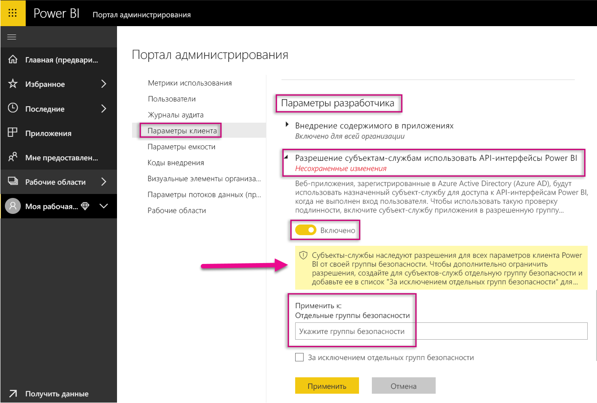
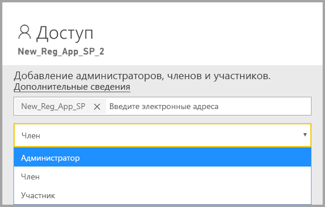
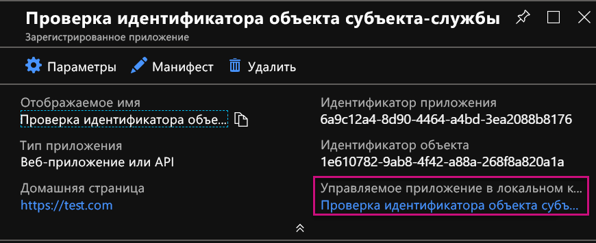
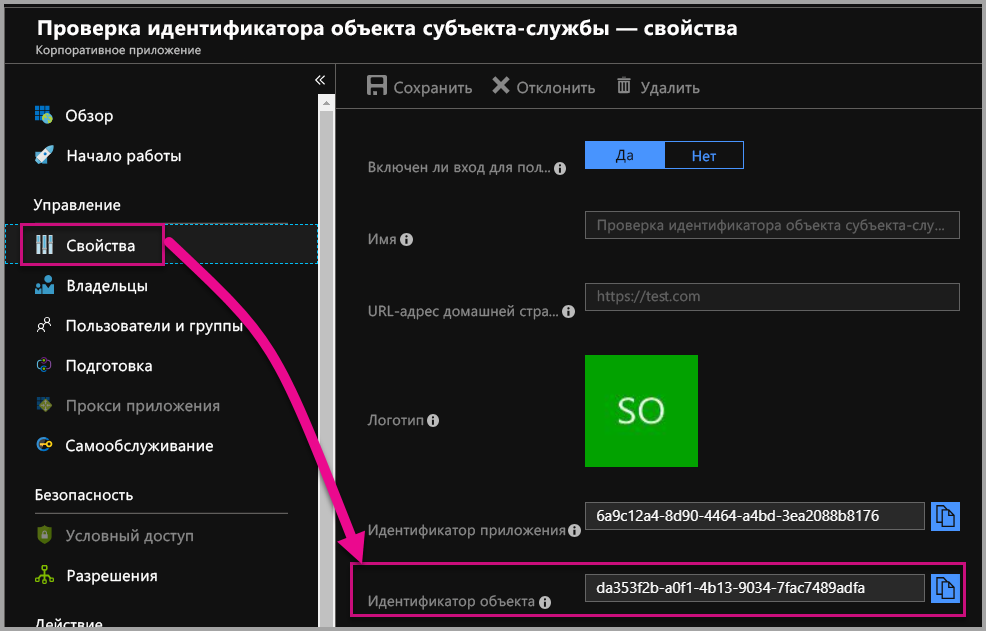

# <a name="service-principal-with-power-bi"></a>Использование субъекта-службы с Power BI

**Субъект-служба** позволяет внедрять содержимое Power BI в приложение и использовать средства автоматизации в Power BI с помощью токена **только для приложения**. Субъект-службу целесообразно использовать при работе с **Power BI Embedded** или **автоматизации задач и процессов Power BI**.

Использование субъекта-службы дает ряд преимуществ при работе с Power BI Embedded. Важнейшее преимущество в том, что для прохождения проверки подлинности в приложении вам не нужна главная учетная запись (лицензия Power BI Pro, то есть попросту имя пользователя и пароль для входа). При использовании субъекта-службы для проверки подлинности в приложении применяются идентификатор приложения и секрет приложения.

При автоматизации задач Power BI можно создать скрипт для обработки субъектов-служб и управления ими.

## <a name="application-and-service-principal-relationship"></a>Взаимосвязь между приложением и субъектом-службой

При доступе к защищенным ресурсам клиента Azure AD сущность, которой требуется доступ, представляется субъектом безопасности. Это верно в отношении как пользователей (субъектов-пользователей), так и приложений (субъектов-служб).

Субъект безопасности определяет политику доступа и разрешения для пользователей и приложений в клиенте Azure AD. Политика доступа обеспечивает ряд базовых функций, таких как проверка подлинности пользователей и приложений во время входа в систему и авторизация доступа к ресурсам. Дополнительные сведения см. в статье [Объекты приложения и субъекта-службы в Azure Active Directory](https://docs.microsoft.com/azure/active-directory/develop/app-objects-and-service-principals).

При регистрации приложения Azure AD на портале Azure в клиенте Azure AD создаются два объекта:

* [объект приложения](https://docs.microsoft.com/azure/active-directory/develop/app-objects-and-service-principals#application-object);
* [объект субъекта-службы](https://docs.microsoft.com/azure/active-directory/develop/app-objects-and-service-principals#service-principal-object).

Объект приложения можно рассматривать как *глобальное* представление приложения для всех клиентов, а объект субъекта-службы — как *локальное* представление для конкретного клиента.

Объект приложения служит шаблоном, из которого *берутся* общие свойства и свойства по умолчанию при создании соответствующих объектов субъектов-служб.

Для каждого клиента, в котором используется приложение, требуется один субъект-служба, который применяется как удостоверение для входа и доступа к защищенным ресурсам клиента. Приложение для одного клиента имеет только один субъект-службу (в домашнем клиенте), который создается и утверждается для использования во время регистрации приложения.

## <a name="service-principal-with-power-bi-embedded"></a>Использование субъекта-службы с Power BI Embedded

Субъект-служба позволяет маскировать данные главной учетной записи в приложении посредством идентификатора и секрета приложения. Для проверки подлинности больше не нужно встраивать главную учетную запись в приложение.

Так как **интерфейсы API Power BI** и **пакет SDK .NET для Power BI** теперь поддерживают вызовы с использованием субъекта-службы, вы можете использовать [REST API в Power BI](https://docs.microsoft.com/rest/api/power-bi/) с субъектом-службой. Так, вы можете вносить изменения в рабочие области, например создавать их, добавлять пользователей в рабочие области или удалять пользователей из них, а также импортировать содержимое в рабочие области.

Субъект-службу можно использовать, только если артефакты и ресурсы Power BI хранятся в [новой рабочей области Power BI](../service-create-the-new-workspaces.md).

## <a name="service-principal-vs-master-account"></a>Субъект-служба и главная учетная запись

Субъект-служба и стандартная главная учетная запись (с лицензией Power BI Pro) используются для проверки подлинности по-разному. В таблице ниже представлены некоторые важные различия.

| функцию | Главная учетная запись пользователя <br> (лицензия Power BI Pro) | Субъект-служба <br> (токен только для приложения) |
|------------------------------------------------------|---------------------|-------------------|
| Позволяет входить в службу Power BI  | Да | Нет |
| Поддерживается на портале администрирования Power BI | Нет | Да |
| [Поддерживает рабочие области (версия 1)](../service-create-workspaces.md) | Да | Нет |
| [Поддерживает новые рабочие области (версия 2)](../service-create-the-new-workspaces.md) | Да | Да |
| При использовании с Power BI Embedded требуются права администратора рабочей области | Да | Да |
| Может использовать REST API в Power BI | Да | Да |
| Для создания требуются права глобального администратора | Да | Нет |
| Позволяет установить локальный шлюз данных и управлять им | Да | Нет |

## <a name="get-started-with-a-service-principal"></a>Начало работы с субъектом-службой

Настройка субъекта-службы (токена только для приложения) для использования отличается от традиционной настройки главной учетной записи. Сначала нужно правильно настроить среду.

1. [Зарегистрируйте веб-приложение на стороне сервера](register-app.md) в Azure Active Directory (AAD) для использования с Power BI. После регистрации приложения можно получить идентификатор приложения, секрет приложения и идентификатор объекта субъекта-службы для доступа к содержимому Power BI. Создать субъект-службу можно с помощью [PowerShell](https://docs.microsoft.com/powershell/azure/create-azure-service-principal-azureps?view=azps-1.1.0).

    Ниже представлен пример скрипта для создания приложения Azure Active Directory.

    ```powershell
    # The app id - $app.appid
    # The service principal object id - $sp.objectId
    # The app key - $key.value

    # Sign in as a user that is allowed to create an app.
    Connect-AzureAD

    # Create a new AAD web application
    $app = New-AzureADApplication -DisplayName "testApp1" -Homepage "https://localhost:44322" -ReplyUrls "https://localhost:44322"

    # Creates a service principal
    $sp = New-AzureADServicePrincipal -AppId $app.AppId

    # Get the service principal key.
    $key = New-AzureADServicePrincipalPasswordCredential -ObjectId $sp.ObjectId
    ```

   > [!Important]
   > После активации субъекта-службы для использования с Power BI разрешения приложения в Active Directory перестают действовать. В дальнейшем управление разрешениями приложения осуществляется на портале администрирования Power BI.

2.  **Рекомендуется**: создайте [группу безопасности в Azure Active Directory (AAD)](https://docs.microsoft.com/azure/active-directory/fundamentals/active-directory-groups-create-azure-portal) и добавьте в нее созданное приложение. Создать группу безопасности AAD можно с помощью [PowerShell](https://docs.microsoft.com/powershell/azure/create-azure-service-principal-azureps?view=azps-1.1.0).

    Ниже представлен пример скрипта для создания группы безопасности и добавления приложения в нее.

    ```powershell
    # Required to sign in as a tenant admin
    Connect-AzureAD

    # Create an AAD security group
    $group = New-AzureADGroup -DisplayName <Group display name> -SecurityEnabled $true -MailEnabled $false -MailNickName notSet

    # Add the service principal to the group
    Add-AzureADGroupMember -ObjectId $($group.ObjectId) -RefObjectId $($sp.ObjectId)
    ```

3. Администратору Power BI необходимо включить субъект-службу в **параметрах разработчика** на портале администрирования Power BI. Добавьте группу безопасности, созданную в Azure AD, в раздел отдельных групп безопасности на странице **Параметры разработчика**. Вы также можете включить доступ к субъекту-службе для всей организации. В этом случае шаг 2 не требуется.

   > [!Important]
   > Субъекты-службы имеют доступ к любым параметрам клиента, включенным для всей организации или для групп безопасности, в состав которых входят эти субъекты. Чтобы ограничить доступ субъекта-службы к конкретным параметрам клиентов, предоставьте ему доступ только к определенным группам безопасности либо создайте выделенную группу безопасности для субъектов-служб, а затем исключите ее.

    

4. Настройте [рабочую среду Power BI](embed-sample-for-customers.md#set-up-your-power-bi-environment).

5. Добавьте субъект-службу в качестве **администратора** в созданную рабочую область. Эту задачу можно выполнить с помощью [интерфейсов API](https://docs.microsoft.com/rest/api/power-bi/groups/addgroupuser) или службы Power BI.

    

6. Теперь вы можете внедрить содержимое в пример приложения или в собственное приложение.

    * [Внедрение содержимого с помощью примера приложения](embed-sample-for-customers.md#embed-content-using-the-sample-application)
    * [Внедрение содержимого в приложении](embed-sample-for-customers.md#embed-content-within-your-application)

7. Теперь вы готовы к [миграции в рабочую среду](embed-sample-for-customers.md#move-to-production).

## <a name="migrate-to-service-principal"></a>Переход на использование субъекта-службы

Если в настоящее время с Power BI или Power BI Embedded используется главная учетная запись, то вы можете перейти на использование субъекта-службы.

Выполните первые три шага в разделе [Начало работы с субъектом-службой](#get-started-with-a-service-principal), а затем следуйте приведенным ниже инструкциям.

Если вы уже используете [новые рабочие области](../service-create-the-new-workspaces.md) в Power BI, добавьте субъект-службу в качестве **администратора** в рабочие области с артефактами Power BI. Однако если вы используете [обычные рабочие области](../service-create-workspaces.md), необходимо сначала скопировать или переместить артефакты и ресурсы Power BI в новые рабочие области и только потом добавить в них субъект-службу в качестве **администратора**.

В пользовательском интерфейсе нет функций для переноса артефактов и ресурсов Power BI из одной рабочей области в другую, поэтому для выполнения этой задачи следует использовать [интерфейсы API](https://powerbi.microsoft.com/pt-br/blog/duplicate-workspaces-using-the-power-bi-rest-apis-a-step-by-step-tutorial/). При использовании интерфейсов API с субъектом-службой требуется идентификатор объекта субъекта-службы.

### <a name="how-to-get-the-service-principal-object-id"></a>Получение идентификатора объекта субъекта-службы

Для назначения субъекта-службы новой рабочей области используются [REST API в Power BI](https://docs.microsoft.com/rest/api/power-bi/groups/addgroupuser). При выполнении операций с субъектом-службой или внесении изменений в него, например добавлении субъекта-службы в качестве администратора в рабочую область, на него необходимо ссылаться по **идентификатору объекта субъекта-службы**.

Ниже приводятся инструкции по получению идентификатора объекта субъекта-службы на портале Azure.

1. На портале Azure создайте регистрацию приложения.  

2. Затем в разделе **Управляемое приложение в локальном каталоге** выберите имя созданного приложения.

   

    > [!Note]
    > Идентификатор объекта на снимке экрана выше — это не тот идентификатор, который используется для субъекта-службы.

3. Чтобы увидеть идентификатор объекта, выберите категорию **Свойства**.

    

Ниже приведен пример скрипта для получения идентификатора объекта субъекта-службы с помощью PowerShell.

   ```powershell
   Get-AzureADServicePrincipal -Filter "DisplayName eq '<application name>'"
   ```

## <a name="considerations-and-limitations"></a>Рекомендации и ограничения

* Субъекты-службы работают только с [новыми рабочими областями](../service-create-the-new-workspaces.md).
* **Моя рабочая область** не поддерживается при использовании субъекта-службы.
* Для миграции в рабочую среду требуется выделенная емкость.
* С помощью субъекта-службы нельзя входить на портал Power BI.
* Для включения субъекта-службы в параметрах разработчика на портале администрирования Power BI требуются права администратора Power BI.
* С помощью субъекта-службы нельзя установить локальный шлюз данных и управлять им.
* [Внедренные для организации](embed-sample-for-your-organization.md) приложения не могут использовать субъект-службу.
* Управление [потоками данных](../service-dataflows-overview.md) не поддерживается.
* Сейчас субъект-служба не поддерживает никакие API администратора.

## <a name="next-steps"></a>Дальнейшие действия

* [Регистрация приложения](register-app.md)
* [Power BI Embedded для клиентов](embed-sample-for-customers.md)
* [Объекты приложения и субъекта-службы в Azure Active Directory](https://docs.microsoft.com/azure/active-directory/develop/app-objects-and-service-principals)
* [Безопасность на уровне строк с использованием локального шлюза данных с субъектом-службой](embedded-row-level-security.md#on-premises-data-gateway-with-service-principal)
