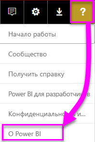
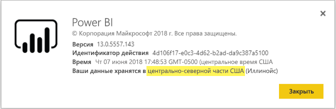

# <a name="frequently-asked-questions-about-power-bi-embedded"></a>Часто задаваемые вопросы о Power BI Embedded

* Если у вас возникли другие вопросы, [задайте их участникам сообщества Power BI](http://community.powerbi.com/).
* Проблема до сих пор не устранена? Посетите [страницу поддержки по Power BI](https://powerbi.microsoft.com/support/).

## <a name="general"></a>Общий

### <a name="what-is-power-bi-embedded"></a>Что такое Power BI Embedded?

Microsoft Power BI Embedded (PBIE) позволяет разработчикам приложений внедрять впечатляющие, полностью интерактивные отчеты в приложения, не тратя время и деньги на создание собственных визуализаций данных и элементов управления с нуля.

### <a name="who-is-the-target-audience-for-power-bi-embedded"></a>Какова целевая аудитория службы Power BI Embedded?

Разработчики и компании, которые создают собственные приложения, называются независимыми поставщиками программного обеспечения.

### <a name="how-is-power-bi-embedded-different-from-power-bi-the-service"></a>Чем Power BI Embedded отличается от службы Power BI?

Служба Power BI Embedded предназначена для независимых поставщиков ПО и разработчиков, которые создают приложения и хотят внедрять в них визуальные элементы, чтобы помочь клиентам решать свои задачи, не создавая средства аналитики с нуля. Встроенные средства аналитики позволяют бизнес-пользователям получать доступ к бизнес-данным и выполнять запросы на формирование аналитических сведений на основе этих данных в приложении.

Power BI, в свою очередь, представляет собой решение SaaS (программное обеспечение как услуга) для аналитики, которое предоставляет организациям единое представление их критически важных бизнес-данных.

### <a name="what-is-the-difference-between-power-bi-premium-and-power-bi-embedded"></a>В чем разница между Power BI Premium и Power BI Embedded?

Power BI Premium — это комплексное решение бизнес-аналитики для предприятий, которое обеспечивает единое представление данных организации, сведений о партнерах, клиентах и поставщиках. Power BI Premium помогает организациям в принятии решений. Power BI Premium — это продукт SaaS, с помощью которого пользователи могут работать с содержимым через портал Power BI, мобильное приложение и приложения, разработанные в компании.

Служба Power BI Embedded предназначена для независимых поставщиков ПО и разработчиков, которые создают приложения и хотят внедрить в них визуальные элементы. Power BI Embedded помогает клиентам принимать решения. Так как эта служба создана для разработчиков приложений, пользователи этих приложений, как в организации, так и за ее пределами, могут работать с содержимым, хранящимся в емкости Power BI Embedded. К такому содержимому невозможно предоставить общий доступ, опубликовав его Интернете или на сайте SharePoint одним щелчком, и для него не поддерживаются отчеты SSRS.

### <a name="what-is-the-microsoft-recommendation-for-when-a-customer-should-buy-power-bi-premium-vs-power-bi-embedded"></a>В каких случаях корпорация Майкрософт рекомендует покупать Power BI Premium, а в каких — Power BI Embedded?

Корпорация Майкрософт рекомендует организациям покупать корпоративное облачное решение для самостоятельной бизнес-аналитики Power BI Premium, а независимым поставщикам ПО — облачное решение Power BI Embedded со встроенными компонентами аналитики. Тем не менее, клиенты не ограничены в выборе продукта.

Возможно, в некоторых случаях независимым поставщикам ПО (как правило, крупным) потребуется номер SKU P, чтобы получить дополнительные возможности предварительно упакованной службы Power BI для своей организации и внедрить их в приложения. Конечно же, некоторые предприятия могут решить использовать номера SKU A в Azure, если они собираются только создавать бизнес-приложения и внедрять в них средства аналитики, но при этом они не заинтересованы использовать предварительно упакованную службу Power BI.

### <a name="how-many-embed-tokens-can-i-create"></a>Сколько можно создать токенов внедрения?

Токены внедрения с лицензией PRO предназначены для разработки и тестирования при разработке, поэтому количество таких токенов, создаваемых главной учетной записью Power BI, ограничено. Необходимо [приобрести емкость](#technical), чтобы иметь возможность внедрения в рабочей среде. В этом случае количество создаваемых токенов внедрения не ограничено. Выберите [Доступные компоненты](https://docs.microsoft.com/rest/api/power-bi/availablefeatures), чтобы проверить данные по использованию Embedded, выраженные в процентах от общей емкости.

## <a name="technical"></a>Технические вопросы

### <a name="what-is-the-difference-between-the-a-skus-in-azure-and-the-em-skus-in-office-365"></a>В чем разница между номерами SKU A в Azure и SKU EM в Office 365?

PowerBI.com — это корпоративное решение, которое содержит множество возможностей, например совместная работа пользователей, подписки по электронной почте и т. д., в рамках предложения SaaS.

Power BI Embedded — это набор интерфейсов API, позволяющих разработчикам создавать внедряемые решения для аналитики, в рамках предложения PaaS (платформа как услуга). В сценариях внедрения средств аналитики независимые поставщики ПО и разработчики могут использовать PowerBI.com, чтобы управлять содержимым внедренных решений для аналитики и настройками на уровне клиента.

Ниже приведен неполный список различий между функциями, используемыми в решениях.

| Избранное | Power BI Embedded | Емкость Power BI Premium | Емкость Power BI Premium |
|----------------------------------------------------------------------------------|-------------------|---------------------------|---------------------------|
|   | (Номера SKU A) | (Номера SKU EM) | (Номера SKU P) |
| Внедрение артефактов из рабочих областей приложения Power BI | Емкость Azure | Емкость Office 365 | Емкость Office 365 |
| Использование отчетов Power BI во внедренном приложении | Да | Да | Да |
| Использование отчетов Power BI в SharePoint | Нет | Да | Да |
| Использование отчетов Power BI в Dynamics | Нет | Да | Да |
| Использование отчетов Power BI в Teams (за исключением мобильного приложения) | Нет | Да | Да |
| Доступ к содержимому с бесплатной лицензией Power BI на Powerbi.com и в Power BI Mobile | Нет | Нет | Да |
| Доступ к содержимому с бесплатной лицензией Power BI в приложениях MS Office | Нет | Да | Да |

### <a name="power-bi-now-offers-three-skus-for-embedding-a-skus-em-skus-and-p-skus-which-one-should-i-purchase-for-my-scenario"></a>Сейчас в Power BI предлагается три типа номеров SKU для внедрения: SKU A, SKU EM и SKU P. Какой из них следует приобрести в моем случае?

|  |SKU A (Power BI Embedded)  |SKU EM (Power BI Premium)  |SKU P (Power BI Premium)  |
|---------|---------|---------|---------|
|Купить  |Портал Azure |Office |Office |
|Варианты использования | Внедрение содержимого в собственное приложение | <li> Внедрение содержимого в собственное приложение <br><br></br> <li> Внедрение содержимого в приложения MS Office: <br> - [SharePoint](https://powerbi.microsoft.com/blog/integrate-power-bi-reports-in-sharepoint-online/) <br> - [Teams (за исключением мобильного приложения)](https://powerbi.microsoft.com/blog/power-bi-teams-up-with-microsoft-teams/) <br> - [Dynamics 365](https://docs.microsoft.com/en-us/dynamics365/customer-engagement/basics/add-edit-power-bi-visualizations-dashboard) | <li> Внедрение содержимого в собственное приложение <br><br></br> <li> Внедрение содержимого в приложения MS Office: <br> - [SharePoint](https://powerbi.microsoft.com/blog/integrate-power-bi-reports-in-sharepoint-online/) <br> - [Teams (за исключением мобильного приложения)](https://powerbi.microsoft.com/blog/power-bi-teams-up-with-microsoft-teams/) <br> - [Dynamics 365](https://docs.microsoft.com/en-us/dynamics365/customer-engagement/basics/add-edit-power-bi-visualizations-dashboard) <br><br></br> <li> Предоставление общего доступа к содержимому пользователям Power BI через [службу Power BI](https://powerbi.microsoft.com/en-us/)  |
|Выставление счетов |Каждый час |Ежемесячно |Ежемесячно |
|Обязательство  |Никаких обязательств |Ежегодно  |Ежемесячно или ежегодно |
|Отличия |Полная гибкость — масштабируемость, приостановление и возобновление использования ресурсов на портале Azure или с помощью API  |Можно использовать для внедрения содержимого в SharePoint Online и Microsoft Teams (за исключением мобильного приложения) |Объединение возможности внедрения в приложение и использования службы Power BI в одной емкости |

### <a name="what-are-the-prerequisites-to-create-a-pbie-capacity-in-azure"></a>Что необходимо для создания емкости PBIE в Azure? 

* Необходим вход в каталог организации (учетные записи MSA не поддерживаются).
* Необходим клиент Power BI, т. е. как минимум один пользователь в вашем каталоге должен зарегистрироваться в Power BI. 
* Необходимо иметь подписку Azure в каталоге организации.

### <a name="how-can-i-monitor-capacity-consumption"></a>Как отслеживать использование емкости?

Мы планируем добавить возможность мониторинга с помощью Azure в ближайшем будущем. Служба Power BI Embedded как ресурс Azure будет включать мониторинг ключевых показателей эффективности, которые будут отражать состояние работоспособности и использование.

### <a name="will-my-capacity-scale-automatically-to-adjust-to-the-consumption-of-my-app"></a>Будет ли емкость автоматически масштабироваться в соответствии с использованием моего приложения?

Автоматическое масштабирование сейчас не поддерживается, но все интерфейсы API доступны для масштабирования.

### <a name="why-creatingscalingresuming-a-capacity-results-in-putting-the-capacity-into-a-suspended-state"></a>Почему создание, масштабирование и возобновление емкости приводит к переводу емкости в приостановленное состояние?

Подготовка емкости (при масштабировании, возобновлении, создании) может завершиться сбоем. Вызывающий объект вызова подготовки должен проверять состояние подготовки емкости с помощью API получения сведений: [Емкость -> Получить сведения](https://docs.microsoft.com/rest/api/power-bi-embedded/capacities/getdetails).

### <a name="why-can-i-only-create-pbie-in-a-specific-region"></a>Почему можно создать PBIE только в определенном регионе?

Емкости PBIE можно создавать только для региона вашего клиента PBI.

### <a name="how-can-i-find-what-is-my-pbi-tenant-region"></a>Как узнать свой регион клиента PBI?

Чтобы узнать регион клиента PBI, можно использовать портал PBI.

https://app.powerbi.com/ > ? > О Power BI




### <a name="what-is-supported-with-the-communicating-sequential-processes-csp-channel"></a>Какие действия поддерживаются для канала взаимодействующих последовательных процессов (CSP)?

* Вы можете создать PBIE для вашего клиента с типом подписки CSP.
* Пользователь с партнерской учетной записью может войти в клиент заказчика и приобрести PBIE для этого клиента, указав пользователя клиента заказчика в качестве администратора емкости Power BI.

### <a name="why-do-i-get-an-unsupported-account-message"></a>Почему я получаю сообщение о неподдерживаемой учетной записи?

Регистрация в Power BI подразумевает использование корпоративной учетной записи. Регистрация в Power BI с помощью учетной записи Майкрософт не поддерживается.

### <a name="can-i-use-apis-to-create--manage-azure-capacities"></a>Можно ли использовать API для создания емкостей Azure и управления ими?

Да, существуют командлеты PowerShell и API-интерфейсы Azure Resource Manager (ARM), которые можно использовать для создания ресурсов PBIE и управления ими.

* REST API — https://docs.microsoft.com/rest/api/power-bi-embedded/
* Командлеты PowerShell — https://docs.microsoft.com/powershell/module/azurerm.powerbiembedded/

### <a name="what-is-the-pbi-embedded-dedicated-capacity-role-in-a-pbi-embedded-solution"></a>Что такое роль выделенной емкости PBI Embedded в решении PBI Embedded?

Чтобы [перенести решение в рабочую среду](https://docs.microsoft.com/en-us/power-bi/developer/embedding-content#step-3-promote-your-solution-to-production), необходимо, чтобы содержимое Power BI (рабочая область приложения, которую вы используете в приложении) было назначено емкости Power BI Embedded (A SKU).

### <a name="what-are-the-azure-regions-pbi-embedded-is-available"></a>В каких регионах Azure доступен компонент PBI Embedded?

[PAM](https://ecosystemmanager.azurewebsites.net/home) (EcoManager) — см. раздел "Менеджер по наличию продуктов"

Доступные регионы (16 — те же регионы, что и для Power BI)
* США (6) — восточная часть США, восточная часть США 2, центрально-северная часть США, центрально-южная часть США, западная часть США, западная часть США 2
* Европа (2) — северная Европа, западная Европа
* Азиатско-Тихоокеанский регион (2) — юго-восточная Азия, восточная Азия
* Бразилия (1) — южная часть Бразилии
* Япония (1) — восточная Япония
* Австралия (1) — юго-восточная часть Австралии
* Индия (1) — западная Индия
* Канада (1) — центральная Канада
* Великобритания (1) — южная часть Соединенного Королевства

### <a name="what-is-the-authentication-model-for-power-bi-embedded"></a>Какая модель аутентификации используется в Power BI Embedded?

В Power BI Embedded будет по-прежнему использоваться Azure AD для аутентификации главного пользователя (назначенный пользователь с лицензией Power BI Pro) при проверке подлинности приложения в Power BI.

Аутентификацию и авторизацию пользователей приложения реализует независимый поставщик ПО. Он может реализовать собственную модель аутентификации для своих приложений.

Если у вас уже есть клиент Azure AD, вы можете использовать существующий каталог или создать новый клиент Azure AD, чтобы обеспечить безопасность содержимого приложения.

Чтобы получить токен Azure AD, можно использовать одну из библиотек проверки подлинности Azure Active Directory — https://docs.microsoft.com/en-us/azure/active-directory/develop/active-directory-authentication-libraries. Клиентские библиотеки доступны для различных платформ.

### <a name="my-application-already-uses-aad-for-user-authentication-how-can-we-use-this-identity-when-authenticating-to-power-bi-in-a-user-owns-data-scenario"></a>Мое приложение уже использует AAD для проверки подлинности пользователей. Как можно использовать это удостоверение при проверке подлинности в Power BI в сценарии "Данные, принадлежащие пользователю"? 

Это стандартный поток OAuth "от имени" (https://docs.microsoft.com/en-us/azure/active-directory/develop/active-directory-authentication-scenarios#web-application-to-web-api). Для приложения необходимо настроить требование разрешений в службе PowerBI (с обязательными областями). Получив маркер пользователя в приложении, можно просто вызвать AcquireTokenAsync API ADAL, используя маркер доступа пользователя и указав URL-адрес ресурса PowerBI в качестве идентификатора ресурса. Фрагмент кода, показывающий, как это можно сделать, см. ниже:

```csharp
var context = new AD.AuthenticationContext(authorityUrl);
var userAssertion = new AD.UserAssertion(userAccessToken);
var clientAssertion = new AD.ClientAssertionCertificate(MyAppId, MyAppCertificate)
var authenticationResult = await context.AcquireTokenAsync(resourceId, clientAssertion, userAssertion);
```

### <a name="how-is-power-bi-embedded-different-from-other-azure-services"></a>Чем Power BI Embedded отличается от других служб Azure?

Чтобы приобрести Power BI Embedded в Azure, у независимого поставщика ПО или разработчика должна быть учетная запись Power BI. Регион развертывания Power BI Embedded определяется по учетной записи Power BI. Управляйте ресурсом Power BI Embedded в Azure для следующих действий:

* увеличение или уменьшение масштаба;
* добавление администраторов емкости;
* приостановление и возобновление работы службы.

Используйте PowerBI.com, чтобы назначать рабочие области и отменять их назначение для емкости Power BI Embedded.

### <a name="what-deploy-regions-are-supported"></a>Какие регионы развертывания поддерживаются?

Восточная часть США 2, восточная Япония, Западная Европа, западная Индия, западная часть США, западная часть США 2, северная Европа, центрально-северная часть США, центральная Канада, юго-восточная Австралия, Юго-Восточная Азия, центрально-южная часть США, южная Бразилия и южная часть Соединенного Королевства.

### <a name="what-type-of-content-pack-data-can-be-embedded"></a>Какой тип данных пакета содержимого можно внедрять?

**Панели мониторинга** и **плитки**, сформированные из наборов данных в пакете содержимого, *невозможно* внедрить, а полученные аналогичным образом **отчеты** — *можно*.

## <a name="licensing"></a>Лицензирование

### <a name="how-do-i-purchase-power-bi-embedded"></a>Как приобрести Power BI Embedded?

Служба Power BI Embedded доступна в Azure.

### <a name="what-happens-if-i-already-purchased-power-bi-premium-and-now-i-want-some-of-the-benefits-of-power-bi-embedded-in-azure"></a>Что если решение Power BI Premium уже приобретено и я хочу воспользоваться некоторыми преимуществами Power BI Embedded в Azure?

Клиенты будут продолжать оплачивать все существующие покупки Power BI Premium до завершения срока текущего соглашения. По истечении срока клиенты смогут перенести покупки Power BI Premium, если будет такая необходимость на тот момент.

### <a name="do-i-still-have-to-buy-power-bi-premium-to-get-access-to-power-bi-embedded"></a>Требуется ли приобрести Power BI Premium, чтобы получить доступ к Power BI Embedded?

Нет. Power BI Embedded включает в себя емкость Azure, которая требуется для развертывания и распространения решений для клиентов.

### <a name="whats-the-purchase-commitment-for-power-bi-embedded"></a>Какие существуют обязательства по приобретению Power BI Embedded? 

Пользователи могут изменять способ использования на почасовой основе. Для службы Power BI Embedded нет ежегодного или ежемесячного обязательства.

### <a name="how-does-the-usage-of-power-bi-embedded-show-up-on-my-bill"></a>Как плата за использование Power BI Embedded отражается в счете?

Плата за использование Power BI Embedded предусматривает прогнозируемую почасовую тарификацию с учетом типа развернутых узлов. Обратите внимание, что если ресурс активен, вам будет выставляться счет за него, даже если ресурс не используется. Чтобы прекратить выставление счетов, необходимо приостановить работу ресурса.

### <a name="who-needs-a-power-bi-pro-license-for-power-bi-embedded-and-why"></a>Кому требуется лицензия Power BI Pro для Power BI Embedded и почему?

Лицензия Power BI Pro требуется любому аналитику, который должен добавлять отчеты в рабочую область Power BI, любому разработчику, который должен использовать интерфейсы REST API, любому администратору клиента, который должен управлять клиентом Power BI и емкостью.

Так как Power BI Embedded позволяет использовать портал Power BI для управления и проверки внедренного содержимого, лицензия Power BI Pro требуется для аутентификации приложения на сайте PowerBI.com, чтобы получить доступ к отчетам в нужных репозиториях.

Однако для [создания или изменения внедренных отчетов](https://github.com/Microsoft/PowerBI-JavaScript/wiki/Create-Report-in-Embed-View) внутри собственного приложения конечному пользователю не требуется лицензия Pro, как ему вообще необязательно быть пользователем Power BI.

### <a name="can-i-get-started-for-free"></a>Можно ли начать работу бесплатно?

Да, вы можете использовать [деньги на счете в Azure](https://azure.microsoft.com/free/) для Power BI Embedded.

### <a name="can-i-get-a-trial-experience-for-power-bi-embedded-in-azure"></a>Можно ли получить пробную версию Power BI Embedded в Azure?

Так как Power BI Embedded является частью Azure вы можете приобрести эту службу за [200 $, полученных при регистрации в Azure](https://azure.microsoft.com/free/).

### <a name="is-power-bi-embedded-available-for-sovereign-clouds-us-government-germany-china"></a>Доступна ли службы Power BI Embedded в национальных облаках (для государственных организаций США, Германии и Китая)?

Служба Power BI Embedded доступна в некоторых [национальных облаках](embed-sample-for-customers-sovereign-clouds.md). Она все еще **НЕДОСТУПНА** в Китае.

### <a name="is-power-bi-embedded-available-for-non-profits-and-educational"></a>Будет ли Power BI Embedded доступна для некоммерческих и образовательных организаций?

Некоммерческие и образовательные организации смогут приобрести подписку Azure. Для клиентов такой категории нет специальных цен в Azure.

## <a name="power-bi-workspace-collection"></a>Коллекция рабочих областей Power BI

### <a name="what-is-power-bi-workspace-collection"></a>Что такое коллекция рабочих областей Power BI?

**Коллекция рабочих областей Power BI** (**Power BI Embedded** версии 1) — это решение на основе ресурса Azure **Коллекция рабочих областей Power BI**. Это решение позволяет создавать приложения **Power BI Embedded** для предоставления клиентам содержимого Power BI, размещенного в решении **Коллекция рабочих областей Power BI** с помощью специальных интерфейсов API и ключей рабочей области для проверки подлинности приложения в Power BI.

### <a name="can-i-migrate-from-power-bi-workspace-collection-to-power-bi-embedded"></a>Можно ли перенести содержимое из коллекции рабочих областей Power BI в Power BI Embedded?

1. Средство миграции позволяет клонировать содержимое из **коллекции рабочих областей Power BI** в Power BI — https://docs.microsoft.com/power-bi/developer/migrate-from-powerbi-embedded#content-migration.

2. Для начала примените POC-приложение **Power BI Embedded**, которое использует содержимое Power BI.

3. Когда вы будете готовы перейти в рабочую среду, приобретите выделенную емкость **Power BI Embedded** и назначьте ей определенное содержимое (рабочую область) Power BI.

> [!Note]
> Вы можете продолжать работу с **коллекцией рабочих областей Power BI** параллельно с созданием решения **Power BI Embedded**. Когда вы будете полностью готовы, перенесите данные клиента в новое решение **Power BI Embedded** и прекратите использовать решение **Коллекция рабочих областей Power BI**.

Дополнительные сведения см. в статье [о переносе содержимого из коллекции рабочих областей Power BI в Power BI Embedded](https://docs.microsoft.com/power-bi/developer/migrate-from-powerbi-embedded).

### <a name="is-power-bi-workspace-collection-on-a-path-to-be-deprecated"></a>Правда ли, что коллекция рабочих областей Power BI скоро будет считаться нерекомендуемой?

Да, это так, но клиенты могут продолжать работу с решением **Коллекция рабочих областей Power BI**, пока оно не станет нерекомендуемым. Клиенты даже могут создавать новые коллекции рабочих областей и приложения **Power BI Embedded**, использующие решения на основе **коллекций рабочих областей Power BI**.

Но это также означает, что новые функции уже не добавляются в **коллекции рабочих областей Power BI**, и мы рекомендуем всем пользователям запланировать миграцию решений на платформу **Power BI Embedded**.
### <a name="when-will-power-bi-workspace-collection-support-be-discontinued"></a>Когда будет прекращена поддержка коллекции рабочих областей Power BI?

Клиенты, которые используют решения на основе **коллекций рабочих областей Power BI**, могут продолжать работу с ними до конца июня 2018 года или до конца текущего соглашения на поддержку.

### <a name="in-what-regions-can-pbi-workspace-collection-be-created"></a>В каких регионах можно создать коллекцию рабочих областей Power BI?

Это решение доступно в следующих регионах: восточная часть США 2, восточная Япония, Западная Европа, западная Индия, западная часть США, северная Европа, центрально-северная часть США, центральная Канада, юго-восточная Австралия, Юго-Восточная Азия, центрально-южная часть США, южная Бразилия и южная часть Соединенного Королевства.

### <a name="why-should-i-migrate-from-pbi-workspace-collection-to-power-bi-embedded"></a>Зачем мне переносить содержимое из коллекции рабочих областей Power BI в Power BI Embedded?

В решение **Power BI Embedded** добавлены новые функции и возможности, которые недоступны в **коллекции рабочих областей Power BI**.

Вот лишь некоторые из них:
* поддержка всех источников данных Power BI, а не только двух стандартных источников для **коллекции рабочих областей Power BI**; 
* Новые функции, такие как вопросы и ответы, обновление, закладки, внедрение информационных панелей и плиток, а также пользовательские меню поддерживаются только в решении **Power BI Embedded**.
* модель выставления счетов по емкости.

## <a name="onboarding-experience-tool-for-embedding"></a>Средство подключения для внедрения

### <a name="what-is-the-onboarding-experience-tool"></a>Что такое средство подключения для внедрения?

[Средство подключения для внедрения](https://aka.ms/embedsetup) позволяет быстро приступить к работе и скачать образец приложения, чтобы начать внедрение в Power BI.

### <a name="which-solution-should-i-choose"></a>Какое решение выбрать?

* [Внедрение для клиентов](embedding.md#embedding-for-your-customers) позволяет внедрять панели мониторинга и отчеты для пользователей, у которых нет учетной записи Power BI. Запустите решение [Внедрение для клиентов](https://aka.ms/embedsetup/AppOwnsData).
* [Внедрение для организации](embedding.md#embedding-for-your-organization) позволяет расширить возможности службы Power BI. Запустите решение [Внедрение для организации](https://aka.ms/embedsetup/UserOwnsData).

### <a name="ive-downloaded-the-sample-app-which-solution-do-i-choose"></a>Образец приложения скачан. Какое решение выбрать?

Если вы работаете с решением **Внедрение для клиентов**, сохраните и распакуйте файл *PowerBI-Developer-Samples.zip*. Затем откройте папку *PowerBI-Developer-Samples-master\App Owns Data* и запустите файл *PowerBIEmbedded_AppOwnsData.sln*.

Если вы работаете с решением **Внедрение для организации**, сохраните и распакуйте файл *PowerBI-Developer-Samples.zip*. Затем откройте папку *PowerBI-Developer-Samples-master\User Owns Data\integrate-report-web-app* и запустите файл *pbi-saas-embed-report.sln*.

### <a name="how-can-i-edit-my-registered-application"></a>Как изменить зарегистрированное приложение?

Узнать, как изменять зарегистрированные в Azure AD приложения, можно [здесь](https://docs.microsoft.com/azure/active-directory/develop/active-directory-integrating-applications#updating-an-application).

### <a name="how-can-i-edit-my-power-bi-user-profile-or-data"></a>Как изменить профиль пользователя или данные Power BI?

Узнать, как изменить данные Power BI, можно [здесь](https://docs.microsoft.com/en-us/power-bi/service-basic-concepts).

См. дополнительные сведения об [устранении неполадок с внедренным приложением](embedded-troubleshoot.md).

Появились дополнительные вопросы? [Ответы на них см. в сообществе Power BI.](http://community.powerbi.com/)
