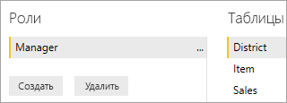
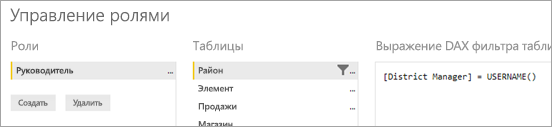
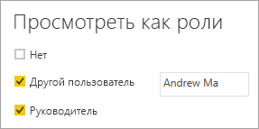

# <a name="use-row-level-security-with-power-bi-embedded-content"></a>Использование безопасности на уровне строк во встроенном содержимом Power BI
Безопасность на уровне строк (RLS) можно использовать для ограничения пользовательского доступа к данным на панели мониторинга и плитках, а также в отчетах и наборах данных. С одними и теми же артефактами могут работать разные пользователи, видя при этом разные данные. Внедрение поддерживает функцию RLS.

Если вы выполняете внедрение для пользователей, не работающих с Power BI (данные принадлежат приложению), что обычно является сценарием ISV, эта статья предназначена именно для вас. Вам понадобится настроить маркер внедрения для учетной записи пользователя и роли. Далее вы узнаете, как это сделать.

При внедрении пользователей Power BI (данные принадлежат пользователю) в своей организации RLS работает также, как и напрямую в службе Power BI. Больше ничего не нужно делать в своем приложении. Дополнительные сведения см. в статье [Безопасность на уровне строк (RLS) в Power BI](../service-admin-rls.md).


Чтобы воспользоваться преимуществами RLS, важно понимать три основных понятия: пользователи, роли и правила. Давайте рассмотрим каждый элемент подробнее.

**Пользователи** — пользователи, просматривающие артефакт (панель мониторинга, плитку, отчет или набор данных). В Power BI Embedded пользователи идентифицируются по свойству имени пользователя в маркере внедрения.

**Роли.** Пользователи принадлежат к различным ролям. Роль — это контейнер для правил и может иметь имя *Менеджер по продажам* или *Торговый представитель*. Роли можно создать в Power BI Desktop. Дополнительные сведения см. в статье [Безопасность на уровне строк (RLS) в Power BI Desktop](../desktop-rls.md).

**Правила.** Роли имеют правила, являющиеся фильтрами, которые будут применяться к данным. Это может быть чем-то простым, например "Страна = США", или чем-то гораздо более динамичным.
Для оставшейся части этой статьи мы предоставим пример создания RLS, а затем его использования во внедренном приложении. В примере используется PBIX-файл с [примером анализа розничной торговли](http://go.microsoft.com/fwlink/?LinkID=780547).


## <a name="adding-roles-with-power-bi-desktop"></a>Добавление ролей с помощью Power BI Desktop
В примере анализа розничной торговли отображаются сведения о продажах во всех магазинах розничной сети. Без RLS будут отображаться те же данные, независимо от того, какой региональный менеджер входит в отчет и просматривает его. Представители высшего руководства решили, что региональный менеджер должен видеть только продажи по магазинам, которыми они управляют. Для этого можно использовать RLS.

RLS создается в Power BI Desktop. При открытии набора данных и отчета можно переключиться в представление схемы для ее просмотра:


Вот несколько моментов, на которые следует обратить внимание в этой схеме:

* Все меры, например **Общий объем продаж**, хранятся в таблице фактов **Продажи**.
* Имеются четыре дополнительные связанные таблицы измерений: **Позиция**, **Время**, **Магазин** и **Округ**.
* Стрелки на линиях связи указывают, каким образом фильтры могут передаваться из одной таблицы в другую. Например, если поместить фильтр к **Time[Date]**, в текущей схеме отфильтруются только значения в таблице **Продажи**. Этот фильтр не повлияет на другие таблицы, так как все стрелки в линиях связи указывают на таблицу продаж.
* В таблице **Округ** представлены сведения о менеджере каждого округа:
  
    

Основываясь на этой схеме, если мы применим фильтр к колонке **Региональный менеджер** в таблице **Округ**, который совпадает с пользователем, просматривающим отчет, то фильтр также отфильтрует таблицы **Магазин** и **Продажи**, чтобы показывать только данные для имеющегося регионального менеджера.

Вот как это сделать.

1. На вкладке **Моделирование** выберите **Управление ролями**.
   
    
2. Создайте роль **Диспетчер**.
   
    
3. В таблице **Округ** введите такое выражение DAX: **[District Manager] = USERNAME()**.
   
    
4. Чтобы убедиться, что правила работают, на вкладке **Моделирование** выберите **Просмотреть как роли**, а затем выберите созданную роль **Менеджер** вместе с ролью **Другой пользователь**. Введите имя **Andrew Ma** для пользователя.
   
    
   
    Теперь в отчете будут отображаться данные, как если бы вы выполнили вход с данными пользователя **Andrew Ma**.

Если применить фильтр таким образом, как это сделали мы, будут отфильтрованы все записи в таблицах **Округ**, **Магазин** и **Продажи**. Однако из-за направления фильтра на связях между таблицами **Продажи** и **Время**, таблицы **Продажи** и **Позиция**, а также **Позиция** и **Время** не будут отфильтрованы. Чтобы узнать больше о двунаправленной перекрестной фильтрации, скачайте технический документ [Bidirectional cross-filtering in SQL Server Analysis Services 2016 and Power BI Desktop](http://download.microsoft.com/download/2/7/8/2782DF95-3E0D-40CD-BFC8-749A2882E109/Bidirectional%20cross-filtering%20in%20Analysis%20Services%202016%20and%20Power%20BI.docx) (Двунаправленная перекрестная фильтрация в SQL Server Analysis Services 2016 и Power BI Desktop).

## <a name="applying-user-and-role-to-an-embed-token"></a>Применение пользователя и роли для маркера внедрения
После настройки ролей Power BI Desktop нужно выполнить ряд действий в приложении, чтобы воспользоваться их преимуществами.

Пользователи проходят проверку подлинности и авторизацию с помощью приложения. Маркеры внедрения используются для предоставления им доступа к конкретным отчетам Power BI Embedded. Power BI Embedded не имеет каких-либо конкретных данных о пользователе. Для работы RLS необходимо передать некоторый дополнительный контекст в маркере внедрения в форме удостоверений. Это можно сделать с помощью API [токена внедрения](https://docs.microsoft.com/rest/api/power-bi/embedtoken).

Он принимает список удостоверений с указанием соответствующих наборов данных. Для работы RLS необходимо передать следующее как часть удостоверения.

* **username (обязательно).** Это строка, которая может использоваться для идентификации пользователя при применении правила RLS. Вы можете указать только одного пользователя.
* **roles (обязательно).** Строка, содержащая роли для выбора при применении правил безопасности на уровне строк. При передаче нескольких ролей их нужно передавать в виде строкового массива.
* **dataset (обязательно).** Это набор данных, предназначенный для внедряемого артефакта. 

Вы можете создать маркер внедрения с помощью метода **GenerateTokenInGroup** в **PowerBIClient.Reports**. 

Например, можно изменить пример [PowerBIEmbedded_AppOwnsData](https://github.com/Microsoft/PowerBI-Developer-Samples/tree/master/App%20Owns%20Data). *Строки 76 и 77 Home\HomeController.cs* можно обновить с:

```
// Generate Embed Token.
var generateTokenRequestParameters = new GenerateTokenRequest(accessLevel: "view");

var tokenResponse = await client.Reports.GenerateTokenInGroupAsync(GroupId, report.Id, generateTokenRequestParameters);
```

на

```
var generateTokenRequestParameters = new GenerateTokenRequest("View", null, identities: new List<EffectiveIdentity> { new EffectiveIdentity(username: "username", roles: new List<string> { "roleA", "roleB" }, datasets: new List<string> { "datasetId" }) });

var tokenResponse = await client.Reports.GenerateTokenInGroupAsync("groupId", "reportId", generateTokenRequestParameters);
```

При вызове REST API обновленный API теперь принимает дополнительный массив JSON с именем **identities**, содержащий имя пользователя, список строковых ролей и список наборов данных строк, например:

```
{
    "accessLevel": "View",
    "identities": [
        {
            "username": "EffectiveIdentity",
            "roles": [ "Role1", "Role2" ],
            "datasets": [ "fe0a1aeb-f6a4-4b27-a2d3-b5df3bb28bdc" ]
        }
    ]
}
```

Теперь, когда все части соединены, когда пользователь войдет в ваше приложение для просмотра этого артефакта, будут отображаться только данные, на просмотр которых у этого пользователя есть разрешение, как это определено безопасностью на уровне строк.

## <a name="working-with-analysis-services-live-connections"></a>Работа с активными подключениями к службам Analysis Services
Безопасность на уровне строк можно использовать с активными подключениями к службам Analysis Services для локальных серверов. При использовании этого типа подключения вы должны учитывать ряд определенных понятий.

Действующее удостоверение, предоставленное для свойства имени пользователя, должно предназначаться для пользователя Windows с разрешениями на сервере служб Analysis Services.

**Настройка локального шлюза данных**

[Локальный шлюз данных](../service-gateway-onprem.md) используется при работе с активными подключениями к Analysis Services. При создании токена внедрения с указанным удостоверением необходимо указать главную учетную запись в качестве учетной записи администратора шлюза. Если главная учетная запись не указана, безопасность на уровне строк не будет правильно применена к данным. Пользователь без прав администратора шлюза может предоставлять роли, но при этом он должен указать свое имя для действующего удостоверения.

**Использование ролей**

Роли могут предоставляться вместе с удостоверением в токене внедрения. Если роль не указана, для разрешения связанных ролей используется указанное имя пользователя.

**Использование функции CustomData**

Функция CustomData позволяет передавать произвольный текст (строку) с помощью свойства строки подключения CustomData; это значение будет использоваться AS (посредством функции CUSTOMDATA()).
Этот способ можно применять как альтернативный способ настройки потребления данных.
Его можно использовать в запросе DAX для ролей или без каких-либо ролей в запросе DAX для мер.
Функция CustomData является частью нашей функции создания токенов для таких артефактов, как панель мониторинга, отчет и плитка. Панели мониторинга могут иметь несколько удостоверений CustomData (по одному на плитку или модель).

> [!NOTE]
> Функция CustomData будет работать только для моделей, которые находятся в Azure Analysis Services, и только в динамическом режиме. В отличие от пользователей и ролей функцию пользовательских данных нельзя задать в PBIX-файле. При создании токена с помощью функции пользовательских данных вы должны иметь имя пользователя.
>
>

**Дополнения пакета SDK CustomData**

Свойство строки CustomData было добавлено в наше действующее удостоверение в сценарии создания токенов.
        
        [JsonProperty(PropertyName = "customData")]
        public string CustomData { get; set; }

Можно создать удостоверение с пользовательскими данными, используя следующий вызов:

        public EffectiveIdentity(string username, IList<string> datasets, IList<string> roles = null, string customData = null);

**Использование пакета SDK CustomData**

При вызове REST API можно добавить пользовательские данные внутри каждого удостоверения, например:

```
{
    "accessLevel": "View",
    "identities": [
        {
            "username": "EffectiveIdentity",
            "roles": [ "Role1", "Role2" ],
            "customData": "MyCustomData",
            "datasets": [ "fe0a1aeb-f6a4-4b27-a2d3-b5df3bb28bdc" ]
        }
    ]
}
```

## <a name="considerations-and-limitations"></a>Рекомендации и ограничения
* Назначение ролей пользователям в службе Power BI не влияет на безопасность на уровне строк при использовании маркера внедрения.
* Хотя служба Power BI не применяет параметр RLS для администраторов и участников с разрешениями на изменение, но при указании удостоверения с маркером внедрения они будут применены к данным.
* Активные подключения к службам Analysis Services поддерживаются для локальных серверов.
* Активные подключения Azure Analysis Services поддерживают фильтрацию по роли и не поддерживают динамическую фильтрацию по имени пользователя. Динамическая фильтрация может осуществляться с помощью CustomData.
* Если для базового набора данных не требуется RLS, запрос GenerateToken **не** должен содержать действующее удостоверение.
* Если базовый набор данных является облачной моделью (кэшированная модель или DirectQuery), действующее удостоверение должно включать хотя бы одну роль, иначе назначение ролей не удастся выполнить.
* Список идентификаторов включает несколько токенов идентификаторов для внедрения панели мониторинга. Для всех других артефактов список содержит один идентификатор.

Появились дополнительные вопросы? [Попробуйте задать вопрос в сообществе Power BI.](https://community.powerbi.com/)
