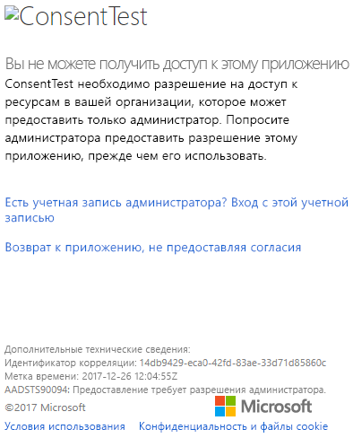
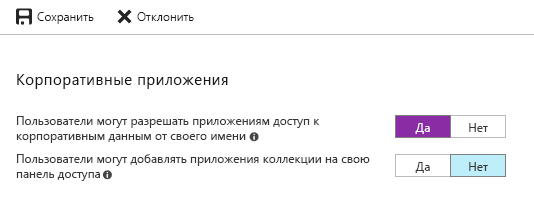

# <a name="troubleshoot-your-embedded-application"></a>Устранение неполадок внедренного приложения

В этой статье описаны распространенные проблемы, с которыми вы можете столкнуться при внедрении содержимого из Power BI.

## <a name="tools-to-troubleshoot"></a>Средства для устранения неполадок

### <a name="fiddler-trace"></a>Трассировка Fiddler

[Fiddler](http://www.telerik.com/fiddler) — это бесплатный инструмент от Telerik, отслеживающий трафик HTTP.  Вы можете просматривать трафик API-интерфейсов Power BI с клиентского компьютера. Это средство позволяет найти ошибки и другие связанные сведения.


### <a name="f12-in-browser-for-front-end-debugging"></a>Отладка интерфейса нажатием клавиши F12 в браузере

При нажатии клавиши F12 запускается окно средства разработки в браузере. Это средство позволяет просмотреть информацию о сетевом трафике и другие сведения.


### <a name="extract-error-details-from-power-bi-response"></a>Извлечение сведений об ошибке из ответа Power BI

В этом фрагменте кода показано, как извлечь сведения об ошибке из HTTP-исключения:

```csharp
public static string GetExceptionText(this HttpOperationException exc)
{
    var errorText = string.Format("Request: {0}\r\nStatus: {1} ({2})\r\nResponse: {3}",
    exc.Request.Content, exc.Response.StatusCode, (int)exc.Response.StatusCode, exc.Response.Content);
    if (exc.Response.Headers.ContainsKey("RequestId"))
    {
        var requestId = exc.Response.Headers["RequestId"].FirstOrDefault();
        errorText += string.Format("\r\nRequestId: {0}", requestId);
    }

    return errorText;
}
```

Рекомендуем вести журнал идентификатора запроса и сведений об ошибках для устранения неполадок.
Укажите идентификатор запроса при обращении в службу поддержки Майкрософт.

## <a name="app-registration"></a>Регистрация приложений

### <a name="app-registration-failure"></a>Сбой регистрации приложения

В сообщениях об ошибках на портале Azure или на странице регистрации приложения в Power BI упоминается о недостаточных правах. Чтобы зарегистрировать приложение, требуются права администратора в клиенте Azure AD или разрешение на регистрацию приложения для пользователей без прав администратора.

### <a name="power-bi-service-doesnt-appear-in-the-azure-portal-when-registering-a-new-app"></a>Служба Power BI не отображается на портале Azure при регистрации нового приложения

В Power BI должен зарегистрироваться по крайней мере один пользователь. Если **служба Power BI** не отображается в списке API, значит в PowerBI нет зарегистрированных пользователей.

## <a name="rest-api"></a>API-интерфейсы REST

### <a name="api-call-returning-401"></a>Вызов API возвращающий ошибку 401

Для дальнейшего анализа может потребоваться захватить трафик с помощью Fiddler. Может отсутствовать необходимая область разрешений для зарегистрированного приложения в Azure AD. Убедитесь, что требуемая область присутствует в зарегистрированном приложении для Azure AD на портале Azure.

### <a name="api-call-returning-403"></a>Вызов API возвращающий ошибку 403

Для дальнейшего анализа может потребоваться захватить трафик с помощью Fiddler. Ошибка 403 может возникнуть по нескольким причинам.

* Пользователь превысил количество внедренных токенов, которые можно создать в общей емкости. Для создания внедренных токенов и назначения рабочей области в этой емкости, приобретите емкости Azure. См. раздел [Создание емкости Power BI Embedded на портале Azure](https://docs.microsoft.com/azure/power-bi-embedded/create-capacity).
* Истек срок действия токена аутентификации Azure AD.
* Пользователь, прошедший проверку подлинности, не входит в группу (рабочую область приложения).
* Пользователь, прошедший проверку подлинности, не является администратором группы (рабочей области приложения).
* Заголовок авторизации может быть указан неправильно. Убедитесь, что он не содержит опечаток.

Возможно, понадобится обновить токен аутентификации в серверной части приложения, прежде чем вызывать GenerateToken.

    ```
    GET https://wabi-us-north-central-redirect.analysis.windows.net/metadata/cluster HTTP/1.1
    Host: wabi-us-north-central-redirect.analysis.windows.net
    ...
    Authorization: Bearer eyJ0eXAiOi...
    ...

    HTTP/1.1 403 Forbidden
    ...

    {"error":{"code":"TokenExpired","message":"Access token has expired, resubmit with a new access token"}}
    ```

## <a name="authentication"></a>Authentication

### <a name="authentication-failed-with-aadsts90002-tenant-authorize-not-found"></a>Сбой проверки подлинности с ошибкой AADSTS90002: Tenant 'authorize' not found (Клиент "авторизовать" не найден)

 Если при входе вы получаете сообщения, такие как ***error: invalid_request, error_description: AADSTS90002: Клиент "авторизовать" не найден***, это происходит из-за того, что ADAL 4.x не поддерживает "https://login.microsoftonline.com/{Tenant}/oauth2/authorize/" как URL-адрес центра.
 
Чтобы устранить эту проблему, следует удалить часть "oauth2/authorize/" в конце URL-адреса центра (дополнительные сведения см. в [примерах для разработчиков Power BI](https://github.com/Microsoft/PowerBI-Developer-Samples)).

 См. раздел [Более эффективная проверка центра](https://github.com/AzureAD/azure-activedirectory-library-for-dotnet/wiki/Changes-adalnet-4.0#better-authority-validation) в заметках о выпуске ADAL 4.x.

### <a name="authentication-failed-with-aadsts70002-or-aadsts50053"></a>Сбой проверки подлинности с ошибкой AADSTS70002 или AADSTS50053

**_(AADSTS70002: ошибка проверки учетных данных. AADSTS50053: слишком много попыток входа с неправильным идентификатором пользователя или паролем)_**

Работая с Power BI Embedded и используя проверку подлинности Azure AD Direct, при входе будете получать такие сообщения, как ***error:unauthorized_client, error_description:AADSTS70002: ошибка проверки учетных данных. AADSTS50053: слишком много попыток входа с неправильным идентификатором пользователя или паролем***, это потому, что прямая проверка подлинности больше не используется с 14 июня 2018 года по умолчанию.

Эту функцию можно включить снова с помощью [Политики Azure AD](https://docs.microsoft.com/azure/active-directory/manage-apps/configure-authentication-for-federated-users-portal#enable-direct-authentication-for-legacy-applications), которая применяется к организации или [субъект-службе](https://docs.microsoft.com/azure/active-directory/develop/active-directory-application-objects#service-principal-object).

Рекомендуется включать эту политику только для отдельных приложений.

Чтобы создать эту политику, вы должны быть **глобальным администратором** для каталога, в котором создается и назначается политика. Ниже приведен пример сценария для создания политики и ее назначения пакету обновления для этого приложения:

1. Установите [модуль PowerShell предварительной версии Azure AD](https://docs.microsoft.com/powershell/azure/active-directory/install-adv2?view=azureadps-2.0).

2. Выполните следующие команды PowerShell, строку за строкой (убедившись, что для переменной $sp в качестве результата не выводится несколько приложений).

```powershell
Connect-AzureAD
```

```powershell
$sp = Get-AzureADServicePrincipal -SearchString "Name_Of_Application"
```

```powershell
$policy = New-AzureADPolicy -Definition @("{`"HomeRealmDiscoveryPolicy`":{`"AllowCloudPasswordValidation`":true}}") -DisplayName EnableDirectAuth -Type HomeRealmDiscoveryPolicy -IsOrganizationDefault $false
```

```powershell
Add-AzureADServicePrincipalPolicy -Id $sp.ObjectId -RefObjectId $policy.Id 
```

Назначив политику, подождите около 15–20 секунд для распространения перед тестированием.

### <a name="generate-token-fails-when-providing-effective-identity"></a>Создание токена завершается неудачей при предоставлении действующего идентификатора

Сбой GenerateToken с предоставленным действующим удостоверением может произойти по нескольким причинам:

* Набор данных не поддерживает действующее удостоверение.
* Не указано имя пользователя.
* Не указана роль.
* Не указано значение для DatasetId.
* У пользователя нет нужных прав.

Выполните приведенные ниже шаги, чтобы узнать причину ошибки.

* Выполните операцию [get dataset](https://docs.microsoft.com/rest/api/power-bi/datasets). Для свойства IsEffectiveIdentityRequired указано значение true?
* Имя пользователя является обязательным для любого свойства EffectiveIdentity.
* Если IsEffectiveIdentityRolesRequired имеет значение true, нужно указать роль.
* DatasetId является обязательным для любого свойства EffectiveIdentity.
* У пользователя Analysis Services должны быть права администратора шлюза.

### <a name="aadsts90094-the-grant-requires-admin-permission"></a>AADSTS90094: предоставление требует разрешения администратора

**_Признаки:_**<br>
Когда пользователь без прав администратора пытается войти в приложение в первый раз при предоставлении согласия, он получает одну из следующих ошибок.

* ConsentTest необходимо разрешение на доступ к ресурсам в вашей организации, которое может предоставить только администратор. Попросите администратора предоставить разрешение этому приложению, прежде чем его использовать.
* AADSTS90094: Предоставление требует разрешения администратора.

    

Пользователь с правами администратора может войти в систему и успешно предоставить разрешение.

**_Основная причина:_**<br>
Согласие пользователя отключено для клиента.

**_Возможно несколько вариантов исправления:_**

*Включение согласия пользователя для всего клиента (все пользователи, все приложения)*

1. На портале Azure перейдите к "Azure Active Directory" => "Пользователи и группы" => "Параметры пользователя".
2. Включите параметр "Пользователи могут разрешать приложениям доступ к корпоративным данным от своего имени", а затем сохраните изменения.

    

*Предоставьте разрешения* для приложения от имени администратора, для одного клиента или для конкретного пользователя.

## <a name="data-sources"></a>Источники данных

### <a name="isv-wants-to-have-different-credentials-for-the-same-data-source"></a>Независимый поставщик программного обеспечения хочет использовать разные учетные данные для одного источника данных

Источник данных может иметь один набор учетных данных для одного главного пользователя. Если необходимо использовать разные учетные данные, создайте дополнительных главных пользователей. Затем назначьте разные учетные данные в каждом контексте главного пользователя и внедрите их, используя токен Azure AD этого пользователя.

## <a name="troubleshoot-your-embedded-application-with-the-ierror-object"></a>Устранение неполадок внедренного приложения с помощью объекта IError

Используйте [**объект IError**, возвращенный при *ошибке* из **пакета SDK для JavaScript**](https://github.com/Microsoft/PowerBI-JavaScript/wiki/Troubleshooting-and-debugging-of-embedded-parts), чтобы отладить приложение и разобраться с причиной ошибок.

Получив объект IError, посмотрите соответствующую таблицу общих ошибок с учетом используемого типа внедрения. Сравните **свойства IError** со свойствами в таблице и найдите возможную причину сбоя.

### <a name="typical-errors-when-embedding-for-power-bi-users"></a>Типичные ошибки при внедрении для пользователей Power BI

| Сообщение | Подробное сообщение | Код ошибки | Возможные причины |
|-------------------------------------------------------|-----------------------------------------------------------------------------------------------------------------------------|-----------|--------------------------------------------------------|
| TokenExpired | Срок действия маркера доступа истек. Выполните повторную отправку, используя новый маркер доступа. | 403 | Истечение срока действия токена  |
| PowerBIEntityNotFound | Сбой при получении отчета | 404 | <li> Неверный идентификатор отчета <li> Отчет не существует  |
| Недопустимые параметры | Параметр powerbiToken не указан | Н/Д | <li> Маркер доступа не указан <li> Идентификатор отчета не указан |
| LoadReportFailed | Сбой инициализации. Не удалось разрешить кластер | 403 | * Недопустимый маркер доступа * Тип внедрения не соответствует типу токена |
| PowerBINotAuthorizedException | Сбой при получении отчета | 401 | <li> Неверный идентификатор группы <li> Неавторизированная группа |
| TokenExpired | Срок действия маркера доступа истек. Выполните повторную отправку, используя новый маркер доступа. Не удалось выполнить рендеринг визуального элемента <visual title> | Н/Д | Срок действия токена для запроса данных истек |
| OpenConnectionError | Не удается отобразить визуальный элемент. Не удалось выполнить рендеринг визуального элемента <visual title> | Н/Д | Емкость была приостановлена или удалена, пока отчет, связанный с ней, был открыт в сеансе |
| ExplorationContainer_FailedToLoadModel_DefaultDetails | Не удалось загрузить схему модели, связанную с этим отчетом. Убедитесь, что имеется подключение к серверу, и повторите попытку. | Н/Д | <li> Емкость приостановлена <li> Емкость удалена |

### <a name="typical-errors-when-embedding-for-non-power-bi-users-using-an-embed-token"></a>Типичные ошибки при внедрении содержимого для пользователей, не использующих Power BI (с помощью токена внедрения)

| Сообщение | Подробное сообщение | Код ошибки | Причины |
|-------------------------------------------------------|-------------------------------------------------------------------------------------------------------------------------------|------------|-------------------------------------------------|
| TokenExpired | Срок действия маркера доступа истек. Выполните повторную отправку, используя новый маркер доступа. | 403 | Истечение срока действия токена  |
| LoadReportFailed | Сбой при получении отчета | 404 | <li> Неверный идентификатор отчета <li> Отчет не существует  |
| LoadReportFailed | Сбой при получении отчета | 403 | Идентификатор отчета не соответствует токену |
| LoadReportFailed | Сбой при получении отчета | 500 | Идентификатор, предоставленный для отчета, — не GUID |
| Недопустимые параметры | Параметр powerbiToken не указан | Н/Д | <li> Маркер доступа не указан <li> Идентификатор отчета не указан |
| LoadReportFailed | Сбой инициализации. Не удалось разрешить кластер | 403 | Неверный тип токена, недопустимый токен |
| PowerBINotAuthorizedException | Не удалось получить отчет | 401 | Неверный или неавторизованный идентификатор группы |
| TokenExpired | Срок действия маркера доступа истек. Выполните повторную отправку, используя новый маркер доступа. Не удалось выполнить рендеринг визуального элемента <visual title> | Н/Д | Срок действия токена для запроса данных истек |
| OpenConnectionError | Не удается отобразить визуальный элемент. Не удалось выполнить рендеринг визуального элемента <visual title> | Н/Д | Емкость была приостановлена или удалена, пока отчет, связанный с ней, был открыт в сеансе |
| ExplorationContainer_FailedToLoadModel_DefaultDetails | Не удалось загрузить схему модели, связанную с этим отчетом. Убедитесь, что имеется подключение к серверу, и повторите попытку. | Н/Д | <li> Емкость приостановлена <li> Емкость удалена |

## <a name="content-rendering"></a>Отображение содержимого

### <a name="performance"></a>Производительность

[Производительность Power BI Embedded](embedded-performance-best-practices.md)

### <a name="rendering-or-consumption-of-embedded-content-fails-or-times-out"></a>Произошел сбой или истекло время отрисовки или потребления внедренного содержимого

Убедитесь, что срок действия токена аутентификации не истек. Проверьте, не истек ли срок действия токена внедрения, и обновите его. Дополнительные сведения см. в статье [Refresh token using JavaScript SDK example](https://github.com/Microsoft/PowerBI-JavaScript/wiki/Refresh-token-using-JavaScript-SDK-example) (Пример обновления токена с помощью пакета SDK для JavaScript).

### <a name="report-or-dashboard-doesnt-load"></a>Не загружается отчет или панель мониторинга

Если пользователь не видит отчет или панель мониторинга, убедитесь, что они загружаются правильно в PowerBI.com. Отчет или информационная панель не работает в приложении, если они не загружаются на сайте PowerBI.com.

### <a name="report-or-dashboard-is-performing-slowly"></a>Отчет или панель мониторинга медленно работает

Откройте файл в Power BI Desktop или на PowerBI.com и убедитесь, что производительность приемлема, чтобы исключить проблемы с приложением или интерфейсами API для внедрения.

## <a name="embed-setup-tool"></a>Средство настройки внедрения

Воспользуйтесь [средством настройки внедрения](https://aka.ms/embedsetup), чтобы быстро скачать образец приложения. Затем можно сравнить свое приложение с образцом.

### <a name="prerequisites"></a>Предварительные требования

Перед использованием средства настройки внедрения убедитесь, что у вас есть все необходимые компоненты. Вам потребуются учетная запись **Power BI Pro** и подписка **Microsoft Azure**.

* Если вы не зарегистрированы в **Power BI**, перед началом работы [пройдите бесплатную регистрацию](https://powerbi.microsoft.com/pricing/).
* Если у вас нет подписки Azure, перед началом работы [создайте бесплатную учетную запись](https://azure.microsoft.com/free/?WT.mc_id=A261C142F).
* Вам потребуется собственная установка [клиента Azure Active Directory ](create-an-azure-active-directory-tenant.md).
* Также нужно установить [Visual Studio](https://www.visualstudio.com/) 2013 или более поздней версии.

### <a name="common-issues"></a>Распространенные проблемы

Ниже перечислены некоторые распространенные проблемы, которые могут возникнуть при тестировании с помощью средства настройки внедрения.

#### <a name="using-the-embed-for-your-customers-sample-application"></a>Использование образца приложения "Внедрение для клиентов"

Если вы работаете с решением **Внедрение для клиентов**, сохраните и распакуйте файл *PowerBI-Developer-Samples.zip*. Затем откройте папку *PowerBI-Developer-Samples-master\App Owns Data* и запустите файл *PowerBIEmbedded_AppOwnsData.sln*.

При выборе варианта **Предоставление разрешений** (этап "Предоставление разрешений"), возникает следующая ошибка:

    AADSTS70001: Application with identifier <client ID> wasn't found in the directory <directory ID>

Нужно закрыть всплывающее окно, подождать несколько секунд и повторить попытку. Это действие может потребоваться выполнить несколько раз. Проблема возникает из-за того, что с момента завершения регистрации приложения до момента, когда оно становится доступным для внешних интерфейсов API, проходит некоторое время.

При запуске образца приложения появляется следующее сообщение об ошибке:

    Password is empty. Please fill password of Power BI username in web.config.

Эта ошибка возникает по той причине, что единственным значением, которое не вносится в пример приложения, является ваш пароль пользователя. Откройте файл Web.config в решении и заполните поле pbiPassword своим паролем.

Если возникает ошибка AADSTS50079, пользователь должен использовать многофакторную проверку подлинности.

    Need to use an AAD account that doesn't have MFA enabled.

#### <a name="using-the-embed-for-your-organization-sample-application"></a>Использование образца приложения "Внедрение для организации"

Если вы работаете с решением **Внедрение для организации**, сохраните и распакуйте файл *PowerBI-Developer-Samples.zip*. Затем откройте папку *PowerBI-Developer-Samples-master\User Owns Data\integrate-report-web-app* и запустите файл *pbi-saas-embed-report.sln*.

При запуске образца приложения **Внедрение для организации** возникает следующая ошибка:

    AADSTS50011: The reply URL specified in the request doesn't match the reply URLs configured for the application: <client ID>

Причина в том, что URL-адрес перенаправления, указанный для приложения веб-сервера, отличается от URL-адреса примера. Чтобы зарегистрировать образец приложения, используйте `http://localhost:13526/` в качестве URL-адреса перенаправления.

Если необходимо изменить зарегистрированное приложение, см.[эту статью](https://docs.microsoft.com/azure/active-directory/develop/active-directory-integrating-applications#updating-an-application), чтобы узнать, как изменить зарегистрированное в Azure AD приложение, чтобы оно могло предоставлять доступ к веб-интерфейсам API.

Если необходимо изменить профиль пользователя или данные Power BI, ознакомьтесь с [соответствующей процедурой](https://docs.microsoft.com/power-bi/service-basic-concepts).

Если возникает ошибка AADSTS50079, пользователь должен использовать многофакторную проверку подлинности.

    Need to use an AAD account that doesn't have MFA enabled.

Дополнительные сведения см. в разделе с [вопросами и ответами о Power BI Embedded](embedded-faq.md).

Появились дополнительные вопросы? [Ответы на них см. в сообществе Power BI.](http://community.powerbi.com/)

Если вам требуется дополнительная помощь, обратитесь в [Службу поддержки](https://powerbi.microsoft.com/support/pro/?Type=documentation&q=power+bi+embedded) или отправьте запрос в службу поддержки через [Портал Azure](https://ms.portal.azure.com/#blade/Microsoft_Azure_Support/HelpAndSupportBlade/newsupportrequest) и укажите сообщение об ошибке, которое вы получили.

## <a name="next-steps"></a>Дальнейшие действия

Для получения дополнительных сведений см. статью [Часто задаваемые вопросы о Power BI Embedded](embedded-faq.md).

Появились дополнительные вопросы? [Ответы на них см. в сообществе Power BI.](http://community.powerbi.com/)
