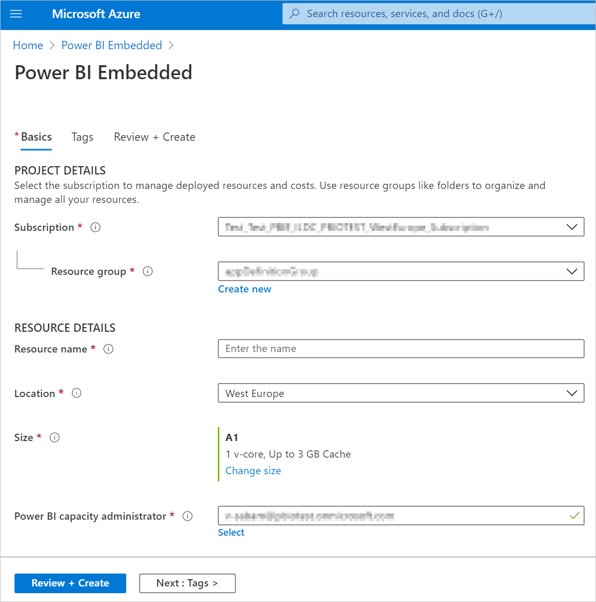

# <a name="create-power-bi-embedded-capacity-in-the-azure-portal"></a>Создание емкости Power BI Embedded на портале Azure

В этой статье рассматривается создание емкости [Power BI Embedded](azure-pbie-what-is-power-bi-embedded.md) в Microsoft Azure. Power BI Embedded упрощает возможности Power BI, позволяя быстро добавлять привлекательные визуальные элементы, отчеты и панели мониторинга в приложения.

## <a name="before-you-begin"></a>Подготовка

Для этого краткого руководства вам потребуется:

* **Подписка Azure.** Посетите страницу [бесплатной пробной версии Azure](https://azure.microsoft.com/free/), чтобы создать учетную запись.

* **Azure Active Directory.** Ваша подписка должна быть связана с клиентом Azure Active Directory (Azure AD). Кроме того, ***вам необходимо войти в Azure с учетной записью в этом клиенте***. Учетные записи Майкрософт не поддерживаются. Дополнительные сведения см. в разделе [Проверка подлинности и разрешения пользователей](https://docs.microsoft.com/azure/analysis-services/analysis-services-manage-users).

* **Клиент Power BI.** По крайней мере одна учетная запись в клиенте Azure AD должна быть зарегистрирована в Power BI.

* **Группа ресурсов.** Используйте существующую группу ресурсов или [создайте новую](https://docs.microsoft.com/azure/azure-resource-manager/resource-group-overview).

## <a name="create-a-capacity"></a>Создание емкости

Перед созданием емкости Power BI Embedded необходимо по крайней мере один раз войти в Power BI.

# <a name="portal"></a>[Портал](#tab/portal)

1. Войдите на [портал Azure](https://portal.azure.com/).

2. В поле поиска найдите *Power BI Embedded*.

3. В Power BI Embedded выберите **Добавить**.

4. Укажите необходимые сведения и нажмите **Просмотр и создание**.

    

    * **Подписка** — подписка, в которой вы хотите создать емкость.

    * **Группа ресурсов** — группа ресурсов, содержащая новую емкость. Выберите существующую группу ресурсов или создайте новую. Дополнительные сведения см. в [обзоре Azure Resource Manager](https://docs.microsoft.com/azure/azure-resource-manager/resource-group-overview).

    * **Имя ресурса** — имя ресурса емкости.

    * **Расположение** — расположение, где размещается Power BI для вашего клиента. Расположение по умолчанию — ваш домашний регион, но можно изменить расположение, используя [параметры поддержки нескольких регионов](embedded-multi-geo.md).

    * **Размер** — требуемый номер [SKU A](../../admin/service-admin-premium-purchase.md#purchase-a-skus-for-testing-and-other-scenarios). Дополнительные сведения см. в разделе [Память и вычислительные ресурсы SKU](/power-bi/developer/embedded/embedded-capacity).

    * **Администратор емкости Power BI** — администратор емкости.
        >[!NOTE]
        >* По умолчанию администратором емкости является ее создатель.
        >* Вы можете выбрать другого пользователя или субъект-службу в качестве администратора емкости.
        >* Администратор емкости должен относиться к клиенту, в котором подготавливается емкость. Пользователи типа "бизнес-бизнес" (B2B) не могут быть администраторами емкости.

# <a name="azure-cli"></a>[Azure CLI](#tab/CLI)

### <a name="use-azure-cloud-shell"></a>Использование Azure Cloud Shell

В Azure есть Azure Cloud Shell, интерактивная оболочка среды, с которой можно работать в браузере. Для работы со службами Azure можно использовать Bash или PowerShell с Cloud Shell. Для запуска кода из этой статьи можно использовать предварительно установленные команды Cloud Shell. Ничего дополнительного в локальной среде устанавливать не нужно.

Начало работы с Azure Cloud Shell

| Параметр | Пример и ссылка |
|-----------------------------------------------|---|
| Нажмите кнопку **Попробовать** в правом верхнем углу блока с кодом. При нажатии кнопки **Попробовать** код не копируется в Cloud Shell автоматически. |  |
| Перейдите по адресу [https://shell.azure.com](https://shell.azure.com) или нажмите кнопку **Запуск Cloud Shell**, чтобы открыть Cloud Shell в браузере. | [](https://shell.azure.com) |
| Нажмите кнопку **Cloud Shell** в строке меню в правом верхнем углу окна [портала Azure](https://portal.azure.com). |  |

Чтобы выполнить код из этой статьи в Azure Cloud Shell, выполните следующие действия:

1. Запустите Cloud Shell.

2. В блоке кода нажмите кнопку **Копировать**, чтобы скопировать код.

3. Вставьте код в окно сеанса Cloud Shell, нажав клавиши **CTRL**+**SHIFT**+**V** в Windows и Linux или **CMD**+**SHIFT**+**V** в macOS.

4. Нажмите клавишу **ВВОД**, чтобы выполнить код.

## <a name="prepare-your-environment"></a>Подготовка среды

Для использования команд емкости Power BI Embedded требуется Azure CLI 2.3.1 или более поздней версии. Запустите `az --version`, чтобы узнать установленную версию и зависимые библиотеки. Чтобы выполнить установку или обновление, см. сведения в статье [Установка Azure CLI](/cli/azure/install-azure-cli).

1. Войдите.

   Выполните вход с помощью команды [az login](/cli/azure/reference-index#az-login), если вы используете локальную установку CLI.

    ```azurecli
    az login
    ```

    Выполните аутентификацию, следуя инструкциям в окне терминала.

2. Установите расширение Azure CLI.

    При работе со ссылками на расширения для Azure CLI необходимо сначала установить расширение.  Расширения Azure CLI предоставляют доступ к экспериментальным командам и предварительным выпускам команд, которые еще не поставлялись как часть основного CLI.  Дополнительные сведения о расширениях, включая обновление и удаление, см. в статье [Использование расширений с Azure CLI](/cli/azure/azure-cli-extensions-overview).

    Установите расширение для емкости Power BI Embedded, выполнив следующую команду:

    ```azurecli
    az extension add --name powerbidedicated
    ```

### <a name="create-a-capacity-with-azure-cli"></a>Создание емкости с помощью Azure CLI

Чтобы создать емкость, используйте команду [az Power BI embedded-capacity create](https://docs.microsoft.com/cli/azure/ext/powerbidedicated/powerbi/embedded-capacity?view=azure-cli-latest#ext-powerbidedicated-az-powerbi-embedded-capacity-create).

```azurecli
az powerbi embedded-capacity create --location westeurope
                                    --name
                                    --resource-group
                                    --sku-name "A1"
                                    --sku-tier "PBIE_Azure"
```

### <a name="delete-a-capacity-with-azure-cli"></a>Удаление емкости с помощью Azure CLI

Чтобы удалить емкость с помощью Azure CLI, используйте команду [az powerbi embedded-capacity delete](https://docs.microsoft.com/cli/azure/ext/powerbidedicated/powerbi/embedded-capacity?view=azure-cli-latest#ext-powerbidedicated-az-powerbi-embedded-capacity-delete).

```azurecli
az powerbi embedded-capacity delete --name
                                    --resource-group
```

### <a name="manage-your-capacity-with-azure-cli"></a>Управление емкостью с помощью Azure CLI

Просмотреть все команды Azure CLI для Power BI Embedded можно в разделе [az powerbi](https://docs.microsoft.com/cli/azure/ext/powerbidedicated/powerbi?view=azure-cli-latest).

# <a name="arm-template"></a>[Шаблон ARM](#tab/ARM-template)

### <a name="use-resource-manager-template"></a>Использование шаблона Resource Manager

[Шаблон Resource Manager](https://docs.microsoft.com/azure/azure-resource-manager/templates/overview) является файлом нотации объектов JavaScript (JSON), определяющими инфраструктуру и конфигурацию вашего проекта. Шаблон использует декларативный синтаксис, который позволяет указать объект, который вы собираетесь развернуть. При этом, для развертывания объекта, не нужно писать последовательность команд. Дополнительные сведения о разработке шаблонов Resource Manager см. в разделе [Документация по Azure Resource Manager](https://docs.microsoft.com/azure/azure-resource-manager/) и в [справочнике по шаблонам](https://docs.microsoft.com/azure/templates/).

Если у вас еще нет подписки Azure, создайте [бесплатную](https://azure.microsoft.com/free/) учетную запись Azure, прежде чем начинать работу.

### <a name="review-the-template"></a>Изучение шаблона

Шаблон, используемый в этом кратком руководстве, взят из [шаблонов быстрого запуска Azure](https://azure.microsoft.com/resources/templates/101-power-bi-embedded).

```json
{
    "$schema": "https://schema.management.azure.com/schemas/2019-04-01/deploymentTemplate.json#",
    "contentVersion": "1.0.0.0",
    "parameters": {
        "name": {
            "type": "string",
            "metadata": {
              "description": "The capacity name, which is displayed in the Azure portal and the Power BI admin portal"
            }
        },
        "location": {
            "type": "string",
            "defaultValue": "[resourceGroup().location]",
            "metadata": {
              "description": "The location where Power BI is hosted for your tenant"
            }
        },
        "sku": {
            "type": "string",
            "allowedValues": [
                "A1",
                "A2",
                "A3",
                "A4",
                "A5",
                "A6"
            ],
            "metadata": {
              "description": "The pricing tier, which determines the v-core count and memory size for the capacity"
            }
        },
        "admin": {
            "type": "string",
            "metadata": {
              "description": "A user within your Power BI tenant, who will serve as an admin for this capacity"
            }
        }
    },
    "resources": [
        {
            "type": "Microsoft.PowerBIDedicated/capacities",
            "apiVersion": "2017-10-01",
            "name": "[parameters('name')]",
            "location": "[parameters('location')]",
            "sku": {
                "name": "[parameters('sku')]"
            },
            "properties": {
                "administration": {
                    "members": [
                        "[parameters('admin')]"
                    ]
                }
            }
        }
    ]
}
```

В шаблоне определен один ресурс Azure, [Microsoft.PowerBIDedicated/capacities Az](https://docs.microsoft.com/azure/templates/microsoft.powerbidedicated/allversions), который создает емкость Power BI Embedded.

### <a name="deploy-the-template"></a>Развертывание шаблона

1. Выберите следующую ссылку, чтобы войти на портал Azure и открыть шаблон. Шаблон создает емкость Power BI Embedded.

    [](https://portal.azure.com/#create/Microsoft.Template/uri/https%3a%2f%2fraw.githubusercontent.com%2fAzure%2fazure-quickstart-templates%2fmaster%2f101-power-bi-embedded%2fazuredeploy.json)

2. Укажите необходимые сведения и нажмите **Просмотр и создание**.

    

    * **Подписка** — подписка, в которой вы хотите создать емкость.

    * **Группа ресурсов** — группа ресурсов, содержащая новую емкость. Выберите существующую группу ресурсов или создайте новую. Дополнительные сведения см. в [обзоре Azure Resource Manager](https://docs.microsoft.com/azure/azure-resource-manager/resource-group-overview).

    * **Регион** — регион, к которому будет относиться емкость.

    * **Имя** — имя емкости.

    * **Расположение** — расположение, где размещается Power BI для вашего клиента. Расположение по умолчанию — ваш домашний регион, но можно изменить расположение, используя [параметры поддержки нескольких регионов](https://docs.microsoft.com/power-bi/developer/embedded/embedded-multi-geo
).

    * **Номер SKU** — требуемый номер [SKU A](../../admin/service-admin-premium-purchase.md#purchase-a-skus-for-testing-and-other-scenarios). Дополнительные сведения см. в разделе [Память и вычислительные ресурсы SKU](/power-bi/developer/embedded/embedded-capacity).

    * **Администратор** — администратор емкости.
        >[!NOTE]
        >* По умолчанию администратором емкости является ее создатель.
        >* Вы можете выбрать другого пользователя или субъект-службу в качестве администратора емкости.
        >* Администратор емкости должен относиться к клиенту, в котором подготавливается емкость. Пользователи типа "бизнес-бизнес" (B2B) не могут быть администраторами емкости.

### <a name="validate-the-deployment"></a>Проверка развертывания

Чтобы проверить развертывание, выполните указанные ниже действия.

1. Войдите на [портал Azure](https://portal.azure.com/).

2. В поле поиска найдите *Power BI Embedded*.

3. Проверьте наличие новой емкости в списке емкостей Power BI Embedded.

    

### <a name="clean-up-resources"></a>Очистка ресурсов

Чтобы удалить созданную емкость, выполните указанные ниже действия.

1. Войдите на [портал Azure](https://portal.azure.com/).

2. В поле поиска найдите *Power BI Embedded*.

3. Откройте контекстное меню для созданной емкости и выберите команду **Удалить**.

    

4. На странице подтверждения введите имя емкости и нажмите кнопку **Удалить**.

    

---

## <a name="next-steps"></a>Дальнейшие действия

>[!div class="nextstepaction"]
>[Управление емкостями](../../admin/service-admin-premium-manage.md)

>[!div class="nextstepaction"]
>[Приостановка и запуск емкости Power BI Embedded на портале Azure](azure-pbie-pause-start.md)

>[!div class="nextstepaction"]
>[Внедрение содержимого Power BI в приложение для клиентов](embed-sample-for-customers.md)

>[!div class="nextstepaction"]
>[Появились дополнительные вопросы? Попробуйте задать их в сообществе Power BI](https://community.powerbi.com/).
