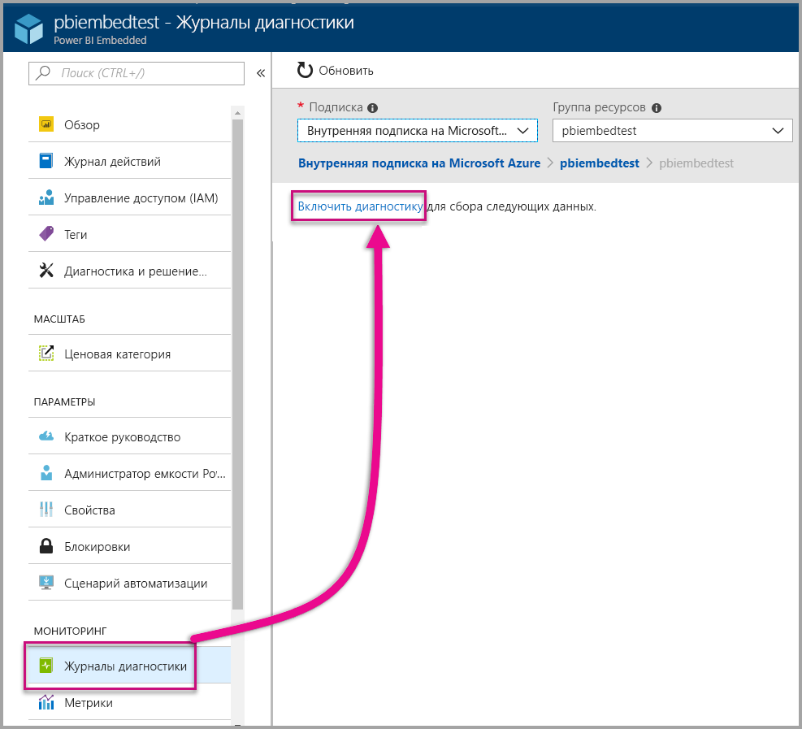
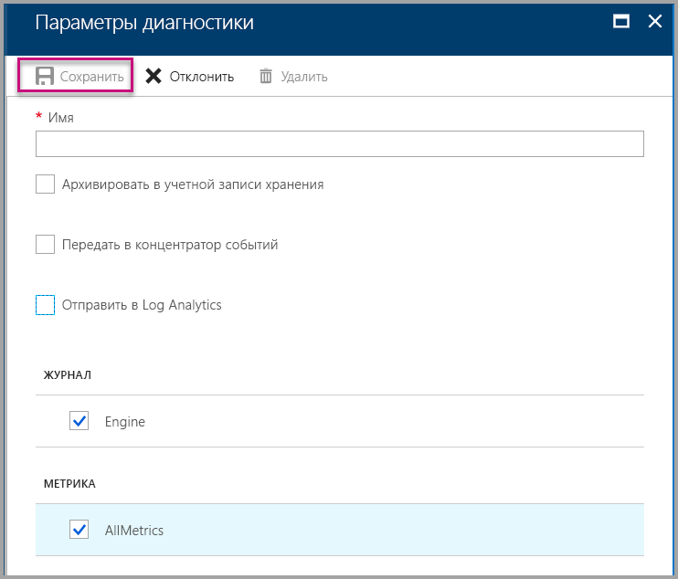
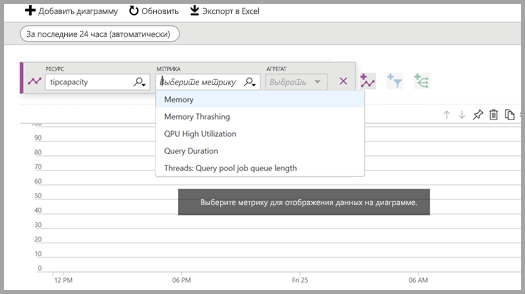
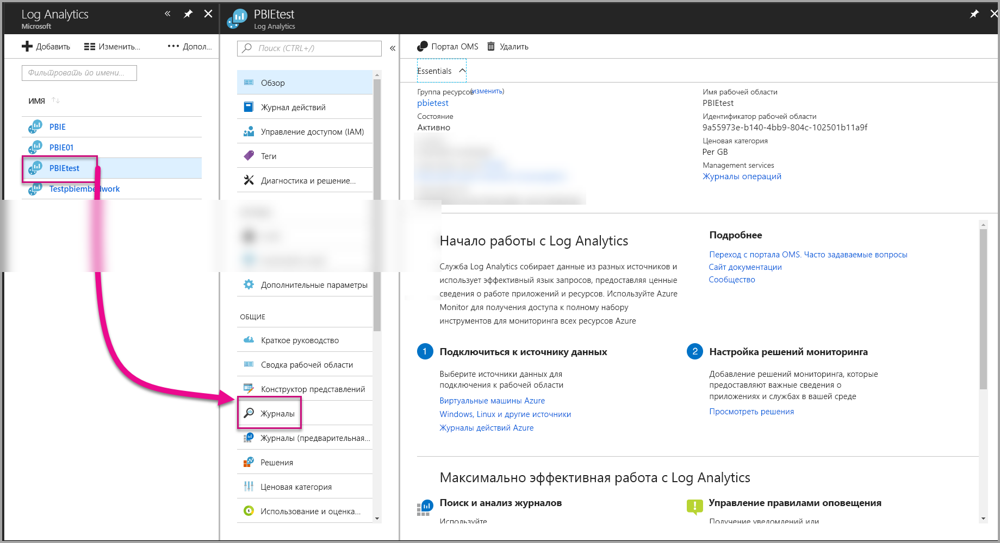
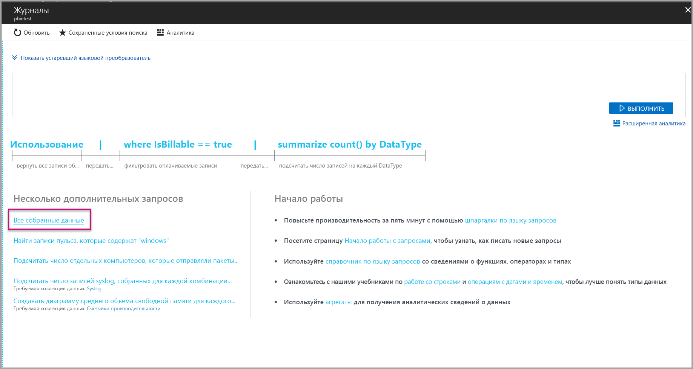
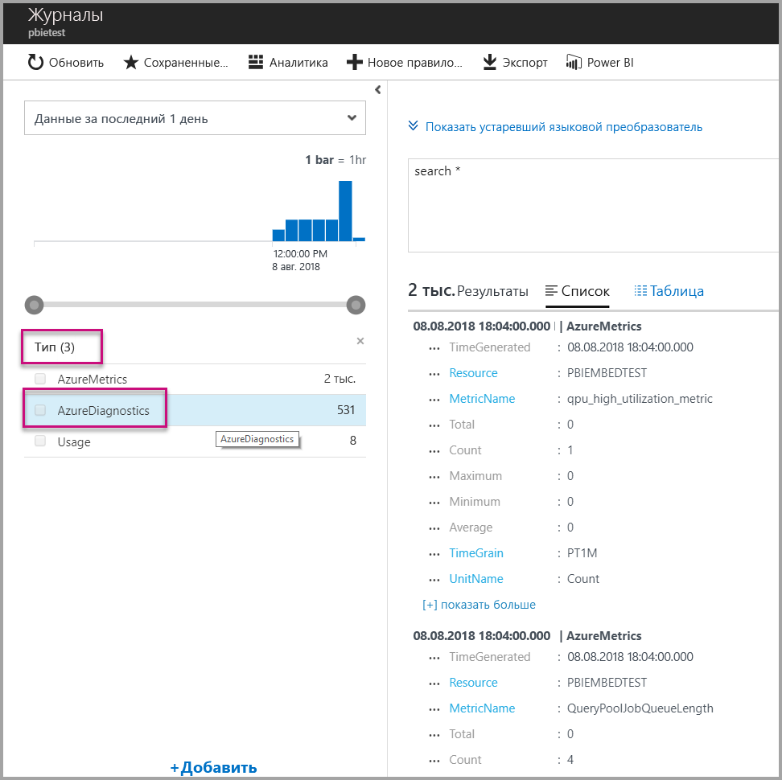
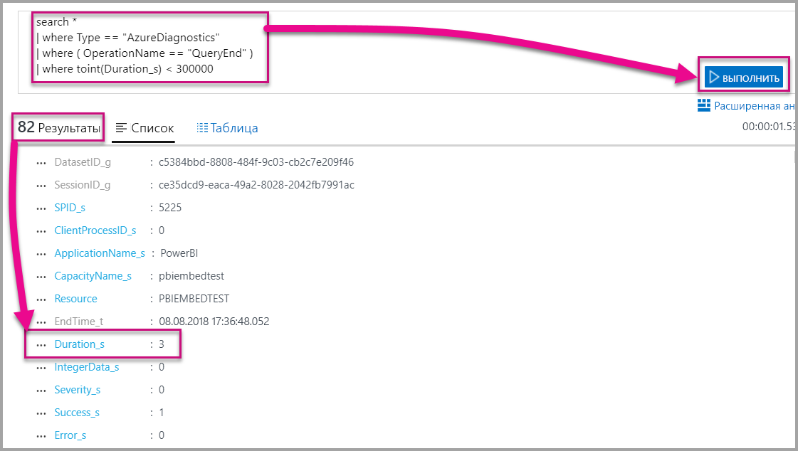
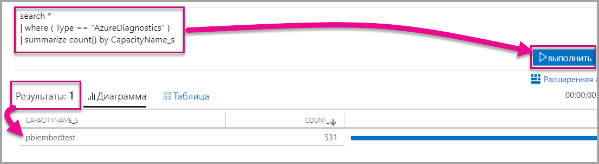

# <a name="diagnostic-logging-for-power-bi-embedded-in-azure"></a>Ведение журнала диагностики для Power BI Embedded в Azure

[Журналы диагностики ресурсов Azure](https://docs.microsoft.com/azure/monitoring-and-diagnostics/monitoring-overview-of-diagnostic-logs) позволяют регистрировать множество событий из емкости, передавать их в средства аналитики и получать полезные сведения о поведении ресурса.

Использование диагностики используется в некоторых сценариях, например:

* обнаружение длительных или проблемных запросов;
* отклонение [метрики емкости](https://powerbi.microsoft.com/blog/power-bi-developer-community-april-update/);
* отслеживание использования определенных наборов данных.

## <a name="set-up-diagnostics-logging"></a>Настройка ведения журнала диагностики

### <a name="azure-portal"></a>Портал Azure

1. На [портале Azure](https://portal.azure.com) выберите ресурс Power BI Embedded, в области навигации слева щелкните **Журналы диагностики**, а затем выберите **Включить диагностику**.

    

2. В окне **Параметры диагностики** задайте следующие параметры:

    * **Имя** — введите имя для создаваемого параметра диагностики.

    * **Архивировать в учетной записи хранения** — чтобы использовать этот параметр, необходимо подключиться к существующей учетной записи хранения. См. инструкции по [созданию учетных записей хранения Azure](https://docs.microsoft.com/azure/storage/common/storage-create-storage-account). Затем вернитесь на эту страницу портала и выберите учетную запись хранения. Может пройти несколько минут, прежде чем только что созданная учетная запись хранения отобразится в раскрывающемся меню. Хранилище файлов журнала имеет формат JSON.
    * **Передать в концентратор событий** — чтобы использовать этот параметр, необходимо подключиться к существующему концентратору событий и его пространству имен. См. инструкции по [созданию пространства имен центров событий и центра событий с помощью портала Azure](https://docs.microsoft.com/azure/event-hubs/event-hubs-create).
    * **Отправить в Log Analytics** — чтобы использовать этот параметр, выберите существующую или [создайте новую рабочую область](https://docs.microsoft.com/azure/log-analytics/log-analytics-quick-collect-azurevm#create-a-workspace) Log Analytics. Для этого используется служба [Azure Log Analytics](https://docs.microsoft.com/azure/log-analytics/log-analytics-overview), которая предоставляет встроенные возможности анализа, панель мониторинга и уведомления. Log Analytics можно использовать, чтобы подключить дополнительные источники данных из других ресурсов и получить полное представление данных по ресурсам вашего приложения. Эту службу также можно подключить к [Power BI одним щелчком](https://docs.microsoft.com/azure/log-analytics/log-analytics-powerbi).
    Дополнительные сведения о просмотре журналов в Log Analytics см. в статье [Сбор и анализ журналов действий Azure в Log Analytics](https://docs.microsoft.com/azure/log-analytics/log-analytics-activity).
    * **Подсистема** — выберите этот параметр, чтобы записывать [ряд событий](#whats-logged) подсистемы, которые приводятся ниже.
    * **AllMetrics** — выберите этот параметр, чтобы сохранять подробные данные в разделе [Метрики](https://docs.microsoft.com/azure/analysis-services/analysis-services-monitor#server-metrics). Если выполняется архивация в учетную запись хранения, можно выбрать период удержания для журналов диагностики. По истечении этого срока журналы будут удалены автоматически.

3. Щелкните **Сохранить**.

    Чтобы изменить способ сохранения журналов диагностики, можете вернуться на эту страницу и изменить параметры.

    

### <a name="using-powershell-to-enable-diagnostics"></a>Включение диагностики с помощью PowerShell

Чтобы включить ведение журналов метрик и диагностики с помощью PowerShell, используйте следующие команды:

* Выполните приведенную ниже команду, чтобы включить отправку журналов диагностики в учетную запись хранения:

    ```powershell
    Set-AzureRmDiagnosticSetting -ResourceId [your resource id] -StorageAccountId [your storage account id] -Enabled $true
    ```
    Идентификатор учетной записи хранения — это идентификатор ресурса учетной записи хранения, в которую будут отправляться журналы.

* Чтобы включить потоковую передачу журналов диагностики в концентратор событий, используйте следующую команду:

    ```powershell
    Set-AzureRmDiagnosticSetting -ResourceId [your resource id] -ServiceBusRuleId [your service bus rule id] -Enabled $true
    ```
* Идентификатор правила служебной шины Azure — это строка в формате:

    ```powershell
    {service bus resource ID}/authorizationrules/{key name}
    ```

* Чтобы включить отправку журналов диагностики в рабочую область Log Analytics, используйте следующую команду:

    ```powershell
        Set-AzureRmDiagnosticSetting -ResourceId [your resource id] -WorkspaceId [resource id of the log analytics workspace] -Enabled $true
    ```

* Идентификатор ресурса рабочей области Log Analytics можно получить с помощью следующей команды:

    ```powershell
    (Get-AzureRmOperationalInsightsWorkspace).ResourceId
    ```

Можно объединять эти параметры, чтобы получить несколько вариантов вывода.

### <a name="rest-api"></a>API-интерфейсы REST

Узнайте, как [изменить параметры диагностики с помощью REST API Azure Monitor](https://docs.microsoft.com/rest/api/monitor/). 

### <a name="resource-manager-template"></a>Шаблон Resource Manager

Узнайте, как [включить параметры диагностики при создании ресурса с помощью шаблона Resource Manager](https://docs.microsoft.com/azure/monitoring-and-diagnostics/monitoring-enable-diagnostic-logs-using-template).

## <a name="whats-logged"></a>Какие данные регистрируются?

Можно выбрать категорию **Engine** и (или) **AllMetrics**.

### <a name="engine"></a>Подсистема

Категория Engine указывает ресурсу, что необходимо регистрировать следующие события, для каждого из которых представлены свойства:

|     Название мероприятия     |     Описание события     |
|----------------------------|----------------------------------------------------------------------------------|
|    Audit Login    |    Запись всех новых событий подключения к подсистеме с момента запуска трассировки.    |
|    Session Initialize    |    Запись всех событий инициализации сеанса с момента запуска трассировки.    |
|    Vertipaq Query Begin    |    Запись всех событий начала запроса VertiPaq SE с момента запуска трассировки.    |
|    Query Begin    |    Запись всех событий начала запроса с момента запуска трассировки.    |
|    Query End    |    Запись всех событий окончания запроса с момента запуска трассировки.    |
|    Vertipaq Query End    |    Запись всех событий окончания запроса VertiPaq SE с момента запуска трассировки.    |
|    Audit Logout    |    Запись всех событий отключения от модуля с момента запуска трассировки.    |
|    Ошибка    |    Запись всех событий ошибок в модуле с момента запуска трассировки.    |

<br>
<br>

| Имя свойства | Пример Vertipaq Query End | Описание свойства |
|-------------------|---------------------------------------------------------------------------------------------------------------------------------------------------------------------------------------------------------|--------------------------------------------------------------------------------------------------------------------------|
| EventClass | XM_SEQUERY_END | EventClass используется для классификации событий по категориям. |
| EventSubclass | 0 | EventSubclass предоставляет дополнительные сведения о каждом классе событий (например, 0: VertiPaq Scan). |
| RootActivityId | ff217fd2-611d-43c0-9c12-19e202a94f70 | Идентификатор корневой операции. |
| CurrentTime | 2018-04-06T18:30:11.9137358Z | Время начала события, если доступно. |
| StartTime | 2018-04-06T18:30:11.9137358Z | Время начала события, если доступно. |
| JobID | 0 | Идентификатор выполняемого задания. |
| ObjectID | 464 | Идентификатор объекта |
| ObjectType | 802012 | ObjectType |
| EndTime | 2018-04-06T18:30:11.9137358Z | Время окончания события. |
| Duration | 0 | Время (в миллисекундах), затраченное событием. |
| SessionType | User | Тип сеанса (какая сущность вызвала операцию). |
| ProgressTotal | 0 | Общий ход выполнения. |
| IntegerData | 0 | Целочисленные данные. |
| Severity | 0 | Уровень серьезности исключения. |
| Успешное завершение | 1 | 1 = успех. 0 = ошибка (например, 1 означает успешную проверку наличия разрешений, а 0 означает ошибку при этой проверке). |
| Ошибка | 0 | Номер ошибки определенного события. |
| ConnectionID | 3 | Уникальный идентификатор подключения. |
| DatasetID | 5eaa550e-06ac-4adf-aba9-dbf0e8fd1527 | Идентификатор набора данных, в котором выполняется инструкция пользователя. |
| SessionID | 3D063F66-A111-48EE-B960-141DEBDA8951 | Идентификатор GUID сеанса. |
| SPID | 180 | Идентификатор серверного процесса. Однозначно идентифицирует сеанс пользователя. Прямо соответствует идентификатору GUID сеанса, используемому XML/A. |
| ClientProcessID | null | Идентификатор процесса клиентского приложения. |
| ApplicationName | null | Имя клиентского приложения, установившего подключение к серверу. |
| CapacityName | pbi641fb41260f84aa2b778a85891ae2d97 | Имя ресурса емкости Power BI Embedded. |


### <a name="allmetrics"></a>AllMetrics

Если выбрать параметр **AllMetrics**, будут регистрироваться данные по всем метрикам, которые можно использовать с ресурсом Power BI Embedded.

   

## <a name="manage-your-logs"></a>Управление журналами

Как правило, журналы становятся доступными через несколько часов после настройки ведения журнала. Способ управления журналами в своей учетной записи хранения вы выбираете сами.

* Используйте стандартные методы управления доступом, предоставляемые Azure, для защиты журналов путем ограничения доступа к ним.
* Удаляйте журналы, которые больше не нужно хранить в учетной записи хранения.
* Обязательно установите срок хранения, чтобы устаревшие журналы удалялись из вашей учетной записи хранения.

## <a name="view-logs-in-log-analytics"></a>Просмотр журналов в Log Analytics

Метрики и события сервера объединяются с событиями xEvent в Log Analytics для параллельного анализа. Службу Log Analytics можно также настроить для получения событий из других служб Azure, чтобы получать целостное представление о данных журнала диагностики в своей архитектуре.

Чтобы просмотреть данные диагностики в Log Analytics, откройте страницу **Журналы** в меню слева или в области управления, как показано ниже.



Теперь, когда вы включили сбор данных, в разделе **Журналы** выберите **Все собранные данные**.



В раскрывающемся списке **Тип** выберите **AzureDiagnostics**, а затем нажмите кнопку **Применить**. AzureDiagnostics включает в себя события Engine. Обратите внимание на то, что запрос Log Analytics создается в режиме реального времени.



Выберите **EventClass\_s** или одно из имен событий, и Log Analytics продолжит создание запроса. Не забудьте сохранить запросы для последующего использования.

Обязательно ознакомьтесь со службой [Log Analytics](https://docs.microsoft.com/azure/log-analytics/), которая предоставляет веб-сайт с расширенными возможностями создания запросов, панелей мониторинга и оповещений на основе собранных данных.

### <a name="queries"></a>Запросы

Вы можете использовать сотни запросов. Ниже приведено несколько запросов для ознакомления. Дополнительные сведения об использовании нового языка запросов поиска по журналам см. в статье [Основные сведения о поисках по журналам в Log Analytics](https://docs.microsoft.com/azure/log-analytics/log-analytics-log-search).

* Результаты запроса, на выполнение которого потребовалось менее пяти минут (300 000 миллисекунд).

    ```
    search *
    | where Type == "AzureDiagnostics"
    | where ( OperationName == "QueryEnd" )
    | where toint(Duration_s) < 300000
    ```

    

* Определение имен емкостей.

    ```
    search *
    | where ( Type == "AzureDiagnostics" )
    | summarize count() by CapacityName_s 
    ```

    

## <a name="next-steps"></a>Дальнейшие действия

Дополнительные сведения о ведении журналов диагностики ресурсов Azure:

> [!div class="nextstepaction"]
> [Ведение журналов диагностики ресурсов Azure](https://docs.microsoft.com/azure/monitoring-and-diagnostics/monitoring-overview-of-diagnostic-logs)

> [!div class="nextstepaction"]
> [Set-AzureRmDiagnosticSetting](https://docs.microsoft.com/powershell/module/azurerm.insights/Set-AzureRmDiagnosticSetting)
