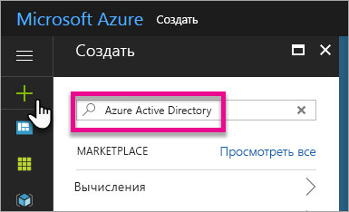
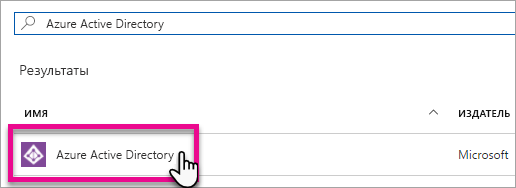
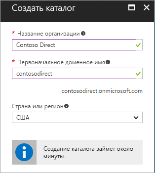
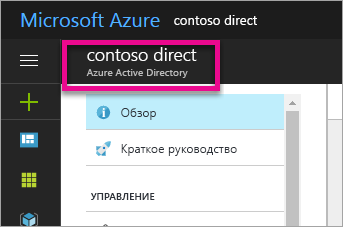
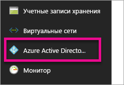
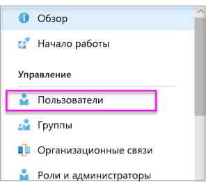
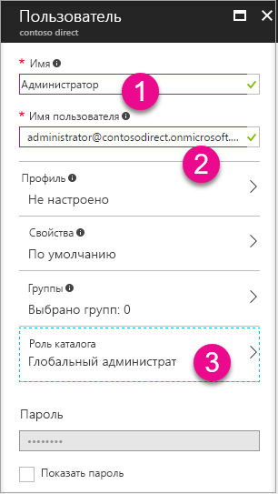
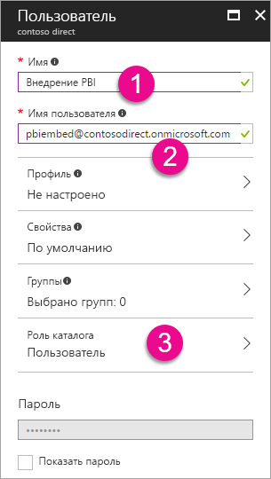

# Создание клиента Azure Active Directory для использования с Power BI

Узнайте, как создать клиент Azure Active Directory (Azure AD) для пользовательского приложения, которое вызывает интерфейсы [REST API для Power BI](../automation/rest-api-reference.md).

Клиент представляет организацию в Azure Active Directory. Это выделенный экземпляр службы Azure AD, который организация получает и которым она владеет при регистрации в облачной службе Майкрософт, например Azure, Microsoft Intune или Microsoft 365. Каждый клиент Azure AD отделен от остальных клиентов Azure AD.

После получения клиента Azure AD вы можете определить приложение и назначить ему разрешения, чтобы оно могло вызывать интерфейсы [REST API для Power BI](../automation/rest-api-reference.md).

Возможно, у вашей организации уже есть клиент Azure AD, который можно использовать для приложения. Вы также можете создать клиент специально для своего приложения. Эта статья показывает, как создать клиент.

## Создание клиента Azure Active Directory

Для интеграции Power BI в пользовательское приложение нужно определить приложение в Azure AD, для чего нужен каталог Azure AD. Этот каталог является вашим *клиентом*. Если у вашей организации еще нет клиента, так как вы не используете Power BI или Microsoft 365, [нужно настроить среду разработки](https://docs.microsoft.com/azure/active-directory/develop/active-directory-howto-tenant). Ее также может потребоваться создать, если вы не хотите использовать приложение совместно с клиентом вашей организации, что позволяет обеспечить изоляцию. Или можно просто создать клиент для тестирования.

Чтобы создать клиент Azure AD, сделайте следующее:

1. Перейдите на [портал Azure](https://portal.azure.com) и выполните вход с учетной записью, имеющей подписку Azure.

2. Щелкните **значок "плюс" (+)** и выполните поиск по запросу **Azure Active Directory**.

    

3. В результатах поиска выберите **Azure Active Directory**.

    

4. Нажмите кнопку **создания**.

5. Укажите **Название организации** и **Первоначальное доменное имя**. Щелкните **Создать**. Ваш каталог создан.

    

   > [!NOTE]
   > Исходный домен является частью onmicrosoft.com. Вы можете добавить другие доменные имена позже. Каталогу клиента можно назначить несколько доменов.

6. После завершения создания каталога щелкните значок сведений для управления созданным каталогом.

Далее вы добавите пользователей клиента.

## Создание пользователей клиента Azure Active Directory

Теперь, когда у вас есть каталог, давайте создадим хотя бы двух пользователей. Один является глобальным администратором клиента, а другой — главным пользователем для внедрения. Последнего можно рассматривать как учетную запись службы.

1. На портале Azure убедитесь, что вы находитесь во всплывающем меню Azure Active Directory.

    

    Если это не так, щелкните значок Azure Active Directory в левой панели переходов по службам.

    

2. В разделе **Управление** выберите **Пользователи**.

    

3. Выберите пункт **Все пользователи**, а затем выберите **+ Новый пользователь**.

4. Укажите **Имя** и **Имя пользователя** для вашего глобального администратора клиента. Измените **Роль каталога** на **Глобальный администратор**. Можно также отобразить временный пароль. Когда все будет готово, выберите **Создать**.

    

5. Теперь сделайте то же самое для обычного пользователя клиента. Эту учетную запись также можно использовать для главной учетной записи внедрения. На этот раз оставьте **Роль каталога** **Пользователь**. Запомните пароль и выберите **Создать**.

    

6. Зарегистрируйтесь в Power BI с помощью учетной записи пользователя, созданной на шаге 5. Перейдите на страницу [powerbi.com](https://powerbi.microsoft.com/get-started/) и выберите **Попробовать бесплатно** в разделе **Power BI — совместная работа и общий доступ в облаке**.

    

    При регистрации вам будет предложена бесплатная 60-дневная версия Power BI Pro. Вы можете согласиться стать пользователем Pro, что дает возможность [начать разработку внедренного решения](embed-sample-for-customers.md).

   > [!NOTE]
   > Зарегистрируйтесь с использованием адреса электронной почты вашей учетной записи пользователя.

## Дальнейшие действия

Теперь, когда у вас есть клиент Azure AD, вы можете использовать его для тестирования элементов в Power BI. Кроме того, вы можете внедрять панели мониторинга и отчеты Power BI в приложение. Дополнительные сведения см. в статье [Как внедрять панели мониторинга, отчеты и плитки Power BI](embed-sample-for-customers.md).

[Что такое Azure Active Directory?](https://docs.microsoft.com/azure/active-directory/active-directory-whatis) 
 
[Краткое руководство. Настройка среды разработки](https://docs.microsoft.com/azure/active-directory/develop/active-directory-howto-tenant)  

Остались вопросы? [Попробуйте задать вопрос в сообществе Power BI.](https://community.powerbi.com/)
