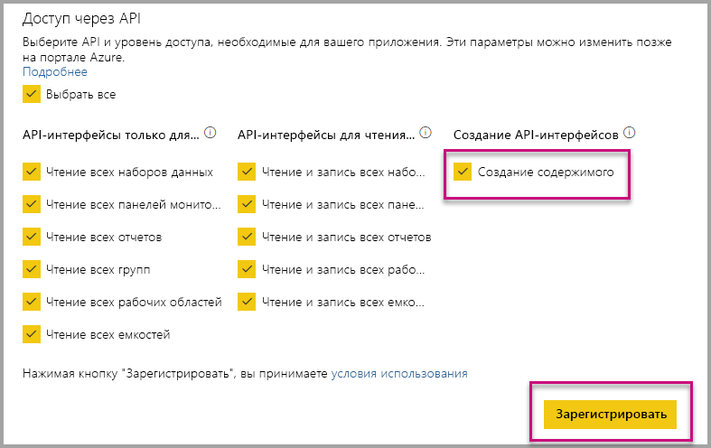

# Автоматическая установка приложений Power BI при внедрении для организации

Для внедрения содержимого из приложения пользователь, выполняющий эту операцию, должен иметь [доступ к приложению](../../collaborate-share/service-create-distribute-apps.md). Если приложение установлено для пользователя, то внедрение осуществляется без проблем. Дополнительные сведения см. в разделе [Внедрение отчетов или панелей мониторинга из приложения](embed-from-apps.md). На сайте PowerBI.com можно указать, что все приложения могут [устанавливаться автоматически](https://powerbi.microsoft.com/blog/automatically-install-apps/). Однако это действие выполняется на уровне клиента и применяется ко всем приложениям.

## Автоматическая установка приложений при внедрении

Если пользователь имеет доступ к приложению, но приложение не установлено, то внедрение завершается ошибкой. Чтобы избежать таких сбоев при внедрении из приложения, вы можете разрешить автоматическую установку приложения после внедрения. Это действие означает, что если приложение, которое пользователь пытается внедрить, не установлено, оно устанавливается автоматически. Таким образом, требуемое содержимое внедряется немедленно, что упрощает работу пользователя.

## Внедрение для пользователей Power BI (данные принадлежат пользователю)

Чтобы разрешить автоматическую установку приложений для пользователей, вам нужно предоставить приложению разрешение "Создание содержимого" при [его регистрации](register-app.md#register-with-the-power-bi-application-registration-tool) или добавить это разрешение, если вы уже зарегистрировали свое приложение.

Далее вам нужно указать идентификатор приложения в URL-адресе внедрения. Чтобы предоставить идентификатор приложения, автору приложения нужно сначала установить приложение, а затем воспользоваться одним из поддерживаемых вызовов [Rest API Power BI](/rest/api/power-bi/) — [Получение отчетов](/rest/api/power-bi/reports/getreports) или [Получение панелей мониторинга](/rest/api/power-bi/dashboards/getdashboards). Затем автору приложения нужно использовать URL-адрес внедрения из ответа REST API. Идентификатор приложения отображается в URL-адресе, если содержимое получено из приложения.  После получения URL-адреса внедрения его можно использовать для систематического внедрения.

## Безопасное внедрение

Чтобы использовать автоматическую установку приложений, автору приложения сначала нужно установить приложение, а затем перейти к приложению на сайте PowerBI.com, открыть отчет и получить ссылку обычным образом. Все другие пользователи с доступом к этому приложению, которые могут использовать ссылку, могут внедрить этот отчет.

## Рекомендации и ограничения

* Вы также можете внедрять отчеты и панели мониторинга в рамках этого сценария.

* Сейчас эта функция не поддерживается для данных, принадлежащих приложению, и сценариев внедрения SharePoint.