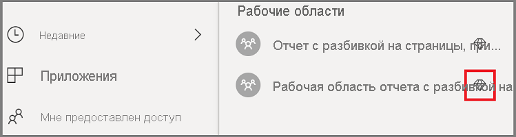
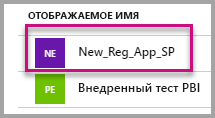
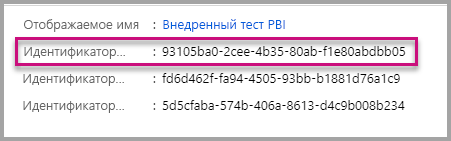
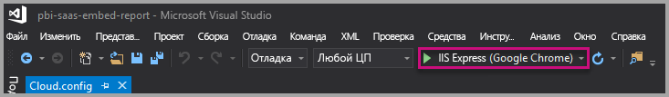
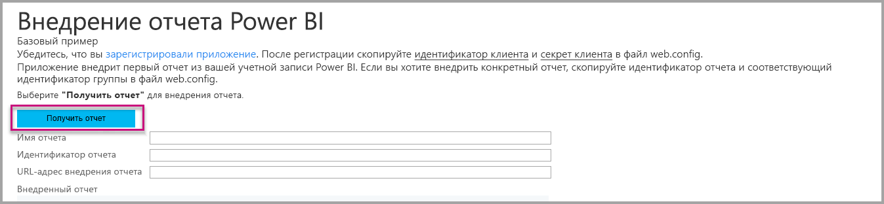

# <a name="tutorial-embed-power-bi-paginated-reports-into-an-application-for-your-organization"></a>Руководство по Внедрение отчетов Power BI с разбивкой на страницы в приложение для организации

В **Power BI** в приложение для вашей организации можно внедрить отчеты с разбивкой на страницы, используя сценарий *данных, принадлежащих пользователю*.

Отчеты с разбивкой на страницы — это отчеты, предназначенные для высококачественной печати. Обычно эти отчеты содержат большой объем данных, отображаемых таким образом, чтобы они соответствовали печатным страницам.
Дополнительные сведения о том, как Power BI поддерживает отчеты с разбивкой на страницы, см. в разделе [Сведения об отчетах с разбивкой на страницы в Power BI Premium](../../paginated-reports/paginated-reports-report-builder-power-bi.md)

**Принадлежащие пользователю данные** для приложения расширяют возможности службы Power BI, позволяя использовать встроенную аналитику. В этом руководстве показано, как интегрировать отчет с разбивкой на страницы в приложение.

Вы можете использовать пакет SDK для .NET Power BI и API Power BI для JavaScript для внедрения Power BI в приложение для вашей организации.


В этом руководстве вы выполнили следующие задачи.
> [!div class="checklist"]
> * регистрация приложения в Azure;
> * внедрение отчета Power BI с разбивкой на страницы в приложение с помощью клиента Power BI.

## <a name="prerequisites"></a>Предварительные требования
Для работы вам понадобятся:

* [учетная запись Power BI Pro](../../admin/service-admin-purchasing-power-bi-pro.md);

* собственная установка [клиента Azure Active Directory](create-an-azure-active-directory-tenant.md).

* Емкость, как минимум, P1. См. раздел [Какой размер емкости "Премиум" требуется для отчетов с разбивкой на страницы?](../../paginated-reports/paginated-reports-faq.md#what-size-premium-capacity-do-i-need-for-paginated-reports)

Если вы не зарегистрированы в **Power BI**, перед началом работы [пройдите бесплатную регистрацию](https://powerbi.microsoft.com/pricing/).

## <a name="set-up-your-power-bi-environment"></a>Настройка рабочей среды Power BI

Следуйте инструкциям в этом разделе, чтобы настроить Power BI для внедрения отчетов с разбивкой на страницы.

### <a name="register-a-server-side-web-application-app"></a>Регистрация приложения веб-приложения на стороне сервера

Следуйте инструкциям в разделе [Регистрация приложения Azure AD для использования с Power BI](register-app.md), чтобы зарегистрировать приложение веб-приложения на стороне сервера.

>[!NOTE]
>При регистрации приложения необходимо выполнить следующие действия.
>* Получение секрета приложения
>* Примените к приложению **Report.ReadAll** разрешения (область).

### <a name="create-a-dedicated-capacity"></a>Создание выделенной емкости

Создав выделенную емкость, вы получите преимущество выделенного ресурса для содержимого в рабочей области приложения. Для отчетов с разбивкой на страницы рабочая область приложения должна иметь емкость не менее P1. Вы можете создать выделенную емкость с помощью [Power BI Premium](../../admin/service-premium-what-is.md).

В следующей таблице перечислены номера SKU для Power BI Premium, которые можно использовать для создания выделенной емкости для отчетов с разбивкой на страницы в [Microsoft Office 365](../../admin/service-admin-premium-purchase.md).

| Узел емкости | Общее количество виртуальных ядер<br/>(серверная часть + внешний интерфейс) | Виртуальные ядра в серверной части | Виртуальные ядра для внешнего интерфейса | Ограничения для подключений DirectQuery и активных подключений |
| --- | --- | --- | --- | --- | --- |
| P1 |8 виртуальных ядер |4 виртуальных ядра, 25 ГБ ОЗУ |4 виртуальных ядра |30 в секунду |
| P2 |16 виртуальных ядер |8 виртуальных ядер, 50 ГБ ОЗУ |8 виртуальных ядер |60 в секунду |
| P3 |32 виртуальных ядра |16 виртуальных ядер, 100 ГБ ОЗУ |16 виртуальных ядер |120 в секунду |
| P4 |64 виртуальных ядра |32 виртуальных ядра, 200 ГБ ОЗУ |32 виртуальных ядра |240 в секунду |
| P5 |128 виртуальных ядер |64 виртуальных ядра, 400 ГБ ОЗУ |64 виртуальных ядра |480 в секунду |
|||||

### <a name="enable-paginated-reports-workload"></a>Включение рабочей нагрузки для отчетов с разбивкой на страницы

Вам необходимо включить рабочую нагрузку для отчетов с разбивкой на страницы для выделенной емкости.

1. Войдите на страницу [Power BI > Портал администрирования > Параметры емкости](https://app.powerbi.com/admin-portal/capacities).

2. Выберите емкость с рабочей областью, в которую нужно передать отчет с разбивкой на страницы.

    

3. Разверните **Рабочие нагрузки**.

    

4. Активируйте рабочую нагрузку для отчетов с разбивкой на страницы.

    

### <a name="assign-an-app-workspace-to-a-dedicated-capacity"></a>Назначение выделенной емкости для рабочей области приложения

После создания выделенной емкости ей можно назначить рабочую область приложения. Для этого сделайте следующее:

1. В службе Power BI разверните рабочие области и щелкните **Дополнительно** возле рабочей области, которую вы используете для внедрения содержимого. Затем выберите **Параметры рабочей области**.

    

2. Выберите **Premium** и включите параметр **Выделенная емкость**. Выберите выделенную емкость, которую вы создали. Затем нажмите кнопку **Save** (Сохранить).

    

3. После нажатия кнопки **Сохранить** рядом с именем рабочей области приложения должен появиться ромб.

    

### <a name="create-and-publish-your-power-bi-paginated-reports"></a>Создание и публикация отчетов Power BI с разбивкой на страницы

Для создания отчетов с разбивкой на страницы можно использовать [Построитель отчетов Power BI](../../paginated-reports/paginated-reports-report-builder-power-bi.md#create-reports-in-power-bi-report-builder). После этого можно [отправить отчет](../../paginated-reports/paginated-reports-quickstart-aw.md#upload-the-report-to-the-service) в рабочую область приложения, назначенную в емкость по меньшей мере P1, и включить [рабочую нагрузку для отчетов с разбивкой на страницы](#enable-paginated-reports-workload). У конечного пользователя, отправляющего отчет, должна быть лицензия Power BI Pro на публикацию в рабочей области приложения.
   
## <a name="embed-your-content-by-using-the-sample-application"></a>Внедрение содержимого с помощью примера приложения

Этот пример намеренно упрощен в целях наглядности.

Чтобы приступить к внедрению содержимого, используя пример приложения, выполните указанные ниже действия.

1. Скачайте [Visual Studio](https://www.visualstudio.com/) (версии 2013 или более поздней). Обязательно скачайте последнюю версию [пакета NuGet](https://www.nuget.org/profiles/powerbi).

2. Загрузите образцы [PowerBI-Developer-Samples](https://github.com/Microsoft/PowerBI-Developer-Samples) и откройте вкладку .NET Framework > Embed for your organization > integrate-web-app > **PBIWebApp** (.NET Framework > Внедрение для организации > integrate-web-app > PBIWebApp).

    

3. Откройте файл **Cloud.config** в примере приложения и заполните следующие поля, чтобы запустить приложение:
    * [Идентификатор приложения](#application-id)
    * [Идентификатор рабочей области](#workspace-id)
    * [Идентификатор отчета](#report-id)
    * [AADAuthorityUrl](#aadauthorityurl)

    

### <a name="application-id"></a>Идентификатор приложения

Укажите в поле **applicationId** значение **идентификатора приложения** из **Azure**. Поле **applicationId** используется приложением для его идентификации для пользователей, у которых запрашиваются разрешения.

Чтобы получить значение **applicationId**, сделайте следующее.

1. Войдите на [портал Azure](https://portal.azure.com).

2. На панели навигации слева выберите **Все службы** и щелкните **Регистрация приложений**.

3. Выберите приложение, для которого требуется **applicationId**.

    

4. В поле **Идентификатор приложения** указан GUID. Используйте этот **идентификатор приложения** как значение параметра **applicationId** приложения.

    

### <a name="workspace-id"></a>Идентификатор рабочей области

Укажите в поле **workspaceId** GUID рабочей области (группы) приложения из Power BI. Эти данные можно получить из URL-адреса после входа в службу Power BI или с помощью PowerShell.

URL-адрес <br>


PowerShell <br>

```powershell
Get-PowerBIworkspace -name "User Owns Embed Test"
```

   

### <a name="report-id"></a>Идентификатор отчета

Укажите в поле **reportId** значение GUID отчета из Power BI. Эти данные можно получить из URL-адреса после входа в службу Power BI или с помощью PowerShell.


PowerShell <br>

```powershell
Get-PowerBIworkspace -name "User Owns Embed Test" | Get-PowerBIReport -Name "Sales Paginated Report"
```


### <a name="aadauthorityurl"></a>AADAuthorityUrl

Укажите в сведениях **AADAuthorityUrl** URL-адрес, который позволяет осуществлять внедрение с помощью клиента организации либо гостевого пользователя.

Для внедрения с помощью клиента организации используйте URL-адрес *https://login.microsoftonline.com/common/oauth2/authorize* .

Для внедрения с помощью гостя используйте URL-адрес *`https://login.microsoftonline.com/report-owner-tenant-id`* , где нужно добавить идентификатор клиента владельца отчета вместо *report-owner-tenant-id*.

### <a name="run-the-application"></a>Выполнение приложения

1. Выберите **Запуск** в **Visual Studio**.

    

2. Теперь выберите **Внедрить отчет**. В зависимости от того, какое содержимое вы хотите проверить (отчеты, панели мониторинга или плитки), выберите нужный вариант в приложении.

    

3. Теперь вы можете просмотреть отчет в примере приложения.

    

## <a name="next-steps"></a>Дальнейшие действия

В этом руководстве вы узнали, как внедрить отчет Power BI с разбивкой на страницы в свое приложение с помощью учетной записи организации Power BI. 

> [!div class="nextstepaction"]
> [Внедрение из приложений](embed-from-apps.md)

> [!div class="nextstepaction"]
>[Внедрение содержимого Power BI для клиентов](embed-sample-for-customers.md)

> [!div class="nextstepaction"]
>[Внедрение отчетов Power BI с разбивкой на страницы для клиентов](embed-paginated-reports-customers.md)

Если у вас возникли вопросы, [задайте их участникам сообщества Power BI](http://community.powerbi.com/).