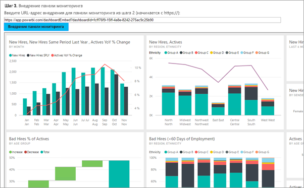
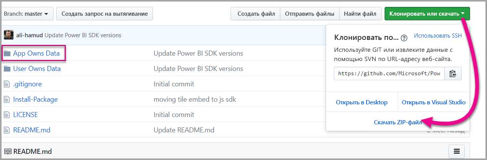

# <a name="tutorial-embed-a-power-bi-content-into-your-application-for-national-clouds"></a>Руководство. Внедрение содержимого Power BI в приложение для национальных облаков

Сведения о том, как для выполнить внедрение аналитического содержимого в бизнес-приложения для национальных облаков. Вы можете использовать пакет SDK Power BI для .NET и API Power BI для JavaScript для внедрения отчетов, панелей мониторинга или плиток в веб-приложение.

Power BI также поддерживает [национальные облака](https://docs.microsoft.com/azure/active-directory/develop/authentication-national-cloud).

Ниже приведены примеры различных национальных облаков:

* U.S. Government Community Cloud (GCC)

* U. S. Government Community Cloud High (GCC High)

* U. S. Military Contractors (DoDCON)

* U. S. Military (DoD)

* Power BI для облачных служб в Германии.

* Power BI для облачных служб в Китае



Для работы с руководством вам потребуется учетная запись **Power BI**. Если вы еще не настроили учетную запись, то можете выбрать подходящее национальное облако в зависимости от типа государственной организации или страны. Вы можете зарегистрировать учетную запись в [Power BI для государственных организаций США](../../service-govus-signup.md), [Power BI для облачных служб в Германии](https://powerbi.microsoft.com/power-bi-germany/?ru=https%3A%2F%2Fapp.powerbi.de%2F%3FnoSignUpCheck%3D1) или [Power BI для облачных служб в Китае](https://www.21vbluecloud.com/powerbi/).

> [!NOTE]
> Планируете внедрить панель мониторинга для организации? В таком случае см. статью об [интеграции панели мониторинга в приложение для организации](embed-sample-for-your-organization.md).

Чтобы интегрировать панель мониторинга в веб-приложение, используйте API **Power BI** и **токен доступа** авторизации Azure Active Directory (AD) для получения панели мониторинга. Затем загрузите панель мониторинга, используя маркер внедрения. **API Power BI** обеспечивает программный доступ к определенным ресурсам **Power BI**. Дополнительные сведения см. в документации по [REST API для Power BI](https://docs.microsoft.com/rest/api/power-bi/), [пакету SDK для .NET в Power BI и [интерфейсу API JavaScript для Power BI](https://github.com/Microsoft/PowerBI-JavaScript).

## <a name="download-the-sample"></a>Скачивание примера

В этой статье приведен код, используемый в [примере для данных, принадлежащих пользователю](https://github.com/Microsoft/PowerBI-Developer-Samples), на сайте GitHub. Для работы с этим пошаговым руководством можно загрузить пример кода. 



* Government Community Cloud (GCC):

    > [!NOTE]
    > Внедрение содержимого Power BI из облака сообщества для государственных организаций (GCC) возможно только с использованием SKU Office 365. Клиенты других национальных облаков могут использовать [SKU Office 365 или Azure](embedded-faq.md).

1. Замените содержимое файла Cloud.config на содержимое файла GCCCloud.config.

2. Обновите поля applicationId (идентификатор приложения для собственного приложения), workspaceId, user (главный пользователь) и password в файле Web.config.

3. Добавьте параметры GCC в файл web.config следующим образом.

```xml
<add key="authorityUrl" value="https://login.microsoftonline.net/common/" />
<add key="resourceUrl" value="https://analysis.usgovcloudapi.net/powerbi/api" />
<add key="apiUrl" value="https://api.powerbigov.us/" />
<add key="embedUrlBase" value="https://app.powerbigov.us" />
```

* Military Contractors (DoDCON):

1. Замените содержимое файла Cloud.config на содержимое файла TBCloud.config.

2. Обновите поля applicationId (идентификатор приложения для собственного приложения), workspaceId, user (главный пользователь) и password в файле Web.config.

3. Добавьте параметры DoDCON в файл web.config следующим образом.

```xml
<add key="authorityUrl" value="https://login.microsoftonlineS.net/common/" />
<add key="resourceUrl" value="https://high.analysis.usgovcloudapi.net/powerbi/api" />
<add key="apiUrl" value="https://api.high.powerbigov.us/" />
<add key="embedUrlBase" value="https://app.high.powerbigov.us" />
```

* Military (DoD):

1. Замените содержимое файла Cloud.config на содержимое файла PFCloud.config.

2. Обновите поля applicationId (идентификатор приложения для собственного приложения), workspaceId, user (главный пользователь) и password в файле Web.config.

3. Добавьте параметры DoDCON в файл web.config следующим образом.

```xml
<add key="authorityUrl" value="https://login.microsoftonline.net/common/" />
<add key="resourceUrl" value="https://mil.analysis.usgovcloudapi.net/powerbi/api" />
<add key="apiUrl" value="https://api.mil.powerbigov.us/" />
<add key="embedUrlBase" value="https://app.mil.powerbigov.us" />
```

* Параметры Power BI для облачных служб в Германии

1. Замените содержимое файла Cloud.config на содержимое Power BI для облачных служб в Германии.

2. Обновите поля applicationId (идентификатор приложения для собственного приложения), workspaceId, user (главный пользователь) и password в файле Web.config.

3. Добавьте параметры Power BI для облачных служб в Германии в файл web.config следующим образом.

```xml
<add key="authorityUrl" value="https://login.microsoftonline.de/common/" />
<add key="resourceUrl" value="https://analysis.cloudapi.de/powerbi/api" />
<add key="apiUrl" value="https://api.powerbi.de/" />
<add key="embedUrlBase" value="https://app.powerbi.de" />
```

* Параметры Power BI для облачных служб в Китае

1. Замените содержимое файла Cloud.config на содержимое [Power BI для облачных служб в Китае](https://github.com/Microsoft/PowerBI-Developer-Samples/blob/master/App%20Owns%20Data/PowerBIEmbedded_AppOwnsData/CloudConfigs/Power%20BI%20operated%20by%2021Vianet%20in%20China/Cloud.config).

2. Обновите поля applicationId (идентификатор приложения для собственного приложения), workspaceId, user (главный пользователь) и password в файле Web.config.

3. Добавьте параметры Power BI для облачных служб в Китае в файл web.config следующим образом.

```xml
<add key="authorityUrl" value="https://login.chinacloudapi.cn/common/" />
<add key="resourceUrl" value="https://analysis.chinacloudapi.cn/powerbi/api" />
<add key="apiUrl" value="https://api.powerbi.cn/" />
<add key="embedUrlBase" value="https://app.powerbi.cn" />
```

## <a name="step-1---register-an-app-in-azure-ad"></a>Шаг 1. Регистрация приложения в Azure AD

Зарегистрируйте приложение в AAD, чтобы осуществлять вызовы REST API. Дополнительные сведения см. в статье [Регистрация приложения Azure AD для внедрения содержимого Power BI](register-app.md). Так как национальные облака принадлежат различным организациям, существуют отдельные URL-адреса для регистрации приложений.

* Government Community Cloud (GCC) — ```https://app.powerbigov.us/apps```

* Military Contractors (DoDCON) — ```https://app.high.powerbigov.us/apps```

* Military (DoD) — ```https://app.mil.powerbigov.us/apps```

* Power BI для облачных служб в Германии — ```https://app.powerbi.de/apps```

* Power BI для облачных служб в Китае — ```https://app.powerbi.cn/apps```

Если вы скачали [пример внедрения для клиента](https://github.com/Microsoft/PowerBI-Developer-Samples/tree/master/App%20Owns%20Data), используйте полученный идентификатор приложения (**applicationId**) для аутентификации этого примера приложения в Azure AD. Для настройки примера измените значение **applicationId** в файле *web.config*.

## <a name="step-2---get-an-access-token-from-azure-ad"></a>Шаг 2. Получение маркера доступа из Azure AD

Перед вызовами REST API Power BI в приложении потребуется получить **маркер доступа** из Azure AD. Дополнительные сведения см. в статье [Authenticate users and get an Azure AD access token for your Power BI app](get-azuread-access-token.md) (Проверка подлинности для пользователей и получение маркера доступа Azure AD для приложения Power BI). Так как национальные облака принадлежат различным организациям, существуют отдельные URL-адреса для получения маркеров доступа для приложений.

* Government Community Cloud (GCC) — ```https://login.microsoftonline.com```

* Military Contractors (DoDCON) — ```https://login.microsoftonline.us```

* Military (DoD) — ```https://login.microsoftonline.us```

* Power BI для облачных служб в Германии — ```https://login.microsoftonline.de```

* Power BI для облачных служб в Китае — ```https://login.chinacloudapi.cn```

Примеры маркеров доступа можно найти в задачах для каждого элемента содержимого в файле **Controllers\HomeController.cs**.

## <a name="step-3---get-a-content-item"></a>Шаг 3. Получение элемента содержимого

Чтобы внедрить содержимое Power BI, вам потребуется выполнить несколько действий для проверки процесса внедрения. Эти действия можно выполнить при помощи API REST напрямую, но образец приложения и приведенные здесь примеры созданы при помощи пакета SDK для .NET.

### <a name="create-the-power-bi-client-with-your-access-token"></a>Создание клиента Power BI с использованием маркера доступа

Используя маркер доступа, можно создать объект клиента Power BI, что позволит вам взаимодействовать с API Power BI. Для создания объекта клиента Power BI маркер AccessToken упаковывается в объект *Microsoft.Rest.TokenCredentials*.

```csharp
using Microsoft.IdentityModel.Clients.ActiveDirectory;
using Microsoft.Rest;
using Microsoft.PowerBI.Api.V2;

var tokenCredentials = new TokenCredentials(authenticationResult.AccessToken, "Bearer");

// Create a Power BI Client object. This is used to call the Power BI APIs.
using (var client = new PowerBIClient(new Uri(ApiUrl), tokenCredentials))
{
    // Your code to embed items.
}
```

### <a name="get-the-content-item-you-want-to-embed"></a>Получение элемента содержимого, который нужно внедрить

Используйте объект клиента Power BI, чтобы получить ссылку на элемент, который требуется внедрить. Вы можете внедрять панели мониторинга, плитки или отчеты. Ниже показано, как получить первую панель мониторинга, плитку или отчет из определенной рабочей области.

Образец можно найти в файле **Controllers\HomeController.cs**[примера для данных, принадлежащих приложению](https://github.com/Microsoft/PowerBI-Developer-Samples/tree/master/App%20Owns%20Data).

#### <a name="reports"></a>Отчеты

```csharp
using Microsoft.PowerBI.Api.V2;
using Microsoft.PowerBI.Api.V2.Models;

// You need to provide the workspaceId where the dashboard resides.
ODataResponseListReport reports = client.Reports.GetReportsInGroupAsync(workspaceId);

// Get the first report in the group.
Report report = reports.Value.FirstOrDefault();
```

#### <a name="dashboards"></a>Панели мониторинга

```csharp
using Microsoft.PowerBI.Api.V2;
using Microsoft.PowerBI.Api.V2.Models;

// You need to provide the workspaceId where the dashboard resides.
ODataResponseListDashboard dashboards = client.Dashboards.GetDashboardsInGroup(workspaceId);

// Get the first report in the group.
Dashboard dashboard = dashboards.Value.FirstOrDefault();
```

#### <a name="tiles"></a>Плитки

```csharp
using Microsoft.PowerBI.Api.V2;
using Microsoft.PowerBI.Api.V2.Models;

// To retrieve the tile, you first need to retrieve the dashboard.

// You need to provide the workspaceId where the dashboard resides.
ODataResponseListDashboard dashboards = client.Dashboards.GetDashboardsInGroup(workspaceId);

// Get the first report in the group.
Dashboard dashboard = dashboards.Value.FirstOrDefault();

// Get a list of tiles from a specific dashboard
ODataResponseListTile tiles = client.Dashboards.GetTilesInGroup(workspaceId, dashboard.Id);

// Get the first tile in the group.
Tile tile = tiles.Value.FirstOrDefault();
```

### <a name="create-the-embed-token"></a>Создание маркера внедрения

С помощью API-интерфейса JavaScript можно создать токен внедрения. Токен внедрения связан только с внедряемым элементом. При каждом внедрении части содержимого Power BI нужно создавать для него новый токен внедрения. Дополнительные сведения, включая информацию о том, какой уровень **accessLevel** нужно использовать, см. в статье [Токен внедрения](https://docs.microsoft.com/rest/api/power-bi/embedtoken).

> [!IMPORTANT]
> Так как токены внедрения предназначены только для тестирования при разработке, количество таких токенов, создаваемых главной учетной записью Power BI, ограничено. Для сценариев внедрения в рабочей среде [необходимо приобрести емкость](https://docs.microsoft.com/power-bi/developer/embedded-faq#technical). В этом случае количество создаваемых токенов внедрения не ограничено.

Пример можно найти в файле **Controllers\HomeController.cs**[примера внедрения для организации](https://github.com/Microsoft/PowerBI-Developer-Samples/tree/master/App%20Owns%20Data).

Класс создается для **EmbedConfig** и **TileEmbedConfig**. Пример вы найдете в файлах **Models\EmbedConfig.cs** и **Models\TileEmbedConfig.cs**.

#### <a name="reports"></a>Отчеты

```csharp
using Microsoft.PowerBI.Api.V2;
using Microsoft.PowerBI.Api.V2.Models;

// Generate Embed Token.
var generateTokenRequestParameters = new GenerateTokenRequest(accessLevel: "view");
EmbedToken tokenResponse = client.Reports.GenerateTokenInGroup(workspaceId, report.Id, generateTokenRequestParameters);

// Generate Embed Configuration.
var embedConfig = new EmbedConfig()
{
    EmbedToken = tokenResponse,
    EmbedUrl = report.EmbedUrl,
    Id = report.Id
};
```

#### <a name="dashboards"></a>Панели мониторинга

```csharp
using Microsoft.PowerBI.Api.V2;
using Microsoft.PowerBI.Api.V2.Models;

// Generate Embed Token.
var generateTokenRequestParameters = new GenerateTokenRequest(accessLevel: "view");
EmbedToken tokenResponse = client.Dashboards.GenerateTokenInGroup(workspaceId, dashboard.Id, generateTokenRequestParameters);

// Generate Embed Configuration.
var embedConfig = new EmbedConfig()
{
    EmbedToken = tokenResponse,
    EmbedUrl = dashboard.EmbedUrl,
    Id = dashboard.Id
};
```

#### <a name="tiles"></a>Плитки

```csharp
using Microsoft.PowerBI.Api.V2;
using Microsoft.PowerBI.Api.V2.Models;

// Generate Embed Token for a tile.
var generateTokenRequestParameters = new GenerateTokenRequest(accessLevel: "view");
EmbedToken tokenResponse = client.Tiles.GenerateTokenInGroup(workspaceId, dashboard.Id, tile.Id, generateTokenRequestParameters);

// Generate Embed Configuration.
var embedConfig = new TileEmbedConfig()
{
    EmbedToken = tokenResponse,
    EmbedUrl = tile.EmbedUrl,
    Id = tile.Id,
    dashboardId = dashboard.Id
};
```

## <a name="step-4---load-an-item-using-javascript"></a>Шаг 4. Загрузка элемента с помощью JavaScript

Чтобы загрузить панель мониторинга в элемент div веб-страницы, вы можете использовать JavaScript. В этом примере используется модель EmbedConfig/TileEmbedConfig и представления панели мониторинга, плитки или отчета. С полным примером применения API JavaScript можно ознакомиться в [образце Microsoft Power BI Embedded](https://microsoft.github.io/PowerBI-JavaScript/demo).

Пример приложения доступен в [примере внедрения для организации](https://github.com/Microsoft/PowerBI-Developer-Samples/tree/master/App%20Owns%20Data).

### <a name="viewshomeembeddashboardcshtml"></a>Views\Home\EmbedDashboard.cshtml

```csharp
<script src="~/scripts/powerbi.js"></script>
<div id="dashboardContainer"></div>
<script>
    // Read embed application token from Model
    var accessToken = "@Model.EmbedToken.Token";

    // Read embed URL from Model
    var embedUrl = "@Html.Raw(Model.EmbedUrl)";

    // Read dashboard Id from Model
    var embedDashboardId = "@Model.Id";

    // Get models. models contains enums that can be used.
    var models = window['powerbi-client'].models;

    // Embed configuration used to describe the what and how to embed.
    // This object is used when calling powerbi.embed.
    // This also includes settings and options such as filters.
    // You can find more information at https://github.com/Microsoft/PowerBI-JavaScript/wiki/Embed-Configuration-Details.
    var config = {
        type: 'dashboard',
        tokenType: models.TokenType.Embed,
        accessToken: accessToken,
        embedUrl: embedUrl,
        id: embedDashboardId
    };

    // Get a reference to the embedded dashboard HTML element
    var dashboardContainer = $('#dashboardContainer')[0];

    // Embed the dashboard and display it within the div container.
    var dashboard = powerbi.embed(dashboardContainer, config);
</script>
```

### <a name="viewshomeembedtilecshtml"></a>Views\Home\EmbedTile.cshtml

```csharp
<script src="~/scripts/powerbi.js"></script>
<div id="tileContainer"></div>
<script>
    // Read embed application token from Model
    var accessToken = "@Model.EmbedToken.Token";

    // Read embed URL from Model
    var embedUrl = "@Html.Raw(Model.EmbedUrl)";

    // Read tile Id from Model
    var embedTileId = "@Model.Id";

    // Read dashboard Id from Model
    var embedDashboardId = "@Model.dashboardId";

    // Get models. models contains enums that can be used.
    var models = window['powerbi-client'].models;

    // Embed configuration used to describe the what and how to embed.
    // This object is used when calling powerbi.embed.
    // This also includes settings and options such as filters.
    // You can find more information at https://github.com/Microsoft/PowerBI-JavaScript/wiki/Embed-Configuration-Details.
    var config = {
        type: 'tile',
        tokenType: models.TokenType.Embed,
        accessToken: accessToken,
        embedUrl: embedUrl,
        id: embedTileId,
        dashboardId: embedDashboardId
    };

    // Get a reference to the embedded tile HTML element
    var tileContainer = $('#tileContainer')[0];

    // Embed the tile and display it within the div container.
    var tile = powerbi.embed(tileContainer, config);
</script>
```

### <a name="viewshomeembedreportcshtml"></a>Views\Home\EmbedReport.cshtml

```csharp
<script src="~/scripts/powerbi.js"></script>
<div id="reportContainer"></div>
<script>
    // Read embed application token from Model
    var accessToken = "@Model.EmbedToken.Token";

    // Read embed URL from Model
    var embedUrl = "@Html.Raw(Model.EmbedUrl)";

    // Read report Id from Model
    var embedReportId = "@Model.Id";

    // Get models. models contains enums that can be used.
    var models = window['powerbi-client'].models;

    // Embed configuration used to describe the what and how to embed.
    // This object is used when calling powerbi.embed.
    // This also includes settings and options such as filters.
    // You can find more information at https://github.com/Microsoft/PowerBI-JavaScript/wiki/Embed-Configuration-Details.
    var config = {
        type: 'report',
        tokenType: models.TokenType.Embed,
        accessToken: accessToken,
        embedUrl: embedUrl,
        id: embedReportId,
        permissions: models.Permissions.All,
        settings: {
            filterPaneEnabled: true,
            navContentPaneEnabled: true
        }
    };

    // Get a reference to the embedded report HTML element
    var reportContainer = $('#reportContainer')[0];

    // Embed the report and display it within the div container.
    var report = powerbi.embed(reportContainer, config);
</script>
```

## <a name="next-steps"></a>Дальнейшие действия

* Пример приложения для проверки можно найти на сайте GitHub. Примеры выше основаны на этом образце. Дополнительные сведения см. в [примере внедрения для организации](https://github.com/Microsoft/PowerBI-Developer-Samples/tree/master/App%20Owns%20Data).

* Дополнительные сведения об API-интерфейсе JavaScript для Power BI см. в [этой статье](https://github.com/Microsoft/PowerBI-JavaScript).

* Дополнительные сведения см. в статье с [ответами на часто задаваемые вопросы по Power BI для облачных служб в Германии ](https://docs.microsoft.com/power-bi/service-govde-faq)

* [Как перенести содержимое коллекции рабочих областей Power BI в Power BI](migrate-from-powerbi-embedded.md)

Рекомендации и ограничения

Появились дополнительные вопросы? [Попробуйте задать вопрос в сообществе Power BI.](https://community.powerbi.com/)
