# <a name="tutorial-embed-power-bi-content-into-an-application-for-your-organization"></a>Руководство. Внедрение содержимого Power BI в приложение для организации

В **Power BI** можно внедрять в приложение отчеты (Power BI или отчеты с разбивкой на страницы), панели мониторинга и плитки, используя принадлежащие пользователю данные. **Принадлежащие пользователю данные** для приложения расширяют возможности службы Power BI, позволяя использовать встроенную аналитику. В этом руководстве показано, как интегрировать отчет (Power BI или отчет с разбивкой на страницы) в приложение. Вы можете использовать пакет SDK для .NET Power BI и API Power BI для JavaScript для внедрения Power BI в приложение для вашей организации.

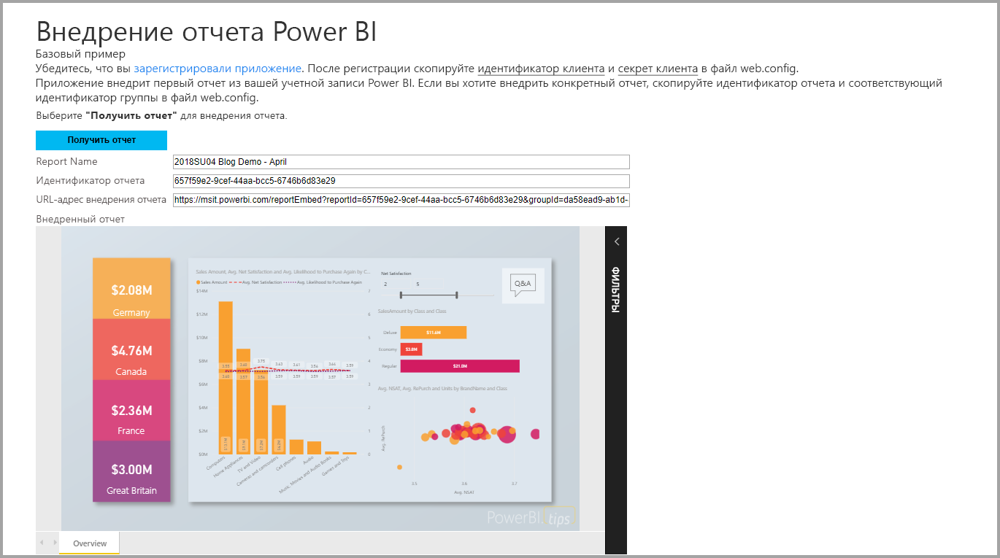

В этом руководстве вы выполните следующие задачи:
> [!div class="checklist"]
> * регистрация приложения в Azure;
> * внедрение отчета Power BI или отчета с разбивкой на страницы в приложение с помощью клиента Power BI.

## <a name="prerequisites"></a>Предварительные требования

Для работы вам понадобятся:

* [учетная запись Power BI Pro](../../fundamentals/service-self-service-signup-for-power-bi.md);
* подписка [Microsoft Azure](https://azure.microsoft.com/);
* собственная установка [клиента Azure Active Directory](create-an-azure-active-directory-tenant.md).
* Для внедрения отчетов с разбивкой на страницы требуется емкость не менее P1. См. статью [Какой размер емкости Premium требуется для отчетов с разбивкой на страницы?](../../paginated-reports/paginated-reports-faq.md#what-size-premium-capacity-do-i-need-for-paginated-reports)

Если вы не зарегистрированы в **Power BI**, перед началом работы [пройдите бесплатную регистрацию](https://powerbi.microsoft.com/pricing/).

Если у вас нет подписки Azure, перед началом работы [создайте бесплатную учетную запись](https://azure.microsoft.com/free/?WT.mc_id=A261C142F).

## <a name="set-up-your-embedded-analytics-development-environment"></a>Настройка среды разработки для встроенной аналитики

Чтобы внедрить в приложение отчеты, панели мониторинга и плитки, необходимо убедиться, что среда допускает внедрение с помощью Power BI.

Воспользуйтесь [средством настройки внедрения](https://aka.ms/embedsetup/UserOwnsData), чтобы быстро приступить к работе и скачать пример приложения с пошаговой инструкцией для создания среды и внедрения отчета. При внедрении отчета с разбивкой на страницы вам понадобится емкость не менее P1 для создаваемой рабочей области.

Если вы решили настроить среду вручную, см. инструкции ниже.

### <a name="register-an-application-in-azure-active-directory"></a>Регистрация приложения в Azure Active Directory

[Зарегистрируйте приложение](register-app.md) в Azure Active Directory, чтобы предоставить ему доступ к [REST API Power BI](https://docs.microsoft.com/rest/api/power-bi/). Регистрация приложения позволит создать удостоверение для приложения и предоставить ему разрешения на доступ к ресурсам REST Power BI.

Вам нужно зарегистрировать **веб-приложение на стороне сервера**, чтобы создать секрет приложения.

После создания приложения в Azure откройте его в службе Azure, выберите раздел *Проверка подлинности* и в разделе *URI перенаправления* добавьте **/Redirect** в поле *URI перенаправления*.

## <a name="set-up-your-power-bi-environment"></a>Настройка рабочей среды Power BI

### <a name="create-a-workspace"></a>Создать рабочую область

Если вы планируете внедрять отчеты, панели мониторинга и плитки в приложение для клиентов, необходимо разместить содержимое в рабочей области. Можно настроить рабочие области разных типов: [традиционные](../../collaborate-share/service-create-workspaces.md) или [новые](../../collaborate-share/service-create-the-new-workspaces.md).

### <a name="create-and-publish-your-power-bi-reports"></a>Создание и публикация отчетов Power BI

С помощью Power BI Desktop можно создавать отчеты и наборы данных. Затем можно публиковать эти отчеты в рабочей области. У пользователя, публикующего отчеты в рабочей области, должна быть лицензия Power BI Pro.

1. Скачайте [демонстрационный](https://github.com/Microsoft/powerbi-desktop-samples) пример из GitHub.

    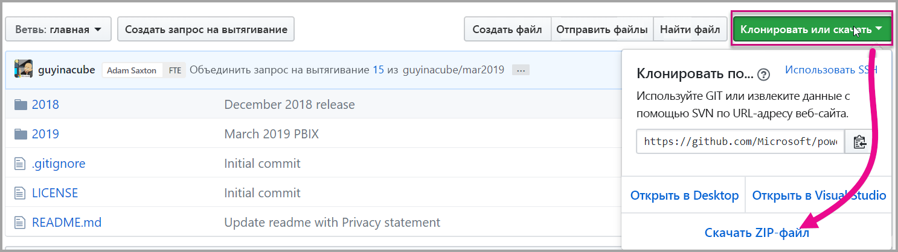

2. Откройте PBIX-файл с образцом отчета в Power BI Desktop.

   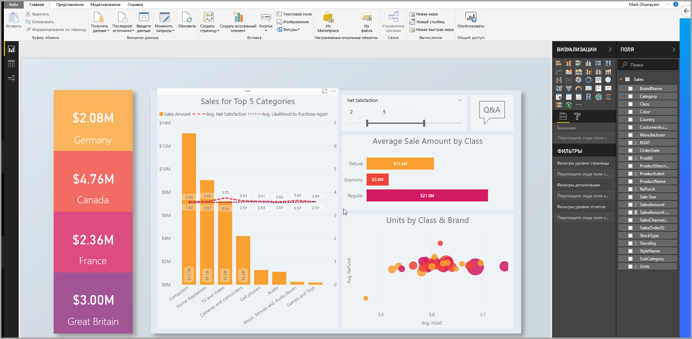

3. Опубликуйте его в рабочей области.

   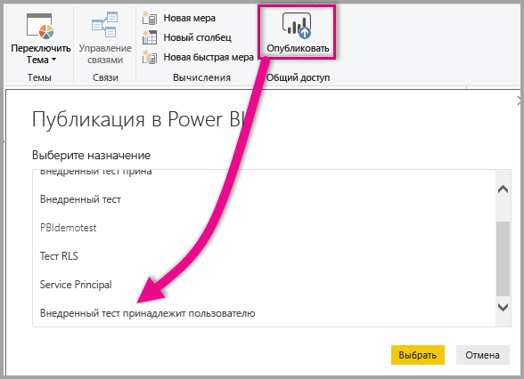

    Теперь вы можете просмотреть отчет в веб-службе Power BI.

   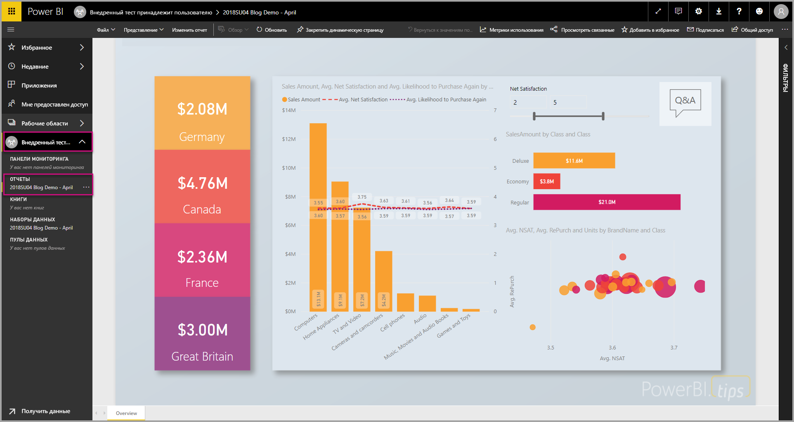
   
### <a name="create-and-publish-your-paginated-reports"></a>Создание и публикация отчетов с разбивкой на страницы

Для создания отчетов с разбивкой на страницы можно использовать [построитель отчетов Power BI](../../paginated-reports/paginated-reports-report-builder-power-bi.md#create-reports-in-power-bi-report-builder). Затем можно [отправить отчет](../../paginated-reports/paginated-reports-quickstart-aw.md#upload-the-report-to-the-service) в рабочую область, которой назначена емкость не менее P1. У конечного пользователя, отправляющего отчет, должна быть лицензия Power BI Pro на публикацию в рабочей области.
   
## <a name="embed-your-content-by-using-the-sample-application"></a>Внедрение содержимого с помощью примера приложения

Этот пример намеренно упрощен в целях наглядности.

Чтобы приступить к внедрению содержимого, используя пример приложения, выполните указанные ниже действия.

1. Скачайте [Visual Studio](https://www.visualstudio.com/) (версии 2013 или более поздней). Обязательно скачайте последнюю версию [пакета NuGet](https://www.nuget.org/profiles/powerbi).

2. Чтобы начать работу, скачайте [пример с данными, принадлежащими пользователю](https://github.com/Microsoft/PowerBI-Developer-Samples), из GitHub.

    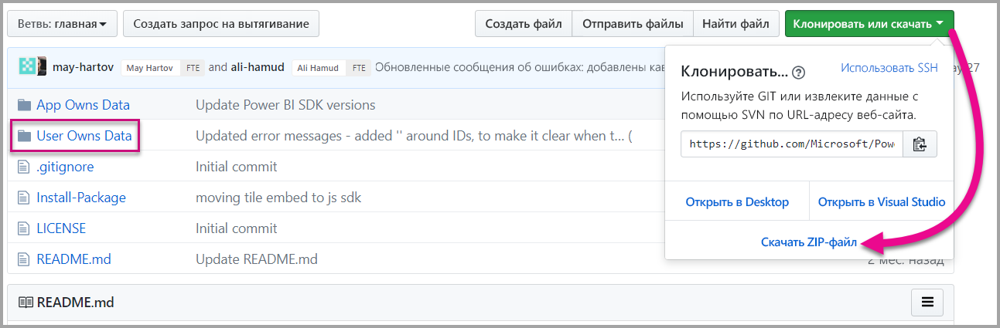

3. Откройте файл **Cloud.config** в примере приложения.

    Здесь есть поля, которые нужно заполнить, чтобы успешно запустить приложение.

    | Поле |
    |--------------------|
    | **[Идентификатор приложения](#application-id)** |
    | **[Идентификатор рабочей области](#workspace-id)** |
    | **[Идентификатор отчета](#report-id)** |
    | **[AADAuthorityUrl](#aadauthorityurl)** |

    

### <a name="application-id"></a>Идентификатор приложения

Укажите в поле **applicationId** значение **идентификатора приложения** из **Azure**. Поле **applicationId** используется приложением для его идентификации для пользователей, у которых запрашиваются разрешения.

Чтобы получить значение **applicationId**, сделайте следующее.

1. Войдите на [портал Azure](https://portal.azure.com).

2. В области навигации слева выберите **Все службы**, а затем — **Регистрация приложений**.

3. Выберите приложение, для которого требуется **applicationId**.

    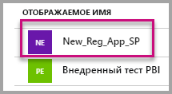

4. В поле **Идентификатор приложения** указан GUID. Используйте этот **идентификатор приложения** как значение параметра **applicationId** приложения.

    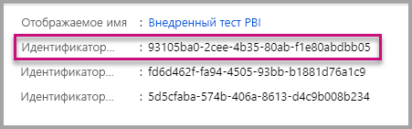

### <a name="workspace-id"></a>Идентификатор рабочей области

Укажите в поле **workspaceId** GUID рабочей области (группы) из Power BI. Эти данные можно получить из URL-адреса после входа в службу Power BI или с помощью PowerShell.

URL-адрес <br>


PowerShell <br>

```powershell
Get-PowerBIworkspace -name "User Owns Embed Test"
```

   

### <a name="report-id"></a>Идентификатор отчета

Укажите в поле **reportId** значение GUID отчета из Power BI. Эти данные можно получить из URL-адреса после входа в службу Power BI или с помощью PowerShell.

URL-адрес отчета Power BI <br>


URL-адрес отчета с разбивкой на страницы<br>


PowerShell <br>

```powershell
Get-PowerBIworkspace -name "User Owns Embed Test" | Get-PowerBIReport
```


### <a name="aadauthorityurl"></a>AADAuthorityUrl

Укажите в сведениях **AADAuthorityUrl** URL-адрес, который позволяет осуществлять внедрение с помощью клиента организации либо гостевого пользователя.

Для внедрения с помощью клиента организации используйте URL-адрес *https://login.microsoftonline.com/common/oauth2/authorize* .

Для внедрения с помощью гостя используйте URL-адрес `https://login.microsoftonline.com/report-owner-tenant-id`, где нужно добавить идентификатор клиента владельца отчета вместо *report-owner-tenant-id*.

### <a name="run-the-application"></a>Запуск приложения

1. Выберите **Запуск** в **Visual Studio**.

    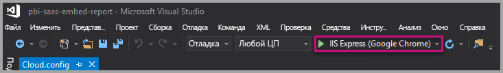

2. Теперь выберите **Внедрить отчет**. В зависимости от того, какое содержимое вы хотите проверить (отчеты, панели мониторинга или плитки), выберите нужный вариант в приложении.

    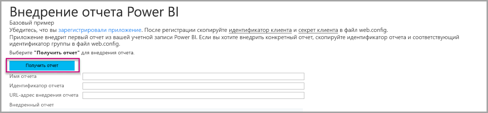

3. Теперь вы можете просмотреть отчет в примере приложения.

    

## <a name="embed-your-content-within-your-application"></a>Внедрение содержимого в приложении

Несмотря на то, что шаги по внедрению содержимого можно выполнить с помощью [интерфейсов REST API Power BI](https://docs.microsoft.com/rest/api/power-bi/), примеры кода, описанные в этой статье, созданы с помощью пакета SDK для .NET.

Чтобы интегрировать отчет в веб-приложение, используйте REST API Power BI или пакет SDK Power BI C#. Можно также использовать маркер доступа Azure Active Directory для получения отчета. Затем вы загружаете отчет, используя тот же токен доступа. REST API Power BI обеспечивает программный доступ к определенным ресурсам Power BI. Дополнительные сведения см. в документации по [интерфейсу REST API для Power BI](https://docs.microsoft.com/rest/api/power-bi/) и [интерфейсу API JavaScript для Power BI](https://github.com/Microsoft/PowerBI-JavaScript).

### <a name="get-an-access-token-from-azure-ad"></a>Получение токена доступа из Azure AD

Перед вызовами REST API Power BI в приложении потребуется получить маркер доступа из Azure AD. Дополнительные сведения см. в статье [Authenticate users and get an Azure AD access token for your Power BI app](get-azuread-access-token.md) (Проверка подлинности для пользователей и получение маркера доступа Azure AD для приложения Power BI).

### <a name="get-a-report"></a>Получение отчета

Для получения отчета Power BI или отчета с разбивкой на страницы используется операция [Получение отчетов](https://docs.microsoft.com/rest/api/power-bi/reports/getreports), возвращающая список отчетов Power BI и отчетов с разбивкой на страницы. В списке отчетов можно получить идентификатор отчета.

### <a name="get-reports-by-using-an-access-token"></a>Получение отчетов с помощью маркера доступа

Операция [Получение отчетов](https://docs.microsoft.com/rest/api/power-bi/reports/getreports) возвращает список отчетов. Можно получить один отчет в списке отчетов.

Для вызова REST API необходимо включить заголовок *авторизации* в формате *Носитель {маркер доступа}* .

#### <a name="get-reports-with-the-rest-api"></a>Получение отчетов с помощью REST API

Ниже приведен пример кода для получения отчетов с помощью REST API:

> [!Note]
> Пример получения элемента содержимого, который вы хотите внедрить, можно найти в файле Default.aspx.cs в [примере приложения](https://github.com/Microsoft/PowerBI-Developer-Samples). Это может быть отчет, панель мониторинга или плитка.

```csharp
using Newtonsoft.Json;

//Get a Report. In this sample, you get the first Report.
protected void GetReport(int index)
{
    //Configure Reports request
    System.Net.WebRequest request = System.Net.WebRequest.Create(
        String.Format("{0}/Reports",
        baseUri)) as System.Net.HttpWebRequest;

    request.Method = "GET";
    request.ContentLength = 0;
    request.Headers.Add("Authorization", String.Format("Bearer {0}", accessToken.Value));

    //Get Reports response from request.GetResponse()
    using (var response = request.GetResponse() as System.Net.HttpWebResponse)
    {
        //Get reader from response stream
        using (var reader = new System.IO.StreamReader(response.GetResponseStream()))
        {
            //Deserialize JSON string
            PBIReports Reports = JsonConvert.DeserializeObject<PBIReports>(reader.ReadToEnd());

            //Sample assumes at least one Report.
            //You could write an app that lists all Reports
            if (Reports.value.Length > 0)
            {
                var report = Reports.value[index];

                txtEmbedUrl.Text = report.embedUrl;
                txtReportId.Text = report.id;
                txtReportName.Text = report.name;
            }
        }
    }
}

//Power BI Reports used to deserialize the Get Reports response.
public class PBIReports
{
    public PBIReport[] value { get; set; }
}
public class PBIReport
{
    public string id { get; set; }
    public string reportType { get; set }
    public string name { get; set; }
    public string webUrl { get; set; }
    public string embedUrl { get; set; }
}
```

#### <a name="get-reports-by-using-the-net-sdk"></a>Получение отчетов с помощью пакета SDK для .NET

Вы можете использовать пакет SDK для .NET, чтобы получить список отчетов, не вызывая REST API напрямую. В следующем примере кода показано, как получить список отчетов:

```csharp
using Microsoft.IdentityModel.Clients.ActiveDirectory;
using Microsoft.PowerBI.Api.V2;
using Microsoft.PowerBI.Api.V2.Models;

var tokenCredentials = new TokenCredentials(<ACCESS TOKEN>, "Bearer");

// Create a Power BI Client object. It is used to call Power BI APIs.
using (var client = new PowerBIClient(new Uri(ApiUrl), tokenCredentials))
{
    // Get the first report all reports in that workspace
    ODataResponseListReport reports = client.Reports.GetReports();

    Report report = reports.Value.FirstOrDefault();

    var embedUrl = report.EmbedUrl;
}
```

### <a name="load-a-report-by-using-javascript"></a>Загрузка отчета с помощью JavaScript

Чтобы загрузить отчет в элемент div веб-страницы, вы можете использовать JavaScript. Ниже приведен пример кода для получения отчета из определенной рабочей области:

> [!NOTE]  
> Пример загрузки элемента содержимого, который вы хотите внедрить, можно найти в файле **Default.aspx** в [примере приложения](https://github.com/Microsoft/PowerBI-Developer-Samples).

```javascript
<!-- Embed Report-->
<div> 
    <asp:Panel ID="PanelEmbed" runat="server" Visible="true">
        <div>
            <div><b class="step">Step 3</b>: Embed a report</div>

            <div>Enter an embed url for a report from Step 2 (starts with https://):</div>
            <input type="text" id="tb_EmbedURL" style="width: 1024px;" />
            <br />
            <input type="button" id="bEmbedReportAction" value="Embed Report" />
        </div>

        <div id="reportContainer"></div>
    </asp:Panel>
</div>
```

#### <a name="sitemaster"></a>Site.master

```javascript
window.onload = function () {
    // client side click to embed a selected report.
    var el = document.getElementById("bEmbedReportAction");
    if (el.addEventListener) {
        el.addEventListener("click", updateEmbedReport, false);
    } else {
        el.attachEvent('onclick', updateEmbedReport);
    }

    // handle server side post backs, optimize for reload scenarios
    // show embedded report if all fields were filled in.
    var accessTokenElement = document.getElementById('MainContent_accessTokenTextbox');
    if (accessTokenElement !== null) {
        var accessToken = accessTokenElement.value;
        if (accessToken !== "")
            updateEmbedReport();
    }
};

// update embed report
function updateEmbedReport() {

    // check if the embed url was selected
    var embedUrl = document.getElementById('tb_EmbedURL').value;
    if (embedUrl === "")
        return;

    // get the access token.
    accessToken = document.getElementById('MainContent_accessTokenTextbox').value;

    // Embed configuration used to describe the what and how to embed.
    // This object is used when calling powerbi.embed.
    // You can find more information at https://github.com/Microsoft/PowerBI-JavaScript/wiki/Embed-Configuration-Details.
    var config = {
        type: 'report',
        accessToken: accessToken,
        embedUrl: embedUrl
    };

    // Grab the reference to the div HTML element that will host the report.
    var reportContainer = document.getElementById('reportContainer');

    // Embed the report and display it within the div container.
    var report = powerbi.embed(reportContainer, config);

    // report.on will add an event handler which prints to Log window.
    report.on("error", function (event) {
        var logView = document.getElementById('logView');
        logView.innerHTML = logView.innerHTML + "Error<br/>";
        logView.innerHTML = logView.innerHTML + JSON.stringify(event.detail, null, "  ") + "<br/>";
        logView.innerHTML = logView.innerHTML + "---------<br/>";
    }
  );
}
```

## <a name="using-a-power-bi-premium-dedicated-capacity"></a>Использование выделенной емкости Power BI Premium

После разработки приложения нужно вернуться к рабочей области с выделенной емкостью.

### <a name="create-a-dedicated-capacity"></a>Создание выделенной емкости

Создав выделенную емкость, вы получите преимущество выделенного ресурса для содержимого в рабочей области. Для отчетов с разбивкой на страницы рабочая область должна иметь емкость не менее P1. Вы можете создать выделенную емкость с помощью [Power BI Premium](../../admin/service-premium-what-is.md).

В таблице ниже перечислены номера SKU Power BI Premium, доступные в [Microsoft 365](../../admin/service-admin-premium-purchase.md).

| Узел емкости | Общее количество виртуальных ядер<br/>(серверная часть + внешний интерфейс) | Виртуальные ядра в серверной части | Виртуальные ядра для внешнего интерфейса | Ограничения для подключений DirectQuery и активных подключений |
| --- | --- | --- | --- | --- | --- |
| EM1 |1 виртуальное ядро |0,5 виртуальных ядер, 3 ГБ ОЗУ |0,5 виртуальных ядер |3,75 в секунду |
| EM2 |2 виртуальных ядра |1 виртуальное ядро, 5 ГБ ОЗУ |1 виртуальное ядро |7,5 в секунду |
| EM3 |4 виртуальных ядра |2 виртуальных ядра, 10 ГБ ОЗУ |2 виртуальных ядра |15 в секунду |
| P1 |8 виртуальных ядер |4 виртуальных ядра, 25 ГБ ОЗУ |4 виртуальных ядра |30 в секунду |
| P2 |16 виртуальных ядер |8 виртуальных ядер, 50 ГБ ОЗУ |8 виртуальных ядер |60 в секунду |
| P3 |32 виртуальных ядра |16 виртуальных ядер, 100 ГБ ОЗУ |16 виртуальных ядер |120 в секунду |
| P4 |64 виртуальных ядра |32 виртуальных ядра, 200 ГБ ОЗУ |32 виртуальных ядра |240 в секунду |
| P5 |128 виртуальных ядер |64 виртуальных ядра, 400 ГБ ОЗУ |64 виртуальных ядра |480 в секунду |

> [!NOTE]
> - Если вы пытаетесь выполнить внедрение с приложениями Microsoft Office, вы можете использовать номера SKU EM для доступа к содержимому по бесплатной лицензии Power BI. Но нельзя получить доступ к содержимому с бесплатной лицензией Power BI, если вы используете Powerbi.com или Power BI Mobile.
> - Если вы хотите выполнить внедрение с приложениями Microsoft Office через Powerbi.com или Power BI Mobile, вы можете получить доступ к содержимому с бесплатной лицензией Power BI.

### <a name="assign-a-workspace-to-a-dedicated-capacity"></a>Назначение выделенной емкости для рабочей области

После создания выделенной емкости ей можно назначить рабочую область. Для этого сделайте следующее:

1. В службе Power BI разверните рабочие области и щелкните многоточие возле рабочей области, которую вы используете для внедрения содержимого. Затем выберите команду **Изменить рабочие области**.

    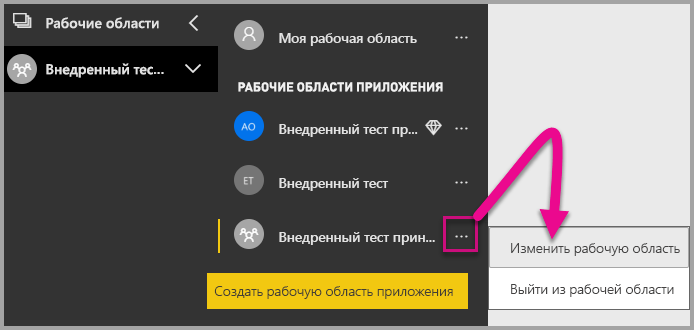

2. Разверните раздел **Дополнительно** и включите **Выделенную емкость**. Выберите выделенную емкость, которую вы создали. Затем выберите **Сохранить**.

    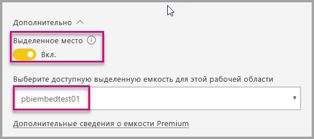

3. После нажатия кнопки **Сохранить** рядом с именем рабочей области должен появиться ромб.

    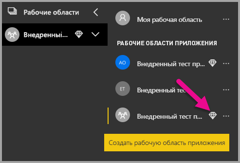

## <a name="admin-settings"></a>Параметры администратора

Глобальные администраторы или администраторы служб Power BI могут включать и отключать возможность использования REST API для клиента. Администраторы Power BI могут задать этот параметр для всей организации или отдельных групп безопасности. По умолчанию он включен для всей организации. Можно внести эти изменения на [портале администрирования Power BI](../../admin/service-admin-portal.md).

## <a name="next-steps"></a>Дальнейшие действия

В этом руководстве вы узнали, как внедрить содержимое Power BI в свое приложение с помощью учетной записи организации Power BI. Теперь вы можете попробовать внедрить содержимое Power BI в приложение с помощью приложений. Кроме того, вы можете попробовать внедрить содержимое Power BI для своих клиентов (на данный момент не поддерживается внедрение отчетов с разбивкой на страницы):

> [!div class="nextstepaction"]
> [Внедрение из приложений](embed-from-apps.md)

> [!div class="nextstepaction"]
>[Внедрение для клиентов](embed-sample-for-customers.md)

Если у вас возникли вопросы, [задайте их участникам сообщества Power BI](https://community.powerbi.com/).
