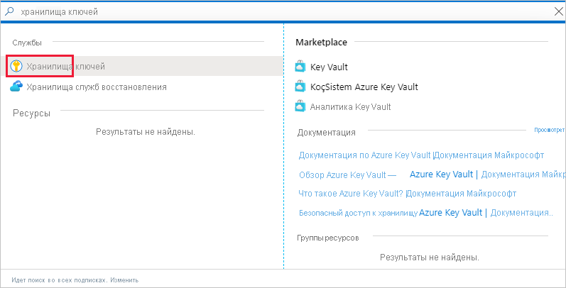
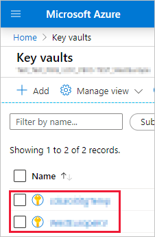

# <a name="embed-power-bi-content-with-service-principal-and-a-certificate"></a>Внедрение содержимого Power BI с помощью субъект-службы и сертификата

[!INCLUDE[service principal overview](../../includes/service-principal-overview.md)]

>[!NOTE]
>Рекомендуем защищать серверные службы с помощью сертификатов, а не секретных ключей. [Дополнительные сведения о получении маркеров доступа из Azure AD с помощью секретных ключей или сертификатов](https://docs.microsoft.com/azure/architecture/multitenant-identity/client-assertion).

## <a name="certificate-based-authentication"></a>Аутентификация на основе сертификата

Аутентификация на основе сертификата позволяет Azure Active Directory (Azure AD) выполнять аутентификацию с помощью сертификата клиента, который находится на устройстве Windows, Android или iOS или хранится в [Azure Key Vault](https://docs.microsoft.com/azure/key-vault/basic-concepts).

Этот метод проверки подлинности позволяет управлять сертификатами (менять их или отзывать) из одного места, используя ЦС.

Дополнительные сведения о сертификатах в Azure AD см. на странице GitHub [Потоки учетных данных клиента](https://github.com/AzureAD/microsoft-authentication-library-for-dotnet/wiki/Client-credential-flows).

## <a name="method"></a>Метод

Чтобы использовать субъект-службу и сертификат со встроенной аналитикой, выполните следующие действия.

1. Создание сертификата.

2. Создайте приложение Azure AD.

3. Настройте проверку подлинности сертификата.

4. Получите сертификат из Azure Key Vault.

5. Выполните проверку подлинности, используя субъект-службу и сертификат.

## <a name="step-1---create-a-certificate"></a>Шаг 1. Создание сертификата

Сертификат можно получить из доверенного *центра сертификации* или создать самостоятельно.

В этом разделе описывается создание сертификата с помощью [Azure Key Vault](https://docs.microsoft.com/azure/key-vault/create-certificate) и скачивания *CER*-файла, содержащего открытый ключ.

1. Выполните вход в [Microsoft Azure](https://ms.portal.azure.com/#allservices).

2. Найдите **Хранилища ключей** и щелкните ссылку **Хранилища ключей**.

    

3. Щелкните хранилище ключей, в которое нужно добавить сертификат.

    

4. Щелкните **Сертификаты**.

    

5. Щелкните **Создать или импортировать**.

    

6. Настройте поля в окне **Создание сертификата** следующим образом.

    * **Метод создания сертификата**: общий.

    * **Имя сертификата**: введите имя своего сертификата.

    * **Тип центра сертификации (ЦС)** : самозаверяющий сертификат

    * **Тема**: различающееся имя [X.500](https://wikipedia.org/wiki/X.500)

    * **Имена DNS**: 0 имен DNS

    * **Срок действия (в месяцах)** : введите срок действия сертификата

    * **Тип содержимого**: PKCS #12

    * **Тип действия времени существования**: автоматически продлить по прошествии указанного процента от времени существования

    * **Процент от времени существования**: 80

    * **Расширенная настройка политик**: не настроено

7. Нажмите кнопку **Создать**. Созданный сертификат будет по умолчанию отключен. Активация может занять до пяти минут.

8. Выберите созданный сертификат.

9. Щелкните **Скачать в формате CER**. Загруженный файл будет содержать открытый ключ.

    

## <a name="step-2---create-an-azure-ad-application"></a>Шаг 2. Создание приложения Azure AD

[!INCLUDE[service principal create app](../../includes/service-principal-create-app.md)]

## <a name="step-3---set-up-certificate-authentication"></a>Шаг 3. Настройка проверки подлинности сертификата

1. В приложении Azure AD откройте вкладку **Сертификаты и секреты**.

     

2. Щелкните **Отправить сертификат** и отправьте *CER*-файл, созданный и скачанный при выполнении [первого шага](#step-1---create-a-certificate) этого учебника. В *CER*-файле содержится открытый ключ.

## <a name="step-4---get-the-certificate-from-azure-key-vault"></a>Шаг 4. Получение сертификата из Azure Key Vault

Для получения сертификата из Azure Key Vault используйте управляемое удостоверение службы (MSI). Этот процесс включает получение сертификата *PFX*, который содержит как открытый, так и закрытый ключи.

См. пример кода чтения сертификата из Azure Key Vault. Если вы хотите использовать Visual Studio, см. статью [Настройка Visual Studio для использования MSI](#configure-visual-studio-to-use-msi).

```csharp
private X509Certificate2 ReadCertificateFromVault(string certName)
{
    var serviceTokenProvider = new AzureServiceTokenProvider();
    var keyVaultClient = new KeyVaultClient(new KeyVaultClient.AuthenticationCallback(serviceTokenProvider.KeyVaultTokenCallback));
    CertificateBundle certificate = null;
    SecretBundle secret = null;
    try
    {
        certificate = keyVaultClient.GetCertificateAsync($"https://{KeyVaultName}.vault.azure.net/", certName).Result;
        secret = keyVaultClient.GetSecretAsync(certificate.SecretIdentifier.Identifier).Result;
    }
    catch (Exception)
    {
        return null;
    }

    return new X509Certificate2(Convert.FromBase64String(secret.Value));
}
```

## <a name="step-5---authenticate-using-service-principal-and-a-certificate"></a>Шаг 5. Проверка подлинности с помощью субъект-службы и сертификата

Чтобы проверить подлинность приложения, можно использовать субъект-службу и сертификат, хранящийся в Azure Key Vault, подключившись к Azure Key Vault.

Пример подключения и чтения сертификата из Azure Key Vault см. в приведенном ниже коде.

>[!NOTE]
>Если у вас уже есть сертификат, созданный вашей организацией, отправьте *PFX*-файл в Azure Key Vault.

```csharp
// Preparing needed variables
var Scope = "https://analysis.windows.net/powerbi/api/.default"
var ApplicationId = "{YourApplicationId}"
var tenantSpecificURL = "https://login.microsoftonline.com/{YourTenantId}/"
X509Certificate2 certificate = ReadCertificateFromVault(CertificateName);

// Authenticating with a SP and a certificate
public async Task<AuthenticationResult> DoAuthentication(){
    IConfidentialClientApplication clientApp = null;
    clientApp = ConfidentialClientApplicationBuilder.Create(ApplicationId)
                                                    .WithCertificate(certificate)
                                                    .WithAuthority(tenantSpecificURL)
                                                    .Build();
    try
    {
        authenticationResult = await clientApp.AcquireTokenForClient(Scope).ExecuteAsync();
    }
    catch (MsalException)
    {
        throw;
    }
    return authenticationResult
}
```

## <a name="configure-visual-studio-to-use-msi"></a>Настройка Visual Studio для использования MSI

При создании внедренного решения может быть полезно настроить Visual Studio для использования управляемого удостоверения службы (MSI). [MSI](https://docs.microsoft.com/azure/active-directory/managed-identities-azure-resources/overview) — это функция, с помощью которой вы сможете управлять своим удостоверением Azure AD. После настройки она позволит Visual Studio пройти проверку подлинности в Azure Key Vault.

1. Откройте проект в Visual Studio.

2. Щелкните **Средства**  >  **Параметры**.

     

3. Найдите **Выбор учетной записи** и щелкните **Выбор учетной записи**.

    

4. Добавьте учетную запись, имеющую доступ к Azure Key Vault.

[!INCLUDE[service principal limitations](../../includes/service-principal-limitations.md)]

## <a name="next-steps"></a>Дальнейшие действия

>[!div class="nextstepaction"]
>[Регистрация приложения](register-app.md)

>[!div class="nextstepaction"]
>[Power BI Embedded для клиентов](embed-sample-for-customers.md)

>[!div class="nextstepaction"]
>[Объекты приложения и субъекта-службы в Azure Active Directory](https://docs.microsoft.com/azure/active-directory/develop/app-objects-and-service-principals)

>[!div class="nextstepaction"]
>[Безопасность на уровне строк с использованием локального шлюза данных с субъектом-службой](embedded-row-level-security.md#on-premises-data-gateway-with-service-principal)

>[!div class="nextstepaction"]
>[Внедрение содержимого Power BI с помощью субъект-службы и секрета приложения](embed-service-principal.md)