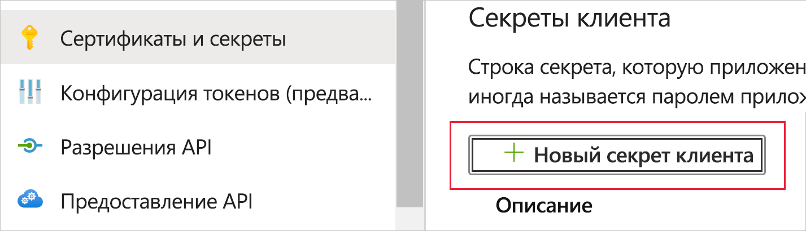
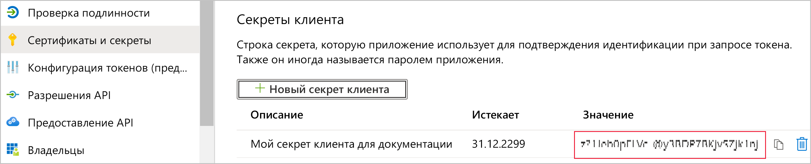
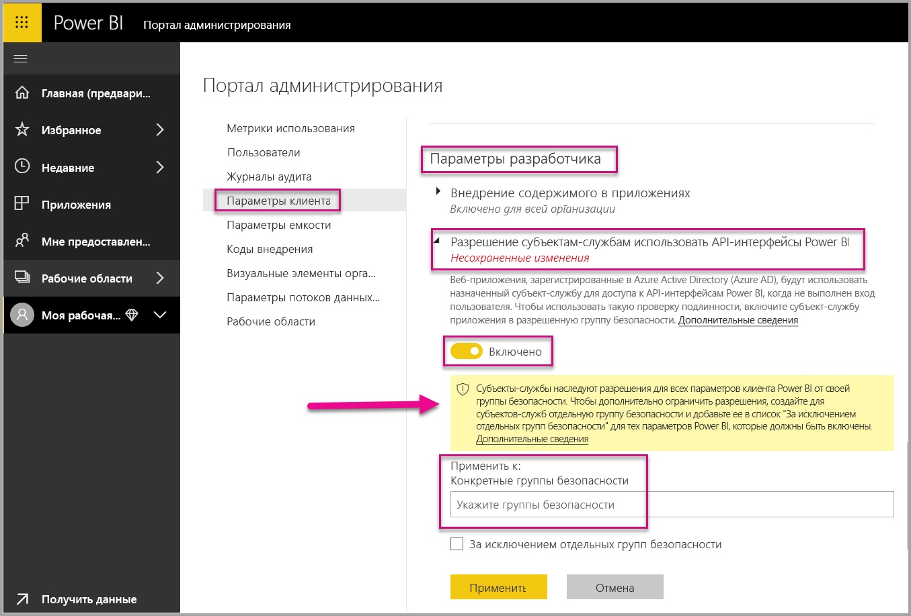
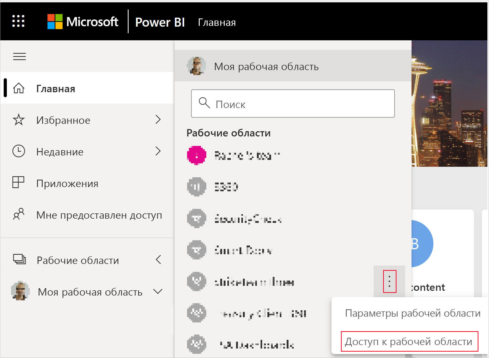
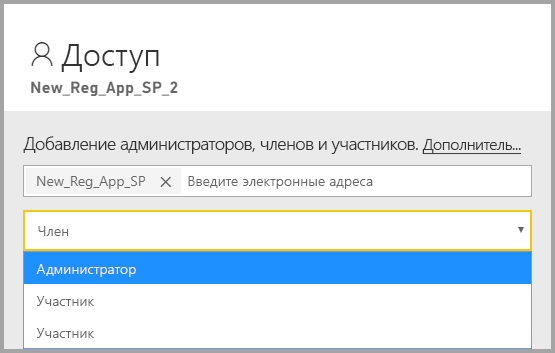

# <a name="embed-power-bi-content-with-service-principal-and-an-application-secret"></a>Внедрение содержимого Power BI с помощью субъект-службы и секрета приложения

[!INCLUDE[service principal overview](../../includes/service-principal-overview.md)]

В этой статье описывается проверка подлинности субъекта-службы с помощью *идентификатора приложения* и *секрета приложения*.

>[!NOTE]
>Рекомендуем защищать серверные службы с помощью сертификатов, а не секретных ключей.
>* [Дополнительные сведения о получении маркеров доступа из Azure AD с помощью секретных ключей или сертификатов](https://docs.microsoft.com/azure/architecture/multitenant-identity/client-assertion).
>* [Внедрение содержимого Power BI с помощью субъекта-службы и сертификата](embed-service-principal-certificate.md)

## <a name="method"></a>Метод

Чтобы использовать субъект-службу и идентификатор приложения со встроенной аналитикой, выполните следующие действия.

1. Создайте [приложение Azure AD](https://docs.microsoft.com/azure/active-directory/manage-apps/what-is-application-management).

    1. Создайте секрет приложения Azure AD.
    
    2. Получите *Идентификатор приложения* и *Секрет приложения*.

    >[!NOTE]
    >Эти действия описаны в **шаге 1**. Дополнительные сведения о создании приложения Azure AD см. в статье [Создание приложения Azure AD](https://docs.microsoft.com/azure/active-directory/develop/howto-create-service-principal-portal).

2. Создайте группу безопасности Azure AD.

3. Включите параметры администрирования службы Power BI.

4. Добавьте субъект-службу в рабочую область.

5. Внедрите свое содержимое.

> [!IMPORTANT]
> После активации субъекта-службы для использования с Power BI разрешения приложения в Active Directory перестают действовать. В дальнейшем управление разрешениями приложения осуществляется на портале администрирования Power BI.

## <a name="step-1---create-an-azure-ad-app"></a>Шаг 1. Создание приложения Azure AD

Создайте приложение Azure AD одним из методов, перечисленных ниже.
* Создать приложение на [портале Microsoft Azure](https://portal.azure.com/#allservices)
* Создать приложение с помощью [PowerShell](https://docs.microsoft.com/powershell/azure/create-azure-service-principal-azureps?view=azps-3.6.1).

### <a name="creating-an-azure-ad-app-in-the-microsoft-azure-portal"></a>Создание приложения Azure AD на портале Microsoft Azure

[!INCLUDE[service create app](../../includes/service-principal-create-app.md)]

7. Перейдите на вкладку **Сертификаты и секреты**.

     


8. Щелкните **Создать секрет клиента**.

    

9. В окне *Добавление секрета клиента* введите описание, укажите, когда должен истечь срок действия секрета клиента, и нажмите кнопку **Добавить**.

10. Скопируйте и сохраните значение *Секрет клиента*.

    

    >[!NOTE]
    >После закрытия этого окна значение секрета клиента будет скрыто, и вы не сможете снова просмотреть или скопировать его.

### <a name="creating-an-azure-ad-app-using-powershell"></a>Создание приложения Azure AD с помощью PowerShell

В этом разделе содержится пример скрипта для создания нового приложения Azure AD с помощью [PowerShell](https://docs.microsoft.com/powershell/azure/create-azure-service-principal-azureps?view=azps-1.1.0).

```powershell
# The app ID - $app.appid
# The service principal object ID - $sp.objectId
# The app key - $key.value

# Sign in as a user that's allowed to create an app
Connect-AzureAD

# Create a new Azure AD web application
$app = New-AzureADApplication -DisplayName "testApp1" -Homepage "https://localhost:44322" -ReplyUrls "https://localhost:44322"

# Creates a service principal
$sp = New-AzureADServicePrincipal -AppId $app.AppId

# Get the service principal key
$key = New-AzureADServicePrincipalPasswordCredential -ObjectId $sp.ObjectId
```

## <a name="step-2---create-an-azure-ad-security-group"></a>Шаг 2. Создание группы безопасности Azure AD

У субъекта-службы нет доступа к любому содержимому и API-интерфейсам Power BI. Чтобы предоставить субъекту-службе доступ, создайте группу безопасности в Azure AD и добавьте созданный субъект-службу в эту группу безопасности.

Существует два способа создания группы безопасности Azure AD.
* Вручную (в Azure)
* Регистрация с помощью PowerShell

### <a name="create-a-security-group-manually"></a>Создание группы безопасности вручную

Чтобы создать группу безопасности Azure вручную, следуйте инструкциям в статье [Создание простой группы и добавление в нее участников с помощью Azure Active Directory](https://docs.microsoft.com/azure/active-directory/fundamentals/active-directory-groups-create-azure-portal). 

### <a name="create-a-security-group-using-powershell"></a>Создание группы безопасности с помощью PowerShell

Ниже приведен пример скрипта для создания новой группы безопасности и добавления приложения в эту группу безопасности.

>[!NOTE]
>Если вы хотите включить доступ субъекта-службы для всей организации, пропустите этот шаг.

```powershell
# Required to sign in as a tenant admin
Connect-AzureAD

# Create an Azure AD security group
$group = New-AzureADGroup -DisplayName <Group display name> -SecurityEnabled $true -MailEnabled $false -MailNickName notSet

# Add the service principal to the group
Add-AzureADGroupMember -ObjectId $($group.ObjectId) -RefObjectId $($sp.ObjectId)
```

## <a name="step-3---enable-the-power-bi-service-admin-settings"></a>Шаг 3. Включение параметров администрирования службы Power BI

Чтобы приложение Azure AD могло получить доступ к содержимому и API-интерфейсам Power BI, администратор Power BI должен включить доступ субъекта-службы на портале администрирования Power BI.

Добавьте группу безопасности, созданную в Azure AD, в раздел отдельных групп безопасности на странице **Параметры разработчика**.

>[!IMPORTANT]
>Субъекты-службы имеют доступ ко всем параметрам клиента, для которых они включены. В зависимости от параметров администратора, это может быть определенная группа безопасности или вся организация.
>
>Чтобы ограничить доступ субъекта-службы к параметрам определенного клиента, разрешите доступ только к определенным группам безопасности. Кроме того, можно создать выделенную группу безопасности для субъектов-служб и исключить ее из параметров нужного клиента.



## <a name="step-4---add-the-service-principal-to-your-workspace"></a>Шаг 4. Добавление субъект-службы в рабочую область

Чтобы включить артефакты доступа к приложению Azure AD, такие как отчеты, панели мониторинга и наборы данных в службу Power BI, добавьте сущность субъекта-службы в качестве участника или администратора в рабочую область.

>[!NOTE]
>В этом разделе содержатся инструкции для пользовательского интерфейса. Вы также можете добавить субъект-службу в рабочую область, используя команду [Groups — add group user API](https://docs.microsoft.com/rest/api/power-bi/groups/addgroupuser) (Группы — добавление API-интерфейса пользователя группы).

1. Перейдите к рабочей области, для которой требуется включить доступ, а затем в меню **Еще** выберите команду **Доступ к рабочей области**.

    

2. Добавьте субъект-службу как **Администратор** или **Участник** в эту рабочую область.

    

## <a name="step-5---embed-your-content"></a>Шаг 5. Внедрение содержимого

Вы можете внедрить содержимое в пример приложения или в собственное приложение.

* [Внедрение содержимого с помощью примера приложения](embed-sample-for-customers.md#embed-content-using-the-sample-application)
* [Внедрение содержимого в приложении](embed-sample-for-customers.md#embed-content-within-your-application)

После того, как содержимое будет внедрено, вы можете [переносить его в производственную среду](embed-sample-for-customers.md#move-to-production).

[!INCLUDE[service principal limitations](../../includes/service-principal-limitations.md)]

## <a name="next-steps"></a>Дальнейшие действия

>[!div class="nextstepaction"]
>[Регистрация приложения](register-app.md)

> [!div class="nextstepaction"]
>[Power BI Embedded для клиентов](embed-sample-for-customers.md)

>[!div class="nextstepaction"]
>[Объекты приложения и субъекта-службы в Azure Active Directory](https://docs.microsoft.com/azure/active-directory/develop/app-objects-and-service-principals)

>[!div class="nextstepaction"]
>[Безопасность на уровне строк с использованием локального шлюза данных с субъектом-службой](embedded-row-level-security.md#on-premises-data-gateway-with-service-principal)

>[!div class="nextstepaction"]
>[Внедрение содержимого Power BI с помощью субъект-службы и сертификата](embed-service-principal-certificate.md)
