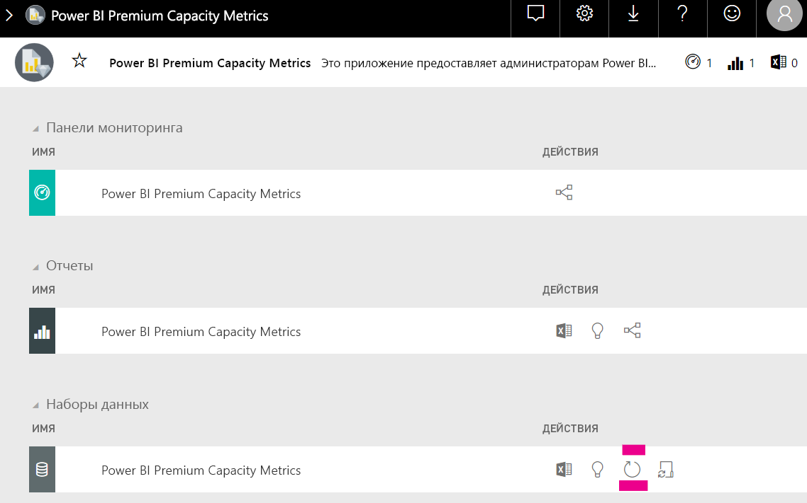

# Планирование ресурсов в аналитике Power BI Embedded

Вычисление типа ресурсов, необходимых для развертывания аналитики Power BI Embedded, может быть сложным. Это обусловлено тем, что такое вычисление основано на нескольких параметрах, некоторые из них сложно прогнозировать.

При планировании ресурсов необходимо учитывать следующие факторы:

* модели данных, которые вы используете;
* число и сложность необходимых запросов;
* почасовое распределение использования приложений;
* частота обновления данных;
* дополнительные шаблоны использования, которые трудно прогнозировать.

Эта статья призвана облегчить планирование ресурсов для аналитики Power BI Embedded с помощью [средства оценки нагрузки для выделенной емкости Power BI](https://github.com/microsoft/PowerBI-Tools-For-Capacities/tree/master/LoadTestingPowerShellTool/), созданного для автоматизации нагрузочного тестирования ресурсов аналитики Power BI Embedded (номера SKU *A*, *EM* и *P*).

## Средство планирования

 [Средство оценки нагрузки для выделенной емкости Power BI](https://github.com/microsoft/PowerBI-Tools-For-Capacities/tree/master/LoadTestingPowerShellTool/) поможет вам понять, на какую пользовательскую нагрузку рассчитаны ваши ресурсы. Оно использует PowerShell для создания автоматических нагрузочных тестов для ресурсов и позволяет выбрать, для каких отчетов следует выполнить тестирование и сколько одновременных пользователей нужно имитировать.

Это средство создает нагрузку на ресурсы, постоянно отображая в отчетах новые значения фильтров (чтобы предотвратить нереалистичную хорошую производительность из-за кэширования отчета), пока не истечет срок действия маркера, необходимого для аутентификации средства в службе.

### Использование средства планирования

При запуске этого средства следует учитывать текущую нагрузку на ресурсы и не выполнять нагрузочные тесты во время наиболее активного использования.

Ниже приведены примеры использования средства планирования.

* Администраторы ресурсов могут получить более полное представление о том, сколько пользователей могут обслуживать их ресурсы в течение заданного периода времени.
* Авторы отчетов могут понять результаты пользовательской нагрузки, оцененной с помощью [анализатора производительности](https://docs.microsoft.com/power-bi/desktop-performance-analyzer) Power BI Desktop.
* Вы можете видеть в браузере, что происходит в режиме реального времени.
* С помощью SQL Server Profiler можно [подключиться к конечным точкам XMLA](https://powerbi.microsoft.com/blog/power-bi-open-platform-connectivity-with-xmla-endpoints-public-preview/) измеряемых ресурсов, чтобы увидеть выполняемые запросы.
* Эффекты нагрузочного теста отображаются на странице "Наборы данных" приложения метрик емкости Premium. Администраторы ресурсов могут использовать это средство, чтобы создать нагрузку и просмотреть результаты.

### Просмотр результатов теста

Чтобы увидеть результаты нагрузочного теста в приложении метрик после выполнения этого теста, следуйте приведенным ниже инструкциям. Нагрузка начнет отображаться в метриках примерно через 15 минут после того, как тест начнет создавать нагрузку.

1. Разверните вкладку **Наборы данных** на [целевой странице](../../admin/service-admin-premium-monitor-capacity.md) приложения метрик.
2. Выполните обновление по запросу, нажав кнопку **Обновить сейчас**. Это должны делать администраторы.

    

## Репозиторий GitHub для средств управления ресурсами Power BI

Для размещения инструмента планирования ресурсов и других будущих инструментов и служебных программ был создан [репозиторий GitHub для средств управления ресурсами Power BI](https://github.com/microsoft/PowerBI-Tools-For-Capacities).

Это репозиторий с открытым кодом, и пользователям рекомендуется участвовать в его наполнении, добавляя новые инструменты, связанные с ресурсами Power BI Premium и Power BI Embedded, а также улучшать существующие инструменты.

## Дальнейшие действия

> [!div class="nextstepaction"]
>[Ресурсы и номера SKU в аналитике Power BI Embedded](embedded-capacity.md)

> [!div class="nextstepaction"]
>[Power BI Embedded performance best practices](embedded-performance-best-practices.md) (Рекомендации по повышению производительности Power BI Embedded)