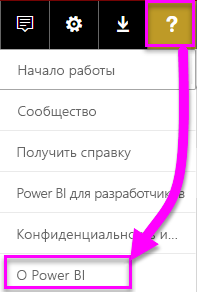
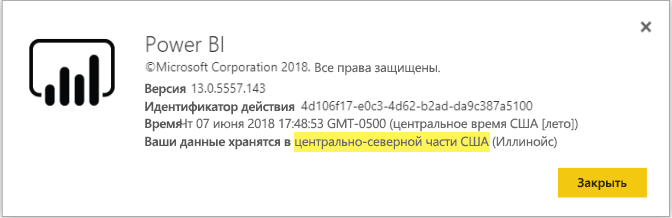

# <a name="frequently-asked-questions-about-power-bi-embedded"></a>Часто задаваемые вопросы о Power BI Embedded

* Если у вас возникли другие вопросы, [задайте их участникам сообщества Power BI](https://community.powerbi.com/).
* Проблема до сих пор не устранена? Посетите [страницу поддержки по Power BI](https://powerbi.microsoft.com/support/).

## <a name="general"></a>Общие

### <a name="what-is-power-bi-embedded"></a>Что такое Power BI Embedded?

[Microsoft Power BI Embedded (PBIE)](azure-pbie-what-is-power-bi-embedded.md) позволяет разработчикам приложений внедрять впечатляющие, полностью интерактивные отчеты в приложения, не создавая собственные визуализации данных и элементы управления с нуля.

### <a name="who-is-the-target-audience-for-power-bi-embedded"></a>Какова целевая аудитория службы Power BI Embedded?

Разработчики и компании, работающие в сфере программного обеспечения, которые также называются независимыми поставщиками программного обеспечения и занимаются созданием приложений.

### <a name="how-is-power-bi-embedded-different-from-power-bi-the-service"></a>Чем Power BI Embedded отличается от службы Power BI?

Power BI представляет собой решение программного обеспечения как услуги для аналитики, которое предоставляет организациям единое представление их критически важных бизнес-данных.

Корпорация Майкрософт разработала службу Power BI Embedded для независимых поставщиков программного обеспечения, которые хотят внедрять визуальные элементы в свои приложения, чтобы помочь клиентам принимать аналитические решения. Это избавляет независимых поставщиков программного обеспечения от необходимости создавать свои собственные решения для аналитики. [Встроенная аналитика](embedding.md) позволяет бизнес-пользователям получать доступ к бизнес-данным и выполнять к ним запросы для формирования аналитических сведений в приложении.


### <a name="what-is-the-difference-between-power-bi-premium-and-power-bi-embedded"></a>В чем разница между Power BI Premium и Power BI Embedded?

Power BI Premium — это комплексное решение бизнес-аналитики для предприятий, которое обеспечивает единое представление данных организации, сведений о партнерах, клиентах и поставщиках. Power BI Premium помогает организациям в принятии решений. Power BI Premium — это продукт SaaS, позволяющий пользователям работать с содержимым через мобильные приложения, приложения собственной разработки или портал Power BI.

Служба Power BI Embedded предназначена для независимых поставщиков программного обеспечения, которые хотят внедрить визуальные элементы в свои приложения. Power BI Embedded помогает клиентам принимать решения. Так как эта служба создана для разработчиков приложений, пользователи этих приложений, как в организации, так и за ее пределами, могут работать с содержимым, хранящимся в емкости Power BI Embedded. Вы не можете предоставить общий доступ к содержимому емкости Power BI Embedded с помощью публикации одним щелчком в Интернете или SharePoint.

### <a name="what-is-the-microsoft-recommendation-for-when-a-customer-should-buy-power-bi-premium-vs-power-bi-embedded"></a>В каких случаях корпорация Майкрософт рекомендует покупать Power BI Premium, а в каких — Power BI Embedded?

Корпорация Майкрософт рекомендует предприятиям приобретать корпоративное облачное решение для самостоятельной бизнес-аналитики Power BI Premium. Независимым поставщикам программного обеспечения мы рекомендуем приобретать решение Power BI Embedded из-за его облачных компонентов встроенной аналитики. Тем не менее клиенты не ограничены в выборе продукта.

Возможно, в некоторых случаях независимым поставщикам программного обеспечения (как правило, крупным) в дополнение к внедрению в приложения потребуется номер SKU P, чтобы получить дополнительные возможности предварительно упакованной службы Power BI для своей организации. Некоторые предприятия могут решить использовать номера SKU A в Azure, если они собираются только создавать бизнес-приложения и внедрять в них средства аналитики, но при этом они не заинтересованы использовать предварительно упакованную службу Power BI.

### <a name="how-many-embed-tokens-can-i-create"></a>Сколько можно создать токенов внедрения?

Токены внедрения с лицензиями PRO предназначены для тестирования при разработке, поэтому количество таких токенов, создаваемых главной учетной записью или [субъектом-службой](embed-service-principal.md) Power BI, ограничено. Необходимо [приобрести емкость](#technical) для возможности внедрения в рабочей среде. В случае приобретения емкости количество создаваемых токенов внедрения не ограничено. Выберите [Доступные компоненты](https://docs.microsoft.com/rest/api/power-bi/availablefeatures), чтобы проверить данные по использованию Embedded, выраженные в процентах от общей емкости.

## <a name="technical"></a>Технические вопросы

### <a name="where-can-i-learn-more-about-capacity-and-skus-in-power-bi-embedded-analytics"></a>Где можно получить дополнительные сведения о емкости и номерах SKU в аналитике Power BI Embedded?

См. статью [Емкость и номера SKU в аналитике Power BI Embedded](embedded-capacity.md).

### <a name="what-are-the-prerequisites-for-creating-a-pbie-capacity-in-azure"></a>Что необходимо для создания емкости PBIE в Azure?

* Нужно войти в каталог организации (учетные записи Майкрософт не поддерживаются).
* Нужен клиент Power BI, то есть по меньшей мере один пользователь в вашем каталоге должен зарегистрироваться в Power BI. 
* Необходимо иметь подписку Azure в каталоге организации.

### <a name="how-can-i-monitor-power-bi-embedded-capacity-consumption"></a>Как отслеживать использование емкости Power BI Embedded?

* На [портале администрирования Power BI](../../service-admin-portal.md#power-bi-embedded).

* Загрузка [приложения метрик](https://docs.microsoft.com/power-bi/service-admin-premium-monitor-capacity) в Power BI.

* С помощью [Журнала диагностики Azure](azure-pbie-diag-logs.md).

### <a name="can-my-capacity-scale-automatically-to-adjust-to-my-app-consumption"></a>Может ли емкость автоматически масштабироваться в соответствии с потреблением моего приложения?

Автоматическое масштабирование сейчас не поддерживается, но все интерфейсы API доступны для масштабирования.

### <a name="why-creatingscalingresuming-a-capacity-results-in-putting-the-capacity-into-a-suspended-state"></a>Почему создание, масштабирование и возобновление емкости приводит к переводу емкости в приостановленное состояние?

Подготовка емкости (при масштабировании, возобновлении, создании) может завершиться сбоем. Вы можете использовать API получения сведений, чтобы проверить значение ProvisioningState для емкости: [Емкость -> Получить сведения](https://docs.microsoft.com/rest/api/power-bi-embedded/capacities/getdetails).

### <a name="can-i-only-create-power-bi-embedded-capacities-in-a-specific-region"></a>Я могу создавать емкости Power BI Embedded только в определенном регионе?

С функцией [Поддержка нескольких регионов (предварительная версия)](embedded-multi-geo.md) вы можете приобрести [емкость Power BI Embedded](azure-pbie-create-capacity.md) в регионе, где не расположен ваш домашний клиент Power BI

### <a name="why-cant-i-see-a-workspace-although-i-have-permissions"></a>Почему я не вижу рабочую область, несмотря на наличие разрешений?

Когда пользователю предоставляются разрешения для рабочей области, приложения или артефакта, доступ к ним посредством вызовов API может появиться не сразу.
Результатом может стать отсутствующий артефакт в ответе API "GET" или ошибка при попытке использования этого артефакта.
Пользователь может устранить эту проблему, вызвав [API refreshUserPermissions](https://docs.microsoft.com/rest/api/power-bi/users/refreshuserpermissions), который обновляет разрешения пользователя.


### <a name="how-can-i-find-my-pbi-tenant-region"></a>Как узнать свой регион клиента Power BI?

Чтобы узнать регион клиента Power BI, можно использовать портал Power BI.

[https://app.powerbi.com/](`https://app.powerbi.com/`) > ? > О Power BI




### <a name="what-does-the-cloud-solution-provider-csp-channel-support"></a>Какие возможности поддерживает канал поставщиков облачных решений (CSP)?

* Вы можете создать PBIE для вашего клиента с типом подписки CSP.
* Пользователь с партнерской учетной записью может войти в клиент заказчика и приобрести для него PBIE, указав пользователя клиента в качестве администратора емкости Power BI.

### <a name="why-do-i-get-an-unsupported-account-message"></a>Почему я получаю сообщение о неподдерживаемой учетной записи?

Регистрация в Power BI подразумевает использование корпоративной учетной записи. Регистрация в Power BI с помощью учетной записи Майкрософт не поддерживается.

### <a name="can-i-use-apis-to-create-and-manage-azure-capacities"></a>Можно ли использовать API для создания емкостей Azure и управления ими?

Да, существуют командлеты PowerShell и интерфейсы REST API Azure Resource Manager, которые можно использовать для создания ресурсов PBIE и управления ими.

* [Интерфейсы REST API](https://docs.microsoft.com/rest/api/power-bi-embedded/) 
* [Командлеты PowerShell](https://docs.microsoft.com/powershell/module/azurerm.powerbiembedded/)

### <a name="what-is-the-pbi-embedded-dedicated-capacity-role-in-a-pbi-embedded-solution"></a>Что такое роль выделенной емкости PBI Embedded в решении PBI Embedded?

Чтобы [повысить уровень решения до рабочей среды](embed-sample-for-customers.md#move-to-production), нужно назначить содержимое Power BI (рабочую область), используемое вашим приложением, емкости Power BI Embedded (SKU А).

### <a name="in-what-azure-regions-is-pbi-embedded-available"></a>В каких регионах Azure доступна служба Power BI Embedded?

[PAM](https://ecosystemmanager.azurewebsites.net/home) (EcoManager) — см. раздел "Менеджер по наличию продуктов"

Доступные регионы (16 — те же регионы, что и для Power BI)

* США (6) — восточная часть США, восточная часть США 2, центрально-северная часть США, центрально-южная часть США, западная часть США, западная часть США 2
* Европа (2) — северная Европа, западная Европа
* Азиатско-Тихоокеанский регион (2) — юго-восточная Азия, восточная Азия
* Бразилия (1) — Южная Бразилия
* Япония (1) — восточная Япония
* Австралия (1) — юго-восточная Австралия
* Индия (1) — западная Индия
* Канада (1) — центральная Канада
* Великобритания (1) — южная часть Соединенного Королевства

### <a name="what-is-power-bi-embeddeds-authentication-model"></a>Какая модель проверки подлинности используется в Power BI Embedded?

В Power BI Embedded по-прежнему используется Azure AD для проверки подлинности главного пользователя (назначенный пользователь с лицензией Power BI Pro) или [субъект-служба](embed-service-principal.md) для проверки подлинности приложения в Power BI.  

 Независимый поставщик программного обеспечения может реализовать собственную модель проверки подлинности и авторизации для своих приложений.

Если у вас уже есть клиент Azure AD, вы можете использовать существующий каталог. Кроме того, можно создать клиент Azure AD, чтобы обеспечить безопасность содержимого внедренного приложения.

Чтобы получить токен Azure AD, можно использовать одну из [библиотек проверки подлинности Azure Active Directory](https://docs.microsoft.com/azure/active-directory/develop/active-directory-authentication-libraries). Клиентские библиотеки доступны для различных платформ.

### <a name="my-application-already-uses-aad-for-user-authentication-how-can-we-use-this-identity-when-authenticating-to-power-bi-in-a-user-owns-data-scenario"></a>Мое приложение уже использует AAD для проверки подлинности пользователей. Как можно использовать это удостоверение при проверке подлинности в Power BI в сценарии "Данные, принадлежащие пользователю"?

Это стандартный поток On-Behalf-Of OAuth (<https://docs.microsoft.com/azure/active-directory/develop/web-api>). Вам нужно настроить приложение для запроса разрешений на использование службы Power BI (с обязательными областями). Получив маркер пользователя для приложения, просто вызовите AcquireTokenAsync API ADAL с помощью маркера доступа и укажите URL-адрес ресурса Power BI как идентификатор ресурса:

```csharp
var context = new AD.AuthenticationContext(authorityUrl);
var userAssertion = new AD.UserAssertion(userAccessToken);
var clientAssertion = new AD.ClientAssertionCertificate(MyAppId, MyAppCertificate)
var authenticationResult = await context.AcquireTokenAsync(resourceId, clientAssertion, userAssertion);
```

### <a name="what-object-id-is-the-service-principal-object-id"></a>Какой идентификатор объекта является идентификатором объекта субъекта-службы?

*Идентификатор объекта* на главном экране зарегистрированного приложения является идентификатором объекта для приложения.

Идентификатор объекта, указанный в разделе *Управляемое приложение в локальном каталоге > Свойства*, является идентификатором объекта субъекта-службы, который вам нужно использовать. Этот идентификатор объекта должен ссылаться на идентификатор объекта субъекта-службы при выполнении операций с субъектом-службой или внесении изменений в него. Например, при добавлении субъекта-службы в качестве администратора в рабочую область.

### <a name="how-is-power-bi-embedded-different-from-other-azure-services"></a>Чем Power BI Embedded отличается от других служб Azure?

Чтобы приобрести Power BI Embedded в Azure, у вас должна быть учетная запись Power BI. Регион развертывания Power BI Embedded определяет вашу учетную запись Power BI. Управляйте ресурсом Power BI Embedded в Azure для следующих действий:

* увеличение или уменьшение масштаба;
* добавление администраторов емкости;
* приостановка и возобновление работы службы.

Используйте PowerBI.com, чтобы назначать рабочие области и отменять их назначение для емкости Power BI Embedded.

### <a name="what-content-pack-data-types-can-you-embed"></a>Какие типы данных пакета содержимого можно внедрять?

**Панели мониторинга** и **плитки**, сформированные из наборов данных в пакете содержимого, *невозможно* внедрить. Однако полученные аналогичным образом **отчеты** внедрить *можно*.

### <a name="what-is-the-difference-between-using-row-level-security-rls-vs-javascript-filters"></a>Какая разница между использованием безопасности на уровне строк (RLS) и фильтров JavaScript?

Часто возникает путаница при выборе RLS и фильтров JavaScript, так как один из методов обеспечивает контроль того, что может увидеть конкретный пользователь, а другой — оптимизацию представления пользователя.

При использовании RLS разработчик независимого поставщика программного обеспечения управляет фильтрацией данных в процессе создания модели и поколения токенов внедрения. Конечный пользователь видит только то, на что независимый поставщик программного обеспечения предоставляет доступ. В этом случае пользователь может выбрать меньшее, чем то, что фильтровалось, но не сможет обойти конфигурацию RLS и увидеть больше, чем разрешено.

При фильтрации на стороне клиент (JavaScript) независимый поставщик программного обеспечения может решить, что будет видеть конечный пользователь в исходном представлении, но не может контролировать изменения, которые конечный пользователь может применить к самому представлению. Так как клиентский код Javascript пользователя может активировать фильтрацию данных в серверной части, его нельзя считать безопасным.

Для дополнительной информации см. раздел [Сравнение использования RLS и фильтров JavaScript](embedded-row-level-security.md#using-rls-vs-javascript-filters).

### <a name="how-do-i-manage-permissions-for-service-principals-with-power-bi"></a>Как управлять разрешениями для субъектов-служб в Power BI?

После активации [субъекта-службы](embed-service-principal.md) для использования с Power BI разрешения приложения в Active Directory перестают действовать. В дальнейшем управление разрешениями приложения осуществляется на портале администрирования Power BI.

Субъекты-службы наследуют разрешения для всех параметров клиента Power BI от своей группы безопасности. Чтобы дополнительно ограничить разрешения, создайте для субъектов-служб выделенную группу безопасности и добавьте ее в список **За исключением отдельных групп безопасности** для тех параметров Power BI, которые должны быть включены.

Это важно, когда вы добавляете субъект-службу в качестве **администратора** в новую рабочую область. Эту задачу можно выполнить с помощью [интерфейсов API](https://docs.microsoft.com/rest/api/power-bi/groups/addgroupuser) или службы Power BI.

### <a name="when-to-use-an-application-id-vs-a-service-principal-object-id"></a>Когда следует использовать идентификатор приложения, а когда — идентификатор объекта субъекта-службы?

**[Идентификатор приложения](embed-sample-for-customers.md#application-id)** используется для создания маркера доступа при передаче этого идентификатора для проверки подлинности.

При выполнении операций с субъектом-службой или внесении изменений в него, например добавлении субъекта-службы в качестве администратора в рабочую область, на него необходимо ссылаться по **[идентификатору объекта субъекта-службы](embed-service-principal.md)** .

### <a name="can-you-manage-an-on-premises-data-gateway-with-service-principal"></a>Можно ли управлять локальным шлюзом данных с помощью субъекта-службы?

С помощью [субъекта-службы](embed-service-principal.md) нельзя управлять локальным шлюзом данных, как с помощью главной учетной записи.

Используя главную учетную запись, можно установить шлюз данных, добавить в него пользователей, подключиться к источникам данных и выполнять другие задачи администрирования.

С помощью субъекта-службы можно настроить [безопасность на уровне строк (RLS)](embedded-row-level-security.md#on-premises-data-gateway-with-service-principal), используя в качестве источника данных активное подключение к локальным службам SQL Server Analysis Services (SSAS). Это позволит управлять пользователями и их доступом к данным в службах SSAS при интеграции с **Power BI Embedded** посредством субъекта-службы.

### <a name="can-you-sign-into-the-power-bi-service-with-service-principal"></a>Можно ли входить в службу Power BI с помощью субъекта-службы?

Нет, входить в службу Power BI с помощью субъекта-службы нельзя.

Кроме того, нельзя использовать содержимое во внешних приложениях (внедренных по модели SaaS). Для этого требуется создать токен внедрения.

### <a name="what-are-the-best-practices-to-improve-performance"></a>Рекомендации по повышению производительности

[Производительность Power BI Embedded](embedded-performance-best-practices.md)

## <a name="licensing"></a>Лицензирование

### <a name="how-do-i-purchase-power-bi-embedded"></a>Как приобрести Power BI Embedded?

Служба Power BI Embedded доступна в Azure.

### <a name="what-happens-if-i-already-purchased-power-bi-premium-and-now-i-want-some-power-bi-embedded-in-azure-benefits"></a>Что если решение Power BI Premium уже приобретено и я хочу воспользоваться некоторыми преимуществами Power BI Embedded в Azure?

Клиенты будут продолжать оплачивать все существующие покупки Power BI Premium до завершения срока текущего соглашения. По истечении срока клиенты смогут перенести покупки Power BI Premium, если будет такая необходимость на тот момент.

### <a name="do-i-still-have-to-buy-power-bi-premium-to-get-access-to-power-bi-embedded"></a>Требуется ли приобрести Power BI Premium, чтобы получить доступ к Power BI Embedded?

Нет. Power BI Embedded включает в себя емкость Azure, которая требуется для развертывания и распространения решений для клиентов.

### <a name="whats-the-purchase-commitment-for-power-bi-embedded"></a>Какие существуют обязательства по приобретению Power BI Embedded?

Пользователи могут изменять способ использования на почасовой основе. Для службы Power BI Embedded нет ежегодного или ежемесячного обязательства.

### <a name="how-does-the-usage-of-power-bi-embedded-show-up-on-my-bill"></a>Как плата за использование Power BI Embedded отражается в счете?

Плата за использование Power BI Embedded предусматривает прогнозируемую почасовую тарификацию с учетом типа развернутых узлов. Пока ресурс активен, вам будет выставляться счет за него, даже если ресурс не используется. Чтобы прекратить выставление счетов, нужно приостановить работу ресурса.

### <a name="who-needs-a-power-bi-pro-license-for-power-bi-embedded-and-why"></a>Кому требуется лицензия Power BI Pro для Power BI Embedded и почему?

Для использования REST API требуется лицензия Power BI Pro или [субъект-служба](embed-service-principal.md). Аналитику, желающему добавлять отчеты в рабочую область Power BI, требуется лицензия Power BI Pro или субъект-служба. Администратору, желающему управляет емкостью и клиентом Power BI, требуется лицензия Power BI Pro.

Так как Power BI Embedded позволяет использовать портал Power BI для проверки внедренного содержимого и управления им, лицензия Power BI Pro требуется для проверки подлинности приложения на сайте PowerBI.com, чтобы получить доступ к отчетам в нужных репозиториях.

Однако для [создания или изменения внедренных отчетов](https://github.com/Microsoft/PowerBI-JavaScript/wiki/Create-Report-in-Embed-View) внутри собственного приложения конечному пользователю не требуется лицензия Pro, так как ему вообще необязательно быть пользователем Power BI.

### <a name="can-i-get-started-for-free"></a>Можно ли начать работу бесплатно?

Да, вы можете использовать [деньги на счете в Azure](https://azure.microsoft.com/free/) для Power BI Embedded.

### <a name="can-i-get-a-trial-experience-for-power-bi-embedded-in-azure"></a>Можно ли получить пробную версию Power BI Embedded в Azure?

Так как Power BI Embedded является частью Azure, вы можете приобрести эту службу за [200 долларов США, полученных при регистрации в Azure](https://azure.microsoft.com/free/).

### <a name="is-power-bi-embedded-available-for-national-clouds-us-government-germany-china"></a>Доступна ли службы Power BI Embedded в национальных облаках (для государственных организаций США, Германии и Китая)?

Power BI Embedded также доступна в [национальных облаках](embed-sample-for-customers-national-clouds.md).

### <a name="is-power-bi-embedded-available-for-non-profits-and-educational"></a>Будет ли Power BI Embedded доступна для некоммерческих и образовательных организаций?

Специальные цены на Azure для некоммерческих и образовательных организаций отсутствуют.

## <a name="power-bi-workspace-collection"></a>Коллекция рабочих областей Power BI

### <a name="what-is-power-bi-workspace-collection"></a>Что такое коллекция рабочих областей Power BI?

**Коллекция рабочих областей Power BI** (**Power BI Embedded** версии 1) — это решение на основе ресурса Azure **Коллекция рабочих областей Power BI**. Это решение позволяет создавать приложения **Power BI Embedded** для предоставления клиентам содержимого Power BI, размещенного в решении **Коллекция рабочих областей Power BI** с помощью специальных интерфейсов API и ключей рабочей области для проверки подлинности приложения в Power BI.

### <a name="can-i-migrate-from-power-bi-workspace-collection-to-power-bi-embedded"></a>Можно ли перенести содержимое из коллекции рабочих областей Power BI в Power BI Embedded?

1. Средство миграции позволяет клонировать содержимое из **коллекции рабочих областей Power BI** в Power BI — https://docs.microsoft.com/power-bi/developer/migrate-from-powerbi-embedded#content-migration.

2. Для начала примените POC-приложение **Power BI Embedded**, которое использует содержимое Power BI.

3. Когда вы будете готовы перейти в рабочую среду, приобретите выделенную емкость **Power BI Embedded** и назначьте ей определенное содержимое (рабочую область) Power BI.

    > [!Note]
    > Вы можете продолжать работу с **коллекцией рабочих областей Power BI** параллельно с созданием решения **Power BI Embedded**. Когда вы будете полностью готовы, перенесите данные клиента в новое решение **Power BI Embedded** и прекратите использовать решение **Коллекция рабочих областей Power BI**.

Дополнительные сведения см. в статье [о переносе содержимого из коллекции рабочих областей Power BI в Power BI Embedded](https://docs.microsoft.com/power-bi/developer/migrate-from-powerbi-embedded).

### <a name="is-power-bi-workspace-collection-on-a-deprecation-path"></a>Правда ли, что коллекция рабочих областей Power BI скоро будет считаться нерекомендуемой?

Да, это так, но клиенты могут продолжать работу с решением **Коллекция рабочих областей Power BI**, пока оно не станет нерекомендуемым. Клиенты также могут создавать коллекции рабочих областей и приложения **Power BI Embedded**, использующие решения на основе **коллекции рабочих областей Power BI**.

Однако это также означает, что новые функции в **коллекцию рабочих областей Power BI** уже не добавляются. Мы рекомендуем клиентам запланировать миграцию решений на новую платформу **Power BI Embedded**.

### <a name="when-is-power-bi-workspace-collection-support-discontinued"></a>Когда будет прекращена поддержка коллекции рабочих областей Power BI?

Клиенты, которые используют решения на основе **коллекций рабочих областей Power BI**, могут продолжать работу с ними до конца июня 2018 года или до конца текущего соглашения на поддержку.

### <a name="in-what-regions-can-i-create-a-pbi-workspace-collection"></a>В каких регионах можно создать коллекцию рабочих областей Power BI?

Это решение доступно в следующих регионах: восточная часть США 2, восточная Япония, Западная Европа, западная Индия, западная часть США, северная Европа, центрально-северная часть США, центральная Канада, юго-восточная Австралия, Юго-Восточная Азия, центрально-южная часть США, южная Бразилия и южная часть Соединенного Королевства.

### <a name="why-should-i-migrate-from-pbi-workspace-collection-to-power-bi-embedded"></a>Зачем мне переносить содержимое из коллекции рабочих областей Power BI в Power BI Embedded?

В решение **Power BI Embedded** добавлены новые функции и возможности, которые недоступны в **коллекции рабочих областей Power BI**.

Вот лишь некоторые из них:
* Поддерживаются все источники данных Power BI. Поддерживаются только два источника данных для **коллекции рабочих областей Power BI**. 
* Новые функции, такие как вопросы и ответы, обновление, закладки, внедрение информационных панелей и плиток, а также пользовательские меню поддерживаются только в решении **Power BI Embedded**.
* модель выставления счетов по емкости.

## <a name="embedding-setup-tool"></a>Средство настройки внедрения

### <a name="what-is-the-embedding-setup-tool"></a>Что такое средство настройки внедрения?

[Средство настройки внедрения](https://aka.ms/embedsetup) позволяет быстро приступить к работе и скачать образец приложения, чтобы начать внедрение в Power BI.

### <a name="which-solution-should-i-choose"></a>Какое решение выбрать?

* [Внедрение для клиентов](embedding.md#embedding-for-your-customers) позволяет внедрять панели мониторинга и отчеты для пользователей, у которых нет учетной записи Power BI. Запустите решение [Внедрение для клиентов](https://aka.ms/embedsetup/AppOwnsData).
* [Внедрение для организации](embedding.md#embedding-for-your-organization) позволяет расширить возможности службы Power BI. Запустите решение [Внедрение для организации](https://aka.ms/embedsetup/UserOwnsData).

### <a name="ive-downloaded-the-sample-app-which-solution-do-i-choose"></a>Образец приложения скачан. Какое решение выбрать?

Если вы работаете с решением **Внедрение для клиентов**, сохраните и распакуйте файл *PowerBI-Developer-Samples.zip*. Затем откройте папку *PowerBI-Developer-Samples-master\App Owns Data* и запустите файл *PowerBIEmbedded_AppOwnsData.sln*.

Если вы работаете с решением **Внедрение для организации**, сохраните и распакуйте файл *PowerBI-Developer-Samples.zip*. Затем откройте папку *PowerBI-Developer-Samples-master\User Owns Data\integrate-report-web-app* и запустите файл *pbi-saas-embed-report.sln*.

### <a name="how-can-i-edit-my-registered-application"></a>Как изменить зарегистрированное приложение?

Узнать, как изменять зарегистрированные в Azure AD приложения, можно в [руководстве по обновлению приложения в Azure Active Directory](https://docs.microsoft.com/azure/active-directory/develop/quickstart-v1-update-azure-ad-app).

### <a name="how-can-i-edit-my-power-bi-user-profile-or-data"></a>Как изменить профиль пользователя или данные Power BI?

Узнать, как изменить данные Power BI, можно [здесь](https://docs.microsoft.com/power-bi/service-basic-concepts).

Дополнительные сведения: [Устранение неполадок внедренного приложения](embedded-troubleshoot.md).

Появились дополнительные вопросы? [Ответы на них см. в сообществе Power BI.](https://community.powerbi.com/)
