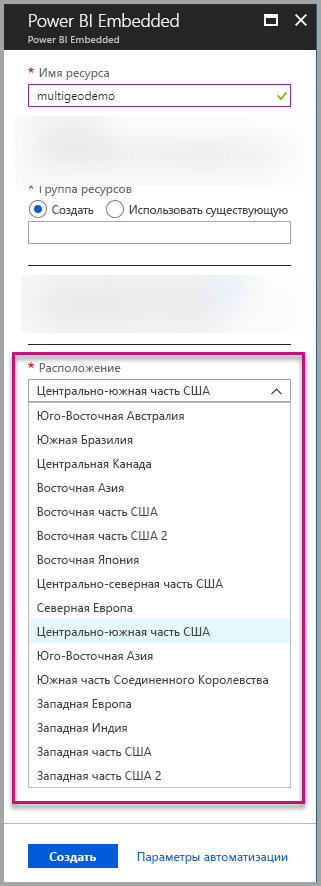

# Поддержка нескольких регионов в Power BI Embedded

**Поддержка нескольких регионов в Power BI Embedded** означает, что независимые поставщики программного обеспечения и организации, которые создают приложения с использованием Power BI Embedded для внедрения аналитики в свои приложения, теперь могут развертывать свои данные в разных регионах по всему миру.

Теперь клиенты, использующие **Power BI Embedded**, могут установить **емкость** с поддержкой **нескольких регионов** на основе тех же функций и ограничений, которые поддерживаются в [Power BI Premium](../../admin/service-admin-premium-Multi-Geo.md).

## Создание ресурса емкости Power BI Embedded с использованием нескольких регионов

На экране **Создать ресурс** вам нужно выбрать расположение для емкости. До сих пор она ограничивалась только местоположением вашего клиента Power BI, поэтому было доступно только одно расположение. Благодаря использованию нескольких регионов вы можете выбирать между различными регионами для развертывания емкости.

Обратите внимание, что при открытии раскрывающегося меню местоположения ваш домашний клиент выбран по умолчанию.
  

При выборе другого расположения вам будет предложено подтвердить свой выбор.

## Просмотр регионов для ресурса емкости

Вы можете легко увидеть расположение своих ресурсов емкости при переходе на главную страницу управления Power BI Embedded на портале Azure.

Его также можно просмотреть на портале администрирования и на сайте Powerbi.com. На портале администрирования выберите "Параметры емкости", а затем перейдите на вкладку Power BI Embedded.

[Подробнее о создании емкостей в Power BI Embedded.](azure-pbie-create-capacity.md)

## Управление расположением имеющихся емкостей

Вы не можете изменить расположение ресурса Power BI Embedded после создания емкости.

Чтобы переместить содержимое Power BI в другой регион, выполните следующие действия:

1. [Создайте емкость](azure-pbie-create-capacity.md) в другом регионе.

2. Назначьте все рабочие области из имеющейся емкости новой емкости.

3. Удалите или приостановите старую емкость.

Важно отметить, что если вы решите удалить емкость, не переназначив ее содержимое, то все содержимое этой емкости переместится в общую емкость, которая находится в вашем домашнем регионе.

## Поддержка API для функции использования нескольких регионов

Для поддержки управления емкостями с помощью функции поддержки нескольких регионов через API мы внесли некоторые изменения в имеющиеся API:

1. **[Получение емкостей](https://docs.microsoft.com/rest/api/power-bi/capacities/getcapacities)** — API возвращает пользователю список доступных емкостей. Теперь ответ включает в себя дополнительное свойство region, которое определяет расположение емкости.

2. **[Назначение емкости](https://docs.microsoft.com/rest/api/power-bi/capacities)** — API позволяет назначить емкости заданную рабочую область. Эта операция не позволяет вам назначать емкости рабочие области за пределами домашнего региона или перемещать рабочие области между емкостями в разных регионах. Для выполнения этой операции пользователю или [субъекту-службе](embed-service-principal.md) по-прежнему нужны разрешения на администрирование в рабочей области, а также разрешения на администрирование или назначение в целевой емкости.

3. **[API Azure Resource Manager](https://docs.microsoft.com/rest/api/power-bi-embedded/capacities)** — все операции API Azure Resource Manager, включая *создание* и *удаление*, поддерживают использование нескольких регионов.

## Рекомендации и ограничения

* Убедитесь, что любое инициируемое вами перемещение данных между регионами соответствует всем корпоративным и государственным требованиям, прежде чем осуществлять его.

* Кэшированный запрос, хранящийся в удаленном регионе, остается в этом регионе в неактивном состоянии. Но другие данные в процессе передачи могут перемещаться в обе стороны между разными географическими регионами.

* При перемещении данных из одного региона в другой в среде с поддержкой нескольких регионов источник данных может до 30 дней оставаться в регионе, из которого были перемещены данные. В течение этого времени конечные пользователи не будут иметь доступа к нему. Он будет удален из этого региона и уничтожен в течение 30-дневного периода.

* Поддержка нескольких регионов в целом не улучшает производительность. Загрузка отчетов и панелей мониторинга по-прежнему сопряжена с запросами метаданных из домашнего региона.

## Дальнейшие действия

Дополнительные сведения о Power BI Embedded и вариантах использования нескольких регионов для всех емкостей см. по приведенным ниже ссылкам.

* [Что такое Power BI Embedded?](azure-pbie-what-is-power-bi-embedded.md)

* [Создание емкости Power BI Embedded на портале Azure](azure-pbie-create-capacity.md)

* [Поддержка нескольких регионов в Power BI Premium (предварительная версия)](../../admin/service-admin-premium-multi-geo.md)

Появились дополнительные вопросы? [Попробуйте задать вопрос в сообществе Power BI.](https://community.powerbi.com/)