# <a name="row-level-security-with-power-bi-embedded"></a>Безопасность на уровне строк в Power BI Embedded

**Безопасность на уровне строк (RLS)** можно использовать для ограничения пользовательского доступа к данным на панели мониторинга и плитках, а также в отчетах и наборах данных. С одними и теми же артефактами могут работать разные пользователи, видя при этом разные данные. Внедрение поддерживает функцию RLS.

Если вы выполняете внедрение для пользователей, не работающих с Power BI (данные принадлежат приложению), что обычно является сценарием ISV, эта статья предназначена именно для вас. Настройте маркер внедрения в учетной записи для пользователя и роли.

При внедрении пользователей Power BI (данные принадлежат пользователю) в своей организации RLS работает также, как и напрямую в службе Power BI. Больше ничего не нужно делать в своем приложении. Дополнительные сведения см. в статье [Безопасность на уровне строк (RLS) в Power BI](../../service-admin-rls.md).


Чтобы воспользоваться преимуществами RLS, важно понимать три основных понятия: пользователи, роли и правила. Давайте подробнее рассмотрим эти понятия.

**Пользователи** — пользователи, просматривающие артефакт (панель мониторинга, плитку, отчет или набор данных). В Power BI Embedded пользователи идентифицируются по свойству имени пользователя в маркере внедрения.

**Роли.** Пользователи принадлежат к различным ролям. Роль — это контейнер для правил и может иметь имя *Менеджер по продажам* или *Торговый представитель*. Роли можно создать в Power BI Desktop. Дополнительные сведения см. в статье [Безопасность на уровне строк (RLS) в Power BI Desktop](../../desktop-rls.md).

**Правила.** Роли имеют правила, являющиеся фильтрами, которые будут применяться к данным. Это может быть чем-то простым, например "Страна = США", или чем-то гораздо более динамичным.
В оставшейся части этой статьи будет приведен пример разработки RLS, а затем показано ее использование во внедренном приложении. В примере используется PBIX-файл с [примером анализа розничной торговли](https://go.microsoft.com/fwlink/?LinkID=780547).


## <a name="adding-roles-with-power-bi-desktop"></a>Добавление ролей с помощью Power BI Desktop

В **примере анализа розничной торговли** отображаются сведения о продажах во всех магазинах розничной сети. Без RLS будут отображаться те же данные, независимо от того, какой региональный менеджер входит в отчет и просматривает его. Представители высшего руководства решили, что региональный менеджер должен видеть только продажи по магазинам, которыми они управляют. Использование RLS позволяет представителям высшего руководства ограничивать данные в зависимости от регионального менеджера.

RLS создается в Power BI Desktop. При открытии набора данных и отчета можно переключиться в представление схемы для ее просмотра:


Вот несколько моментов, на которые следует обратить внимание в этой схеме:

* Все меры, например **Общий объем продаж**, хранятся в таблице фактов **Продажи**.
* Существуют четыре дополнительные связанные таблицы измерений: **Позиция**, **Время**, **Магазин** и **Округ**.
* Стрелки на линиях связи указывают, каким образом фильтры могут передаваться из одной таблицы в другую. Например, если поместить фильтр к **Time[Date]** , в текущей схеме отфильтруются только значения в таблице **Продажи**. Этот фильтр не повлияет на другие таблицы, так как все стрелки в линиях связи указывают на таблицу продаж.
* В таблице **Округ** представлены сведения о менеджере каждого округа:
  
    

Исходя из этой схемы, если мы применим фильтр к столбцу **Региональный менеджер** в таблице **Округ** и этот фильтр совпадает с пользователем, просматривающим отчет, то будут отфильтрованы таблицы **Магазин** и **Продажи**, чтобы показать данные только для этого регионального менеджера.

Вот как это сделать.

1. На вкладке **Моделирование** выберите **Управление ролями**.

    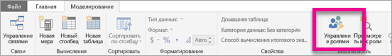
2. Создайте роль **Диспетчер**.

    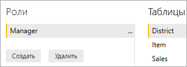
3. В таблице **Округ** введите такое выражение DAX: **[District Manager] = USERNAME()** .

    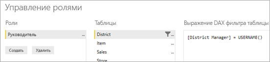
4. Чтобы убедиться, что правила работают, на вкладке **Моделирование** выберите **Просмотреть как роли**, а затем созданную роль **Менеджер** вместе с ролью **Другие пользователи**. Введите имя **AndrewMa** для пользователя.

    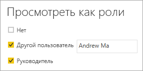

    Теперь в отчете отображаются данные, как если бы вы выполнили вход как **AndrewMa**.

Если применить фильтр таким образом, как это сделали мы, будут отфильтрованы все записи в таблицах **Округ**, **Магазин** и **Продажи**. Однако из-за направления фильтра в отношениях между таблицами **Продажи** и **Время**, **Продажи** и **Позиция**, а также **Позиция** и **Время** эти таблицы не будут отфильтрованы. Чтобы узнать больше о двунаправленной перекрестной фильтрации, скачайте технический документ [Bidirectional cross-filtering in SQL Server Analysis Services 2016 and Power BI Desktop](https://download.microsoft.com/download/2/7/8/2782DF95-3E0D-40CD-BFC8-749A2882E109/Bidirectional%20cross-filtering%20in%20Analysis%20Services%202016%20and%20Power%20BI.docx) (Двунаправленная перекрестная фильтрация в SQL Server Analysis Services 2016 и Power BI Desktop).

## <a name="applying-user-and-role-to-an-embed-token"></a>Применение пользователя и роли для маркера внедрения

После настройки ролей Power BI Desktop нужно выполнить ряд действий в приложении, чтобы воспользоваться этими ролями.

Пользователи проходят проверку подлинности и авторизацию с помощью приложения. Маркеры внедрения используются для предоставления им доступа к конкретным отчетам Power BI Embedded. Power BI Embedded не имеет каких-либо конкретных данных о пользователе. Для работы RLS необходимо передать некоторый дополнительный контекст в токене внедрения в форме удостоверений. Можно передать удостоверения с помощью API [токена внедрения](https://docs.microsoft.com/rest/api/power-bi/embedtoken).

Он принимает список удостоверений с указанием соответствующих наборов данных. Для работы RLS необходимо передать приведенные ниже элементы как часть удостоверения.

* **username (обязательно).** Это строка, которая может использоваться для идентификации пользователя при применении правил RLS. Вы можете указать только одного пользователя. Имя пользователя может быть создано с помощью набора символов *ASCII*.
* **roles (обязательно).** Строка, содержащая роли для выбора при применении правил безопасности на уровне строк. При передаче нескольких ролей их нужно передавать в виде строкового массива.
* **dataset (обязательно).** Это набор данных, предназначенный для внедряемого артефакта.

Вы можете создать маркер внедрения с помощью метода **GenerateTokenInGroup** в **PowerBIClient.Reports**.

Например, можно изменить пример [PowerBIEmbedded_AppOwnsData](https://github.com/microsoft/PowerBI-Developer-Samples/tree/master/.NET%20Framework/App%20Owns%20Data/PowerBIEmbedded_AppOwnsData). *Строки 76 и 77 Services\EmbedService.cs* можно обновить с:

```csharp
// Generate Embed Token.
var generateTokenRequestParameters = new GenerateTokenRequest(accessLevel: "view");

var tokenResponse = await client.Reports.GenerateTokenInGroupAsync(GroupId, report.Id, generateTokenRequestParameters);
```

на

```csharp
var generateTokenRequestParameters = new GenerateTokenRequest("View", null, identities: new List<EffectiveIdentity> { new EffectiveIdentity(username: "username", roles: new List<string> { "roleA", "roleB" }, datasets: new List<string> { "datasetId" }) });

var tokenResponse = await client.Reports.GenerateTokenInGroupAsync("groupId", "reportId", generateTokenRequestParameters);
```

При вызове REST API обновленный API теперь принимает дополнительный массив JSON с именем **identities**, содержащий имя пользователя, список строковых ролей и список наборов данных строк. 

Примером будет приведенный ниже код.

```json
{
    "accessLevel": "View",
    "identities": [
        {
            "username": "EffectiveIdentity",
            "roles": [ "Role1", "Role2" ],
            "datasets": [ "fe0a1aeb-f6a4-4b27-a2d3-b5df3bb28bdc" ]
        }
    ]
}
```

Теперь, когда все части соединены, когда пользователь войдет в ваше приложение для просмотра этого артефакта, будут отображаться только данные, на просмотр которых у этого пользователя есть разрешение, как это определено безопасностью на уровне строк.

## <a name="working-with-analysis-services-live-connections"></a>Работа с активными подключениями к службам Analysis Services

Безопасность на уровне строк можно использовать с активными подключениями к службам Analysis Services для локальных серверов. При использовании этого типа подключения вы должны учитывать ряд определенных понятий.

Действующее удостоверение, предоставленное для свойства имени пользователя, должно предназначаться для пользователя Windows с разрешениями на сервере служб Analysis Services.

>[!NOTE]
> При использовании субъекта-службы с источником данных [Azure Analysis Services](https://docs.microsoft.com/azure/analysis-services/analysis-services-overview) сам субъект-служба должен иметь разрешения экземпляра Azure Analysis Services. Использовать для этой цели группу безопасности, содержащую субъект-службу, нельзя.

### <a name="on-premises-data-gateway-configuration"></a>Настройка локального шлюза данных

[Локальный шлюз данных](../../service-gateway-onprem.md) используется при работе с активными подключениями к Analysis Services. При создании токена внедрения с указанным удостоверением необходимо указать главную учетную запись в качестве учетной записи администратора шлюза. Если главная учетная запись не указана, безопасность на уровне строк не применяется к свойству данных. Пользователь без прав администратора шлюза может предоставлять роли, но при этом он должен указать свое имя для действующего удостоверения.

### <a name="use-of-roles"></a>Использование ролей

Роли могут предоставляться вместе с удостоверением в токене внедрения. Если роль не указана, для разрешения связанных ролей может использоваться предоставленное имя пользователя.

### <a name="using-the-customdata-feature"></a>Использование функции CustomData

Функция CustomData будет работать только для моделей, которые находятся в **Azure Analysis Services**, и только в режиме **Подключение в реальном времени**. В отличие от пользователей и ролей функцию пользовательских данных нельзя задать в PBIX-файле. При создании токена с помощью функции Customdata необходимо ввести имя пользователя.

Просматривая данные Power BI в приложении, функция CustomData позволяет добавлять фильтр строк при использовании **Azure Analysis Services** в качестве источника данных (просматривая данные Power BI, подключенные в приложении к Azure Analysis Services).

Функция CustomData позволяет передавать произвольный текст (строку) с помощью свойства строки подключения CustomData. Службы Analysis Services используют это значение с помощью функции *CUSTOMDATA()* .

Единственный способ для приобретения динамической безопасности на уровне строк (которая использует динамические значения для вычисления фильтра) в **Azure Analysis Services** — это использовать функцию *CUSTOMDATA()* .

Его можно использовать в запросе DAX для ролей или без каких-либо ролей в запросе DAX для мер.
Функция CustomData является частью нашей функции создания токенов для таких артефактов, как панель мониторинга, отчет и плитка. Панели мониторинга могут иметь несколько удостоверений CustomData (по одному на плитку или модель).

#### <a name="customdata-sdk-additions"></a>Дополнения пакета SDK CustomData

Свойство строки CustomData было добавлено в наше действующее удостоверение в сценарии создания токенов.

```json
[JsonProperty(PropertyName = "customData")]
public string CustomData { get; set; }
```

Можно создать удостоверение с пользовательскими данными, используя следующий вызов:

```csharp
public EffectiveIdentity(string username, IList<string> datasets, IList<string> roles = null, string customData = null);
```

#### <a name="customdata-sdk-usage"></a>Использование пакета SDK CustomData

При вызове REST API можно добавить пользовательские данные внутри каждого удостоверения; пример приведен ниже.

```json
{
    "accessLevel": "View",
    "identities": [
        {
            "username": "EffectiveIdentity",
            "roles": [ "Role1", "Role2" ],
            "customData": "MyCustomData",
            "datasets": [ "fe0a1aeb-f6a4-4b27-a2d3-b5df3bb28bdc" ]
        }
    ]
}
```

Ниже приведены действия для настройки функции CustomData() с помощью приложения Power BI Embedded.

1. Создайте базу данных Azure Analysis Services. Войдите на сервер Azure Analysis Services с помощью [SQL Server Management Studio](https://docs.microsoft.com/sql/ssms/download-sql-server-management-studio-ssms?view=sql-server-2017).

    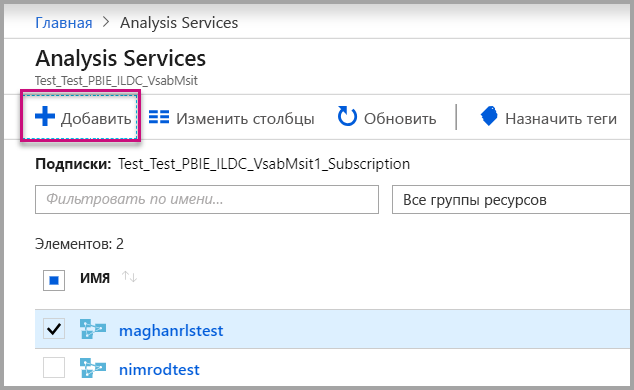

    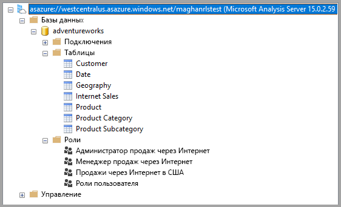

2. Создайте роль на сервере Analysis Services.

    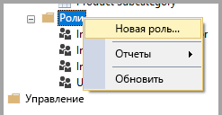

3. Настройте параметры **Общее**.  Здесь предоставляется **Имя роли** и устанавливаются разрешения базы данных только на **Чтение**.

    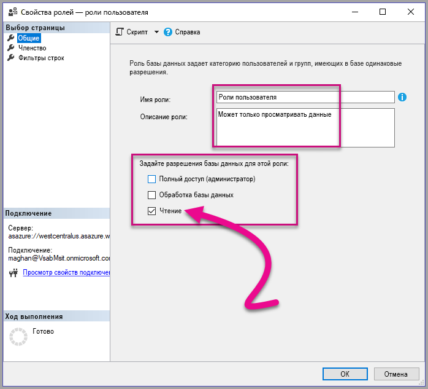

4. Задайте параметры **Членства**. Здесь добавляются пользователи, которых затрагивает эта роль.

    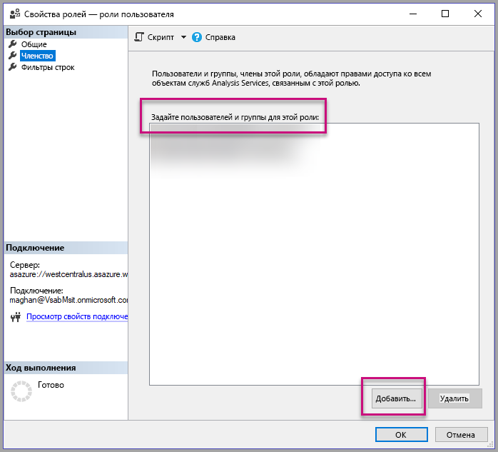

5. Задайте запрос DAX **Фильтры строк** с помощью функции *CUSTOMDATA()* .

    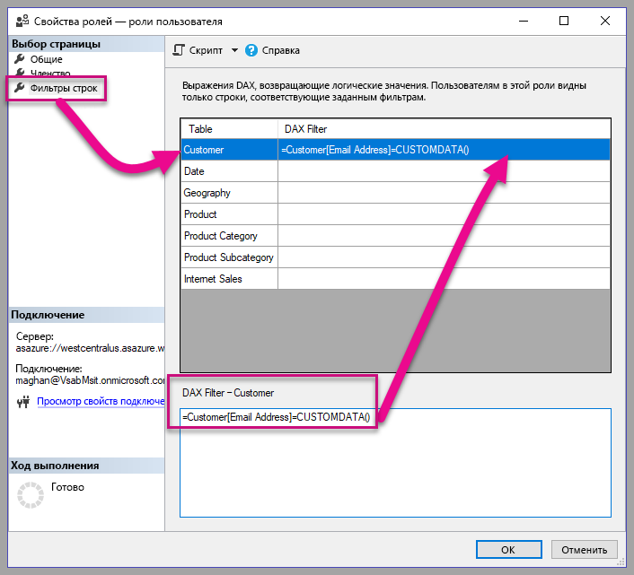

6. Создайте отчет PBI и опубликуйте его в рабочую область с выделенной емкостью.

    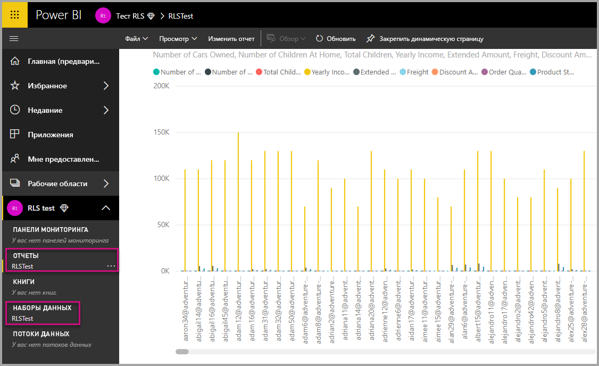

7. С помощью программных интерфейсов Power BI используйте функцию CustomData в приложении.  При создании токена с помощью функции Customdata необходимо ввести имя пользователя. Имя пользователя должно быть таким же, как и имя главного участника-пользователя. Главный пользователь должен быть членом созданной роли. Если роли не указаны, то все роли, членом которых является главный пользователь, используются для вычисления RLS.

    При работе с [субъектом-службой](embed-service-principal.md) вам также нужно выполнить описанные выше действия вместо использования основной учетной записи. При создании маркера внедрения используйте [идентификатор объекта субъекта-службы](embed-service-principal.md) как имя пользователя.

    > [!Note]
    > Когда вы будете готовы развернуть приложение в рабочей среде, необходимо, чтобы параметр или поле учетной записи главного пользователя были скрыты для конечного пользователя.

    Чтобы добавить функцию CustomData, просмотрите [код](#customdata-sdk-additions).

8. Теперь перед применением значения Customdata можно просмотреть отчет в приложении, чтобы увидеть все содержащиеся в отчете данные.

    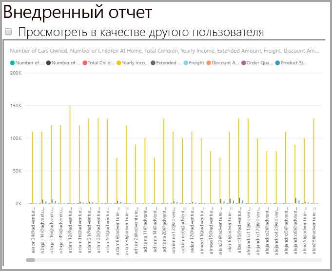

    Примените значения Customdata, чтобы увидеть, как другой набор данных отображается в отчете.
    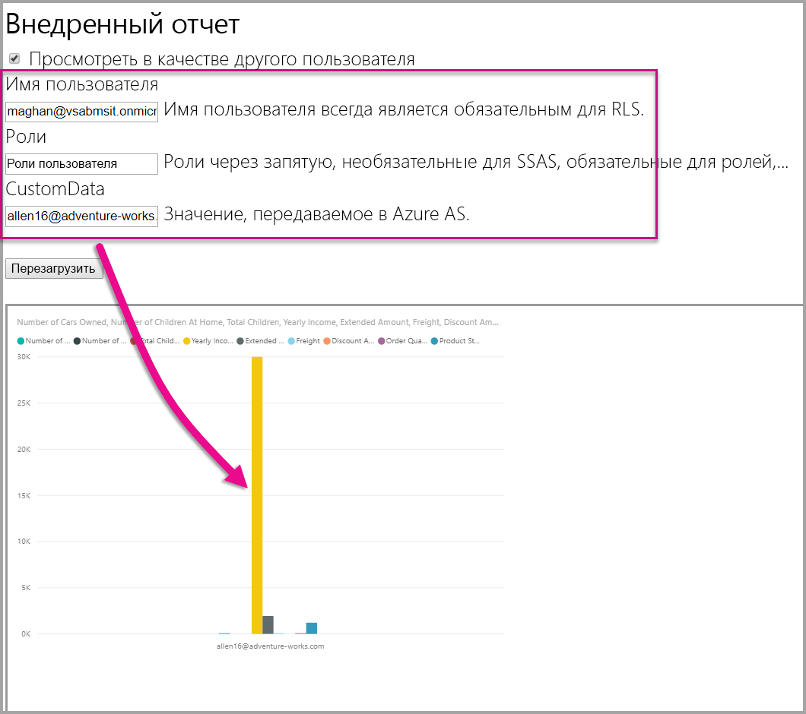

## <a name="using-rls-vs-javascript-filters"></a>Сравнение использования RLS и фильтров JavaScript

При фильтрации данных в отчете можно использовать **Безопасность на уровне строк (RLS)** или **фильтры JavaScript**.

[Безопасность на уровне строк](../../service-admin-rls.md) — это функция, которая фильтрует данные на уровне модели данных. Серверный источник данных определяет параметры RLS. Исходя из модели данных, поколение токена внедрения задает имя пользователя и роли для сеанса. С помощью клиентского кода его нельзя переопределить, удалить или контролировать, поэтому он считается безопасным. Мы рекомендуем использовать безопасность на уровне строк для безопасной фильтрации данных. Данные с RLS можно фильтровать с помощью одного из приведенных ниже параметров.

* Настройка ролей в отчете Power BI, как это сделать см. [здесь](../../desktop-rls.md).
* Настройка ролей на уровне источника данных (только динамическое подключение Analysis Services).
* Программным образом с помощью [токена внедрения](https://docs.microsoft.com/rest/api/power-bi/embedtoken/datasets_generatetokeningroup), используя `EffectiveIdentity`. При использовании токена внедрения: фактический фильтр проходит через токен внедрения во время конкретного сеанса.

[Фильтры JavaScript](https://github.com/Microsoft/PowerBI-JavaScript/wiki/Filters#page-level-and-visual-level-filters) используются, чтобы пользователь мог получать уменьшенное, масштабированное или отфильтрованное представление данных. Тем не менее у пользователя по-прежнему есть доступ к таблицам модели схемы, столбцов и мер и потенциально может получать доступ к любым существующим там данным. Ограниченный доступ к данным может применяться только с использованием RLS, а не фильтрации API, осуществляемой клиентом.

## <a name="token-based-identity-with-azure-sql-database"></a>Использование удостоверения на основе токена с Базой данных SQL Azure

**Удостоверение на основе токена** позволяет указать действующее удостоверение для токена внедрения с помощью маркера доступа **Azure Active Directory (AAD)** для **Базы данных SQL Azure**.

Клиенты, данные которых хранятся в **Базе данных SQL Azure**, теперь могут управлять пользователями и их доступом к Azure SQL в ходе интеграции со службой **Power BI Embedded**.

При создании токена внедрения можно указать действующее удостоверение пользователя в Azure SQL. Вы можете указать действующее удостоверение пользователя, передав маркер доступа Azure Active Directory на сервер. Маркер доступа используется, чтобы извлекать из Azure SQL только те данные, которые соответствуют указанному пользователю и этому сеансу.

Его можно использовать для управления представлением каждого пользователя в Azure SQL или входа в Azure SQL под учетной записью клиента в мультитенантной базе данных. Кроме того, его можно использовать, чтобы обеспечить безопасность на уровне строк в этом сеансе SQL Azure и получить только соответствующие данные для этого сеанса без необходимости управлять RLS в Power BI.

Действующее удостоверение применяется к правилам RLS непосредственно на сервере Azure SQL. В Power BI Embedded при запросе на получение данных с Azure SQL Server используется предоставленный маркер доступа. Имя участника-пользователя (для которого был предоставлен маркер доступа) можно получить в результате выполнения функции SQL USER_NAME().

Удостоверение на основе токена работает только для моделей DirectQuery с выделенной емкостью, которые подключаются к Базе данных SQL Azure, настроенной для использования проверки подлинности Microsoft Azure Active Directory ([см. сведения о проверке подлинности AAD для Базы данных SQL Azure](https://docs.microsoft.com/azure/sql-database/sql-database-manage-logins)). Настройте источник набора данных так, чтобы использовать учетные данные OAuth2 пользователей и удостоверение на основе токена.

   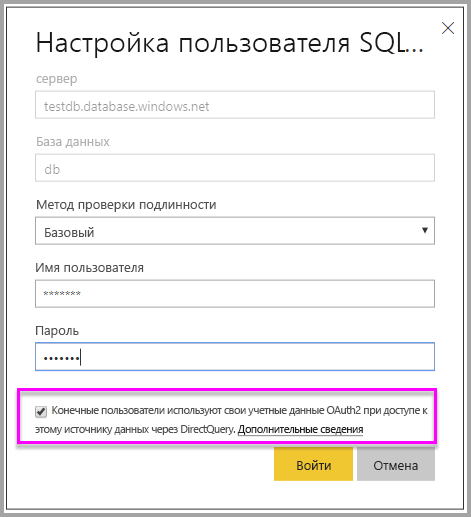

### <a name="token-based-identity-sdk-additions"></a>Дополнения пакета SDK для работы с удостоверением на основе токена

В сценарий создания токенов действующего удостоверения было добавлено свойство большого двоичного объекта удостоверения.

```JSON
[JsonProperty(PropertyName = "identityBlob")]
public IdentityBlob IdentityBlob { get; set; }
```

Тип IdentityBlob имеет простую структуру JSON-файла, содержащего свойство строкового значения.

```JSON
[JsonProperty(PropertyName = "value")]
public string value { get; set; }
```

EffectiveIdentity можно создать с помощью большого двоичного объекта идентификатора, выполнив следующий запрос:

```C#
public EffectiveIdentity(string username, IList<string> datasets, IList<string> roles = null, string customData = null, IdentityBlob identityBlob = null);
```

Большой двоичный объект удостоверения можно создать с помощью следующего запроса.

```C#
public IdentityBlob(string value);
```

### <a name="token-based-identity-rest-api-usage"></a>Использование REST API удостоверения на основе токена

При вызове [REST API](/rest/api/power-bi/embedtoken/reports_generatetokeningroup#definitions) можно добавить большой двоичный объект в каждое удостоверение.

```JSON
{
    "accessLevel": "View",
    "identities": [
        {
            "datasets": ["fe0a1aeb-f6a4-4b27-a2d3-b5df3bb28bdc"],
        "identityBlob": {
            "value": "eyJ0eXAiOiJKV1QiLCJh…."
         }
        }
    ]
}
```

В большом двоичном объекте удостоверения необходимо указать действительный маркер доступа к Azure SQL Server (с URL-адресом ресурса (<https://database.windows.net/>).

   > [!Note]
   > Для создания маркера доступа к Azure SQL приложение должно иметь делегированное разрешение на **доступ к базе данных и хранилищу Azure SQL** для API **Базы данных Azure SQL** в конфигурации регистрации AAD приложения на портале Azure.

   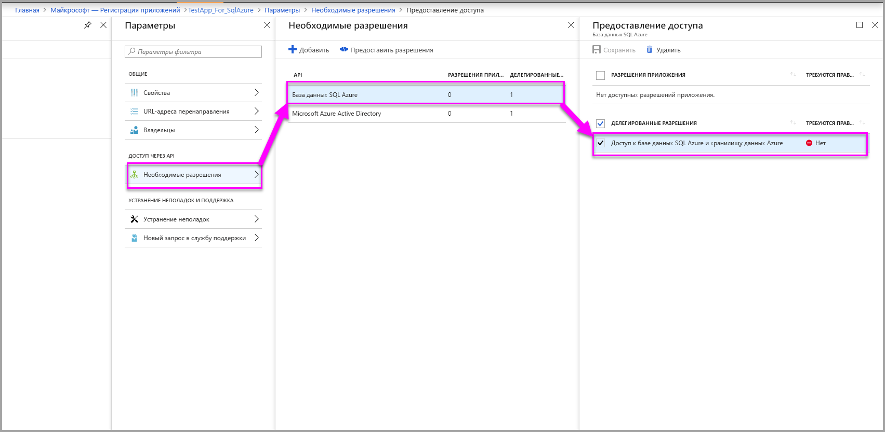

## <a name="on-premises-data-gateway-with-service-principal"></a>Локальный шлюз данных с субъектом-службой

Клиенты, настроившие безопасность на уровне строк (RLS), используя в качестве источника данных активное подключение к локальным службам SQL Server Analysis Services (SSAS), получают возможность применять [субъект-службу](embed-service-principal.md) для управления пользователями и их доступом к данным в службах SSAS при интеграции с **Power BI Embedded**.

Интерфейсы [REST API Power BI](https://docs.microsoft.com/rest/api/power-bi/) позволяют указать действующее удостоверение для активных подключений к локальным службам SSAS на основе токена внедрения с помощью [объекта субъекта-службы](https://docs.microsoft.com/azure/active-directory/develop/app-objects-and-service-principals#service-principal-object).

Ранее для указания действующего удостоверения для активного подключения к локальным службам SSAS главный пользователь, создающий токен внедрения, должен был быть администратором шлюза. Теперь администратор шлюза может предоставить пользователю специальное разрешение на доступ к источнику данных, позволяющее ему переопределить действующее удостоверение при создании токена внедрения. Эта новая возможность позволяет выполнять внедрение с помощью субъекта-службы для активного подключения к службам SSAS.

Для этого администратор шлюза использует [REST API добавления пользователя источника данных](https://docs.microsoft.com/rest/api/power-bi/gateways/adddatasourceuser), чтобы предоставить субъекту-службе разрешение *ReadOverrideEffectiveIdentity* в Power BI Embedded.

Предоставить это разрешение через портал администрирования нельзя. Оно задается только с помощью API. На портале администрирования пользователи и субъекты-службы, имеющие это разрешение, обозначены особым образом.

## <a name="considerations-and-limitations"></a>Рекомендации и ограничения

* Назначение ролей пользователям в службе Power BI не влияет на безопасность на уровне строк при использовании токена внедрения.
* Хотя служба Power BI не применяет параметр RLS для администраторов и участников с разрешениями на изменение, при указании удостоверения с токеном внедрения он будет применен к данным.
* Активные подключения к службам Analysis Services поддерживаются для локальных серверов.
* Активные подключения Azure Analysis Services поддерживают фильтрацию по ролям. Динамическая фильтрация может осуществляться с помощью CustomData.
* Если для базового набора данных не требуется RLS, запрос GenerateToken **не** должен содержать действующее удостоверение.
* Если базовый набор данных является облачной моделью (кэшированная модель или DirectQuery), действующее удостоверение должно включать в себя хотя бы одну роль, иначе назначение ролей не удастся выполнить.
* Список идентификаторов включает несколько токенов идентификаторов для внедрения панели мониторинга. Для всех других артефактов список содержит один идентификатор.

### <a name="token-based-identity-limitations"></a>Ограничения удостоверений на основе токена

* Безопасность на уровне строк можно использовать только при наличии выделенной емкости.
* Безопасность на уровне строк не работает для локального экземпляра SQL Server.

Появились дополнительные вопросы? [Попробуйте задать вопрос в сообществе Power BI.](https://community.powerbi.com/)
