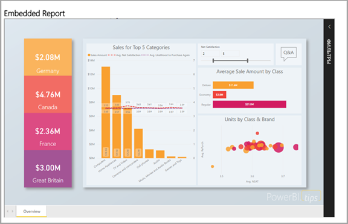
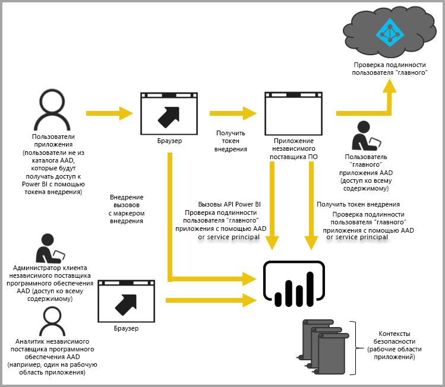

# Использование встроенной аналитики с Power BI

Возможности службы Power BI (SaaS) и Power BI Embedded в Azure (PaaS) предоставляют единый API для внедрения информационных панелей и отчетов. При внедрении содержимого это дает вам доступ к последним функциям Power BI, таким как панели мониторинга, шлюзы и рабочие области.

Воспользуйтесь [средством установки внедрения](https://aka.ms/embedsetup), чтобы быстро скачать образец приложения и приступить к работе.

Выберите подходящее решение:

* [Внедрение для организации](embedding.md#embedding-for-your-organization) позволяет расширить возможности службы Power BI. Для этого реализуйте решение [Внедрение для организации](https://aka.ms/embedsetup/UserOwnsData).
* [Внедрение для клиентов](embedding.md#embedding-for-your-customers) позволяет внедрять панели мониторинга и отчеты для пользователей, у которых нет учетной записи Power BI. Для этого реализуйте решение [Внедрение для клиентов](https://aka.ms/embedsetup/AppOwnsData).

## Использование API-интерфейсов

Существуют два основных сценария внедрения содержимого Power BI.
- Внедрение для пользователей вашей организации (у которых есть лицензия Power BI). 
 
- Внедрение для пользователей и клиентов, которым не требуются лицензии Power BI. 

[REST API Power BI](https://docs.microsoft.com/rest/api/power-bi/) поддерживает оба сценария.

Для пользователей и клиентов, у которых нет лицензий Power BI, вы можете внедрить панели мониторинга и отчеты в настраиваемое приложение, используя один API для обслуживания организации и клиентов. Клиенты видят данные, которыми управляет приложение. Кроме того, пользователям Power BI в организации доступны дополнительные возможности для просмотра *их данных* прямо в Power BI или в контексте внедренного приложения. При внедрении содержимого вы можете воспользоваться всеми преимуществами JavaScript и REST API.

Принцип работы внедрения см. в [примере внедрения JavaScript](https://microsoft.github.io/PowerBI-JavaScript/demo/).

## Внедрение для организации

**Внедрение для организации** позволяет расширить возможности службы Power BI. Этот тип внедрения требует, чтобы пользователи вашего приложения вошли в службу Power BI для просмотра содержимого. Когда сотрудник организации войдет в приложение, он получит доступ только к своим панелям мониторинга и отчетам или панелям мониторинга и отчетам, предоставленным ему в службе Power BI.

Примеры внедрения для организации включают внутренние приложения, например [SharePoint Online](https://powerbi.microsoft.com/blog/integrate-power-bi-reports-in-sharepoint-online/), [интеграцию с Microsoft Teams (у вас должны быть права администратора)](https://powerbi.microsoft.com/blog/power-bi-teams-up-with-microsoft-teams/) и [Microsoft Dynamics](https://docs.microsoft.com/dynamics365/customer-engagement/basics/add-edit-power-bi-visualizations-dashboard).

Чтобы выполнить внедрение для организации, см. [Руководство. Внедрение содержимого Power BI в приложение для организации](embed-sample-for-your-organization.md).

При внедрении для пользователей Power BI возможности самообслуживания, например редактирование, сохранение и т. д., доступны с использованием [API JavaScript](https://github.com/Microsoft/PowerBI-JavaScript).

Воспользуйтесь [средством настройки внедрения](https://aka.ms/embedsetup/UserOwnsData), чтобы приступить к работе и скачать образец приложения, с помощью которого можно интегрировать отчет в организации.

## Внедрение для клиентов

**Внедрение для клиентов** позволяет внедрять панели мониторинга и отчеты для пользователей, у которых нет учетной записи Power BI. Такое внедрение также называется *Power BI Embedded*.

[Power BI Embedded](azure-pbie-what-is-power-bi-embedded.md) — это служба **Microsoft Azure**, которая позволяет разработчикам и независимым поставщикам программного обеспечения быстро внедрять визуальные элементы, отчеты и панели мониторинга в приложение. Для этого внедрения используется основанная на емкости модель с почасовой оплатой.

Power BI Embedded дает независимым поставщикам программного обеспечения, разработчикам и клиентам ряд выгодных преимуществ. Например, независимые поставщики программного обеспечения могут начать бесплатно создавать визуальные элементы в Power BI Desktop. Минимизировав затраты на разработку визуальных элементов аналитики, независимые поставщики программного обеспечения могут ускорить вывод продуктов на рынок и выделиться среди конкурентов благодаря разнообразным представлениям данных. Кроме того, встроенная аналитика позволяет поставщикам взимать плату за особые возможности, реализуемые с ее помощью.

С Power BI Embedded вашим клиентам ничего не нужно знать о Power BI. Создать внедренное приложение можно двумя разными способами.
- Учетная запись Power BI Pro 
- Субъект-служба 

Учетная запись Power BI Pro выступает в качестве главной для вашего приложения (считайте, что это ваша учетная запись-посредник). Эта учетная запись позволяет создавать внедренные токены, которые обеспечивают доступ к панелям мониторинга и отчетам Power BI вашего приложения.

[Субъект-служба](embed-service-principal.md) позволяет внедрять содержимое Power BI в приложение с помощью токена **только для приложения**. Кроме того, она позволяет создавать внедренные токены, которые обеспечивают доступ к панелям мониторинга и отчетам Power BI вашего приложения.

С Power BI Embedded разработчики смогут сосредоточиться на ключевых функциональных возможностях приложения и не тратить время на разработку аналитики и визуальных элементов. API-интерфейсы и пакеты SDK, снабженные полной документацией, помогут быстро создать нужные отчеты и панели мониторинга и легко внедрить их, куда необходимо, выполнив все требования клиентов. Включив в приложения удобный анализ данных, независимые поставщики программного обеспечения позволят клиентам быстро принимать решения на основе данных в контексте, доступных с любого устройства.

> [!IMPORTANT]
> Хотя для внедрения требуется служба Power BI, вашим клиентам не нужно иметь учетную запись Power BI для просмотра внедренного содержимого вашего приложения. 

Когда все будет готово к переносу в рабочую среду, рабочую область нужно будет включить в выделенную емкость. Power BI Embedded в Microsoft Azure предоставляет [выделенную емкость](azure-pbie-create-capacity.md) для использования с приложениями.

Подробные сведения о внедрении см. в разделе [Внедрение содержимого Power BI](embed-sample-for-customers.md).

## Дальнейшие действия

Теперь можно попробовать внедрить содержимое Power BI в приложение, или же внедрить его для клиентов.

> [!div class="nextstepaction"]
> [Внедрение для организации](embed-sample-for-your-organization.md)

> [!div class="nextstepaction"]
> [Что такое Power BI Embedded?](azure-pbie-what-is-power-bi-embedded.md)

> [!div class="nextstepaction"]
>[Внедрение для клиентов](embed-sample-for-customers.md)

Появились дополнительные вопросы? [Попробуйте задать вопрос в сообществе Power BI.](https://community.powerbi.com/)
