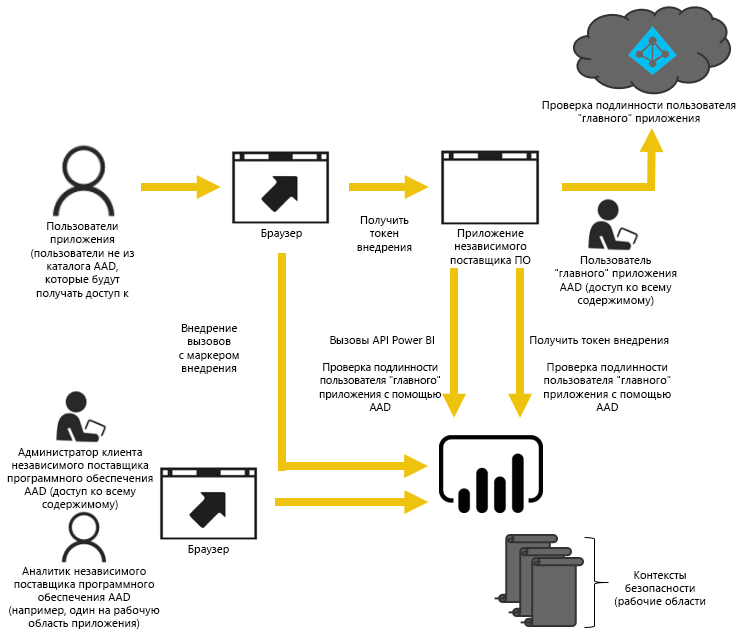
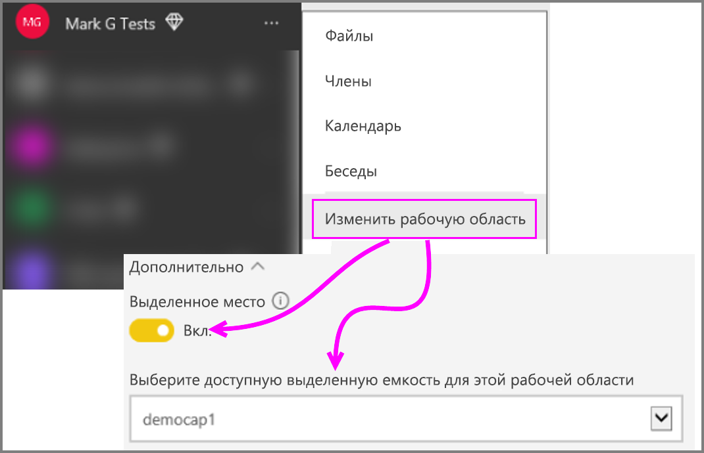

# Как перенести содержимое коллекции рабочих областей Power BI в Power BI Embedded

Эта статья содержит сведения о переносе содержимого из коллекции рабочих областей Power BI в Power BI Embedded и его внедрении в приложения с помощью расширенных функций.

Недавно корпорация Майкрософт [объявила о выпуске Power BI Embedded](https://powerbi.microsoft.com/blog/power-bi-embedded-capacity-based-skus-coming-to-azure/) — новой модели лицензирования на основе емкости, которая повышает гибкость доступа к содержимому, а также его совместного использования и распространения. Это предложение также обеспечивает дополнительные возможности масштабирования и повышает производительность.

Благодаря Power BI Embedded у вас будет одна область API, одинаковый набор возможностей и доступ к последним функциям Power BI, например панелям мониторинга, шлюзам и рабочим областям, которые можно использовать при внедрении содержимого. В будущем вы сможете начать работу с Power BI Desktop, а затем обновить ее до версии Power BI Embedded.

Текущая коллекция рабочих областей Power BI будет доступна в течение ограниченного времени. Пользователи с Соглашением Enterprise сохранят доступ до окончания срока действия этого соглашения, а пользователи, получившие эту коллекцию рабочих областей Power BI через каналы CSP или прямые каналы, смогут использовать ее в течение одного года с момента выпуска общедоступной версии Power BI Embedded.  В этой статье приведены некоторые рекомендации по миграции из коллекции рабочих областей Power BI на Power BI Embedded, а также сведения о возможных изменениях в приложении.

> [!IMPORTANT]
> Процесс миграции зависит от Power BI Embedded. Но при использовании **токена внедрения** эта зависимость устраняется для пользователей вашего приложения. Чтобы просмотреть содержимое приложения, пользователям не нужно регистрироваться в службе Power BI. Этот способ внедрения можно использовать для обслуживания пользователей, не использующих Power BI Embedded.

Перед началом миграции в новую службу Power BI Embedded можно быстро ознакомиться с пошаговым руководством, которое поможет вам настроить новую среду Power BI Embedded с помощью [средства настройки внедрения](https://aka.ms/embedsetup).

Выберите подходящее решение:
* **Внедрение для клиентов**, если [данные должны принадлежать приложению](https://aka.ms/embedsetup/AppOwnsData). [Внедрение для клиентов](embedding.md#embedding-for-your-customers) позволяет внедрять панели мониторинга и отчеты для пользователей, у которых нет учетной записи Power BI. 

* **Внедрение для организации**, если [данные должны принадлежать пользователям](https://aka.ms/embedsetup/UserOwnsData). [Внедрение для организации](embedding.md#embedding-for-your-organization) позволяет расширить возможности службы Power BI.

## Подготовка к переносу

Перед переносом содержимого из коллекции рабочих областей Power BI в Power BI Embedded нужно выполнить несколько действий. Вам потребуется клиент, а также пользователь с лицензией Power BI Pro.

1. Убедитесь в наличии доступа к клиенту Azure Active Directory (Azure AD).

    Нужно определить, какой вариант клиента использовать.

   * Использовать существующий корпоративной клиент Power BI?
   * Использовать отдельный клиент для приложения?
   * Использовать отдельный клиент для каждого пользователя?

     Если вы решили создать клиент для приложения или для каждого пользователя, ознакомьтесь с разделом [Создание клиента Azure Active Directory](create-an-azure-active-directory-tenant.md) или [Получение клиента Azure Active Directory](https://docs.microsoft.com/azure/active-directory/develop/active-directory-howto-tenant).
2. Создайте в этом новом клиенте пользователя, который будет выполнять роль "главной" учетной записи приложения. Эту учетную запись необходимо зарегистрировать в Power BI и назначить ей лицензию Power BI Pro.

## Учетные записи Azure AD

В клиенте должны использоваться следующие учетные записи.

> [!NOTE]
> Этим учетным записям потребуются лицензии Power BI Pro, чтобы использовать рабочие области.

1. Учетная запись администратора клиента.

    Мы советуем, чтобы этот пользователь был участником всех рабочих областей, созданных для внедрения.

2. Учетные записи аналитиков, создающих содержимое.

    При необходимости этих пользователей следует добавить в рабочие области.

3. *Главная* учетная запись приложения или учетная запись Embedded.

    Учетные данные этой учетной записи хранятся в серверной части приложений. Эта учетная запись используется для получения токена Azure AD, используемого в интерфейсах REST API Power BI, и создания токена внедрения приложения. Эта учетная запись также должна быть учетной записью администратора рабочих областей, созданных для внедрения.

> [!NOTE]
> Это обычная корпоративная учетная запись пользователя, которая будет использоваться для внедрения.

## Регистрация приложения и разрешения

Приложение необходимо зарегистрировать в Azure AD и предоставить ему определенные разрешения.

### Регистрация приложения

Необходимо зарегистрировать приложение в Azure AD, чтобы осуществлять вызовы REST API. Для этого перейдите на портал Azure и примените дополнительные настройки в дополнение к действиям на странице регистрации приложения Power BI. Дополнительные сведения см. в статье [Регистрация приложения Azure AD для внедрения содержимого Power BI](register-app.md).

Необходимо зарегистрировать приложение с использованием **главной** учетной записи приложения.

## Создание рабочих областей (обязательно)

Рабочие области позволяют улучшить изоляцию, если приложение обслуживает несколько клиентов. Информационные панели и отчеты разных клиентов будут изолированы. Затем вы можете использовать по одной учетной записи Power BI на каждую рабочую область, что позволит еще больше изолировать приложения.

> [!IMPORTANT]
> Невозможно использовать личную рабочую область, чтобы внедрить содержимое для пользователей, не использующих Power BI.

Чтобы создать рабочую область в Power BI, вам понадобится пользователь с лицензией Pro. Пользователь Power BI, который создает рабочую область, по умолчанию назначается ее администратором.

> [!NOTE]
> *Главная* учетная запись приложения должна быть учетной записью администратора рабочей области.

## Перенос содержимого

Перенос содержимого из коллекций рабочих областей в Power BI Embedded может выполняться во время работы с текущим решением, не вызывая простоев.

Вы можете использовать **средство миграции**, чтобы скопировать содержимое из коллекции рабочих областей Power BI в Power BI Embedded. Особенно если содержимого у вас много. Дополнительные сведения см. в статье [Инструмент переноса Power BI Embedded](migrate-tool.md).

Для переноса содержимого в основном используются два API.

1. API скачивания PBIX-файлов. Он позволяет скачивать PBIX-файлы, которые были переданы в Power BI после октября 2016 года.
2. API импорта PBIX-файлов. Он позволяет передать в Power BI любой PBIX-файл.

Соответствующие фрагменты кода приведены в разделе [Фрагменты кода для переноса содержимого из коллекции рабочих областей Power BI](migrate-code-snippets.md).

### Типы отчетов

Существует несколько типов отчетов, предназначенных для различных потоков переноса.

#### Кэшированный набор данных и отчет

Кэшированные наборы данных — это PBIX-файлы, содержащие импортированные данные, в отличие от наборов данных с активным подключением или подключением DirectQuery.

**Поток**

1. Вызовите API скачивания PBIX-файлов из рабочей области PaaS.
2. Сохраните PBIX-файл.
3. Вызовите API импорта PBIX-файлов в рабочей области SaaS.

#### Набор данных и отчет DirectQuery

**Поток**

1. Вызовите GET `https://api.powerbi.com/v1.0/collections/{collection_id}/workspaces/{wid}/datasets/{dataset_id}/Default.GetBoundGatewayDataSources` и сохраните полученную строку подключения.
2. Вызовите API скачивания PBIX-файлов из рабочей области PaaS.
3. Сохраните PBIX-файл.
4. Вызовите API импорта PBIX-файлов в рабочей области SaaS.
5. Обновите строку подключения, вызвав POST `https://api.powerbi.com/v1.0/myorg/datasets/{dataset_id}/Default.SetAllConnections`.
6. Получите идентификаторы GW и источника данных, вызвав GET `https://api.powerbi.com/v1.0/myorg/datasets/{dataset_id}/Default.GetBoundGatewayDataSources`.
7. Обновите учетные данные пользователя, вызвав PATCH `https://api.powerbi.com/v1.0/myorg/gateways/{gateway_id}/datasources/{datasource_id}`.

#### Устаревшие наборы данных и отчеты

Это наборы данных и отчеты, созданные до октября 2016 года. API скачивания PBIX-файлов не поддерживает PBIX-файлы, которые были переданы до октября 2016 года.

**Поток**

1. Получите PBIX-файлы из среды разработки (внутренняя система управления версиями).
2. Вызовите API импорта PBIX-файлов в рабочей области SaaS.

#### Отправка набора данных и отчета

API скачивания PBIX-файлов не поддерживает наборы данных *API отправки*. Данные из набора данных API невозможно перенести из PaaS в SaaS.

**Поток**

1. Вызовите API "Создание набора данных" для набора данных JSON, чтобы создать набор данных в рабочей области SaaS.
2. Повторно создайте отчет для созданного набора данных*.

Существуют обходные пути для переноса отчета API отправки из PaaS в SaaS. Они приведены ниже.

1. Передайте фиктивный PBIX-файл в рабочую область PaaS.
2. Клонируйте отчет API отправки и привяжите его к этому фиктивному PBIX-файлу.
3. Скачайте отчет API отправки с фиктивным PBIX-файлом.
4. Передайте фиктивный PBIX-файл в рабочую область SaaS.
5. Создайте набор данных API отправки в рабочей области SaaS.
6. Повторно создайте отчет для набора данных API отправки.

## Создание отчетов и их передача

Помимо содержимого, переносимого из коллекции рабочих областей Power BI, можно создавать отчеты и наборы данных с помощью Power BI Desktop, а затем публиковать эти отчеты в рабочей области. У пользователя, публикующего отчеты в рабочей области, должна быть лицензия Power BI Pro.

## Повторное создание приложения

1. Сначала вам потребуется изменить приложение, чтобы обеспечить доступ к интерфейсам REST API Power BI и расположению отчета на сайте powerbi.com.
2. Перестройте параметры проверки подлинности AuthN и AuthZ с помощью *главной* учетной записи приложения. Вы можете воспользоваться преимуществами [маркера внедрения](https://docs.microsoft.com/rest/api/power-bi/embedtoken), чтобы разрешить этому пользователю действовать от имени других пользователей.
3. Внедрите отчеты из powerbi.com в приложение.

## Сопоставления пользователей с пользователем Power BI

Пользователей, управление которыми выполняется в приложении, необходимо сопоставить с *главными* учетными данными Power BI. Учетные данные этой *главной* учетной записи Power BI хранятся в приложении и предназначены для создания токена внедрения.

## Перенос в рабочую среду

Когда вы будете готовы перенести содержимое в рабочую среду, сделайте следующее.

* Если вы используете отдельный клиент для разработки, необходимо будет убедитесь, что рабочие области, панели мониторинга и отчеты доступны в вашей рабочей среде. Также необходимо будет убедиться, что приложение создано в Azure AD для рабочего клиента и для этого приложения назначены соответствующие разрешения, как описано на шаге 1.
* Приобретите необходимый размер емкости. Чтобы определиться, какой объем и тип вам нужны, см. [технический документ по планированию ресурсов аналитики Power BI Embedded](https://aka.ms/pbiewhitepaper). Вы можете [приобрести емкость](https://portal.azure.com/#create/Microsoft.PowerBIDedicated) в Azure.
* Измените рабочую область и переместите ее в емкость Premium в диалоговом окне "Дополнительно".

    

* Разверните обновленное приложение в рабочую среду и приступите к внедрению отчетов из Power BI Embedded.

## Действия после переноса

После переноса необходимо сделать некоторые очистки в Azure.

* Удалите все рабочие области развернутого решения в коллекции рабочих областей Power BI Azure.
* Удалите все имеющиеся в Azure коллекции рабочей области.

## Дальнейшие действия

[Внедрение в Power BI](embedding.md)  
[Средство миграции коллекции рабочих областей Power BI](migrate-tool.md)  
[Фрагменты кода для переноса содержимого из коллекции рабочих областей Power BI](migrate-code-snippets.md)  
[Как внедрять панели мониторинга, отчеты и плитки Power BI](embed-sample-for-your-organization.md)  
[Что такое Power BI Premium?](../../service-premium-what-is.md)  
[Репозиторий Git JavaScript API](https://github.com/Microsoft/PowerBI-JavaScript)  
[Репозиторий Git Power BI C#](https://github.com/Microsoft/PowerBI-CSharp)  
[Пример внедрения JavaScript](https://microsoft.github.io/PowerBI-JavaScript/demo/)  
[Технический документ по планированию ресурсов аналитики коллекции рабочих областей](https://aka.ms/pbiewhitepaper)  
[Техническая документация по Power BI Premium](https://aka.ms/pbipremiumwhitepaper)  

У вас имеются и другие вопросы? [Попробуйте задать вопрос в сообществе Power BI.](https://community.powerbi.com/)
