# <a name="power-bi-embedded-migration-tool"></a>Встроенный инструмент миграции Power BI

Этот инструмент переноса можно использовать для копирования отчетов из службы Azure Power BI Embedded (PaaS) в службу Power BI (SaaS).

Перенос содержимого из коллекций рабочей области в службу Power BI может выполняться во время работы с текущим решением, не вызывая простоев.

## <a name="limitations"></a>Ограничения

* Отправленные наборы данных нельзя скачать. Их потребуется создать повторно с помощью интерфейсов REST API Power BI для службы Power BI.
* PBIX-файлы, импортированные до 26 ноября 2016 г., нельзя будет скачать.

## <a name="download"></a>Скачать

Пример инструмента переноса доступен на сайте [GitHub](https://github.com/Microsoft/powerbi-migration-sample). Можно скачать ZIP-файл репозитория или клонировать его локально. Затем вы можете открыть файл *powerbi-migration-sample.sln* в Visual Studio для сборки и запуска инструмента переноса.

## <a name="migration-plans"></a>Планы переноса

План переноса — это просто метаданные, которые упорядочивают содержимое в каталоги в Power BI Embedded, и способ их публикации в службе Power BI.

### <a name="start-with-a-new-migration-plan"></a>Создание нового плана переноса

План переноса — это метаданные доступных в Power BI Embedded элементов, которые необходимо перенести в службу Power BI. План переноса хранится в виде XML-файла.

Сначала необходимо создать план переноса. Для этого сделайте следующее:

1. Выберите **Файл** > **New Migration Plan** (Новый план переноса).

    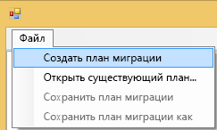

2. В диалоговом окне **Select Power BI Embedded Resource Group** (Выбор группы ресурсов Power BI Embedded) необходимо выбрать в раскрывающемся списке "Среда" рабочую среду.

3. Вам будет предложено выполнить вход. Используйте имя входа подписки Azure.

   > [!IMPORTANT]
   > Это **не** рабочая учетная запись Office 365, которую вы используете для входа в Power BI.

4. Выберите подписку Azure, где хранятся коллекции рабочей области Power BI Embedded.

    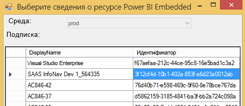
5. Под списком подписок выберите **группу ресурсов**, содержащую коллекции рабочей области, и нажмите кнопку **Выбрать**.

    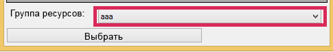

6. Нажмите кнопку **Анализ**. Таким образом вы получите список элементов в подписке Azure, чтобы начать создание плана.

    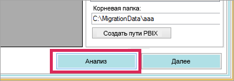

   > [!NOTE]
   > Анализ может занять несколько минут в зависимости от количества коллекций рабочей области и объема содержимого в коллекции рабочей области.

7. Когда **анализ** будет завершен, вам будет предложено сохранить план переноса.

На этом этапе вы уже подключили план переноса к подписке Azure. В следующих разделах вы узнаете, как работать с планом переноса, в частности как анализировать и планировать перенос, создавать группы, а также как выполнять скачивание и передачу.

### <a name="save-your-migration-plan"></a>Сохранение плана переноса

Вы можете сохранить план переноса для последующего использования. При этом будет создан XML-файл со всеми данными, указанными в плане переноса.

Чтобы сохранить план переноса, сделайте следующее:

1. Выберите **Файл** > **Save Migration Plan** (Сохранить план переноса).

    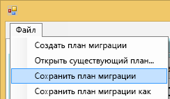

2. Присвойте файлу имя или используйте созданное имя файла и нажмите кнопку **Сохранить**.

### <a name="open-an-existing-migration-plan"></a>Открытие существующего плана переноса

Вы можете открыть сохраненный план переноса, чтобы продолжить работу над переносом.

Чтобы открыть существующий план переноса, сделайте следующее:

1. Выберите **Файл** > **Open Existing Migration Plan** (Открыть существующий план переноса).

    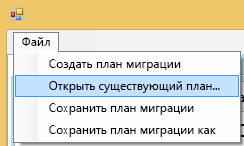

2. Выберите файл переноса и щелкните **Открыть**.

## <a name="step-1-analyze--plan-migration"></a>Шаг 1. Анализ и планирование миграции

Сведения на вкладке **Analyze & Plan Migration** (Анализ и планирование переноса) позволяет получить представление о том, какие ресурсы в настоящее время входят в группу ресурсов подписки Azure.

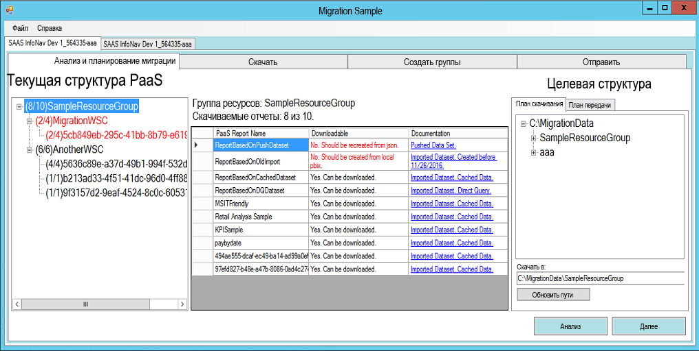

В качестве примера мы рассмотрим группу *SampleResourceGroup*.

### <a name="paas-topology"></a>Топология PaaS

Ниже приведено представление *Группа ресурсов > Коллекции рабочей области > Рабочие области*. Для группы ресурсов и коллекций рабочей области будет отображаться понятное имя, а для рабочих областей — идентификатор GUID.

Элементы в списке могут быть разного цвета. Они отображаются с числом в формате (№/№). Это количество отчетов, которые можно скачать.
Черный цвет означает, что все отчеты можно скачать.

Красный цвет означает, что все отчеты нельзя скачать. Число слева указывает общее количество отчетов, которые можно скачать. Число справа показывает общее количество отчетов внутри группы.

Вы можете выбрать элемент в топологии PaaS для отображения отчетов в разделе "Отчеты".

### <a name="reports"></a>Отчеты

В разделе "Отчеты" содержатся доступные отчеты с пометкой о том, можно ли их скачать.


### <a name="target-structure"></a>Целевая структура

**Целевая структура** позволяет указать место для скачивания элементов, а также способ их передачи.

#### <a name="download-plan"></a>План скачивания

Путь будет создан автоматически. При желании его можно изменить. В таком случае необходимо выбрать **Update paths** (Обновить пути).

> [!NOTE]
> При этом само скачивание не выполняется. Вы просто указываете структуру, в которую будут скачаны отчеты.

#### <a name="upload-plan"></a>План передачи

Здесь можно указать префикс для рабочих областей, которые будут созданы в службе Power BI. Затем префикс будет использоваться как идентификатор GUID для рабочей области, которая существовала в Azure.

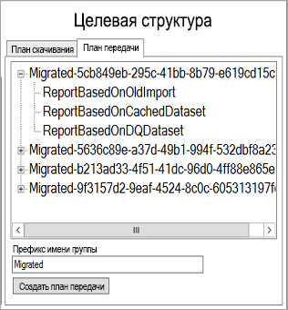

> [!NOTE]
> Этим действием вы не создаете группы в службе Power BI. Вы просто определяете структуру именования для групп.

В случае изменения префикса необходимо выбрать **Generate Upload Plan** (Создать план передачи).

При необходимости вы можете щелкнуть группу правой кнопкой мыши и выбрать команду, чтобы переименовать группу прямо в плане передачи.

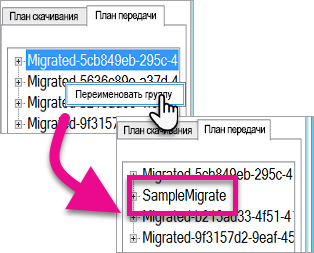

> [!NOTE]
> Имя *группы* не должно содержать пробелы и недопустимые знаки.

## <a name="step-2-download"></a>Шаг 2. Скачать

На вкладке **Скачивание** содержится список отчетов и связанные метаданные. Здесь вы увидите текущее и предыдущее состояния экспорта.

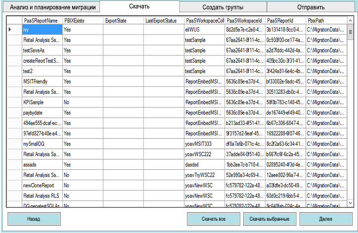

У вас есть два варианта.

* Выберите конкретные отчеты и нажмите кнопку **Скачать выбранные**.
* Нажмите кнопку **Скачать все**.

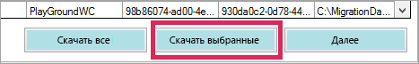

Для успешной загрузки отобразится состояние *Готово* и существующий PBIX-файл.

После завершения скачивания выберите вкладку **Create Groups** (Создание групп).

## <a name="step-3-create-groups"></a>Шаг 3. Создать группы

После скачивания доступных отчетов можно перейти на вкладку **Create Groups** (Создание групп). На этой вкладке будут созданы рабочие области в службе Power BI на основе созданного плана переноса. Рабочие области будут иметь имена, указанные на вкладке **Отправка** в разделе **Анализ и планирование миграции**.

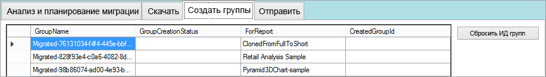

Чтобы создать рабочие области, можно нажать кнопку **Создать выбранные группы** или **Создать все отсутствующие группы**.

При выборе любого из этих вариантов вам будет предложено войти. *Необходимо использовать учетные данные для службы Power BI, в которой нужно создать рабочие области.*

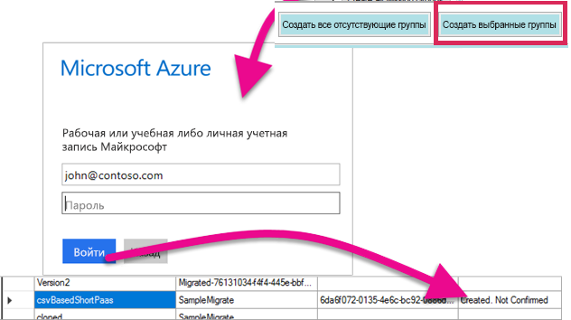

Будет создана рабочая область в службе Power BI. При этом в рабочую область не будут переданы отчеты.

Вы можете проверить, создана ли рабочая область, войдя в службу Power BI. Вы увидите, что в рабочей области ничего нет.

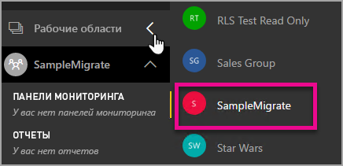

После создания рабочей области можно перейти на вкладку **Upload** (Передача).

## <a name="step-4-upload"></a>Шаг 4. Отправить

На вкладке **Upload** (Передача) можно передать отчеты в службу Power BI. Вы увидите список отчетов, которые мы скачали на вкладке скачивания, а также имя целевой группы в соответствии с планом переноса.

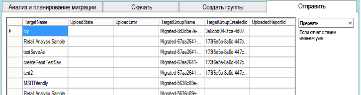

Можно передать выбранные или все отчеты. Можно также сбросить состояние передачи для повторной передачи элементов.

Вы также можете выбрать, что делать, если отчет с таким именем уже существует: **прервать**, **игнорировать** или **перезаписать**.

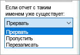

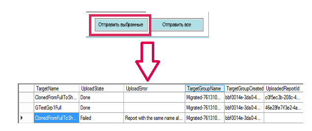

### <a name="duplicate-report-names"></a>Повторяющиеся имена отчетов

Если у вас есть отчет с таким же именем, но вы знаете, что это другой отчет, необходимо изменить его **целевое имя**. Это нужно сделать вручную в XML-файле плана переноса.

Чтобы внести изменения, необходимо закрыть инструмент переноса, а затем снова открыть его и план переноса.

В приведенном выше примере один из клонированных отчетов не удалось передать, так как отчет с таким именем уже существует. Если открыть XML-файл плана переноса, вы увидите там следующее:

```xml
<ReportMigrationData>
    <PaaSWorkspaceCollectionName>SampleWorkspaceCollection</PaaSWorkspaceCollectionName>
    <PaaSWorkspaceId>4c04147b-d8fc-478b-8dcb-bcf687149823</PaaSWorkspaceId>
    <PaaSReportId>525a8328-b8cc-4f0d-b2cb-c3a9b4ba2efe</PaaSReportId>
    <PaaSReportLastImportTime>1/3/2017 2:10:19 PM</PaaSReportLastImportTime>
    <PaaSReportName>cloned</PaaSReportName>
    <IsPushDataset>false</IsPushDataset>
    <IsBoundToOldDataset>false</IsBoundToOldDataset>
    <PbixPath>C:\MigrationData\SampleResourceGroup\SampleWorkspaceCollection\4c04147b-d8fc-478b-8dcb-bcf687149823\cloned-525a8328-b8cc-4f0d-b2cb-c3a9b4ba2efe.pbix</PbixPath>
    <ExportState>Done</ExportState>
    <LastExportStatus>OK</LastExportStatus>
    <SaaSTargetGroupName>SampleMigrate</SaaSTargetGroupName>
    <SaaSTargetGroupId>6da6f072-0135-4e6c-bc92-0886d8aeb79d</SaaSTargetGroupId>
    <SaaSTargetReportName>cloned</SaaSTargetReportName>
    <SaaSImportState>Failed</SaaSImportState>
    <SaaSImportError>Report with the same name already exists</SaaSImportError>
</ReportMigrationData>
```

Для файла, который не удалось отправить, можно изменить имя SaaSTargetReportName.

```xml
<SaaSTargetReportName>cloned2</SaaSTargetReportName>
```

Затем можно повторно открыть план в инструменте переноса и передать этот отчет.

Вернувшись в Power BI, мы видим, что отчеты и наборы данных были переданы в рабочую область.

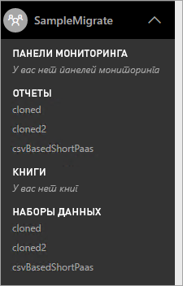

<a name="upload-local-file"></a>

### <a name="upload-a-local-pbix-file"></a>Передача локального PBIX-файла

Вы можете передать локальную версию файла Power BI Desktop. Для этого закройте инструмент и в XML-файле укажите полный путь к локальному PBIX-файлу в свойстве **PbixPath**.

```xml
<PbixPath>[Full Path to PBIX file]</PbixPath>
```

После изменения XML-файла повторно откройте план в инструменте переноса и передайте отчет.

<a name="directquery-reports"></a>

### <a name="directquery-reports"></a>Отчеты DirectQuery

Вам понадобится обновить строку подключения для отчетов DirectQuery. Это можно сделать на сайте *powerbi.com* или программными средствами запросить строку подключения из Power BI Embedded (PaaS). Пример см. в разделе [Extract DirectQuery connection string from PaaS report](migrate-code-snippets.md#extract-directquery-connection-string-from-paas-report) (Извлечение строки подключения DirectQuery из отчета PaaS).

Затем можно обновить строку подключения для набора данных в службе Power BI (SaaS) и задать учетные данные для источника данных. Для этого см. следующие разделы:

* [Обновление строки подключения DirectQuery в рабочей области SaaS](migrate-code-snippets.md#update-directquery-connection-string-is-saas-workspace)
* [Задание учетных данных DirectQuery в рабочей области SaaS](migrate-code-snippets.md#set-directquery-credentials-in-saas-workspace)

## <a name="embedding"></a>Внедрение

Теперь, когда отчеты перенесены из службы Azure Power BI Embedded в службу Power BI, можно обновить приложение и начать внедрение отчетов в этой рабочей области.

Дополнительные сведения см. в статье [Как перенести содержимое коллекции рабочих областей Power BI Embedded в Power BI](migrate-from-powerbi-embedded.md).

## <a name="next-steps"></a>Дальнейшие действия

[Внедрение в Power BI](embedding.md)  
[Как перенести содержимое коллекции рабочих областей Power BI Embedded в Power BI](migrate-from-powerbi-embedded.md)  
[Что такое Power BI Premium?](../../service-premium-what-is.md)  
[Репозиторий Git JavaScript API](https://github.com/Microsoft/PowerBI-JavaScript)  
[Репозиторий Git Power BI C#](https://github.com/Microsoft/PowerBI-CSharp)  
[Пример внедрения JavaScript](https://microsoft.github.io/PowerBI-JavaScript/demo/)  
[Техническая документация по Power BI Premium](https://aka.ms/pbipremiumwhitepaper)  

Появились дополнительные вопросы? [Попробуйте задать вопрос в сообществе Power BI.](https://community.powerbi.com/)