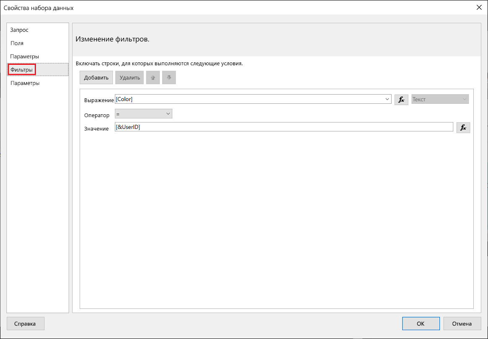
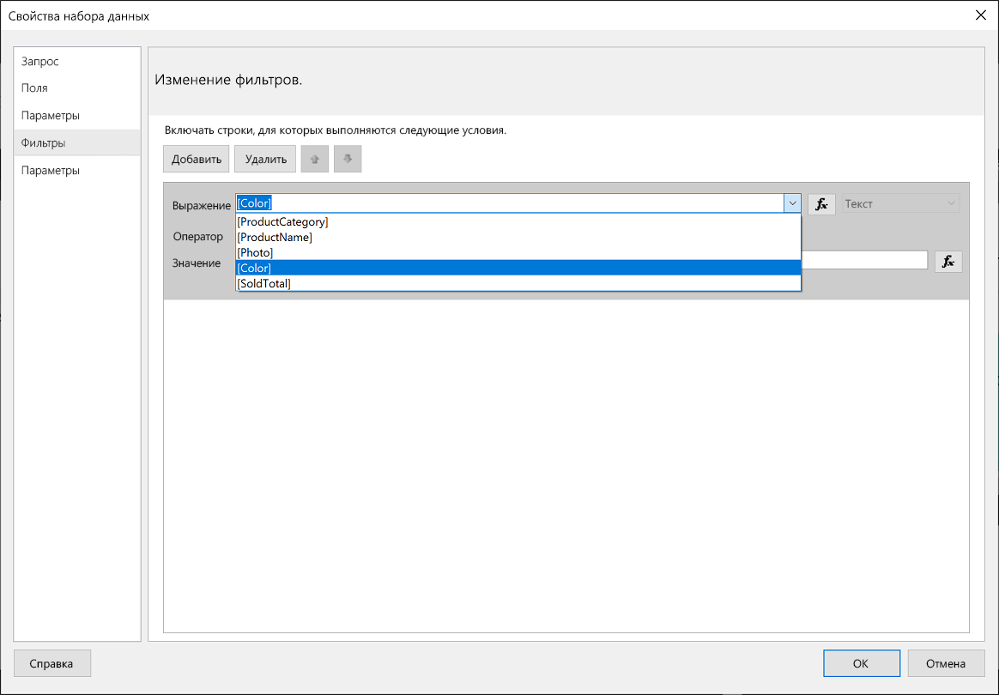
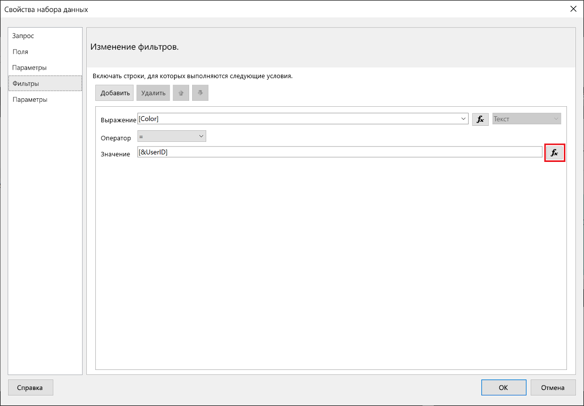
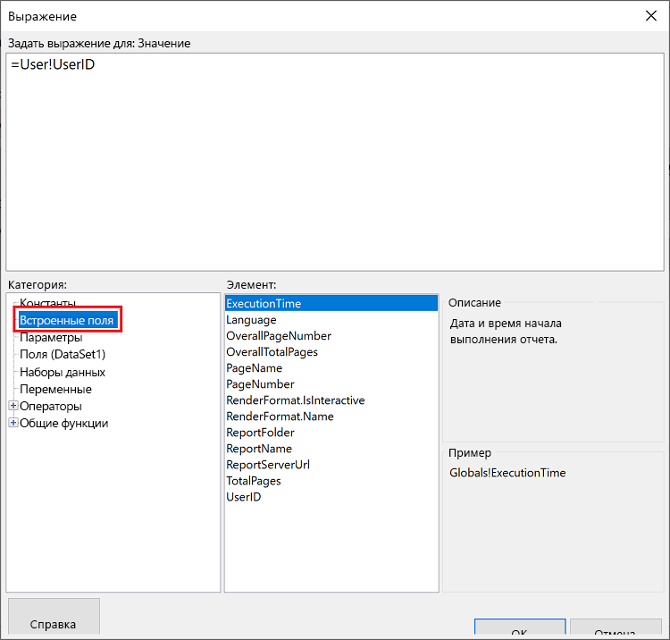
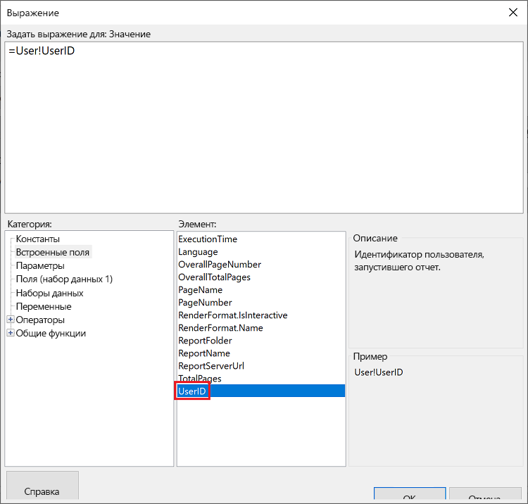
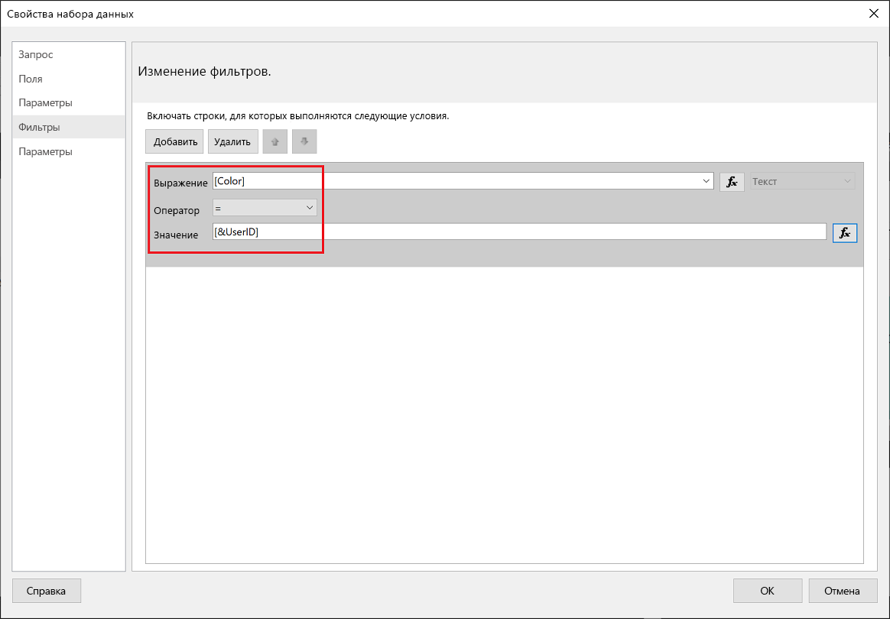
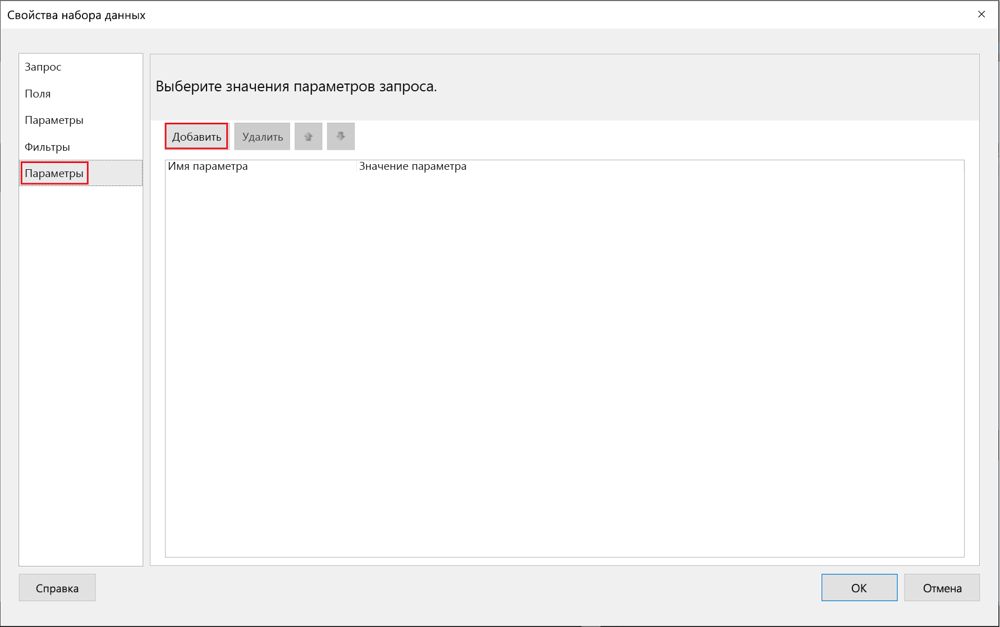
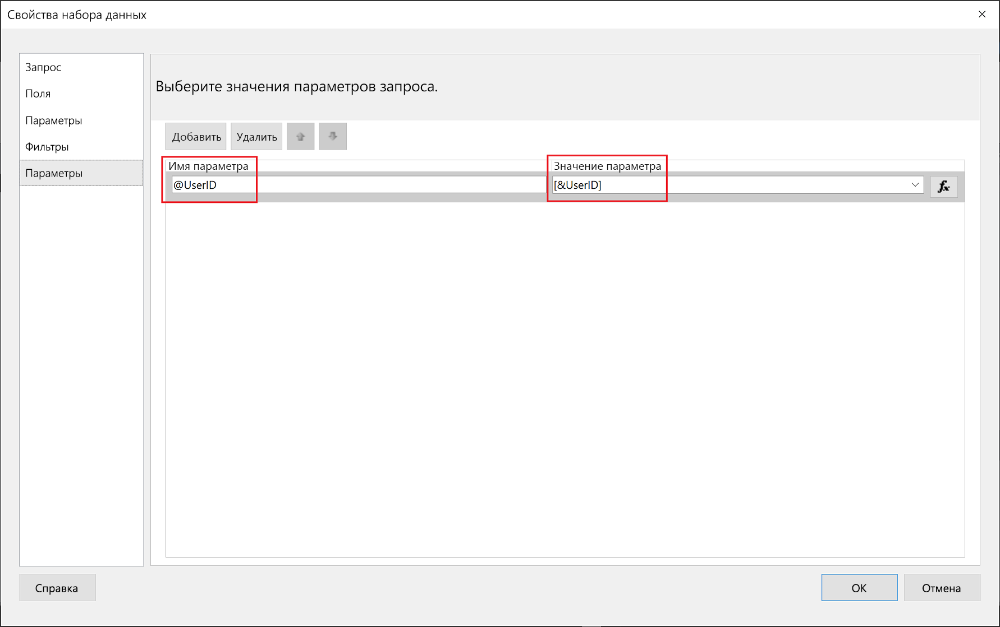
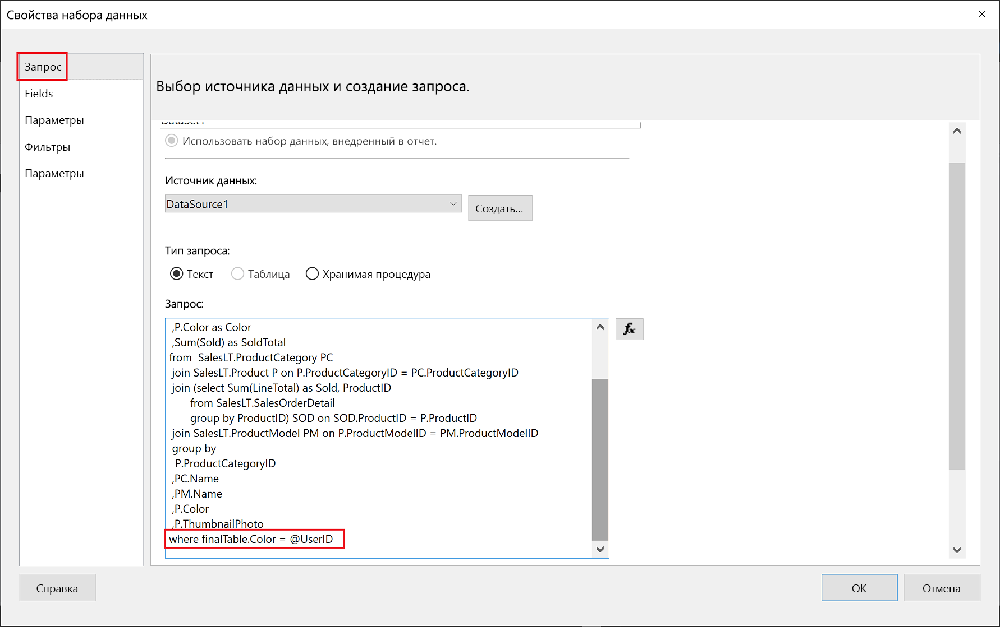

# <a name="implementing-row-level-security-in-embedded-paginated-reports"></a>Реализация безопасности на уровне строк во внедренных отчетах с разбивкой на страницы

При внедрении отчета с разбивкой на страницы можно управлять отображением данных. Это позволяет адаптировать отображаемые сведения для каждого пользователя. Например, если имеется отчет Power BI с разбивкой на страницы, включающий глобальные результаты продаж, его можно внедрить таким образом, чтобы были доступны только результаты продаж из определенного региона.

Эта функция обеспечивает безопасный способ отображения подмножества данных таким способом, который не нарушает оставшуюся часть данных. Он напоминает функцию [безопасность на уровне строк (RLS)](embedded-row-level-security.md), которая обеспечивает безопасный способ отображения данных в отчетах Power BI (которые не разбиты на страницы), на панелях мониторинга, плитках и наборах данных.  

> [!NOTE]
> Эта функция работает с внедрением отчетов с разбивкой на страницы для клиентов.

## <a name="configuring-a-parameter-to-filter-the-dataset"></a>Настройка параметра для фильтрации набора данных

При применении безопасности на уровне строк к отчету Power BI с разбивкой на страницы необходимо присвоить [параметр](../../paginated-reports/report-builder-parameters.md) атрибуту **UserID**. Перед внедрением отчета этот параметр ограничит данные, извлеченные из набора данных.

После назначения параметра **UserID** используйте API [Отчеты GenerateTokenInGroup](/rest/api/power-bi/embedtoken/reports_generatetokeningroup), чтобы получить маркер внедрения.

## <a name="use-userid-as-a-filter-at-report-or-query-level"></a>Использование UserID в качестве фильтра на уровне отчета или запроса

**UserId** можно использовать в качестве *фильтра* или *запроса* для источника данных в [Power BI Report Builder](../../paginated-reports/report-builder-power-bi.md).

### <a name="using-the-filter"></a>Использование фильтра

1. В окне **Свойства набора данных** в левой области выберите **Фильтр**.

    

2. В раскрывающемся меню **Выражение** выберите параметр, который нужно использовать для фильтрации данных.

     

3. Нажмите кнопку функции **Значение**. 

    

4. В окне **Выражение** в списке **Категория** выберите **Встроенные поля**.

    

5. В списке **Элемент** выберите **UserID** и нажмите **ОК**.

    

6. В окне **Свойства набора данных** убедитесь, что выражение *выбранный параметр ровен UserID*, и нажмите кнопку **ОК**.

    

### <a name="using-a-query"></a>Использование запроса

1. В окне **Свойства набора данных** в левой области выберите **Параметры** и нажмите **Добавить**.

    

2. В поле **Имя параметра** введите **\@UserID** и добавьте в **значение параметра** **[&UserID]** .

     

3. В левой области выберите **Запрос**, в разделе "Запрос" добавьте параметр **UserID** в качестве части запроса и нажмите кнопку **ОК**.
    > [!NOTE]
    > На снимке экрана ниже параметр цвета используется в качестве примера (whereFinalTable.Color = @UserID). При необходимости можно создать более сложный запрос.

    

## <a name="passing-the-configured-parameter-using-the-embed-token"></a>Передача настроенного параметра с помощью маркера внедрения

Чтобы при внедрении для клиентов отчета с разбивкой на страницы получить маркер внедрения, используется API [Отчеты GenerateTokenInGroup](/rest/api/power-bi/embedtoken/reports_generatetokeningroup). Этот маркер также можно использовать для фильтрации некоторых данных, извлекаемых из отчета с разбивкой на страницы.

Чтобы предоставить только часть данных, назначьте поле `username` с информацией, которую необходимо отобразить. Например, в отчете с разбивкой на страницы, имеющем параметр цвета, при вводе *зеленый* в поле `username` маркер внедрения ограничит внедренные данные, чтобы отображались только данные, которые имеют значение *зеленый* в столбце "Цвет".

```JSON
{
    "accessLevel": "View",
    "reportId": "cfafbeb1-8037-4d0c-896e-a46fb27ff229",
    "identities": [
            {
                    // Replace the 'username' with a paginated report parameter
                    "username":     "...",
                    "reports: [
                        "cfafbeb1-8037-4d0c-896e-a46fb27ff229"
                    ]
            }
    ]
}
```