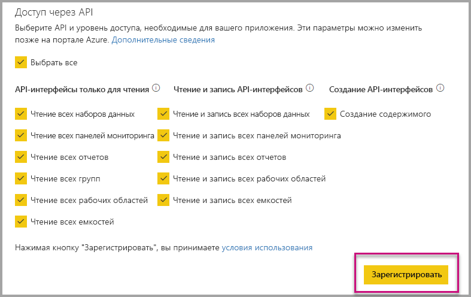
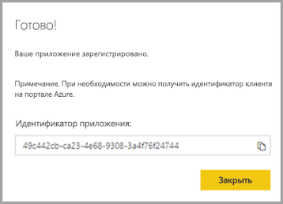
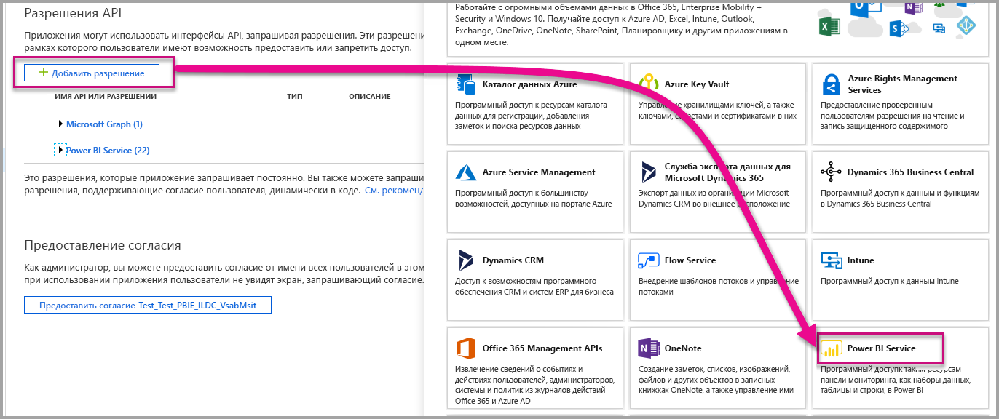

# <a name="register-an-azure-ad-application-to-use-with-power-bi"></a>Регистрация приложения Azure AD для использования с Power BI

Узнайте, как зарегистрировать приложение в Azure Active Directory (Azure AD) для использования внедренного содержимого Power BI.

Чтобы предоставить приложению доступ к интерфейсам [REST API Power BI](https://docs.microsoft.com/rest/api/power-bi/), его необходимо зарегистрировать в Azure AD. Зарегистрировав приложение, вы сможете создать удостоверение для приложения и предоставить ему разрешения на доступ к ресурсам REST Power BI.

> [!IMPORTANT]
> Для регистрации приложения Power BI вам потребуется [клиент Azure Active Directory и пользователь организации](create-an-azure-active-directory-tenant.md). Если вы еще не зарегистрировались в Power BI как пользователь в клиенте, регистрация приложения не завершится успешно.

Существует два способа регистрации приложения. Это можно сделать с помощью [средства регистрации приложений Power BI](https://dev.powerbi.com/apps/) или портала Azure. Средство регистрации приложений Power BI удобнее, так как в нем всего лишь несколько полей для заполнения. Если вы хотите внести изменения в приложение, используйте портал Azure.

## <a name="register-with-the-power-bi-application-registration-tool"></a>Регистрация с помощью средства регистрации приложений Power BI

Чтобы получить удостоверение для приложения и указать разрешения для ресурсов REST Power BI, необходимо зарегистрировать приложение в **Azure Active Directory**. При регистрации приложения, например консольного приложения или веб-сайта, вы получаете идентификатор, который используется приложением для запроса разрешений у пользователей.

Ниже описана процедура регистрации приложения с помощью средства регистрации приложений Power BI.

1. Перейдите по адресу [dev.powerbi.com/apps](https://dev.powerbi.com/apps).

2. Нажмите кнопку **Войти по существующей учетной записи**, а затем кнопку **Далее**.

3. Укажите **имя приложения**.

4. Укажите **тип приложения**.

    При выборе **собственного приложения** или **веб-приложения на стороне сервера** учитывайте описанные ниже различия.

    Собственное:
    * Вы планируете создать приложение, [предназначенное для клиентов](embed-sample-for-customers.md), которое будет использовать для проверки подлинности главную учетную запись (лицензию Power BI Pro для входа в Power BI).

    Веб-приложение на стороне сервера:
    * Вы планируете создать приложение, [предназначенное для вашей организации](embed-sample-for-your-organization.md).
    * Вы планируете создать приложение, [предназначенное для клиентов](embed-sample-for-customers.md), которое будет использовать субъект-службу для проверки подлинности.
    * Вы планируете создавать веб-приложения или веб-API.

    

5. Если в качестве типа приложения выбрано **веб-приложение на стороне сервера**, введите значения в полях **URL-адрес домашней страницы** и **URL-адрес перенаправления**. **URL-адресом перенаправления** может быть любой допустимый URL-адрес, соответствующий созданному приложению. Если выбрано **собственное** приложение, перейдите к шагу 6.

6. Выберите интерфейсы API Power BI, требуемые приложению. Дополнительные сведения о разрешениях на доступ к Power BI см. в статье [Разрешения и согласие для конечной точки платформы удостоверений Майкрософт](https://docs.microsoft.com/azure/active-directory/develop/v2-permissions-and-consent). Нажмите кнопку **Зарегистрировать**.

    

    > [!Important]
    > После активации субъектов-служб для использования с Power BI разрешения в Azure Active Directory перестают действовать. Управление разрешениями осуществляется на портале администрирования Power BI.

7. Если в качестве типа приложения выбрано **собственное** приложение, будет предоставлен **идентификатор приложения**. Если в качестве типа приложения выбрано **веб-приложение на стороне сервера**, вы получите **идентификатор приложения** и **секрет приложения**.

    > [!Note]
    > При необходимости **идентификатор приложения** можно будет получить на портале Azure позднее. Если **секрет приложения** потерян, необходимо создать новый на портале Azure.

| Машинный код | Веб-приложение на стороне сервера |
|--------|-----------------------------|
|  |  |

Теперь зарегистрированное приложение можно использовать как часть настраиваемого приложения для взаимодействия со службой Power BI или приложением Power BI Embedded.

## <a name="register-with-the-azure-portal"></a>Регистрация на портале Azure

Зарегистрировать приложение можно также непосредственно на портале Azure. Чтобы зарегистрировать приложение, выполните следующее.

1. Примите [условия использования API Microsoft Power BI](https://powerbi.microsoft.com/api-terms).

2. Войдите на [портал Azure](https://portal.azure.com).

3. Выберите клиент Azure AD, щелкнув свою учетную запись в правом верхнем углу страницы.

4. В области навигации слева перейдите в раздел **Все службы**, выберите **Регистрация приложений** и щелкните **Новая регистрация**.

5. Следуя инструкциям на экране, создайте приложение.

   Дополнительные сведения о регистрации приложений в Azure Active Directory см. в статье [здесь](https://docs.microsoft.com/azure/active-directory/develop/quickstart-v2-register-an-app).

## <a name="how-to-get-the-application-id"></a>Получение идентификатора приложения

При регистрации приложения вы получаете [идентификатор приложения](embed-sample-for-customers.md#application-id).  По **идентификатору приложения** приложение запрашивает разрешения для идентификации пользователей.

## <a name="how-to-get-the-service-principal-object-id"></a>Получение идентификатора объекта субъекта-службы

При выполнении операций с субъектом-службой с помощью [интерфейсов API Power BI](https://docs.microsoft.com/rest/api/power-bi/), например при добавлении субъекта-службы в качестве администратора в рабочую область, на него необходимо ссылаться по [идентификатору объекта субъекта-службы](embed-service-principal.md).

## <a name="apply-permissions-to-your-application-within-azure-ad"></a>Применение разрешений к приложению в Azure AD

Кроме разрешений, представленных на странице регистрации приложения, необходимо также включить дополнительные разрешения. Это можно сделать на портале Azure AD или программным способом.

Вам нужно войти в систему с помощью *основной* учетной записи, используемой для внедрения, или учетной записи глобального администратора.

### <a name="using-the-azure-ad-portal"></a>Применение разрешений на портале Azure AD

1. На портале Azure перейдите к колонке [Регистрация приложений](https://portal.azure.com/#blade/Microsoft_AAD_RegisteredApps/ApplicationsListBlade/quickStartType//sourceType/) и выберите приложение, используемое для внедрения.

2. В разделе **Управление** выберите **Разрешения API**.

3. В области **Разрешения API** выберите **Добавить разрешение**, а затем **Служба Power BI**.

    

4. Установите нужные вам разрешения в разделе **Делегированные разрешения**. Их необходимо выбирать по одному, чтобы сохранить настройки. После завершения щелкните **Сохранить**.

5. Выберите **Предоставление согласия**.

    Действие **Предоставление согласия** требуется для того, чтобы в *главную учетную запись* не отправлялись запросы на согласие из Azure AD. Если это действие выполняется с учетной записью глобального администратора, разрешения на использование приложения предоставляются всем пользователям в вашей организации. Если это действие выполняется для *главной учетной записи*, а не для учетной записи глобального администратора, разрешения на использование этого приложения предоставляются только *главной учетной записи*.

### <a name="applying-permissions-programmatically"></a>Применение разрешений программным способом

1. В этом сценарии необходимо получить имеющиеся субъекты-службы (пользователей) клиента. Сведения о том, как это сделать, см. в статье [Тип ресурса servicePrincipal](https://docs.microsoft.com/graph/api/resources/serviceprincipal?view=graph-rest-beta).

    API *Get servicePrincipal* можно вызвать без параметра {ID}. Это позволит получить все субъекты-службы в клиенте.

2. Проверьте наличие субъекта-службы, задав в качестве значения свойства **appId** идентификатор приложения.

3. Создайте план обслуживания, если он отсутствует в вашем приложении.

    ```json
    Post https://graph.microsoft.com/beta/servicePrincipals
    Authorization: Bearer ey..qw
    Content-Type: application/json
    {
    "accountEnabled" : true,
    "appId" : "{App_Client_ID}",
    "displayName" : "{App_DisplayName}"
    }
    ```

4. Предоставление разрешений на использование приложения интерфейсу API Power BI

   Если вы используете существующий клиент и не собираетесь предоставлять разрешения от имени всех пользователей клиента, можно предоставить разрешения определенному пользователю, заменив значение **contentType** на **Principal**.

   Значением **consentType** может быть **AllPrincipals** или **Principal**.

   * Значение **AllPrincipals** может использовать только администратор клиента для предоставления разрешений от имени всех пользователей в клиенте.
   * Значение **Principal** используется для предоставления разрешений от имени определенного пользователя. В этом случае в текст запроса следует добавить дополнительное свойство: *principalId={User_ObjectId}* .

     Действие *Предоставить разрешения* требуется для того, чтобы главная учетная запись не получала запросы подтверждения из Azure AD, что невозможно при неинтерактивном входе в систему.

     ```json
     Post https://graph.microsoft.com/beta/OAuth2PermissionGrants
     Authorization: Bearer ey..qw
     Content-Type: application/json
     {
     "clientId":"{Service_Plan_ID}",
     "consentType":"AllPrincipals",
     "resourceId":"c78a3685-1ce7-52cd-95f7-dc5aea8ec98e",
     "scope":"Dataset.ReadWrite.All Dashboard.Read.All Report.Read.All Group.Read Group.Read.All Content.Create Metadata.View_Any Dataset.Read.All Data.Alter_Any",
     "expiryTime":"2018-03-29T14:35:32.4943409+03:00",
     "startTime":"2017-03-29T14:35:32.4933413+03:00"
     }
     ```

    Используемый **идентификатор ресурса** *c78a3685-1ce7-52cd-95f7-dc5aea8ec98e* не является универсальным, а зависит от клиента. Это значение — идентификатор объекта приложения "Служба Power BI" в клиенте Azure Active Directory.

    Пользователь может быстро получить это значение на портале Azure:
    1. https://portal.azure.com/#blade/Microsoft_AAD_IAM/StartboardApplicationsMenuBlade/AllApps

    2. Поиск "Служба Power BI" в окне поиска

5. Предоставление разрешений на использование приложения службе Azure Active Directory (AAD)

   Значением **consentType** может быть **AllPrincipals** или **Principal**.

   * Значение **AllPrincipals** может использовать только администратор клиента для предоставления разрешений всем пользователям в клиенте.
   * Значение **Principal** используется для предоставления разрешений определенному пользователю. В этом случае в текст запроса следует добавить дополнительное свойство: *principalId={User_ObjectId}* .

   Действие *Предоставить разрешения* требуется для того, чтобы главная учетная запись не получала запросы подтверждения из Azure AD, что невозможно при неинтерактивном входе в систему.

   ```json
   Post https://graph.microsoft.com/beta/OAuth2PermissionGrants
   Authorization: Bearer ey..qw
   Content-Type: application/json
   { 
   "clientId":"{Service_Plan_ID}",
   "consentType":"AllPrincipals",
   "resourceId":"61e57743-d5cf-41ba-bd1a-2b381390a3f1",
   "scope":"User.Read Directory.AccessAsUser.All",
   "expiryTime":"2018-03-29T14:35:32.4943409+03:00",
   "startTime":"2017-03-29T14:35:32.4933413+03:00"
   }
   ```

## <a name="next-steps"></a>Дальнейшие действия

После регистрации приложения в Azure AD необходимо выполнить проверку подлинности пользователей в приложении. Дополнительные сведения см. в статье [Проверка подлинности для пользователей и получение маркера доступа Azure AD для приложения Power BI](get-azuread-access-token.md).

Появились дополнительные вопросы? [Попробуйте задать вопрос в сообществе Power BI.](https://community.powerbi.com/)