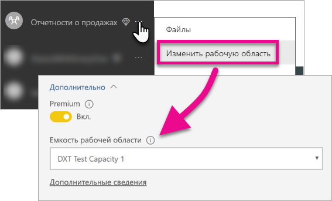

# Внедрение панелей мониторинга, отчетов и плиток Power BI

Узнайте, какие действия необходимо выполнить для внедрения содержимого Power BI в приложение.

Корпорация Майкрософт [объявила о выпуске Power BI Premium](https://powerbi.microsoft.com/blog/microsoft-accelerates-modern-bi-adoption-with-power-bi-premium/) — новой модели лицензирования на основе емкости, которая расширяет возможности получения доступа к содержимому, а также его совместного использования и распространения. Это предложение также обеспечивает дополнительные возможности масштабирования и повышает производительность службы Power BI. Кроме того, представлена служба Power BI Embedded, которая позволяет создавать емкость в Microsoft Azure. Служба Power BI Embedded ориентирована на приложение и клиентов. 

В этой статье рассматривается внедрение содержимого Power BI для организации и клиентов. Процедура в обоих случаях аналогична. Инструкции, которые относятся только к внедрению для клиентов, сопровождаются соответствующими указаниями.

Ниже приведены действия, которые позволяют реализовать эту возможность. Мы рассмотрим, что необходимо сделать, чтобы создать и использовать внедренное содержимое в приложение.

> [!NOTE]
> В интерфейсах API Power BI рабочие области приложения по-прежнему называются группами. Если упоминаются группы, это означает, что вы работаете с рабочими областями приложения.

## Шаг 1. Настройка среды разработки внедренной аналитики

Прежде чем начать внедрение панелей мониторинга и отчетов в приложение, необходимо убедиться, что ваша среда настроена для внедрения. В процессе настройки необходимо будет сделать следующее.

* [Убедитесь, что у вас есть клиент Azure Active Directory](embedding-content.md#azureadtenant)
* [Создание учетной записи Power BI](embedding-content.md#proaccount)
* [Регистрация приложения Azure Active Directory и назначение разрешений](embedding-content.md#appreg)

> [!NOTE]
> Наличие емкости Power BI не является обязательным условием для разработки приложения. Разработчикам приложения потребуется лицензия Power BI Pro.

### Клиент Azure Active Directory

Чтобы внедрить элементы из Power BI, потребуется клиент Azure Active Directory (Azure AD). У этого клиента должен быть по крайней мере один пользователь Power BI Pro. Также будет необходимо определить приложение Azure AD в данном клиенте. Можно использовать существующий клиент Azure AD или создать новый клиент специально для внедрения.

Необходимо определить, какие настройки клиента будут использоваться при внедрении для клиентов.

* Использовать существующий корпоративной клиент Power BI?
* Использовать отдельный клиент для приложения?
* Использовать отдельный клиент для каждого пользователя?

Если вы не хотите использовать существующий клиент, вы можете создать клиент для приложения или для каждого пользователя. См. дополнительные сведения о [создании клиента Azure Active Directory](create-an-azure-active-directory-tenant.md) и [получении клиента Azure Active Directory](https://docs.microsoft.com/azure/active-directory/develop/active-directory-howto-tenant).

### Создание учетной записи Power BI Pro

Для внедрения содержимого требуется только одна учетная запись Power BI Pro. Тем не менее можно использовать несколько различных пользователей с особым доступом к элементам. Давайте рассмотрим возможных пользователей в клиенте.

Ниже приведены учетные записи, которые должны существовать в клиенте и иметь лицензию Power BI Pro. Для работы с рабочими областями приложения в Power BI требуется лицензия Power BI Pro.

#### Администратор организации или клиента

Не советуем использовать для приложения учетную запись глобального администратора организации или клиента, если выполняется внедрение для клиентов. Так вы ограничите доступ для учетной записи приложения в клиенте. Рекомендуется, чтобы администратор управлял всеми рабочими областями приложений, созданными для внедрения.

#### Учетные записи аналитиков, создающих содержимое.

У вас может быть несколько пользователей, которые создают содержимое для Power BI. Вам потребуется учетная запись Power BI Pro для каждого аналитика, который создает и развертывает содержимое в Power BI.

#### *Главная* учетная запись приложения для внедрения для клиентов

При внедрении содержимого для клиентов ваше приложение будет использовать главную учетную запись. Такой сценарий обычно используется для приложений независимых поставщиков программного обеспечения. Это единственная учетная запись, необходимая в организации. Ее также можно использовать как учетную запись администратора и аналитика, но мы не советуем это делать. Учетные данные этой учетной записи хранятся в серверной части приложения. Эта учетная запись используется для получения токена аутентификации Azure AD, используемого в интерфейсах API Power BI, и создания токена внедрения для приложения, предназначенного для клиентов.

Главная учетная запись — это обычная учетная запись пользователя с лицензией Power BI Pro, которая используется с приложением. Это должна быть учетная запись администратора рабочей области, используемой для внедрения.

### Регистрация приложения и разрешения

Необходимо зарегистрировать приложение в Azure AD, чтобы осуществлять вызовы REST API. Дополнительные сведения см. в статье [Регистрация приложения Azure AD для внедрения содержимого Power BI](register-app.md).

### Создание рабочих областей приложений

Если вы внедряете панели мониторинга и отчеты для клиентов, эти компоненты должны быть размещены в рабочей области приложения. *Главная* учетная запись, которая упоминалась выше, должна быть учетной записью администратора рабочей области приложения.

[!INCLUDE [powerbi-service-create-app-workspace](../includes/powerbi-service-create-app-workspace.md)]

> [!NOTE]
> Пользователь без прав администратора может создать не более 250 рабочих областей приложения. Чтобы создать дополнительные рабочие области приложения, нужна учетная запись администратора клиента.
>

### Создание и передача отчетов

Вы можете создавать отчеты и наборы данных с помощью Power BI Desktop, а затем публиковать эти отчеты в рабочей области приложения. У пользователя, публикующего отчеты в рабочей области приложения, должна быть лицензия Power BI Pro.

## Шаг 2. Внедрение содержимого

В приложении потребуется пройти аутентификацию в Power BI. Если вы внедряете содержимое для клиентов, учетные данные *главной* учетной записи сохраняются в приложении. Дополнительные сведения см. в статье [Authenticate users and get an Azure AD access token for your Power BI app](get-azuread-access-token.md) (Проверка подлинности для пользователей и получение маркера доступа Azure AD для приложения Power BI).

После аутентификации используйте в приложении интерфейсы REST API Power BI и API JavaScript, чтобы внедрить панели мониторинга и отчеты в это приложение. 

Сведения о **внедрении для организации** см. в следующих руководствах:

* [Интеграция информационной панели в приложение](integrate-dashboard.md)
* [Интеграция плитки в приложение](integrate-tile.md)
* [Интеграция отчета в приложение](integrate-report.md)

При **внедрении для клиентов**, используемом, как правило, для независимых поставщиков программного обеспечения, см. следующие статьи:

* [Интеграция в приложение панели мониторинга, плитки или отчета](embed-sample-for-customers.md)

При внедрении содержимого для клиентов требуется токен внедрения. Чтобы узнать больше, ознакомьтесь с разделом [GenerateToken](https://msdn.microsoft.com/library/mt784614.aspx).

## Шаг 3. Перенос решения в рабочую среду

Для перемещения в рабочую среду требуется ряд дополнительных действий.

### Внедрение для организации

Если вы внедряете содержимое для организации, достаточно уведомить пользователей о том, как получить доступ к приложению. 

Пользователи бесплатной службы могут использовать содержимое, которое внедрено из рабочей области приложения (группы), если эта рабочая область поддерживается емкостью. Укажите пользователя бесплатной службы как участника рабочей области приложения (группы). Иначе вы получите сообщение об ошибке авторизации 401. В таблице ниже перечислены доступные номера SKU Power BI Premium в Office 365.

| Узел емкости | Общее число ядер *(серверная часть и интерфейс)* | Внутренние ядра | Интерфейсные ядра | Ограничения для подключений DirectQuery и активных подключений | Максимальное число страниц, отображаемых в часы максимальной нагрузки |
| --- | --- | --- | --- | --- | --- |
| EM3 |4 виртуальных ядра |2 ядра, 10 ГБ ОЗУ |2 ядра | |601–1200 |
| P1 |8 виртуальных ядер |4 ядра, 25 ГБ ОЗУ |4 ядра |30 в секунду |1201–2400 |
| P2 |16 виртуальных ядер |8 ядер, 50 ГБ ОЗУ |8 ядер |60 в секунду |2401–4800 |
| P3 |32 виртуальных ядра |16 ядер, 100 ГБ ОЗУ |16 ядер |120 в секунду |4801–9600 |

> [!NOTE]
> Чтобы приобрести Power BI Premium, необходимо быть глобальным администратором или администратором выставления счетов в своем клиенте. Сведения о том, как приобрести Power BI Premium, см. в разделе [Как купить Power BI Premium](../service-admin-premium-purchase.md).

### Внедрение для клиентов

Если вы внедряете содержимое для клиентов, выполните следующие действия.

* Если вы используете отдельный клиент для разработки, убедитесь, что рабочие области приложений, панели мониторинга и отчеты доступны в вашей рабочей среде. Убедитесь, что приложение создано в Azure AD для рабочего клиента и для этого приложения назначены соответствующие разрешения, как описано в шаге 1.
* Приобретите необходимый размер емкости. Ниже приведена таблица, с помощью которой можно определить, какой номер SKU емкости Power BI Embedded может потребоваться. Дополнительные сведения приведены в [техническом документе по планированию емкости для внедренной аналитики](https://aka.ms/pbiewhitepaper). Когда вы будете готовы к покупке, перейдите на [портал Microsoft Azure](https://portal.azure.com). Дополнительные сведения о создании емкости Power BI Embedded см. в статье [Create Power BI Embedded capacity in the Azure portal](https://docs.microsoft.com/azure/power-bi-embedded/create-capacity) (Создание емкости Power BI Embedded на портале Azure).

> [!IMPORTANT]
> Так как токены внедрения предназначены только для тестирования при разработке, количество таких токенов, создаваемых основной учетной записью Power BI, ограничено. Для сценариев внедрения в рабочей среде [необходимо приобрести емкость](https://docs.microsoft.com/power-bi/developer/embedded-faq#technical). В этом случае количество создаваемых токенов внедрения не ограничено. Выберите [Получить доступные функции](https://msdn.microsoft.com/en-us/library/mt846473.aspx), чтобы проверить использованное число свободных токенов внедрения.

| Узел емкости | Общее число ядер *(серверная часть и интерфейс)* | Внутренние ядра | Интерфейсные ядра | Ограничения для подключений DirectQuery и активных подключений | Максимальное число страниц, отображаемых в часы максимальной нагрузки |
| --- | --- | --- | --- | --- | --- |
| A1 |1 виртуальное ядро |0,5 ядра, 3 ГБ ОЗУ |0,5 ядра | 5 в секунду |1–300 |
| A2 |2 виртуальных ядра |1 ядро, 5 ГБ ОЗУ |1 ядро | 10 в секунду |301–600 |
| A3 |4 виртуальных ядра |2 ядра, 10 ГБ ОЗУ |2 ядра | 15 в секунду |601–1200 |
| A4 |8 виртуальных ядер |4 ядра, 25 ГБ ОЗУ |4 ядра |30 в секунду |1201–2400 |
| A5 |16 виртуальных ядер |8 ядер, 50 ГБ ОЗУ |8 ядер |60 в секунду |2401–4800 |
| A6 |32 виртуальных ядра |16 ядер, 100 ГБ ОЗУ |16 ядер |120 в секунду |4801–9600 |

* Измените рабочую область приложения и назначьте для нее емкость в диалоговом окне "Дополнительно".

    

* Разверните обновленное приложение в рабочей среде и приступите к внедрению панелей мониторинга и отчетов Power BI.

## Параметры администрирования

Глобальные администраторы или администраторы служб Power BI могут включать и отключать возможность использования REST API для клиента. Администраторы Power BI могут задать этот параметр для всей организации или отдельных групп безопасности. По умолчанию установлено состояние "Включено для всей организации". Параметр задается на [портале администрирования Power BI](../service-admin-portal.md).

## Дальнейшие действия

[Внедрение в Power BI](embedding.md)  
[Как перенести содержимое коллекции рабочих областей Power BI Embedded в Power BI](migrate-from-powerbi-embedded.md)  
[Что такое Power BI Premium?](../service-premium.md)  
[Как купить Power BI Premium](../service-admin-premium-purchase.md)  
[Репозиторий Git JavaScript API](https://github.com/Microsoft/PowerBI-JavaScript)  
[Репозиторий Git Power BI C#](https://github.com/Microsoft/PowerBI-CSharp)  
[Пример внедрения JavaScript](https://microsoft.github.io/PowerBI-JavaScript/demo/)  
[Технический документ по планированию емкости для внедренной аналитики](https://aka.ms/pbiewhitepaper)  
[Техническая документация по Power BI Premium](https://aka.ms/pbipremiumwhitepaper)  

Появились дополнительные вопросы? [Попробуйте задать вопрос в сообществе Power BI.](http://community.powerbi.com/)

