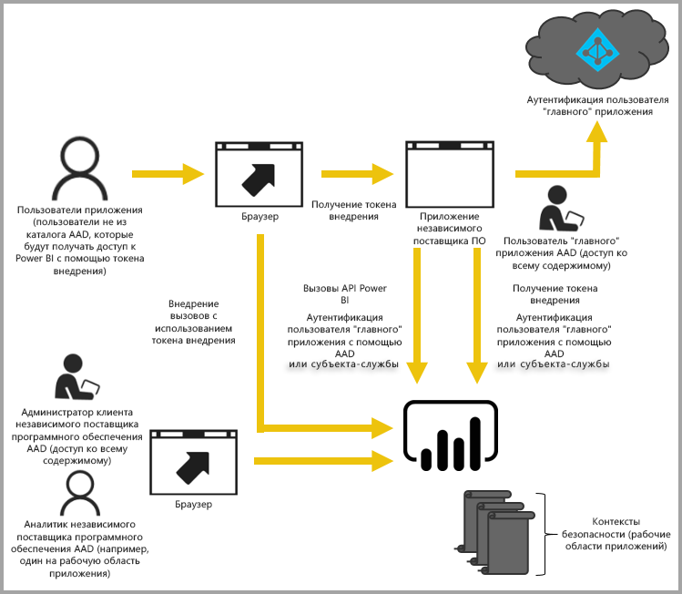

# Внедрение в Power BI
Возможности службы Power BI (SaaS) и Power BI Embedded в Azure (PaaS) предоставляют единый API для внедрения информационных панелей и отчетов. Это означает, что у вас есть одинаковый набор возможностей и доступ к последним функциям Power BI, например панелям мониторинга, шлюзам и рабочим областям приложений, которые можно использовать при внедрении содержимого.

Воспользуйтесь [средством подключения для внедрения](https://aka.ms/embedsetup), чтобы быстро скачать образец приложения и приступить к работе.

Выберите подходящее решение:

* [Внедрение для организации](embedding.md#embedding-for-your-organization) позволяет расширить возможности службы Power BI. Запустите решение [Внедрение для организации](https://aka.ms/embedsetup/UserOwnsData).
* [Внедрение для клиентов](embedding.md#embedding-for-your-customers) позволяет внедрять панели мониторинга и отчеты для пользователей, у которых нет учетной записи Power BI. Запустите решение [Внедрение для клиентов](https://aka.ms/embedsetup/AppOwnsData).

## Использование API-интерфейсов
Существуют два основных сценария внедрения содержимого Power BI.  Внедрение для пользователей в организации (у которых есть лицензия Power BI) и внедрение для пользователей и клиентов, которым не требуются лицензии Power BI. REST API Power BI поддерживает оба сценария.

Для пользователей и клиентов, у которых нет лицензий Power BI, вы можете внедрить панели мониторинга и отчеты в настраиваемое приложение, используя один API для обслуживания организации и клиентов. Клиенты будут видеть данные, которыми управляет приложение. Кроме того, пользователям Power BI в организации будут предоставляться дополнительные возможности для просмотра *своих данных* прямо в Power BI или в контексте внедренного приложения. При внедрении содержимого вы можете воспользоваться всеми преимуществами JavaScript и REST API.

Пример того, как работает внедрение, см. в [примере внедрения JavaScript](https://microsoft.github.io/PowerBI-JavaScript/demo/).

## Внедрение для организации
**Внедрение для организации** позволяет расширить возможности службы Power BI. Чтобы пользователи вашего приложения могли просмотреть свое содержимое, им нужно войти в службу Power BI. Когда сотрудник организации войдет в приложение, он получит доступ только к своим панелям мониторинга и отчетам или предоставленным ему в службе Power BI.

*Примеры внедрения для организации включают интеграцию внутреннего веб-приложения, веб-части SharePoint Online и [Microsoft Teams (у вас должны быть права администратора)](https://powerbi.microsoft.com/en-us/blog/power-bi-teams-up-with-microsoft-teams/).*

Сведения о внедрении для организации см. в следующих статьях:

* [Интеграция отчета в приложение](embed-sample-for-your-organization.md)

При внедрении для пользователей Power BI возможности самообслуживания, например редактирование, сохранение и т. д., доступны посредством [API JavaScript](https://github.com/Microsoft/PowerBI-JavaScript).

Вы можете воспользоваться [средством подготовки к внедрению в организации](https://aka.ms/embedsetup/UserOwnsData), чтобы быстро приступить к работе и скачать образец приложения, с помощью которого можно интегрировать отчет в организации.

## Внедрение для клиентов

**Внедрение для клиентов** позволяет внедрять панели мониторинга и отчеты для пользователей, у которых нет учетной записи Power BI. Вашим клиентам ничего не нужно знать о Power BI. Чтобы создать внедренное приложение, требуется хотя бы одна учетная запись Power BI Pro. Эта учетная запись используется как главная для вашего приложения. Ее можно назвать учетной записью прокси-сервера. Учетная запись Power BI Pro также позволяет создавать токены внедрения, которые обеспечивают доступ к панелям мониторинга и отчетам в службе Power BI, принадлежащих вашему приложению и управляемых им.

[Power BI Embedded](azure-pbie-what-is-power-bi-embedded.md) предлагает разработчикам и независимым поставщикам программного обеспечения функции внедрения, позволяющие быстро добавлять великолепные визуальные элементы, отчеты и панели мониторинга в создаваемые для клиентов приложения, используя основанную на емкости модель с почасовой оплатой.

Power BI Embedded дает независимым поставщикам программного обеспечения, разработчикам и клиентам ряд выгодных преимуществ. Например, независимые поставщики программного обеспечения могут начать бесплатно создавать визуальные элементы в Power BI Desktop. Это позволит ускорить вывод продуктов на рынок, минимизировав затраты на разработку элементов аналитики, и выделиться среди конкурентов благодаря разнообразным представлениям данных. Кроме того, встроенная аналитика позволяет поставщикам взимать плату за особые возможности, реализуемые с ее помощью.

Разработчики смогут сосредоточиться на создании основных компетенций приложения и не тратить время на разработку аналитики и визуальных элементов. API-интерфейсы и пакеты SDK, снабженные полной документацией, помогут быстро создать нужные отчеты и панели мониторинга и легко внедрить их, куда необходимо, выполнив все требования клиентов. Наконец, включив в приложения удобный анализ данных, независимые поставщики программного обеспечения позволят клиентам быстро и уверенно принимать решения на основе данных в контексте, доступных с любого устройства.

> [!IMPORTANT]
> Процесс внедрения зависит от службы Power BI, а ваши клиенты — нет. Чтобы просмотреть содержимое приложения, пользователям не нужно регистрироваться в службе Power BI.

Когда все будет готово к переносу в рабочую среду, рабочую область приложения нужно будет назначить выделенной емкости. Power BI Embedded в Microsoft Azure предоставляет выделенную емкость для использования с приложениями.

Дополнительные сведения о внедрении см. в статье [Как внедрять панели мониторинга, отчеты и плитки Power BI](embed-sample-for-customers.md).

Вы можете воспользоваться [средством подготовки к внедрению](https://aka.ms/embedsetup/AppOwnsData), чтобы быстро приступить к работе и скачать образец приложения, с помощью которого можно интегрировать отчет в приложение.

Если вы используете службу коллекций рабочих областей Power BI в Azure, сведения о переносе содержимого см. в статье [Как перенести содержимое коллекции рабочих областей Power BI Embedded в Power BI](migrate-from-powerbi-embedded.md).

## Дальнейшие действия
Теперь можно попробовать внедрить содержимое Power BI в приложение, или же внедрить его для клиентов.

> [!div class="nextstepaction"]
> [Что такое Power BI Embedded?](azure-pbie-what-is-power-bi-embedded.md)

> [!div class="nextstepaction"]
> [Внедрение для организации](embed-sample-for-your-organization.md)

> [!div class="nextstepaction"]
>[Внедрение для клиентов](embed-sample-for-customers.md)

Появились дополнительные вопросы? [Попробуйте задать вопрос в сообществе Power BI.](http://community.powerbi.com/)