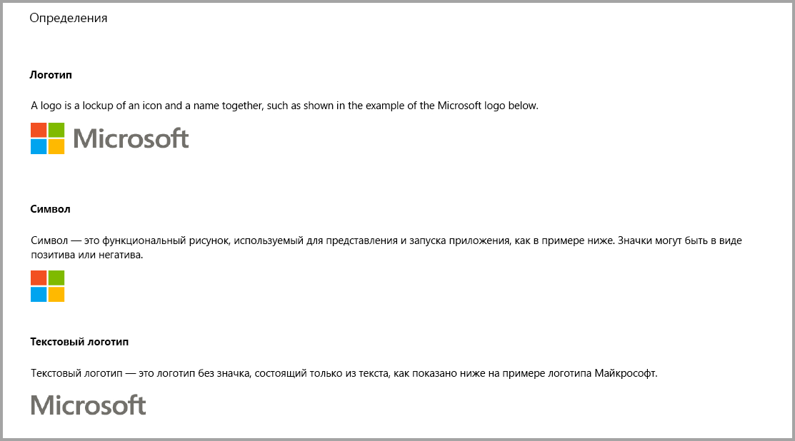
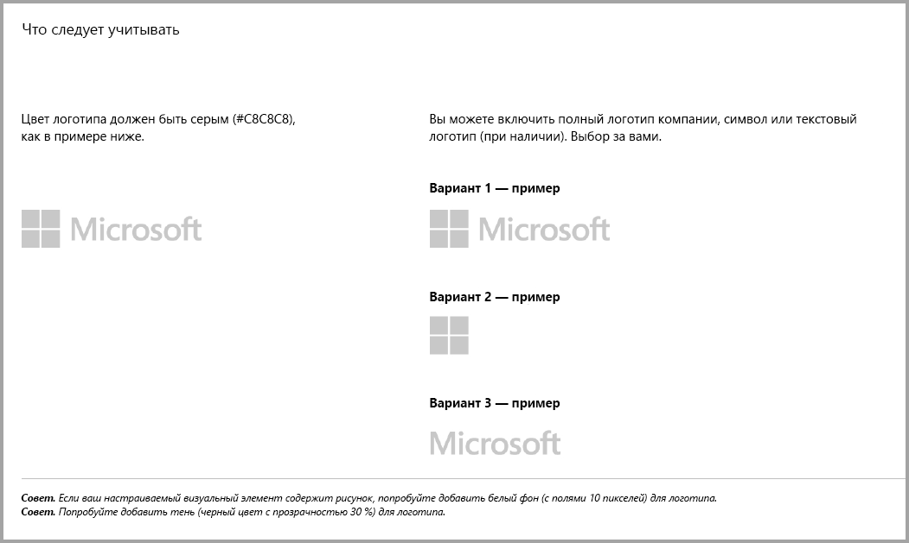
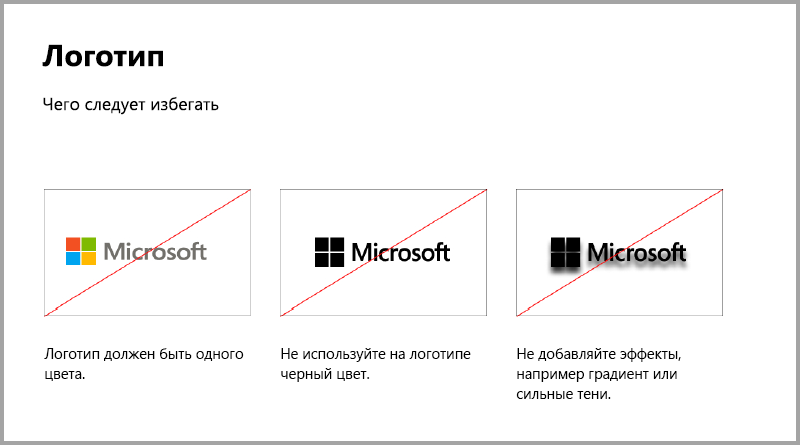
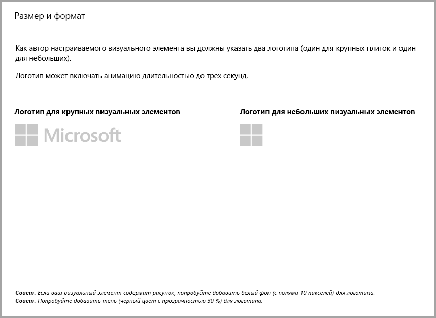
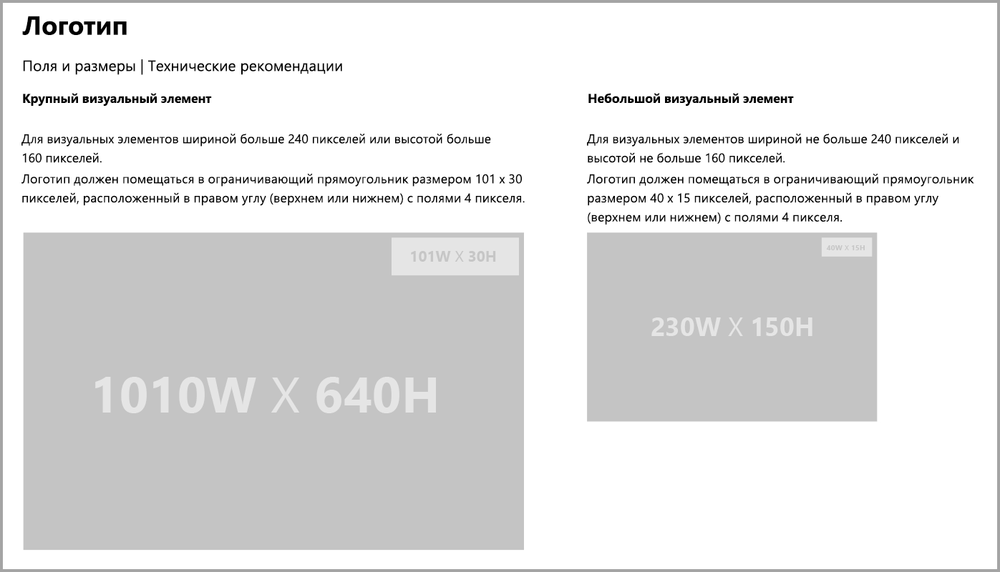
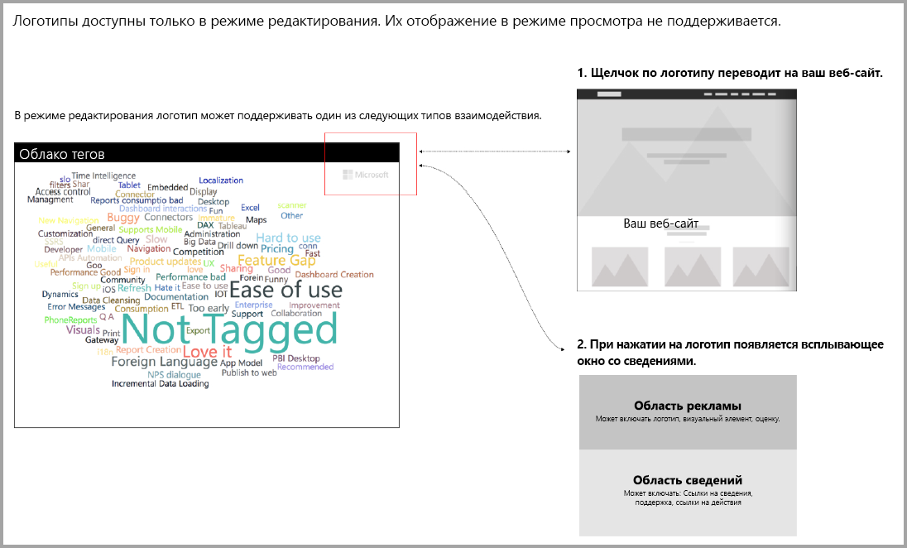

# Рекомендации по визуальным элементам Power BI
Прежде чем [опубликовать](https://docs.microsoft.com/power-bi/developer/office-store) визуальный элемент в AppSource, чтобы его могли найти и использовать другие люди, убедитесь, что соблюдены рекомендации по обеспечению интерфейса для эффективной работы пользователей. 

## Контекстное меню
Контекстное меню отображается по нажатию правой кнопки мыши, когда пользователь наводит указатель мыши на визуальный элемент.
Все визуальные элементы Power BI должны использовать контекстное меню для обеспечения единого интерфейса. Обратитесь к [этой статье](https://github.com/Microsoft/PowerBI-visuals/blob/gh-pages/tutorials/building-bar-chart/adding-context-menu-to-the-bar.md), чтобы узнать, как добавить контекстное меню.

## Рекомендации по логотипам
> [!NOTE]
> В этой статье термин "логотип" — это коммерческое обозначение компании, как описано на снимке экрана ниже. 

В этом разделе показано, как добавить логотип в визуальные элементы Power BI. Логотипы не являются обязательными. В случае добавления они должны соответствовать этим рекомендациям. 

> [!IMPORTANT]
> Логотипы доступны *только в режиме редактирования*. Их *невозможно* отобразить в режиме просмотра.

Если присутствуют информационные значки, их цвет, размер и расположение должны гармонировать с логотипом.

## Рекомендации по визуальным элементам Power BI с дополнительными покупками

До недавнего времени магазин AppSource принимал только бесплатные визуальные элементы Power BI. Эта политика была изменена (в декабре 2018 г.), чтобы вы также могли отправить в AppSource визуальные элементы с тегом "Может потребоваться дополнительная покупка". 

Визуальные элементы с тегом "Может потребоваться дополнительная покупка" аналогичны надстройкам "покупки из приложений" (IAP) в Магазине Office. Разработчики могут отправлять эти визуальные элементы для сертификации после утверждения группой AppSource. Кроме того, необходимо убедиться, что они соответствуют требованиям сертификации. Дополнительные сведения см. в статье о [сертификации визуальных элементов Power BI](../power-bi-custom-visuals-certified.md).

> [!NOTE]
> Для сертификации визуального элемента он не должен обращаться к внешним службам и ресурсам.

>[!IMPORTANT]  
> Если вы изменяете свой визуальный элемент с бесплатного на версию с тегом "Может потребоваться дополнительная покупка", пользователи должны получить тот же уровень бесплатных функциональных возможностей, что и до изменения. В дополнение к старым бесплатным функциям можно при необходимости добавить расширенные платные функции. Рекомендуем публиковать визуальные элементы IAP с расширенными функциями как новые визуальные элементы, а не обновлять существующие бесплатные элементы.

## Как изменился процесс отправки?

Разработчики отправляют визуальные элементы IAP в AppSource через панель мониторинга продавца (так же как и для бесплатных визуальных элементов). Чтобы указать, что отправляемый визуальный элемент включает функции IAP, разработчик должен добавить в заметки панели мониторинга продавца фразу "Визуальный элемент с покупкой из приложения". Кроме того, разработчик должен предоставить лицензионный ключ или токен, чтобы команда проверки могла проверить функции IAP. Когда визуальный элемент будет проверен и утвержден AppSource, в списке визуальных элементов IAP в разделе вариантов цен будет указано "Может потребоваться дополнительная покупка".

## Что такое визуальный элемент Power BI с функциями IAP?

Визуальный элемент IAP — это *бесплатный* визуальный элемент с *бесплатными функциями*. Он также включает дополнительные расширенные функции, для работы с которыми может потребоваться дополнительная плата. В описании визуального элемента разработчики обязаны уведомить пользователей о функциях, для работы с которыми требуются дополнительные покупки. Сейчас корпорация Майкрософт не предоставляет собственные API-интерфейсы для поддержки покупки приложений и надстроек.

Для таких покупок разработчики могут использовать любые сторонние платежные системы. Дополнительные сведения см. в статье о [политике магазина](https://docs.microsoft.com/office/dev/store/validation-policies#2-apps-or-add-ins-can-display-certain-ads).

> [!NOTE]
> Для бесплатных функций или визуальных элементов не поддерживаются водяные знаки. Водяные знаки можно использовать только для платных функций, используемых без действительной лицензии. Мы рекомендуем отобразить всплывающее окно со всеми сведениями о лицензии, если дополнительные платные функции используются без действительной лицензии.  

## Советы и рекомендации

### Целевая страница визуального элемента

Используйте целевую страницу, чтобы рассказать пользователям о том, как они могут использовать визуальный элемент и где можно приобрести лицензию. Не включайте видео, которые запускаются автоматически. Добавляйте только те материалы, которые повышают удобство работы пользователя, например информацию или ссылки на сведения о покупке лицензии и использовании возможностей IAP.

### Лицензионный ключ и токен

Для удобства пользователей добавьте поля для лицензионного ключа или токена в верхней части области форматирования.

## ВОПРОСЫ И ОТВЕТЫ

Дополнительные сведения о визуальных элементах см. в разделе [Визуальные элементы с дополнительными покупками](https://docs.microsoft.com/power-bi/power-bi-custom-visuals-faq#visuals-with-additional-purchases).

## Дальнейшие действия

Узнайте, как опубликовать настраиваемые визуальные элементы в [AppSource](office-store.md), чтобы они стали доступными для других пользователей.
