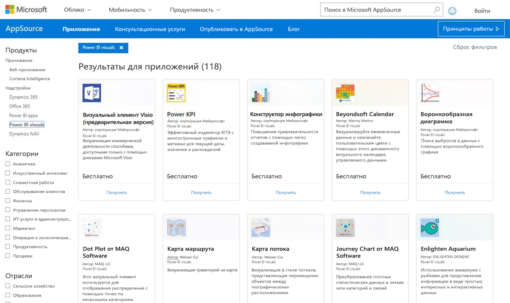

# Публикация визуализаций Power BI в Центре партнеров

Создав пользовательский визуальный элемент Power BI, вы, возможно, захотите опубликовать его в AppSource, чтобы он стал доступным для других. См. сведения о [создании визуализаций Power BI](visuals/custom-visual-develop-tutorial.md).

## Что такое AppSource?

[AppSource](https://appsource.microsoft.com/marketplace/apps?product=power-bi-visuals) — это место, где можно найти приложения SaaS, а также надстройки для продуктов и служб Майкрософт.

## Подготовка к отправке визуализации Power BI

Перед отправкой визуализации Power BI в AppSource, обязательно прочитайте рекомендации по работе с [визуализациями Power BI](guidelines-powerbi-visuals.md) и [протестируйте свой пользовательский визуальный элемент](https://github.com/Microsoft/PowerBI-visuals/blob/master/Tutorial/SubmissionTesting.md).

Когда все будет готово к отправке, проверьте, соответствует ли визуализация Power BI всем указанным ниже требованиям.

| Элемент | Требуется | Описание |
| --- | --- | --- |
| Пакет PBIVIZ |Да |Упакуйте визуализацию Power BI в пакет PBIVIZ, содержащий все необходимые метаданные. Имя визуализации Отображаемое имя GUID Версия Описание Имя и электронная почта автора |
| Пример отчета в файле PBIX |Да |Демонстрация своей визуализации пользователям предполагает предоставление определенной информации о ней. Акцентируйте внимание на полезных возможностях, приведите примеры использования и расскажите о возможностях форматирования. Кроме того, в конце можно добавить страницу с *подсказками*, которая будет содержать некоторые советы и описание действий, которых следует избегать. Пример PBIX-файла отчета должен работать автономно, без внешних подключений. |
| Значок |Да |Добавьте логотип пользовательской визуализации. Он будет отображаться в онлайн-магазине. Допустимые форматы: PNG, JPG, JPEG или GIF. Изображение должно быть размером строго 300 × 300 пикселей (ширина × высота). **Важно!** Перед отправкой значка внимательно прочитайте руководство [Создание эффективных изображений для магазина AppSource](https://docs.microsoft.com/office/dev/store/craft-effective-appsource-store-images). |
| Снимки экрана |Да |Предоставьте хотя бы один снимок экрана. Допустимые форматы: PNG, JPG, JPEG или GIF. Размер изображения должен составлять строго 1366 × 768 пикселей (ширина × высота). Размер файла не должен превышать 1024 КБ. Для большей эффективности добавьте текстовые выноски, в которых будут описаны преимущества основных функций, показанных на каждом снимке экрана. |
| Ссылка на страницу поддержки |Да |Укажите URL-адрес службы поддержки для клиентов. Эта ссылка указывается как часть спецификации Панели мониторинга продаж и отображается для пользователей, когда они получают доступ к списку визуализации в AppSource. URL-адрес должен начинаться с https:// или http://. |
| ссылку на заявление о конфиденциальности; |Да |Предоставьте ссылку на политику конфиденциальности визуализации. Эта ссылка указывается как часть спецификации Панели мониторинга продаж и отображается для пользователей, когда они получают доступ к списку визуализации в AppSource. Ссылка должна начинаться с https:// или http://. |
| Лицензионное соглашение |Да |Для визуального элемента Power BI необходимо предоставить файл лицензионного соглашения. |
| ссылку на видео; |Нет |Чтобы сделать описание пользовательского визуального элемента более содержательным, укажите ссылку на видео. URL-адрес должен начинаться с https:// или http://. |
| Репозиторий GitHub |Нет |Предоставьте общедоступную ссылку на репозиторий [GitHub](https://www.github.com), где хранится исходный код визуализации Power BI и примеры данных. Так другие разработчики смогут отправлять вам отзывы и предложения по улучшению кода. |

## Получение XML-файла пакета приложения

Чтобы отправить визуализацию Power BI, вам потребуется XML-файл пакета приложения от команды Power BI. Чтобы получить XML-файл пакета приложения, отправьте сообщение электронной почты команде по вопросам отправки визуализаций Power BI ([pbivizsubmit@microsoft.com](mailto:pbivizsubmit@microsoft.com)).

Прежде чем вы создадите пакет **PBIVIZ**, необходимо заполнить следующие поля в файле **pbiviz.json**:
* description;
* supportUrl;
* автор
* name
* электронная почта

Вложите в сообщение **PBIVIZ-файл** и **пример отчета в формате PBIX**. В ответ команда Power BI предоставит вам инструкции и XML-файл с пакетом приложения. Этот XML-файл требуется для отправки визуального элемента через Центр разработчика Office.

> [!NOTE]
> После того как визуальный элемент пройдет процедуру утверждения в магазине, все его последующие обновления будут появляться в рабочей среде через две недели. Это сделано для того, чтобы повысить качество распространяемых материалов и проверить их на совместимость с существующими отчетами.

## Отправка в AppSource

Чтобы отправить визуализацию Power BI в AppSource, необходимо получить пакет приложения от команды Power BI, а затем отправить его в Центр партнеров. 

### Получение пакета приложения

Прежде чем отправить визуализацию в AppSource, файлы **PBIVIZ** и **PBIX** необходимо отправить по электронной почте команде Power BI. Таким образом, команда Power BI передаст эти файлы на общедоступный сервер общих ресурсов. Другого способа передать эти файлы в магазин нет. 

Команда Power BI должна проверять эти файлы при каждой отправке новой, обновлении существующей и исправлении отклоненной визуализации Power BI.

### Отправка в Центр партнеров

Чтобы отправить визуализацию Power BI в Центр партнеров, требуется регистрация. Если вы еще не зарегистрировались, [откройте учетную запись разработчика в Центре партнеров](https://docs.microsoft.com/office/dev/store/open-a-developer-account).

Чтобы отправить визуализацию Power BI в Центр партнеров, сделайте следующее. Дополнительные сведения о процессе отправки см. в статье [Отправка решений Office в AppSource через Центр партнеров](https://docs.microsoft.com/office/dev/store/use-partner-center-to-submit-to-appsource).

>[!NOTE]
> Если в ходе отправки визуализации Power BI в AppSource вам потребуется [Панель мониторинга продаж](https://docs.microsoft.com/office/dev/store/use-the-seller-dashboard-to-submit-to-the-office-store) (старое средство управления), ознакомьтесь с этими [инструкциями](seller-dashboard.md).

1. Войдите в **Центр партнеров**.

2. На панели слева выберите **Магазин Office**.

3. Щелкните **Обзор**.

4. Выберите **Создать** и в раскрывающемся меню щелкните **Визуализация Power BI**.

    

5. В окне **Создание визуализации Power BI** введите имя визуализации Power BI и щелкните **Создать**.

6. Выберите **Пакеты** и отправьте XML-файл пакета приложения для визуализации Power BI.

7. Выберите **Свойства** и укажите необходимые сведения.

8. Если для продукта требуется дополнительная покупка, выберите **Настройка продукта** и установите флажок **Покупка связанной службы**.

9. (Необязательно.) Если вы хотите [сертифицировать](power-bi-custom-visuals-certified.md) свою визуализацию, щелкните **Настройка продукта** и установите флажок **Сертификация Power BI**.
    >[!TIP]
    >Процесс сертификации визуализации Power BI может занять некоторое время. Если вы создаете новую визуализацию Power BI, мы рекомендуем опубликовать ее в Центре партнеров, прежде чем подавать заявку на сертификацию Power BI. Так публикация визуализации не будет отложена.

10. Выберите **Настройка продукта** и щелкните **Проверить и опубликовать**.

## Отслеживание состояния отправки и использования

Просмотрите [политики проверки](https://dev.office.com/officestore/docs/validation-policies#13-power-bi-custom-visuals).

После отправки состояние отправленного приложения можно будет просматривать на [панели мониторинга приложения](https://sellerdashboard.microsoft.com/Application/Summary/).

## Сертификация визуального элемента

Созданную визуализацию при необходимости можно [сертифицировать](../developer/power-bi-custom-visuals-certified.md).

## Дальнейшие действия

[Разработка пользовательского визуального элемента Power BI](visuals/custom-visual-develop-tutorial.md)  
[Визуализации в Power BI](../visuals/power-bi-report-visualizations.md)  
[Пользовательские визуализации в Power BI](../developer/power-bi-custom-visuals.md)  
[Сертификация визуализации Power BI](../developer/power-bi-custom-visuals-certified.md)

Появились дополнительные вопросы? [Попробуйте задать вопрос в сообществе Power BI.](https://community.powerbi.com/)
