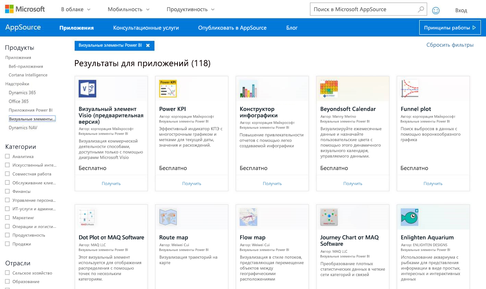
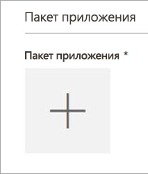
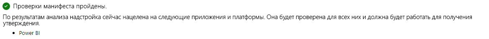
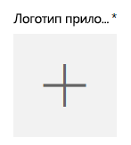
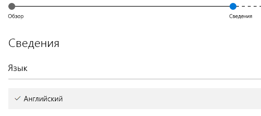

# Публикация настраиваемых визуальных элементов в AppSource
Узнайте, как опубликовать настраиваемые визуальные элементы в AppSource, чтобы они стали доступными для других пользователей. Office

Создав настраиваемый визуальный элемент, опубликуйте его в AppSource, чтобы он стал доступным для других пользователей. Перед публикацией необходимо выполнить некоторые подготовительные действия. Дополнительные сведения о том, как создать пользовательские визуализации, см. в статье [Создание пользовательского визуального элемента с помощью средств разработчика](../service-custom-visuals-getting-started-with-developer-tools.md).

Что такое AppSource? Это место, где можно найти приложения SaaS, надстройки для продуктов и служб Майкрософт. [AppSource](https://appsource.microsoft.com/marketplace/apps?product=power-bi-visuals) позволяет миллионам пользователей Office 365, Azure, Dynamics 365, Cortana Intelligence и других продуктов находить решения, с помощью которых можно выполнять работу более эффективно, продуманно и презентабельно.

## Подготовка к отправке пользовательской визуализации
Написав код, протестировав и упаковав пользовательскую визуализацию в файл PBIVIZ, вам необходимо подготовить к отправке следующие элементы:

| Элемент | Требуется | Описание |
| --- | --- | --- |
| Пакет PBIVIZ со всеми необходимыми метаданными |Да |Имя визуализации Отображаемое имя GUID Версия Описание Имя и электронная почта автора |
| Пример отчета в файле PBIX |Да |Чтобы правильно продемонстрировать свою визуализацию, помогите пользователям ознакомиться с ней. Акцентируйте внимание на полезных для пользователей возможностях, приведите примеры использования, расскажите и возможностях форматирования и т. д. Кроме того, в конце можно добавить страницу с *подсказками*: некоторые советы и приемы, чего следует избегать и пр. Пример файла отчета PBIX должен работать автономно, без внешнего подключения. |
| Значок |Да |Добавьте логотип пользовательской визуализации. Он будет отображаться в онлайн-магазине. Допустимые форматы: PNG, JPG, JPEG или GIF. Изображение должно быть ровно 300 пикселей в ширину и 300 пикселей в высоту. **Важно!** Перед отправкой значка ознакомьтесь с этим [кратким руководством](https://docs.microsoft.com/en-us/office/dev/store/craft-effective-appsource-store-images). |
| Снимки экрана |Да |Необходимо предоставить хотя бы один снимок экрана. Допустимые форматы: PNG, JPG, JPEG или GIF. Изображение должно быть ровно 1366 пикселей в ширину и 768 пикселей в высоту. Размер файла не должен превышать 1024 КБ. *Для большей эффективности добавьте текстовые выноски, в которых сформулируйте преимущества основных функций, показанных на каждом снимке экрана.* |
| Ссылка на страницу поддержки |Да |Укажите URL-адрес страницы, на которой пользователи визуализации смогут получить поддержку. URL-адрес должен начинаться с https:// или http://. |
| Ссылка на заявление о конфиденциальности |Да |Укажите ссылку на заявление о конфиденциальности для пользователей визуализации. Ссылка должна начинаться с https:// или http://. |
| Лицензионное соглашение |Да |Необходимо отправить файл лицензионного соглашения. Можно использовать собственное лицензионное соглашение или стандартное лицензионное соглашение для пользовательских визуализаций Power BI в Магазине Office. Чтобы использовать стандартное лицензионное соглашение, в диалоговом окне отправки файла лицензионного соглашения на панели мониторинга продавца вставьте следующий URL-адрес: [https://visuals.azureedge.net/app-store/Power BI - Default Custom Visual EULA.pdf](https://visuals.azureedge.net/app-store/Power BI - Default Custom Visual EULA.pdf). |
| ссылку на видео; |Нет |Чтобы повысить интерес пользователей к визуализации, рекомендуем указать ссылку на видео о вашем продукте. URL-адрес должен начинаться с https:// или http://. |
| Репозиторий GitHub |Нет |Рекомендуем указать действительную общедоступную ссылку на репозиторий [GitHub](https://www.github.com), где хранится исходный код вашей визуализации и пример данных. Это позволит другим разработчикам отправлять вам отзывы и предложения по улучшению кода. |

## Отправка в Power BI
В первую очередь вам нужно связаться по электронной почте с командой Power BI, которая занимается приемом пользовательских визуализаций. Заявку можно отправить по адресу [pbivizsubmit@microsoft.com](mailto:pbivizsubmit@microsoft.com).

> [!IMPORTANT]
> Необходимо заполнить следующие поля в файле pbiviz.json: description, supportUrl, author, name и email, прежде чем вы создадите пакет .pbiviz.
> 

Вложите в сообщение PBIVIZ-файл и образец отчета в формате PBIX. В ответ команда Power BI предоставит вам инструкции и XML-файл с пакетом приложения. Этот XML-файл требуется для отправки визуального элемента через Центр разработчика Office.

> [!NOTE]
> После того как визуальный элемент пройдет процедуру утверждения в магазине, все его последующие обновления будут появляться в рабочей среде через две недели. Это сделано для того, чтобы повысить качество распространяемых материалов и проверить их на совместимость с существующими отчетами.
> 
> 

## Отправка в AppSource
Получив XML-файл с пакетом приложения от команды Power BI, перейдите в [центр для разработчиков](https://sellerdashboard.microsoft.com/Application/Summary), чтобы отправить визуальный элемент в AppSource.

> [!NOTE]
> Для входа в [Центр разработчика Office](https://dev.office.com/) требуется действительная учетная запись разработчика Office. Учетная запись разработчика Office должна быть учетной записью Майкрософт (Live ID, например, hotmail.com или outlook.com).
> 
> [!IMPORTANT]
> Прежде чем отправить визуальный элемент в AppSource, файлы PBIVIZ и PBIX необходимо отправить по электронной почте команде Power BI. Таким образом, команда Power BI передаст эти файлы на общедоступный сервер общих ресурсов. Другого способа передать эти файлы в магазин нет. Эти файлы нужно отправлять команде каждый раз, когда вы публикуете новый визуальный элемент, а также обновляете существующий или исправляете отклоненный визуальный элемент.
> 
> 

### Процесс отправки визуализации
Чтобы отправить визуализацию, выполните приведенные ниже действия.

1. Выберите **Добавить новое приложение**.
   
    
2. Последовательно щелкните **Настраиваемый визуальный элемент Power BI** и **Далее**.
3. Под надписью **Пакет приложения** щелкните **+** и в диалоговом окне открытия файла выберите XML-файл с пакетом приложения, полученный от команды Power BI.
   
    
4. Должно появиться подтверждение, что вы используете правильный пакет приложения Power BI.
   
    
5. Укажите необходимую информацию в разделе **Общие сведения**.
   
   * *Submission title* (Название отправки). Имя, которое будет использоваться в центре разработчика.
   * *Версия*. Номер версии автоматически подставляется из файла с пакетом приложения.
   * *Дата выпуска (UTC)*. Выберите дату добавления приложения в магазин. Если указать дату в будущем, приложение будет недоступно в магазине до наступления указанной даты.
   * *Категория*. В качестве первой категории автоматически будет указано "Визуализация данных и бизнес-аналитика". Так обозначаются все пользовательские визуализации Power BI. Чтобы пользователи могли быстрее находить вашу визуализацию, можно указать две дополнительные категории.
   * *Примечания по тестированию (необязательно)*. Поле, в котором можно указать специальные инструкции для тест-инженеров Майкрософт.
   * *Мое приложение вызывает, поддерживает, содержит или использует криптографию или шифрование*. Не устанавливайте этот флажок.
   * *Включить эту надстройку в каталог надстроек Office для iPad*. Не устанавливайте этот флажок.
6. Под надписью **Логотип приложения** нажмите кнопку **+**, чтобы отправить логотип вашей визуализации. В диалоговом окне открытия файла выберите файл значка. Файл должен быть в формате PNG, JPG, JPEG или GIF. Изображение должно быть ровно 300 пикселей в ширину и 300 пикселей в высоту, а размер файла не должен превышать 512 КБ.
   
    
7. Укажите необходимую информацию в разделе **Документы по поддержке**:
   
   * ссылку на справочные материалы;
   * ссылку на заявление о конфиденциальности;
   * ссылку на видео;
   * лицензионное соглашение:
     
       Необходимо отправить файл лицензионного соглашения. Можно использовать собственное лицензионное соглашение или стандартное лицензионное соглашение для пользовательских визуализаций Power BI в Магазине Office. Чтобы использовать стандартное лицензионное соглашение, в диалоговом окне отправки файла лицензионного соглашения на панели мониторинга продавца вставьте следующий URL-адрес: [https://visuals.azureedge.net/app-store/Power BI - Default Custom Visual EULA.pdf](https://visuals.azureedge.net/app-store/Power BI - Default Custom Visual EULA.pdf).
8. Нажмите кнопку **Далее**, чтобы перейти на страницу **Сведения**.
9. Щелкните **Язык** и выберите в списке нужный язык.
   
    
10. Заполните поля в разделе "Описание".
    
    * *Имя приложения (для этого языка)*. Введите название приложения, которое должно отображаться в онлайн-магазине.
    * *Краткое описание*. Введите краткое описание своего приложения (до 100 символов), которое должно отображаться в онлайн-магазине. Это описание будет отображаться на страницах верхнего уровня вместе с логотипом. Можно использовать описание из пакета PBIVIZ.
    * *Подробное описание*. Укажите более подробное описание приложения, которое пользователи будут видеть на странице сведений о приложении. Если вы хотите, чтобы сообщество улучшило ваш визуальный элемент, сделав его код открытым, оставьте здесь ссылку на общедоступный репозиторий, например GitHub.
11. Отправьте хотя бы один снимок экрана. Допустимые форматы: PNG, JPG, JPEG или GIF. Изображение должно быть ровно 1366 пикселей в ширину и 768 пикселей в высоту. Размер файла не должен превышать 1024 КБ. *Для большей эффективности добавьте текстовые выноски, в которых сформулируйте преимущества основных функций, показанных на каждом снимке экрана.*
12. Чтобы добавить дополнительные языки, щелкните **Добавить язык** и повторите шаги 10 и 11. Дополнительные языки позволят пользователям просматривать сведения о визуализации на их родном языке. Если какой-то язык не указан, вместо него используется первый выбранный язык.
13. Добавив языки, щелкните **Далее**, чтобы перейти на страницу **Блокировка доступа**.
14. Если вы не хотите, чтобы пользователи из определенных стран или регионов могли покупать или использовать ваше приложение, установите соответствующий флажок и выберите в списке нужные элементы.
15. Нажмите кнопку **Далее**, чтобы перейти на страницу **Цены**.
16. Сейчас поддерживаются только *бесплатные* визуальные элементы, и возможность покупки в приложении (в визуальном элементе) отключена. Установите флажок **Это приложение бесплатно**. 
    
    > [!NOTE]
    > Если вы укажете, что приложение не бесплатное или включите в него платное содержимое, отправляемый визуальный элемент будет отклонен.
    > 
    > 
17. Теперь можно выбрать **Save as draft** (Сохранить как черновик) и отправить пользовательский визуальный элемент позже, или **Submit for approval** (Отправить на утверждение), чтобы отправить его в Магазин Office.

## Отслеживание состояния отправки и использования
Просмотрите [политики проверки](https://dev.office.com/officestore/docs/validation-policies#13-power-bi-custom-visuals).

После отправки состояние отправленного приложения можно будет просматривать на [панели мониторинга приложения](https://sellerdashboard.microsoft.com/Application/Summary/).

## Сертификация визуального элемента
После создания визуального элемента при необходимости можно выполнить его сертификацию. Это означает, что его можно запустить в службе Power BI и использовать с другими компонентами службы, например экспортировать в PowerPoint. Дополнительные сведения см. в статье [Получение *сертификации* для пользовательского визуального элемента](../power-bi-custom-visuals-certified.md).

## Дальнейшие действия
[Создание пользовательского визуального элемента с помощью средств разработчика](../service-custom-visuals-getting-started-with-developer-tools.md)  
[Визуализации в Power BI](../power-bi-report-visualizations.md)  
[Пользовательские визуализации в Power BI](../power-bi-custom-visuals.md)  
[Получение *сертификации* для пользовательского визуального элемента](../power-bi-custom-visuals-certified.md)

Появились дополнительные вопросы? [Попробуйте задать вопрос в сообществе Power BI.](http://community.powerbi.com/)

