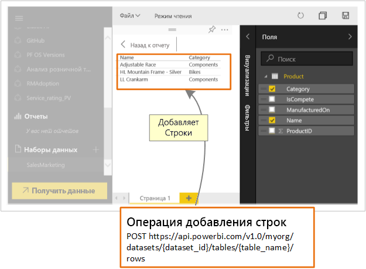

# Какие возможности API Power BI предоставляет разработчикам?

Power BI отображает интерактивные панели мониторинга, которые можно создать и обновлять посредством множества различных источников данных в режиме реального времени. С помощью любого языка программирования, поддерживающего вызовы REST, можно создавать приложения, которые интегрируются в панель мониторинга Power BI в режиме реального времени. В приложения также можно интегрировать плитки и отчеты Power BI.

Разработчики также могут создавать собственные визуализации данных, которые можно использовать в интерактивных отчетах и на панелях мониторинга.

Ниже перечислено несколько задач, которые можно выполнить с помощью API-интерфейсов Power BI.

| **Действия** | **Инструкции** |
| --- | --- |
| Внедрение панелей мониторинга, отчетов и плиток для пользователей Power BI и пользователей, не работающих с Power BI (данные принадлежат приложению) |[Как внедрять панели мониторинга, отчеты и плитки Power BI](embedding-content.md) |
| Расширение существующего рабочего бизнес-процесса для принудительной отправки ключевых данных в панель мониторинга Power BI. |[Принудительная отправка данных на панель мониторинга](walkthrough-push-data.md) |
| Аутентификация в Power BI. |[Аутентификация в Power BI](get-azuread-access-token.md) |
| Создание настраиваемого визуального элемента. |[Разработка пользовательского визуального элемента Power BI](custom-visual-develop-tutorial.md) |

> [!NOTE]
> В интерфейсах API Power BI рабочие области приложения по-прежнему называются группами. Если упоминаются группы, это означает, что вы работаете с рабочими областями приложения.

## Примеры для разработчиков Power BI

Примеры для разработчиков Power BI содержат элементы для внедрения панелей мониторинга, отчетов и плиток.

[Примеры для разработчиков Power BI](https://github.com/Microsoft/PowerBI-Developer-Samples)

* Примеры в **App Owns Data** (Данные приложения) предназначены для внедрения пользователями, не использующими Power BI.
* Примеры в **User Owns Data** (Данные пользователя) предназначены для внедрения пользователями Power BI.

## Репозитории GitHub

* [Пакет SDK для .NET](https://github.com/Microsoft/PowerBI-CSharp)
* [JavaScript API](https://github.com/Microsoft/PowerBI-JavaScript)
* [Пользовательские визуальные элементы](https://github.com/Microsoft/PowerBI-visuals)

## Инструменты разработчиков

Ниже приведены инструменты, которые можно использовать для упрощения разработки элементов Power BI.

Воспользуйтесь [средством настройки внедрения](https://aka.ms/embedsetup), чтобы быстро скачать образец приложения и приступить к внедрению содержимого Power BI.

Выберите подходящее решение:

* [Внедрение для клиентов](embedding.md#embedding-for-your-customers) позволяет внедрять панели мониторинга и отчеты для пользователей, у которых нет учетной записи Power BI. Запустите решение [Внедрение для клиентов](https://aka.ms/embedsetup/AppOwnsData).

* [Внедрение для организации](embedding.md#embedding-for-your-organization) позволяет расширить возможности службы Power BI. Запустите решение [Внедрение для организации](https://aka.ms/embedsetup/UserOwnsData).

С полнофункциональным примером на основе API JavaScript вы можете ознакомиться на странице [средства "Площадка"](https://microsoft.github.io/PowerBI-JavaScript/demo). Это очень удобный способ быстро протестировать разные примеры Power BI Embedded. Дополнительные сведения об API JavaScript вы найдете на странице [вики-сайта PowerBI-JavaScript](https://github.com/Microsoft/powerbi-javascript/wiki).

## Принудительная отправка данных в Power BI

Для принудительной отправки данных в набор данных можно использовать API-интерфейс Power BI. Этот компонент позволяет добавлять строки в таблицу в наборе данных. После этого новые данные могут отображаться на плитках информационной панели и в визуальных элементах отчета.

## Дальнейшие действия

[Принудительная отправка данных в панель мониторинга Power BI](walkthrough-push-data.md)  
[Разработка пользовательского визуального элемента Power BI](custom-visual-develop-tutorial.md)  
[Справочник по REST API Power BI](https://docs.microsoft.com/rest/api/power-bi/)  

Появились дополнительные вопросы? [Попробуйте задать вопрос в сообществе Power BI.](http://community.powerbi.com/)
