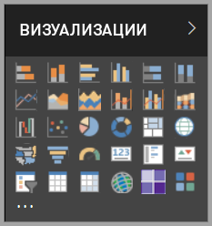

# Визуальные элементы в Power BI

В состав Power BI входит множеством готовых визуальных элементов Power BI. Эти визуальные элементы доступны на панели визуализации как в [Power BI Desktop](https://powerbi.microsoft.com/desktop/), так и в [службе Power BI](https://app.powerbi.com). Их можно использовать для создания и редактирования содержимого Power BI.

В Microsoft [AppSource](https://nam06.safelinks.protection.outlook.com/?url=https%3A%2F%2Fappsource.microsoft.com%2Fen-us%2Fmarketplace%2Fapps%3Fpage%3D1%26product%3Dpower-bi-visuals&data=02%7C01%7CKesem.Sharabi%40microsoft.com%7C6d9286afacb3468d4cde08d740b76694%7C72f988bf86f141af91ab2d7cd011db47%7C1%7C0%7C637049028749147718&sdata=igWm0e1vXdgGcbyvngQBrHQVAkahPnxPC1ZhUPntGI8%3D&reserved=0) и в Power BI также доступно множество других визуальных элементов Power BI. Эти визуальные элементы создаются корпорацией Майкрософт и ее партнерами, а затем тестируются и проверяются командой проверки AppSource.

Вы также можете разработать собственный визуальный элемент Power BI, который будет использоваться вами, вашей организацией или участниками сообщества Power BI.

## Визуальные элементы Power BI по умолчанию

Это готовые визуальные элементы Power BI, доступные на панели "Визуализация" в *Power BI Desktop* и *службе Power BI*.

Чтобы открепить визуальный элемент Power BI на панели "Визуализация", щелкните его правой кнопкой мыши и выберите **открепить**.

Чтобы восстановить визуальные элементы Power BI по умолчанию, имеющиеся на панели "Визуализация", щелкните **Импортировать настраиваемый визуальный элемент** и выберите **Восстановить визуальные элементы по умолчанию**. 

## Визуальные элементы Power BI из магазина AppSource

Члены сообщества и специалисты Майкрософт создают свои визуальные элементы Power BI и публикуют их в магазине [AppSource](https://appsource.microsoft.com/marketplace/apps?product=power-bi-visuals), чтобы любой мог воспользоваться ими. Эти визуальные элементы можно скачать и добавлять в отчеты Power BI. Эти визуальные элементы протестированы на предмет функциональности и качества и утверждены корпорацией Майкрософт.

### Что такое AppSource?

[AppSource](office-store.md) — это место, где можно найти приложения, надстройки и расширения для программного обеспечения корпорации Майкрософт. AppSource позволяет миллионам пользователей таких продуктов, как Office 365, Azure, Dynamics 365, Cortana и Power BI, находить решения, с помощью которых можно выполнять работу более эффективно и продуманно.

### Сертифицированные визуальные элементы Power BI

Сертифицированными визуальными элементами Power BI называются визуальные элементы из магазина [AppSource](https://nam06.safelinks.protection.outlook.com/?url=https%3A%2F%2Fappsource.microsoft.com%2Fen-us%2Fmarketplace%2Fapps%3Fpage%3D1%26product%3Dpower-bi-visuals&data=02%7C01%7CKesem.Sharabi%40microsoft.com%7C6d9286afacb3468d4cde08d740b76694%7C72f988bf86f141af91ab2d7cd011db47%7C1%7C0%7C637049028749147718&sdata=igWm0e1vXdgGcbyvngQBrHQVAkahPnxPC1ZhUPntGI8%3D&reserved=0), которые соответствуют определенным требованиям к коду, а также протестированы и одобрены командой Microsoft Power BI. Проверки гарантируют, что визуализация не обращается к внешним службам и ресурсам.

Просмотреть список сертифицированных визуальных элементов Power BI или отправить свои визуальные элементы можно [здесь](power-bi-custom-visuals-certified.md).

### Образцы визуальных элементов Power BI

Для каждого визуального элемента Power BI в AppSource имеется соответствующий образец, демонстрирующий работу визуального элемента. Чтобы скачать образец, в [AppSource](https://nam06.safelinks.protection.outlook.com/?url=https%3A%2F%2Fappsource.microsoft.com%2Fen-us%2Fmarketplace%2Fapps%3Fpage%3D1%26product%3Dpower-bi-visuals&data=02%7C01%7CKesem.Sharabi%40microsoft.com%7C6d9286afacb3468d4cde08d740b76694%7C72f988bf86f141af91ab2d7cd011db47%7C1%7C0%7C637049028749147718&sdata=igWm0e1vXdgGcbyvngQBrHQVAkahPnxPC1ZhUPntGI8%3D&reserved=0) выберите визуальный элемент Power BI и в разделе *Попробуйте образец* щелкните ссылку **Образец отчета**.

## Хранилище организации

Администраторы Power BI утверждают и развертывают визуальные элементы Power BI в своей организации. Благодаря этому авторы отчетов могут с легкостью находить, обновлять и использовать эти визуальные элементы Power BI. Администраторы могут с легкостью управлять этими визуальными элементами с помощью таких действий, как обновление версий, отключение и включение визуальных элементов Power BI.

Чтобы получить доступ к хранилищу организации, в области *Визуализация* щелкните **Импортировать настраиваемый визуальный элемент**, выберите **Импорт из магазина** и в верхней части окна *Визуальные элементы Power BI* выберите вкладку **Моя организация**.

[Подробнее о визуальных элементах организации](power-bi-custom-visuals-organization.md).

## Файлы визуальных элементов

Визуальные элементы Power BI представляют собой пакеты с кодом для отображения данных, предназначенных для этих элементов. Любой пользователь может создать пользовательский визуальный элемент и упаковать его в один `.pbiviz`-файл, который можно импортировать в отчет Power BI.

Чтобы импортировать визуальный элемент Power BI, в области *Визуализация* щелкните **Импортировать настраиваемый визуальный элемент** и выберите **Импорт из файла**.

Если вы являетесь веб-разработчиком и заинтересованы в создании собственного визуального элемента и его добавлении в магазин AppSource, узнайте подробнее о том, как [разработать визуальный элемент Power BI](visuals/custom-visual-develop-tutorial.md) и [опубликовать его в магазине AppSource](office-store.md).

> [!WARNING]
> Визуальный элемент Power BI может содержать код, подвергающий риску безопасность или конфиденциальность. Перед импортом в отчет убедитесь в надежности автора и источника визуального элемента Power BI.

## Дальнейшие действия

* Если вы являетесь разработчиком, начните с руководства по [разработке визуальных элементов Power BI](./visuals/custom-visual-develop-tutorial.md).

* Узнайте о [структуре проекта по созданию визуального элемента Power BI](./visuals/visual-project-structure.md).

* Изучите [рекомендации по визуальным элементам Power BI](guidelines-powerbi-visuals.md).

Появились дополнительные вопросы? Ознакомьтесь с [вопросами и ответами о визуальных элементах Power BI](power-bi-custom-visuals-faq.md) или обратитесь за помощью к участникам [сообщества Power BI](http://community.powerbi.com/).