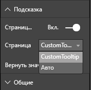

# <a name="tooltips-in-power-bi-visuals"></a>Подсказки в визуальных элементах Power BI

Теперь в визуальных элементах можно использовать поддержку подсказок Power BI. Подсказки Power BI поддерживают следующие взаимодействия:

* Отображение подсказки.
* Скрытие подсказки.
* Перемещение подсказки.

Подсказки могут отображать текстовый элемент с заголовком, значением с заданным цветом и непрозрачностью по указанному набору координат. Эти данные предоставляются для API, и узел Power BI отрисовывает их так же, как и подсказки для собственных визуальных элементов.

На следующем рисунке показана подсказка на образце линейчатой диаграммы:


Приведенная выше подсказка демонстрирует категорию отдельной полосы и значение. Подсказка может быть расширена и отображать несколько значений.

## <a name="manage-tooltips"></a>Управление подсказками

Для управления подсказками служит интерфейс ITooltipService. Он используется для уведомления узла о том, что необходимо отобразить, удалить или переместить подсказку.

```typescript
    interface ITooltipService {
        enabled(): boolean;
        show(options: TooltipShowOptions): void;
        move(options: TooltipMoveOptions): void;
        hide(options: TooltipHideOptions): void;
    }
```

Вашему визуальному элементу необходимо прослушивать события мыши внутри себя и по мере необходимости вызвать делегаты `show()`, `move()` и `hide()` с соответствующим содержимым, заполненным в объекты `Tooltip****Options`.
`TooltipShowOptions` и `TooltipHideOptions`, в свою очередь, определяют, что нужно отображать и что делать при таких событиях.

Так как вызов этих методов будет включать в себя пользовательские события, такие как перемещение мыши или касание, рекомендуется создать прослушиватели для таких событий, которые, в свою очередь, будут вызывать члены `TooltipService`.
Наш пример агрегируется в классе `TooltipServiceWrapper`.

### <a name="the-tooltipservicewrapper-class"></a>Класс TooltipServiceWrapper

Основное назначение этого класса заключается в том, чтобы разместить экземпляр `TooltipService`, прослушивать события мыши D3 для соответствующих элементов, а затем выполнять вызовы элементов `show()` и `hide()` по мере необходимости.

Этот класс хранит и контролирует все соответствующие состояния и логику для этих событий, в основном нацеленных на взаимодействие с базовым кодом D3. Взаимодействие и преобразование D3 выходит за рамки этой статьи.

Полный пример кода см. в [репозитории визуальных элементов SampleBarChart](https://github.com/Microsoft/PowerBI-visuals-sampleBarChart/commit/981b021612d7b333adffe9f723ab27783c76fb14).

### <a name="create-tooltipservicewrapper"></a>Создание класса TooltipServiceWrapper

Конструктор линейчатой диаграммы теперь имеет член `TooltipServiceWrapper`, экземпляр которого создается в конструкторе с экземпляром `tooltipService` узла.

```typescript
        private tooltipServiceWrapper: ITooltipServiceWrapper;

        this.tooltipServiceWrapper = createTooltipServiceWrapper(this.host.tooltipService, options.element);
```

Класс `TooltipServiceWrapper` содержит экземпляр `tooltipService`, а также корневой элемент D3 параметров визуального элемента и сенсорного управления.

```typescript
    class TooltipServiceWrapper implements ITooltipServiceWrapper {
        private handleTouchTimeoutId: number;
        private visualHostTooltipService: ITooltipService;
        private rootElement: Element;
        private handleTouchDelay: number;

        constructor(tooltipService: ITooltipService, rootElement: Element, handleTouchDelay: number) {
            this.visualHostTooltipService = tooltipService;
            this.handleTouchDelay = handleTouchDelay;
            this.rootElement = rootElement;
        }
        .
        .
        .
    }
```

Единственной точкой входа для регистрации прослушивателей событий для этого класса является метод `addTooltip`.

### <a name="the-addtooltip-method"></a>Метод addTooltip

```typescript
        public addTooltip<T>(
            selection: d3.Selection<Element>,
            getTooltipInfoDelegate: (args: TooltipEventArgs<T>) => VisualTooltipDataItem[],
            getDataPointIdentity: (args: TooltipEventArgs<T>) => ISelectionId,
            reloadTooltipDataOnMouseMove?: boolean): void {

            if (!selection || !this.visualHostTooltipService.enabled()) {
                return;
            }
        ...
        ...
        }
```

* **selection: d3.Selection<Element>** : Элементы d3, по которым обрабатываются подсказки.

* **getTooltipInfoDelegate: (args: TooltipEventArgs<T>) => VisualTooltipDataItem[]** : Делегат для заполнения содержимого подсказки (отображаемых данных) в соответствии с контекстом.

* **getDataPointIdentity: (args: TooltipEventArgs<T>) => ISelectionId**: Делегат для получения идентификатора точки данных (в этом примере не используется). 

* **reloadTooltipDataOnMouseMove? boolean**: Логическое значение, указывающее, следует ли обновлять данные подсказки во время события MouseMove (в этом примере не используется).

Как видите, `addTooltip` завершает работу без действий, если `tooltipService` отключен или нет фактического выбора.

### <a name="call-the-show-method-to-display-a-tooltip"></a>Вызов метода show для отображения подсказки

Далее метод `addTooltip` прослушивает событие D3 `mouseover`, как показано в следующем коде:

```typescript
        ...
        ...
        selection.on("mouseover.tooltip", () => {
            // Ignore mouseover while handling touch events
            if (!this.canDisplayTooltip(d3.event))
                return;

            let tooltipEventArgs = this.makeTooltipEventArgs<T>(rootNode, true, false);
            if (!tooltipEventArgs)
                return;

            let tooltipInfo = getTooltipInfoDelegate(tooltipEventArgs);
            if (tooltipInfo == null)
                return;

            let selectionId = getDataPointIdentity(tooltipEventArgs);

            this.visualHostTooltipService.show({
                coordinates: tooltipEventArgs.coordinates,
                isTouchEvent: false,
                dataItems: tooltipInfo,
                identities: selectionId ? [selectionId] : [],
            });
        });
```

* **makeTooltipEventArgs**: Извлекает контекст из выбранных элементов D3 в tooltipEventArgs. Также он вычисляет координаты.

* **getTooltipInfoDelegate**: Формирует содержимое подсказки из tooltipEventArgs. Это обратный вызов в класс BarChart, так как он является логикой визуального элемента. Это реальное текстовое содержимое, отображаемое в подсказке.

* **getDataPointIdentity**: Не используется в этом примере.

* **this.visualHostTooltipService.show**: Вызов для отображения подсказки.  

Дополнительные сведения об обработке см. в примере для событий `mouseout` и `mousemove`.

Дополнительные сведения см. в [репозитории визуальных элементов SampleBarChart](https://github.com/Microsoft/PowerBI-visuals-sampleBarChart/commit/981b021612d7b333adffe9f723ab27783c76fb14).

### <a name="populate-the-tooltip-content-by-the-gettooltipdata-method"></a>Заполнение содержимого подсказки с помощью метода getTooltipData

Был добавлен класс BarChart с членом `getTooltipData`, который просто извлекает `category`, `value` и `color` точки данных в элемент VisualTooltipDataItem[].

```typescript
        private static getTooltipData(value: any): VisualTooltipDataItem[] {
            return [{
                displayName: value.category,
                value: value.value.toString(),
                color: value.color,
                header: 'ToolTip Title'
            }];
        }
```

В приведенной выше реализации член `header` является константой, но может использоваться и для более сложных реализаций, требующих динамические значения. Можно заполнить `VisualTooltipDataItem[]` сразу несколькими элементами, что приведет к добавлению нескольких строк в подсказку. Это может пригодиться для таких визуальных элементов, как линейчатые диаграммы с накоплением, в которых подсказка может отображать данные из более чем одной точки данных.

### <a name="call-the-addtooltip-method"></a>Вызов метода addTooltip

Завершающим этапом является вызов метода `addTooltip`, когда фактические данные могут измениться. Этот вызов выполняется в методе `BarChart.update()`. Выполняется вызов для отслеживания выбора всех элементов "bar" с передачей только `BarChart.getTooltipData()`, как было указано выше.

```typescript
        this.tooltipServiceWrapper.addTooltip(this.barContainer.selectAll('.bar'),
            (tooltipEvent: TooltipEventArgs<number>) => BarChart.getTooltipData(tooltipEvent.data),
            (tooltipEvent: TooltipEventArgs<number>) => null);
```

## <a name="add-report-page-tooltips"></a>Добавление подсказок на страницу отчета

Чтобы добавить поддержку подсказок для страницы отчета, большинство изменений необходимо внести в файл *capabilities.json*.

Пример схемы:

```json
{
    "tooltips": {
        "supportedTypes": {
            "default": true,
            "canvas": true
        },
        "roles": [
            "tooltips"
        ]
    }
}
```

Подсказки на страницах отчета можно определять в панели **Формат**.



* `supportedTypes` — это конфигурация подсказок, поддерживаемая визуальным элементом и отраженная в ячейке поля. 
   * `default` — указывает, поддерживается ли автоматическая привязка подсказок с помощью поля данных. 
   * `canvas` — указывает, поддерживаются ли подсказки для страницы отчета.

* `roles` — (необязательно) после определения указывает, какие роли данных привязаны к выбранному параметру подсказки в ячейке полей.

Дополнительные сведения см. в статье [Рекомендации по использованию всплывающих подсказок на странице отчета](https://powerbi.microsoft.com/blog/power-bi-desktop-march-2018-feature-summary/#tooltips).

Чтобы отобразить подсказку на странице отчета после того, как узел Power BI вызывает `ITooltipService.Show(options: TooltipShowOptions)` или `ITooltipService.Move(options: TooltipMoveOptions)`, используется selectionId (свойство `identities` предшествующего аргумента `options`). SelectionId должно представлять выбранные данные (категорию, ряды и т. д.) элемента, на который наведен указатель мыши, получаемые подсказкой.

Пример отправки selectionId в вызовы для отображения подсказки показан в следующем коде:

```typescript
    this.tooltipServiceWrapper.addTooltip(this.barContainer.selectAll('.bar'),
        (tooltipEvent: TooltipEventArgs<number>) => BarChart.getTooltipData(tooltipEvent.data),
        (tooltipEvent: TooltipEventArgs<number>) => tooltipEvent.data.selectionID);
```
