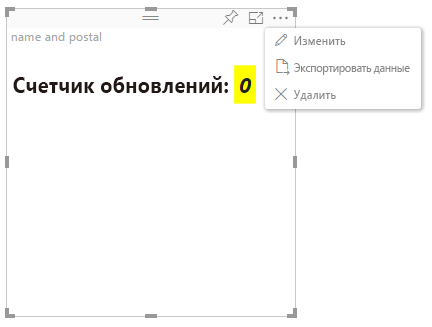

# Режим расширенного редактирования

Визуальные элементы, требующие расширенных элементов управления пользовательского интерфейса, могут объявлять поддержку режима расширенного редактирования.
Если он поддерживается и активен, в меню визуального элемента отображается кнопка `Edit`.
При нажатии кнопки `Advanced` для EditMode задается значение `Edit`.
Визуальный элемент может использовать флаг EditMode, чтобы определить, нужно ли отображать такие элементы управления пользовательского интерфейса.

По умолчанию визуальный элемент не поддерживает режим расширенного редактирования.
Если требуется другое поведение, его нужно явно указать в файле `capabilities.json` визуального элемента, задав свойство `advancedEditModeSupport`.

Возможные значения:

- 0 — NotSupported

- 1 — SupportedNoAction

- 2 — SupportedInFocus

## Вход в режим расширенного редактирования

Кнопка `Edit` отображается при следующих условиях:

 1\. Для свойства `advancedEditModeSupport` в capabilities.json задано значение `SupportedNoAction` или `SupportedInFocus`.

 2\. Визуальный элемент открыт в режиме редактирования отчета.

Если свойство `advancedEditModeSupport` в файле capabilities.json отсутствует или имеет значение `NotSupported`, кнопка "Изменить" исчезает.

Когда пользователь нажимает кнопку `Edit`, визуальный элемент получит вызов update() с параметром EditMode, имеющим значение `Advanced`.
В соответствии со значением, заданным в возможностях, выполняются следующие действия:

* `SupportedNoAction` — не требуется никаких дальнейших действий со стороны узла.
* `SupportedInFocus` — узел развертывает визуальный элемент в режим фокусировки.

## Выход из режима расширенного редактирования

Кнопка `Back to report` отображается при следующих условиях:

1\. Для свойства `advancedEditModeSupport` в capabilities.json задано значение `SupportedInFocus`.
