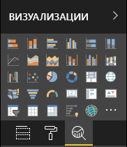

# <a name="the-analytics-pane-in-power-bi-visuals"></a>Панель аналитики в визуальных элементах Power BI

**Панель аналитики** была представлена для [собственных визуальных элементов](../../transform-model/desktop-analytics-pane.md) в ноябре 2018 г.
В этой статье описывается, каким образом пользовательские визуальные элементы с API версии 2.5.0 могут предоставлять свои свойства и управлять ими на **панели аналитики**.



## <a name="manage-the-analytics-pane"></a>Управление панелью "Аналитика"

Как и в случае со свойствами в [панели **Формат**](./custom-visual-develop-tutorial-format-options.md), для управления панелью **Аналитика** необходимо определить объект в файле *capabilities.json* визуального элемента.

Отличия в случае с панелью **Аналитика** заключаются в следующем:

* В определении объекта необходимо добавить поле **objectCategory** со значением 2.

    > [!NOTE]
    > Необязательное поле `objectCategory` было представлено в API версии 2.5.0. Оно определяет аспект визуального элемента, контролируемый объектом (1 — "Formatting" (Форматирование), 2 — "Analytics" (Аналитика)). Значение `Formatting` используется для элементов оформления, цветов, осей и меток. Значение `Analytics` используется для прогнозов, линий трендов, строк ссылок, фигур и т. д.
    >
    > Если значение не указано, поле `objectCategory` по умолчанию будет иметь значение "Formatting".

* Объект должен иметь следующие два свойства:
    * Свойство `show` типа `bool` со значением по умолчанию `false`.
    * Свойство `displayName` типа `text`. Выбранное вами значение по умолчанию станет начальным отображаемым именем экземпляра.

```json
{
  "objects": {
    "YourAnalyticsPropertiesCard": {
      "displayName": "Your analytics properties card's name",
      "objectCategory": 2,
      "properties": {
        "show": {
          "type": {
            "bool": true
          }
        },
        "displayName": {
          "type": {
            "text": true
          }
        },
      ... //any other properties for your Analytics card
      }
    }
  ...
  }
}
```

Другие свойства можно определить так же, как и для объектов **Формат**. Кроме того, вы можете перечислять объекты так же, как и в панели **Формат**.

## <a name="known-limitations-and-issues-of-the-analytics-pane"></a>Известные ограничения и проблемы, связанные с панелью аналитики

* В панели **Аналитика** по-прежнему не реализована поддержка нескольких экземпляров. Объекты не могут иметь [selector](https://microsoft.github.io/PowerBI-visuals/docs/concepts/objects-and-properties/#selector), отличный от static (то есть "selector": null), а визуальные элементы Power BI не могут иметь определенные пользователем множественные экземпляры карты.
* Свойства типа `integer` отображаются неправильно. Чтобы обойти эту проблему, используйте тип `numeric`.

> [!NOTE]
> * Используйте панель **Аналитика** только для объектов, которые добавляют новые сведения или раскрывают новые аспекты представленной информации (например, динамические строки ссылок, которые иллюстрируют важные тренды).
> * Все параметры, определяющие внешний вид визуального элемента, например форматирование, должны находиться на панели **Форматирование**.